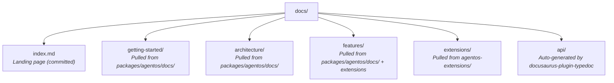

<div align="center">

<p align="center">
  <a href="https://agentos.sh"></a>
  &nbsp;&nbsp;&nbsp;
  <a href="https://frame.dev" target="_blank" rel="noopener"></a>
</p>

# AgentOS Documentation

Unified documentation site for AgentOS — guides, architecture, extensions, and API reference.

[Frame.dev](https://frame.dev) • [AgentOS](https://agentos.sh) • [Docs](https://docs.agentos.sh)

</div>

---

Built with [Docusaurus v3](https://docusaurus.io/) and [docusaurus-plugin-typedoc](https://github.com/typedoc2md/docusaurus-plugin-typedoc).

## Development

```bash
npm install
npm start        # Dev server at localhost:3000
npm run start:guides  # Faster local mode: guides/docs only, skips API, Paracosm, and blog builds
```

## Build

```bash
npm run build    # Runs pull-docs + docusaurus build
npm run build:guides  # Faster local build for guides/docs only
npm run test:publication  # Contract + link + search manifest tests
npm run verify:publication # Strict publication check + full production build
npm run serve    # Preview production build
```

The `prebuild` step runs `scripts/pull-docs.mjs`, which copies markdown guides from `packages/agentos/docs/` and `packages/agentos-extensions/` into the `docs/` tree with Docusaurus frontmatter.

### Fast Local Guides Mode

`npm run build:guides` and `npm run start:guides` are for local docs iteration when you do **not** need the generated API/Paracosm reference surfaces or the blog.

- Disables Typedoc generation for `docs/api` and `docs/paracosm`
- Excludes `api/**` and `paracosm/**` from the docs preset
- Disables the blog surface entirely
- Disables local search indexing and the marketing-site search-manifest plugin
- Hides API/Paracosm/blog navbar, sidebar, and footer entry points in this mode

Measured route surface after this change:

- Full production build: `2067` routes
- Guides-only build: `150` routes

Use `npm run verify:publication` before shipping changes. That path keeps strict broken-link handling enabled and builds the full published site.

## Structure



## Deployment

Deployed via GitHub Actions on push to `master`. The workflow checks out the `agentos` and `agentos-extensions` repos, symlinks them as `packages/`, then builds and deploys to GitHub Pages.

## License

MIT

---

<p align="center">
  <a href="https://agentos.sh"></a>
  &nbsp;&nbsp;&nbsp;
  <a href="https://frame.dev"></a>
</p>

<p align="center">
  Built by <a href="https://manic.agency">Manic Agency LLC</a> / <a href="https://frame.dev">Frame.dev</a><br>
  Contact: <a href="mailto:team@frame.dev">team@frame.dev</a>
</p>
