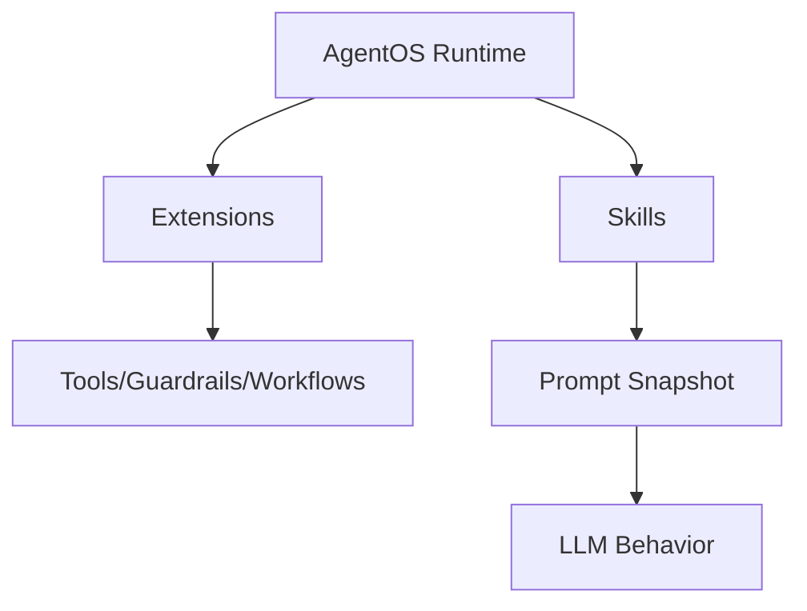
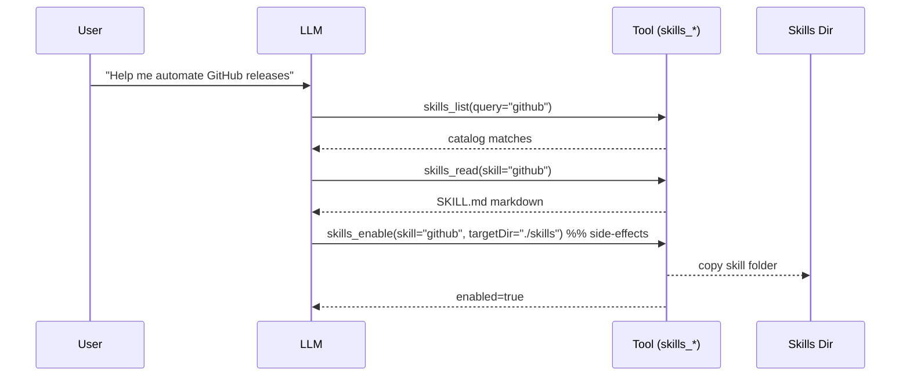

# Skills (SKILL.md)

Skills are **modular prompt modules** that extend what an AgentOS-based agent can do. Each skill lives in a folder containing a `SKILL.md` file:

- YAML frontmatter: metadata, requirements, install specs, invocation policy
- Markdown body: instructions injected into an agent’s system prompt (or fetched on-demand)

## Skill Docs

- Skill format: [`SKILL.md`](./skill-format)
- Skills extension (tools): [`@framers/agentos-ext-skills`](./skills-extension)
- Curated skills registry: [`@framers/agentos-skills-registry`](./agentos-skills-registry) (data + typed SDK + factories)

## Skills vs Extensions

Skills and extensions solve different problems:

- **Extensions**: runtime code (tools, guardrails, workflows) loaded into AgentOS via the extensions system.
- **Skills**: prompt-level “how to” modules that teach an agent _when_ and _how_ to use tools and workflows.



## Loading Skills With `SkillRegistry`

Use `SkillRegistry` to load skills from one or more directories and compile them into a single prompt snapshot:

```ts
import { SkillRegistry } from '@framers/agentos/skills';

const registry = new SkillRegistry();
await registry.loadFromDirs(['./skills']);

const snapshot = registry.buildSnapshot({ platform: process.platform, strict: true });
console.log(snapshot.prompt);
```

## Curated Skills Packages

The curated catalog ships as a single package:

- `@framers/agentos-skills-registry`: SKILL.md files + registry.json + typed catalog + query helpers + factories

It supports a lightweight import path:

```ts
import { searchSkills, getSkillsByCategory } from '@framers/agentos-skills-registry/catalog';
```

…and a factory path that lazy-loads `@framers/agentos` only when you call it:

```ts
import { createCuratedSkillSnapshot } from '@framers/agentos-skills-registry';

const snapshot = await createCuratedSkillSnapshot({ skills: ['github', 'weather'] });
```

## On-Demand Skill Discovery (Lazy)

If you don’t want to inject all skill prompt content up front, load the **skills tool extension**:

- `@framers/agentos-ext-skills`: exposes `skills_list`, `skills_read`, `skills_status`, `skills_enable`, `skills_install`

This enables a “lazy” flow where the model can:

1. List/search skills (`skills_list`)
2. Fetch a specific `SKILL.md` only when needed (`skills_read`)
3. Enable a skill into a local skills directory (HITL-gated) (`skills_enable`)



## Capability Discovery Integration

Beyond lazy loading, skills are fully indexed by the **Capability Discovery Engine** (`@framers/agentos/discovery`). This provides semantic search across all capabilities -- tools, skills, extensions, and channels -- using embedding similarity and graph re-ranking.

Skills become `CapabilityDescriptor` entries with `kind: ‘skill’` and are indexed alongside tools. The discovery engine’s graph tracks relationships between skills and their required tools (e.g., `skill:web-search` → `DEPENDS_ON` → `tool:web_search`), so searching for either surfaces both.

**Skills vs extensions in discovery**: Skills are prompt-level modules (`SKILL.md`) that teach _when_ and _how_ to use tools. Extensions are runtime code (tools, guardrails, workflows) that provide callable actions. Both feed into the same discovery index, but you don’t need a skill for every tool -- many tools work fine with just their schema. Skills add value when a tool needs behavioral guidelines beyond its name and parameters.

For Wunderland agents, `WunderlandDiscoveryManager` handles indexing automatically. For standalone AgentOS usage:

```ts
import { CapabilityDiscoveryEngine } from ‘@framers/agentos/discovery’;

const engine = new CapabilityDiscoveryEngine(config);
await engine.initialize({
  tools: toolMap,
  skills: skillEntries,
});

const result = await engine.discover(‘search the web’);
// result.tier0: category summaries (~150 tokens)
// result.tier1: top-5 semantic matches with summaries (~200 tokens)
// result.tier2: full schemas for top matches (~1,500 tokens)
```

## Example: Inject Skills Snapshot Into a System Prompt

One common integration pattern is:

1. Build a skills snapshot at startup (or per-session)
2. Append `snapshot.prompt` into your system prompt

This is how the `wunderland` CLI’s `--skills-dir` support works.
