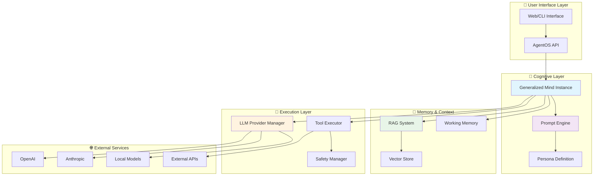
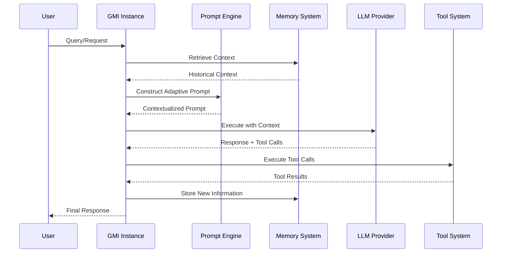

# 🧠 AgentOS: Advanced AI Agent Framework

[](https://github.com/agentos/agentos)
[](https://github.com/agentos/agentos)
[](LICENSE)

> **A revolutionary AI agent framework with adaptive prompting, contextual memory, and sophisticated reasoning capabilities.**

---

## 🚀 Quick Navigation

| Component | Description | Documentation |
|-----------|-------------|---------------|
| 🚀 **[Getting Started](docs/GETTING-STARTED.md)** | 5 Minute Start | [Getting Started](docs/GETTING-STARTED.md) |
| 🎯 **[Prompting System](docs/PROMPTS.md)** | Natural language → AI personas | [Advanced Guide](docs/PROMPTS.md) |
| 🧠 **[LLM Providers](backend/agentos/core/llm/providers/README.md)** | Multi-provider LLM integration | [Provider System](backend/agentos/core/llm/providers/README.md) |
| 💾 **[RAG System](docs/RAG.md)** | Intelligent memory & retrieval | [RAG Documentation](docs/RAG.md) |
| ⚙️ **Architecture** | Core system design | [Technical Deep Dive](#system-architecture) |

---

## 📋 Table of Contents

- [🌟 What Makes AgentOS Special](#-what-makes-agentos-special)
- [🏗️ System Architecture](#️-system-architecture)
- [🎯 Core Components](#-core-components)
- [🚀 Getting Started](#-getting-started)
- [📚 Documentation Index](#-documentation-index)
- [🔮 Advanced Features](#-advanced-features)
- [🤝 Contributing](#-contributing)

---

## 🌟 What Makes AgentOS Special

### **Natural Language → AI Personas**
```markdown
# SQL Expert - web search, code execution, uncensored, remembers user's database schemas
```
↓ *Automatically parsed into sophisticated AI configuration* ↓
```typescript
{
  identity: { role: "SQL Expert", safetyLevel: "uncensored_technical" },
  autoGrantedTools: ["web_search", "code_execution"],
  memoryConfig: { categories: ["user_database_schemas"], retention: "long_term" }
}
```

### **Key Innovations**

🎯 **Adaptive Prompting**
- Prompts that dynamically adapt based on context
- Natural language parsing for persona creation
- Constitutional AI integration with safety guardrails

🧠 **Sophisticated Memory**
- Long-term memory with intelligent lifecycle management
- RAG-powered context retrieval
- GMI-negotiated memory eviction

🔧 **Provider Agnostic**
- Seamless integration with multiple LLM providers
- Dynamic model selection based on task requirements
- Cost optimization and capability matching

⚡ **Real-time Intelligence**
- Contextual decision making
- Tool integration with smart permission management
- Self-correcting and adaptive behavior

---

## 🏗️ System Architecture



### **Data Flow Architecture**



---

## 🎯 Core Components

### **🧠 Generalized Mind Instance (GMI)**
The cognitive core that orchestrates all AI operations.

**Key Features:**
- **Adaptive Reasoning:** Context-aware decision making
- **Memory Integration:** Seamless long-term memory access
- **Tool Orchestration:** Smart capability management
- **Self-Correction:** Built-in error detection and recovery

### **🎯 Advanced Prompting System**
Revolutionary prompt engineering with natural language parsing.

**Capabilities:**
- **Dynamic Adaptation:** Prompts that change based on context
- **Persona Creation:** Natural language → AI personalities
- **Constitutional AI:** Built-in safety and ethical guidelines
- **Template Composition:** Modular, reusable components

📖 **[→ Read the Complete Prompting Guide](docs/PROMPTS.md)**

### **🔧 LLM Provider System**
Unified interface for multiple LLM services.

**Supported Providers:**
- **OpenAI:** GPT-4, GPT-3.5, embeddings
- **Anthropic:** Claude models via OpenRouter
- **Local Models:** Ollama integration
- **Custom:** Extensible provider system

📖 **[→ View Provider Documentation](backend/agentos/core/llm/providers/README.md)**

### **💾 RAG System**
Intelligent memory and knowledge retrieval.

**Features:**
- **Categorized Memory:** Organized by type and purpose
- **Lifecycle Management:** Smart memory retention policies
- **GMI Negotiation:** AI-assisted memory decisions
- **Multi-Store Support:** Pinecone, Weaviate, local options

📖 **[→ Explore RAG Documentation](docs/RAG.md)**

---

## 🚀 Getting Started

### **Quick Setup**

```bash
# Clone and install
git clone https://github.com/agentos/agentos.git
cd agentos
npm install

# Configure environment
cp .env.example .env
# Edit .env with your API keys

# Start the system
npm run dev
```

### **Create Your First Agent**

```typescript
// Simple natural language definition
const persona = `
# Expert Coder - web search, code execution, remembers project context
- Communication: Direct, executable examples only
- Learning: Continuous adaptation from user feedback
- Safety: Technical uncensored mode for security discussions
`;

// AgentOS automatically parses this into sophisticated configuration
const agent = await agentOS.createGMI(persona);
```

### **Environment Configuration**

```bash
# Core LLM Providers
OPENAI_API_KEY=your_openai_key
ANTHROPIC_API_KEY=your_anthropic_key

# Vector Storage (choose one)
PINECONE_API_KEY=your_pinecone_key
PINECONE_ENVIRONMENT=us-west1-gcp

# Optional: Local models
OLLAMA_BASE_URL=http://localhost:11434
```

---

## 📚 Documentation Index

### **Core System**
- **[🎯 Advanced Prompting System](docs/PROMPTS.md)** - Complete guide to persona creation and adaptive prompting
- **[🔧 LLM Provider System](backend/agentos/core/llm/providers/README.md)** - Multi-provider integration and management
- **[💾 RAG System](docs/RAG.md)** - Memory, retrieval, and knowledge management
- **[⚙️ Architecture Overview](docs/ARCHITECTURE.md)** - System design and component interactions

### **Development**
- **[🛠️ API Reference](docs/API.md)** - Complete API documentation
- **[🧪 Testing Guide](docs/TESTING.md)** - Testing strategies and frameworks
- **[🤝 Contributing](CONTRIBUTING.md)** - Development guidelines and standards

### **Examples & Tutorials**
- **[🎓 Getting Started Guide](docs/GETTING_STARTED.md)** - Step-by-step tutorials
- **[💡 Example Personas](examples/personas/)** - Ready-to-use agent definitions
- **[🔧 Integration Examples](examples/integrations/)** - Real-world usage patterns

---

## 🔮 Advanced Features

### **Constitutional AI Integration**
```markdown
## Safety Guidelines in Natural Language
- Always validate code before execution
- Warn about security implications  
- Respect intellectual property
- Adapt explanations to user expertise level
```

### **Dynamic Persona Adaptation**
```typescript
// Personas that learn and adapt
interface AdaptivePersona {
  learningConfig: {
    feedbackIntegration: "continuous",
    userPatternRecognition: true,
    crossSessionLearning: true
  }
}
```

### **Multi-Modal Tool Integration**
```typescript
// Smart tool selection and execution
const tools = [
  "web_search",      // Real-time information
  "code_execution",  // Safe code running
  "image_generation", // Visual content
  "data_analysis"    // Complex computations
];
```

---

## 🤝 Contributing

We welcome contributions! Here's how to get involved:

### **Development Setup**
```bash
# Fork and clone
git clone https://github.com/yourusername/agentos.git
cd agentos

# Install dependencies
npm install
npm run setup:dev

# Run tests
npm test
npm run test:integration
```

### **Contribution Areas**
- 🎯 **Persona Templates** - Create reusable agent personalities
- 🔧 **LLM Providers** - Add support for new models
- 💾 **Vector Stores** - Integrate new storage backends
- 🛠️ **Tools** - Build new capabilities for agents
- 📚 **Documentation** - Improve guides and examples

### **Coding Standards**
- TypeScript for all core components
- Comprehensive test coverage
- Clear documentation and examples
- Follow existing architectural patterns

---

## 📊 System Status

| Component | Status | Coverage | Performance |
|-----------|--------|----------|-------------|
| 🎯 Prompting System | ✅ Stable | 95% | Excellent |
| 🔧 LLM Providers | ✅ Stable | 90% | Excellent |
| 💾 RAG System | ✅ Stable | 88% | Good |
| 🧠 GMI Core | 🔄 Active Dev | 85% | Good |
| 🛠️ Tool System | 🔄 Active Dev | 80% | Good |

---

## 📄 License

This project is licensed under the MIT License - see the [LICENSE](LICENSE) file for details.

---

## 🔗 Links

- **[GitHub Repository](https://github.com/agentos/agentos)**
- **[Documentation Site](https://docs.agentos.ai)**
- **[Community Discord](https://discord.gg/agentos)**
- **[Issue Tracker](https://github.com/agentos/agentos/issues)**

---

<div align="center">

**Built with ❤️ by the AgentOS Team**

[🌟 Star us on GitHub](https://github.com/agentos/agentos) • [📧 Join our Newsletter](https://agentos.ai/newsletter) • [🐦 Follow on Twitter](https://twitter.com/agentos_ai)

</div>