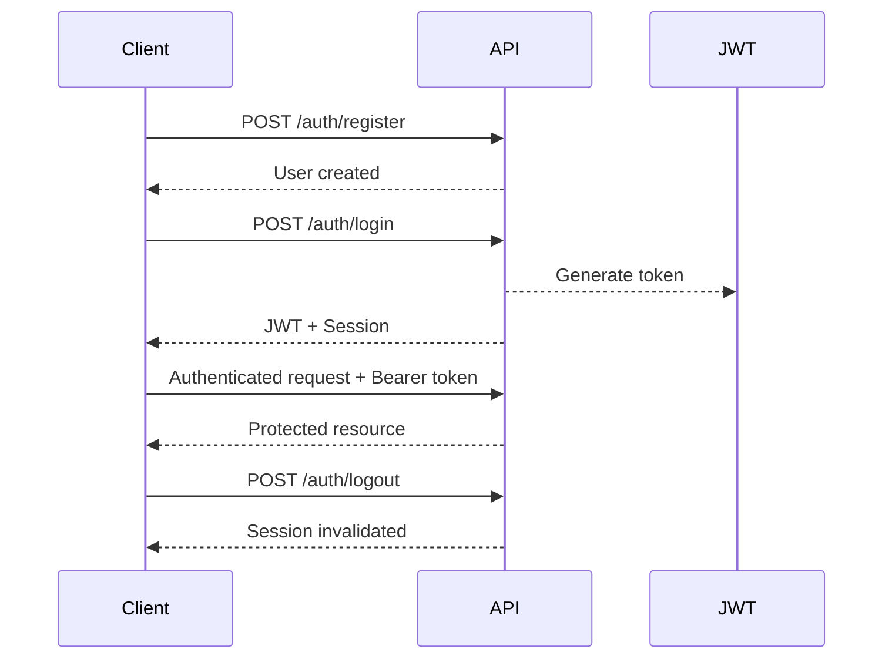

# AgentOS Backend API Documentation

<div align="center">

**Version 1.0.0**

*A comprehensive guide to the AgentOS Backend API for interacting with Generalized Mind Instances (GMIs)*

</div>

---

## 📋 Table of Contents

- [Introduction](#introduction)
- [Authentication](#authentication)
- [API Endpoints](#api-endpoints)
  - [Health Check](#health-check)
  - [Authentication Endpoints](#authentication-endpoints)
  - [AgentOS Core Endpoints](#agentos-core-endpoints)
  - [Persona Endpoints](#persona-endpoints)
  - [Payment Webhooks](#payment-webhooks-lemonsqueezy)
- [Error Handling](#error-handling)
- [Streaming API Endpoints](#streaming-api-endpoints)
- [Further Reading](#further-reading)

---

## 🚀 Introduction

Welcome to the **AgentOS Backend API**. This API enables you to:

- 🤖 Interact with Generalized Mind Instances (GMIs)
- 👤 Manage user accounts and authentication
- 💬 Handle conversations with AI personas
- ⚡ Leverage advanced AI capabilities of the AgentOS platform

### 🏗️ Architecture Overview

- **RESTful Design**: Built on REST principles for predictable interactions
- **JSON Communication**: Uses JSON for request/response bodies
- **JWT Authentication**: Employs JWT Bearer tokens for secure access
- **Streaming-First**: Core GMI interactions use `application/x-ndjson` streaming

> **Base URL**: All API endpoints are prefixed with `/api/v1`
> 
> Example: `POST /api/v1/auth/login`

---

## 🔐 Authentication

Most AgentOS API interactions require authentication using **JSON Web Tokens (JWTs)** passed as Bearer tokens.

### 🔄 Authentication Flow



### 📝 Step-by-Step Process

1. **Register**: New users register via `POST /auth/register`
2. **Login**: Get JWT access token using `POST /auth/login`
3. **Authenticated Requests**: Include JWT in Authorization header:
   ```http
   Authorization: Bearer <YOUR_JWT_ACCESS_TOKEN>
   ```
4. **Token Validation**: API validates tokens on each protected route request
5. **Logout**: Invalidate session via `POST /auth/logout`

### 🌐 Guest Access

- Certain endpoints allow **unauthenticated access** (e.g., listing public personas)
- Public demo personas can be accessed with a designated guest `userId`
- Access levels determined by subscription tier or public permissions

> 💡 **Getting Started**: See `GETTING-STARTED.MD` for detailed setup instructions

---

## 📡 API Endpoints

All paths are relative to the base URL `/api/v1`.

### 🏥 Health Check

<details>
<summary><strong>GET /health</strong> - Check server operational status</summary>

**Description**: Verifies backend server status and critical dependencies

**Authentication**: 🌐 Public

**Request**: No body required

**Response**:
```json
{
  "status": "OK",
  "timestamp": "2025-05-23T20:00:00.000Z",
  "servicesInitialized": true,
  "databaseConnected": true,
  "nodeVersion": "v20.11.0",
  "environment": "development"
}
```

**Status Codes**: `200 OK`

</details>

---

### 🔑 Authentication Endpoints

Base path: `/auth`

#### User Registration

<details>
<summary><strong>POST /auth/register</strong> - Register new user</summary>

**Authentication**: 🌐 Public

**Request Body**:
```json
{
  "username": "newUser",
  "email": "user@example.com",
  "password": "SecurePassword123!"
}
```

**Success Response** (`201 Created`):
```json
{
  "id": "user-uuid-123",
  "username": "newUser",
  "email": "user@example.com",
  "subscriptionTierId": "free-tier-uuid",
  "createdAt": "2025-05-23T20:00:00.000Z",
  "updatedAt": "2025-05-23T20:00:00.000Z",
  "lastLoginAt": null,
  "emailVerified": false
}
```

**Error Responses**:
- `400 Bad Request`: Invalid input
- `409 Conflict`: Username/email already exists

</details>

#### User Login

<details>
<summary><strong>POST /auth/login</strong> - Authenticate existing user</summary>

**Authentication**: 🌐 Public

**Request Body**:
```json
{
  "identifier": "user@example.com",
  "password": "SecurePassword123!"
}
```

**Success Response** (`200 OK`):
```json
{
  "user": { /* PublicUser object */ },
  "token": "eyJhbGciOiJIUzI1NiIsInR5cCI6IkpXVCJ9...",
  "tokenExpiresAt": "2025-05-24T20:00:00.000Z",
  "session": { /* PrismaUserSession object */ }
}
```

**Error Responses**:
- `400 Bad Request`: Missing credentials
- `401 Unauthorized`: Invalid credentials
- `403 Forbidden`: Email not verified

</details>

#### User Logout

<details>
<summary><strong>POST /auth/logout</strong> - Invalidate user session</summary>

**Authentication**: 🔒 JWT Bearer Token Required

**Request**: No body required

**Success Response** (`200 OK`):
```json
{
  "message": "Logout successful."
}
```

</details>

#### User Profile

<details>
<summary><strong>GET /auth/me</strong> - Get current user profile</summary>

**Authentication**: 🔒 JWT Bearer Token Required

**Success Response** (`200 OK`):
```json
{
  "user": { /* PublicUser object */ },
  "tier": { /* ISubscriptionTier object or null */ }
}
```

</details>

#### Password Management

<details>
<summary><strong>POST /auth/me/change-password</strong> - Change user password</summary>

**Authentication**: 🔒 JWT Bearer Token Required

**Request Body**:
```json
{
  "oldPassword": "CurrentSecurePassword123!",
  "newPassword": "NewSecurePassword456!"
}
```

**Success Response** (`200 OK`):
```json
{
  "message": "Password changed successfully."
}
```

</details>

<details>
<summary><strong>POST /auth/request-password-reset</strong> - Request password reset</summary>

**Authentication**: 🌐 Public

**Request Body**:
```json
{
  "email": "user@example.com"
}
```

**Success Response** (`200 OK`):
```json
{
  "message": "If your email address is registered, you will receive a password reset link shortly."
}
```

</details>

<details>
<summary><strong>POST /auth/reset-password</strong> - Reset password with token</summary>

**Authentication**: 🌐 Public

**Request Body**:
```json
{
  "resetToken": "user-provided-reset-token-string",
  "newPassword": "NewSecurePassword456!"
}
```

**Success Response** (`200 OK`):
```json
{
  "message": "Password has been reset successfully. You can now log in with your new password."
}
```

</details>

#### 🔑 API Key Management

<details>
<summary><strong>POST /auth/me/api-keys</strong> - Add/update LLM provider API key</summary>

**Authentication**: 🔒 JWT Bearer Token Required

**Request Body**:
```json
{
  "providerId": "openai",
  "apiKey": "sk-xxxxxxxxxxxxxxxxxxxxxxxxxxxx",
  "keyName": "My Personal OpenAI Key"
}
```

**Success Response** (`201 Created`):
```json
{
  "id": "apikey-uuid-123",
  "providerId": "openai",
  "keyName": "My Personal OpenAI Key",
  "isActive": true,
  "createdAt": "2025-05-23T20:00:00.000Z",
  "updatedAt": "2025-05-23T20:00:00.000Z",
  "maskedKeyPreview": "sk-x...xxxx"
}
```

</details>

<details>
<summary><strong>GET /auth/me/api-keys</strong> - List user's API keys</summary>

**Authentication**: 🔒 JWT Bearer Token Required

**Success Response** (`200 OK`):
```json
[
  {
    "id": "apikey-uuid-123",
    "providerId": "openai",
    "keyName": "My Personal OpenAI Key",
    "isActive": true,
    "createdAt": "2025-05-23T20:00:00.000Z",
    "updatedAt": "2025-05-23T20:00:00.000Z",
    "maskedKeyPreview": "sk-x...xxxx"
  }
]
```

</details>

<details>
<summary><strong>DELETE /auth/me/api-keys/:apiKeyRecordId</strong> - Delete API key</summary>

**Authentication**: 🔒 JWT Bearer Token Required

**URL Parameters**: `apiKeyRecordId` - Database ID of the API key record

**Success Response**: `204 No Content`

</details>

---

### 🤖 AgentOS Core Endpoints

Base path: `/agentos`

These endpoints provide direct interaction with AgentOS Generalized Mind Instances (GMIs).

#### Chat Interaction

<details>
<summary><strong>POST /agentos/chat/turn</strong> - Process chat turn with GMI (Streaming)</summary>

**Authentication**: 🔒 JWT Bearer Token Required (Guest access via persona entitlements)

**Request Body**:
```json
{
  "userId": "user-uuid-123",
  "sessionId": "session-uuid-abc",
  "conversationId": "conversation-uuid-xyz",
  "textInput": "Hello, how does photosynthesis work?",
  "selectedPersonaId": "science_tutor_persona_v1",
  "options": {
    "debugMode": false
  }
}
```

**Success Response** (`200 OK`):
- **Content-Type**: `application/x-ndjson`
- **Body**: Stream of newline-delimited JSON chunks

```json
{"type":"text_delta","streamId":"...","gmiInstanceId":"...","personaId":"...","isFinal":false,"timestamp":"...","textDelta":"Photosynthesis is a process..."}
{"type":"text_delta","streamId":"...","textDelta":" used by plants..."}
{"type":"final_response","streamId":"...","isFinal":true,"finalResponseText":"Photosynthesis is...", "usage":{...}}
```

**Error Handling**:
- Stream initiation failures: `400/401/403/500/503` JSON error
- Mid-stream errors: `AgentOSErrorChunk` in stream

</details>

#### Tool Result Submission

<details>
<summary><strong>POST /agentos/chat/tool_result</strong> - Submit tool execution result (Streaming)</summary>

**Authentication**: 🔒 JWT Bearer Token Required

**Request Body**:
```json
{
  "streamId": "original-stream-uuid-from-processRequest",
  "toolCallId": "toolcall-uuid-from-TOOL_CALL_REQUEST-chunk",
  "toolName": "web_search",
  "isSuccess": true,
  "toolOutput": {
    "summary": "Photosynthesis uses sunlight, water, and CO2."
  }
}
```

**Error Response Example**:
```json
{
  "streamId": "...",
  "toolCallId": "...",
  "toolName": "calculator",
  "isSuccess": false,
  "errorMessage": "Division by zero."
}
```

**Success Response** (`200 OK`):
- **Content-Type**: `application/x-ndjson`
- **Body**: Stream of `AgentOSResponse` chunks

</details>

---

### 🎭 Persona Endpoints

Base path: `/personas`

<details>
<summary><strong>GET /personas</strong> - List available personas</summary>

**Authentication**: 🔓 Optional (JWT Bearer Token or Public/Guest)

**Description**: 
- **Authenticated users**: Access to private and entitlement-specific personas
- **Guest users**: Access to public personas only

**Success Response** (`200 OK`):
```json
[
  {
    "id": "science_tutor_persona_v1",
    "name": "Science Tutor",
    "description": "A helpful AI tutor for science questions.",
    "tags": ["education", "science"],
    "avatarUrl": "/avatars/science_tutor.png"
  },
  {
    "id": "public_demo_persona_v1",
    "name": "Public Demo Assistant",
    "description": "A general purpose assistant available for demos.",
    "tags": ["demo", "public"],
    "isPublic": true
  }
]
```

</details>

---

### 💳 Payment Webhooks (LemonSqueezy)

Base path: `/webhooks`

> ⚠️ **Important**: These endpoints are intended for LemonSqueezy service calls, not direct client use.

<details>
<summary><strong>POST /webhooks/lemonsqueezy</strong> - Handle LemonSqueezy webhook events</summary>

**Authentication**: 🔏 Signature-based validation (`X-Signature` header)

**Description**: Processes subscription events (`subscription_created`, `subscription_updated`, etc.)

**Request Headers**:
- `X-Signature: <LEMONSQUEEZY_GENERATED_SIGNATURE>`
- `Content-Type: application/json`

**Success Response** (`200 OK`):
```json
{
  "success": true,
  "event": "subscription_created",
  "processed_at": "2025-05-23T20:00:00.000Z"
}
```

**Error Responses**:
- `400 Bad Request`: Missing signature/body or invalid payload
- `401 Unauthorized`: Invalid signature

</details>

<details>
<summary><strong>GET /webhooks/lemonsqueezy/health</strong> - Webhook endpoint health check</summary>

**Authentication**: 🌐 Public

**Success Response** (`200 OK`):
```json
{
  "status": "healthy",
  "service": "lemonsqueezy-webhooks",
  "timestamp": "2025-05-23T20:00:00.000Z",
  "webhook_secret_configured": true
}
```

</details>

---

## ⚠️ Error Handling

The AgentOS API returns standardized JSON error responses for consistent error handling.

### 📋 Error Response Structure

```json
{
  "error": {
    "code": "ERROR_CODE_STRING",
    "message": "A human-readable description of the error.",
    "details": { /* Optional context-specific details */ },
    "timestamp": "YYYY-MM-DDTHH:mm:ss.sssZ"
    // "stack": "..." // Development environments only
  }
}
```

### 📊 HTTP Status Codes Reference

| Status Code | Description | Usage |
|-------------|-------------|--------|
| `200 OK` | ✅ Request successful | Standard success response |
| `201 Created` | ✅ Resource created | After user registration, etc. |
| `204 No Content` | ✅ Success, no body | After successful deletion |
| `400 Bad Request` | ❌ Invalid input | Validation errors, malformed requests |
| `401 Unauthorized` | ❌ Authentication failed | Missing/invalid token |
| `403 Forbidden` | ❌ Access denied | Insufficient permissions |
| `404 Not Found` | ❌ Resource not found | Non-existent endpoints/resources |
| `409 Conflict` | ❌ Resource conflict | Duplicate email registration |
| `500 Internal Server Error` | ❌ Server error | Unexpected server issues |
| `503 Service Unavailable` | ❌ Service unavailable | Downstream service issues |

---

## 🌊 Streaming API Endpoints

Several AgentOS endpoints use **streaming responses** for real-time interaction.

### 📡 Streaming Characteristics

- **Content-Type**: `application/x-ndjson` (newline-delimited JSON)
- **Format**: Each line contains a separate JSON object (`AgentOSResponse` chunk)
- **Processing**: Clients should handle chunks incrementally as they arrive
- **Completion**: `isFinal: true` flag indicates end of logical response

### 🔄 Client Implementation Guide

```javascript
// Example streaming response handler
const response = await fetch('/api/v1/agentos/chat/turn', {
  method: 'POST',
  headers: {
    'Authorization': `Bearer ${token}`,
    'Content-Type': 'application/json'
  },
  body: JSON.stringify(requestData)
});

const reader = response.body.getReader();
const decoder = new TextDecoder();

while (true) {
  const { done, value } = await reader.read();
  if (done) break;
  
  const chunk = decoder.decode(value);
  const lines = chunk.split('\n').filter(line => line.length > 0);
  
  for (const line of lines) {
    const data = JSON.parse(line);
    
    if (data.type === 'text_delta') {
      // Handle incremental text
      appendToChat(data.textDelta);
    } else if (data.type === 'final_response') {
      // Handle completion
      markChatComplete(data.finalResponseText);
    } else if (data.type === 'error') {
      // Handle errors
      handleStreamError(data);
    }
  }
}
```

### 🚨 Error Handling in Streams

- **Pre-stream errors**: Standard HTTP error responses
- **Mid-stream errors**: `AgentOSErrorChunk` objects within the stream
- **Connection issues**: Implement retry logic with exponential backoff

---

## 📚 Further Reading

Explore additional AgentOS documentation for deeper understanding:

| Topic | Document | Description |
|-------|----------|-------------|
| 🏗️ **Architecture** | `docs/ARCHITECTURE.MD` | Overall system architecture and design patterns |
| 🚀 **Getting Started** | `docs/GETTING-STARTED.MD` | Setup guide and initial API calls |
| 💭 **Prompt Engineering** | `backend/agentos/docs/PROMPTS.MD` | Strategies for effective prompt design |
| 🔍 **RAG System** | `backend/agentos/docs/RAG.MD` | Retrieval Augmented Generation implementation |
| 🛠️ **Tools** | `backend/agentos/docs/TOOLS.MD` | Available tools and tool system architecture |
| 🧠 **Memory Lifecycle** | `backend/agentos/docs/MEMORY_LIFECYCLE.MD` | Memory management and persistence strategies |

---

<div align="center">

**AgentOS Backend API Documentation v1.0.0**

*Built with ❤️ for the AgentOS Community*

</div>