# 🧠 AgentOS Technical Deep Dive

[](#) [](#)

> **Comprehensive technical exploration of AgentOS adaptive prompting system, contextual dynamics, and NLP-driven persona definition**

---

## 🚀 Quick Navigation

| Section | Description | Jump To |
|---------|-------------|---------|
| 🏗️ **[Architecture Philosophy](#️-architectural-philosophy-adaptive-and-contextual-prompting)** | Core design principles | [↓](#️-architectural-philosophy-adaptive-and-contextual-prompting) |
| 🔧 **[System Components](#-system-components--their-interplay-in-prompting)** | Component interactions | [↓](#-system-components--their-interplay-in-prompting) |
| 🔄 **[Lifecycle](#-the-lifecycle-of-an-adaptive-prompt-from-design-to-execution)** | Prompt processing flow | [↓](#-the-lifecycle-of-an-adaptive-prompt-from-design-to-execution) |
| 🧠 **[NL Parsing](#-natural-language-parsing--persona-serialization-the-vision)** | Natural language processing | [↓](#-natural-language-parsing--persona-serialization-the-vision) |
| ⚡ **[Advanced Techniques](#-advanced-prompting-techniques-and-strategies-in-agentos)** | Sophisticated prompting strategies | [↓](#-advanced-prompting-techniques-and-strategies-in-agentos) |
| 🔗 **[Integration](#-prompting-system-interactions-with-other-agentos-modules)** | Module interactions | [↓](#-prompting-system-interactions-with-other-agentos-modules) |

**🔗 Related Documentation:**
- [📖 Main README](../README.md) - AgentOS overview
- [🚀 Getting Started](GETTING-STARTED.md) - Getting Started
- [🎯 Prompting System](PROMPTS.md) - User-friendly prompting guide
- [🔧 LLM Providers](backend/agentos/core/llm/providers/README.md) - Provider system
- [💾 RAG System](RAG.md) - Memory and retrieval

---

## 📋 Table of Contents

- [🏗️ Architectural Philosophy: Adaptive and Contextual Prompting](#️-architectural-philosophy-adaptive-and-contextual-prompting)
- [🔧 System Components & Their Interplay in Prompting](#-system-components--their-interplay-in-prompting)
- [🔄 The Lifecycle of an Adaptive Prompt: From Design to Execution](#-the-lifecycle-of-an-adaptive-prompt-from-design-to-execution)
- [🧠 Natural Language Parsing & Persona "Serialization" (The Vision)](#-natural-language-parsing--persona-serialization-the-vision)
- [⚡ Advanced Prompting Techniques and Strategies in AgentOS](#-advanced-prompting-techniques-and-strategies-in-agentos)
- [🔗 Prompting System Interactions with Other AgentOS Modules](#-prompting-system-interactions-with-other-agentos-modules)
- [🛡️ Constitutional AI and Safeguards via Prompting](#️-constitutional-ai-and-safeguards-via-prompting)
- [📚 Foundational Research and Inspirations](#-foundational-research-and-inspirations)
- [🧪 Testing and Debugging Adaptive Prompts](#-testing-and-debugging-adaptive-prompts)
- [🔮 The Future of Prompting in AgentOS](#-the-future-of-prompting-in-agentos)

---

## 🏗️ Architectural Philosophy: Adaptive and Contextual Prompting

The AgentOS prompting system transcends static, one-size-fits-all approaches. We believe that truly intelligent AI agents require dynamic adaptation based on nuanced understanding of interaction context.

### **🎯 Goals of the Advanced Prompting System**

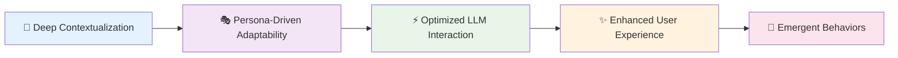

| Goal | Description | Impact |
|------|-------------|---------|
| **🎯 Deep Contextualization** | Leverage rich contextual cues for prompt construction | Highly relevant responses |
| **🎭 Persona-Driven Adaptability** | Complex conditional prompting logic in personas | Consistent agent personality |
| **⚡ Optimized LLM Interaction** | Maximum effectiveness within token limits | Cost-efficient AI operations |
| **✨ Enhanced User Experience** | Natural, relevant, empathetic interactions | Superior user satisfaction |
| **🌟 Emergent Behaviors** | Sophisticated behaviors from dynamic interactions | Advanced AI capabilities |

### **📐 Core Principles**

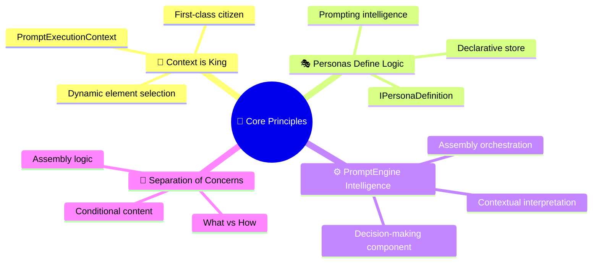

---

## 🔧 System Components & Their Interplay in Prompting

The adaptive prompting system is a collaborative effort between several core AgentOS components. Understanding their roles and interactions is crucial.

### **🏗️ System Architecture**

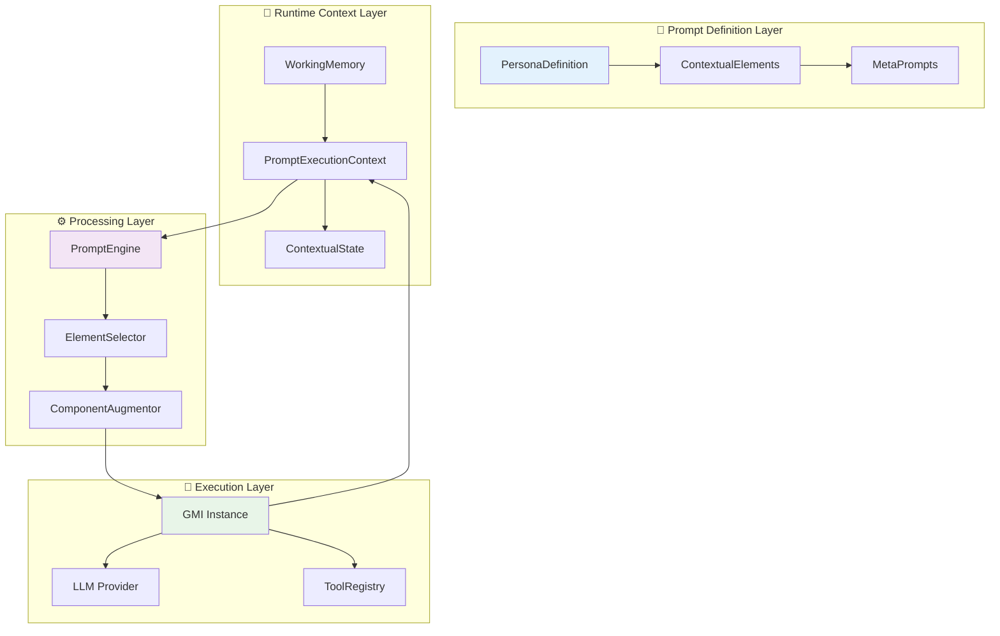

### **🎭 IPersonaDefinition: The Store of Prompting Intelligence**

The `PersonaDefinition` is the blueprint for a GMI, storing both static and dynamic prompting components.

```typescript
interface IPersonaDefinition {
  // 🎯 Core Identity
  identity: PersonaIdentity;
  traits: PersonaTraits;
  
  // 📋 Prompt Configuration
  promptConfig: {
    baseSystemPrompt: string | SystemPromptArray;
    metaPrompts: MetaPrompts;
    contextualElements: ContextualPromptElement[];
    exampleSets: ExampleSet[];
    triggerModules: TriggerModule[];
  };
  
  // 🧠 Cognitive Configuration
  cognitiveConfig: CognitiveConfiguration;
  
  // 🔄 Adaptation Settings
  adaptationConfig: AdaptationConfiguration;
  
  // 💾 Memory Integration
  ragConfig: PersonaRagConfig;
  memoryLifecycleConfig: PersonaMemoryLifecycleConfig;
}
```

#### **🧩 Static Prompt Components**

```typescript
// 📋 Base System Prompt (Flexible Structure)
type BaseSystemPrompt = 
  | string  // Simple string
  | SystemPromptTemplate  // Template with variables
  | PrioritizedSystemPrompt[];  // Layered instructions

interface PrioritizedSystemPrompt {
  content: string;
  priority: number;
  conditions?: ContextualCriteria;
}

// 🔄 Meta-Prompts for Self-Regulation
interface MetaPrompts {
  explainUnexpectedSituation: string;
  generateMemoryMergeProposal: string;
  negotiateMemoryEviction: string;
  selfCritiqueResponse: string;
  adaptToUserFeedback: string;
  generateFollowUpQuestions: string;
}
```

#### **⚡ Dynamic Prompt Elements**

The cornerstone of adaptive prompting - contextual elements that activate based on current state:

```typescript
interface ContextualPromptElement {
  id: string;
  type: 'system_instruction_addon' | 'few_shot_example' | 'reasoning_protocol' | 'safety_guideline';
  content: string | TemplatedContent;
  criteria: ContextualPromptElementCriteria;
  priority?: number;
  weight?: number;
  metadata?: Record<string, any>;
}

interface ContextualPromptElementCriteria {
  // 👤 User Context
  userSkillLevel?: 'beginner' | 'intermediate' | 'expert';
  userMood?: string;
  language?: string;
  
  // 🎯 Task Context
  taskHint?: string;
  taskComplexity?: 'simple' | 'moderate' | 'complex';
  domain?: string;
  
  // 🤖 GMI State
  gmiMood?: string;
  confidenceLevel?: 'low' | 'medium' | 'high';
  
  // 💬 Conversation Context
  conversationSignals?: string[];
  historyLength?: number;
  
  // 🔧 Custom Conditions
  customContext?: Record<string, any>;
}
```

### **🧠 IWorkingMemory: Source of Real-time GMI State**

The GMI's working memory holds transient, session-specific state critical for adaptive prompting:

```typescript
interface IWorkingMemory {
  // 🎭 Personality State
  current_mood: string;
  active_persona_traits: string[];
  
  // 📊 Assessment State
  user_skill_level: 'beginner' | 'intermediate' | 'expert';
  user_preferences: Record<string, any>;
  
  // 🔍 Detection State
  detected_conversation_signals: string[];
  task_complexity_assessment: string;
  
  // 📈 Performance State
  confidence_level: 'low' | 'medium' | 'high';
  success_indicators: string[];
  
  // 🎯 Context State
  active_domain: string;
  current_task_hint: string;
}
```

### **📋 PromptExecutionContext: Packaging Runtime Context**

```typescript
interface PromptExecutionContext {
  // 🎭 Persona Context
  activePersona: IPersonaDefinition;
  
  // 🧠 Memory Context
  workingMemory: IWorkingMemory;
  
  // 🎯 Task Context
  taskHint?: string;
  taskComplexity?: string;
  domain?: string;
  
  // 👤 User Context
  userSkillLevel?: string;
  userPreferences?: Record<string, any>;
  language?: string;
  
  // 💬 Conversation Context
  conversationHistory: ChatMessage[];
  conversationSignals: string[];
  
  // 🔧 Custom Context
  customContext?: Record<string, any>;
  
  // ⏰ Temporal Context
  timestamp: Date;
  sessionId: string;
}
```

### **⚙️ IPromptEngine: The Dynamic Prompt Assembler**

The `PromptEngine` is the intelligent orchestrator that transforms static components and dynamic context into optimized prompts:

```typescript
interface IPromptEngine {
  constructPrompt(
    components: PromptComponents,
    modelTargetInfo: ModelTargetInfo,
    executionContext: PromptExecutionContext
  ): Promise<PromptEngineResult>;
  
  // 🔍 Analysis Methods
  analyzePromptComplexity(prompt: string): PromptComplexityAnalysis;
  estimateTokenUsage(components: PromptComponents): TokenEstimate;
  optimizeForModel(prompt: string, modelInfo: ModelTargetInfo): OptimizedPrompt;
  
  // 🧪 Testing & Debugging
  explainElementSelection(context: PromptExecutionContext): ElementSelectionExplanation;
  validatePromptStructure(persona: IPersonaDefinition): ValidationResult[];
}
```

#### **⚡ PromptEngine Processing Pipeline**

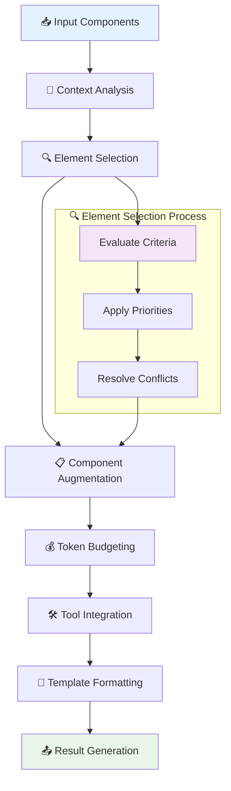

---

## 🔄 The Lifecycle of an Adaptive Prompt: From Design to Execution

### **📐 Design Time: Persona Definition**

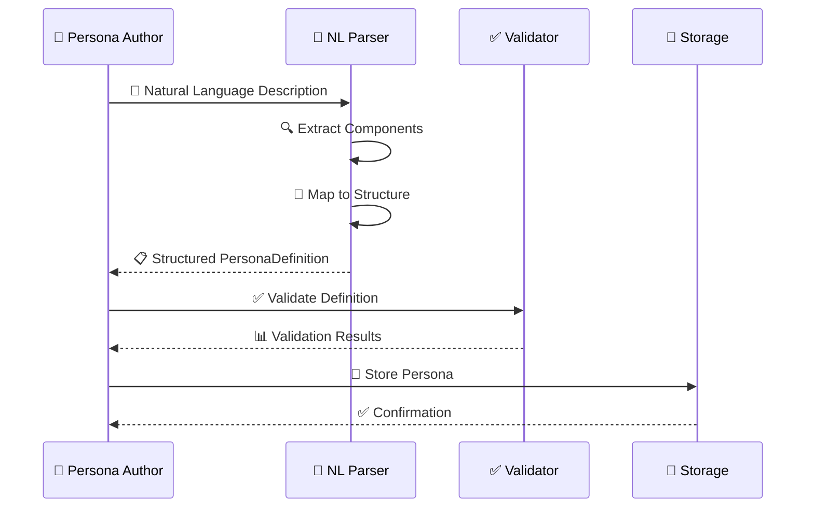

**Key Steps:**
1. **📝 Authoring**: Create persona description in natural language or structured format
2. **🔍 Parsing**: NL Parser converts description to `IPersonaDefinition`
3. **✅ Validation**: Check structure, criteria, and dependencies
4. **💾 Storage**: Serialize and store persona configuration

### **🚀 Runtime: GMI Request Processing**

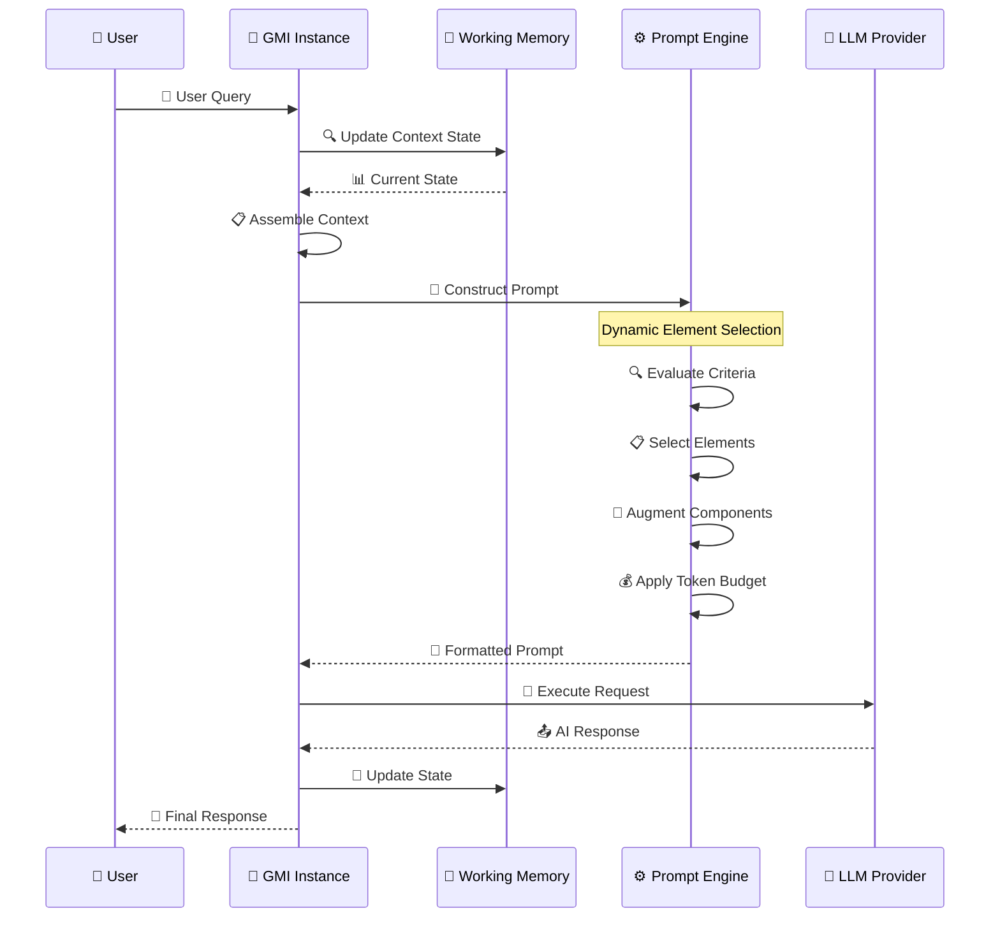

### **🎯 Dynamic Element Selection Process**

The `PromptEngine` performs sophisticated element selection:

```typescript
class PromptEngine {
  private async selectContextualElements(
    persona: IPersonaDefinition,
    context: PromptExecutionContext
  ): Promise<ContextualPromptElement[]> {
    const selectedElements: ContextualPromptElement[] = [];
    
    // 🔍 Evaluate each contextual element
    for (const element of persona.promptConfig.contextualElements) {
      const matches = this.evaluateCriteria(element.criteria, context);
      
      if (matches) {
        selectedElements.push({
          ...element,
          selectionScore: this.calculateSelectionScore(element, context)
        });
      }
    }
    
    // 📊 Sort by priority and score
    return selectedElements
      .sort((a, b) => (b.priority || 0) - (a.priority || 0))
      .sort((a, b) => (b.selectionScore || 0) - (a.selectionScore || 0));
  }
  
  private evaluateCriteria(
    criteria: ContextualPromptElementCriteria,
    context: PromptExecutionContext
  ): boolean {
    // 👤 User skill level matching
    if (criteria.userSkillLevel && 
        criteria.userSkillLevel !== context.userSkillLevel) {
      return false;
    }
    
    // 🎯 Task hint matching
    if (criteria.taskHint && 
        !context.taskHint?.includes(criteria.taskHint)) {
      return false;
    }
    
    // 🤖 GMI mood matching
    if (criteria.gmiMood && 
        criteria.gmiMood !== context.workingMemory.current_mood) {
      return false;
    }
    
    // 💬 Conversation signals
    if (criteria.conversationSignals) {
      const hasSignal = criteria.conversationSignals.some(signal =>
        context.conversationSignals.includes(signal)
      );
      if (!hasSignal) return false;
    }
    
    // 🔧 Custom context evaluation
    if (criteria.customContext) {
      for (const [key, value] of Object.entries(criteria.customContext)) {
        if (context.customContext?.[key] !== value) {
          return false;
        }
      }
    }
    
    return true;
  }
}
```

---

## 🧠 Natural Language Parsing & Persona "Serialization" (The Vision)

### **🎯 Goal: Intuitive Persona Authoring**

Transform human-readable descriptions into sophisticated AI configurations:

```markdown
# Expert Data Scientist - Premium Template

Create a senior-level data science consultant that can:
- Analyze complex datasets with statistical rigor (weight: high priority)
- Generate visualizations and interactive dashboards
- Access real-time market data and research papers
- Work with sensitive financial data (security: high)
- Remember client preferences and analysis patterns across projects
- Provide explanations that scale from executive summary to technical detail

**Communication style**: Professional but accessible, data-driven insights
**Analysis approach**: Hypothesis-driven with multiple validation methods
**Adaptation**: Continuous learning from client feedback and analysis outcomes
**Tools**: Python, R, SQL, Tableau, financial APIs, research databases

Safety: Professional mode with financial data handling protocols
```

### **🔍 Natural Language Prompt Parser (NLPP) Architecture**

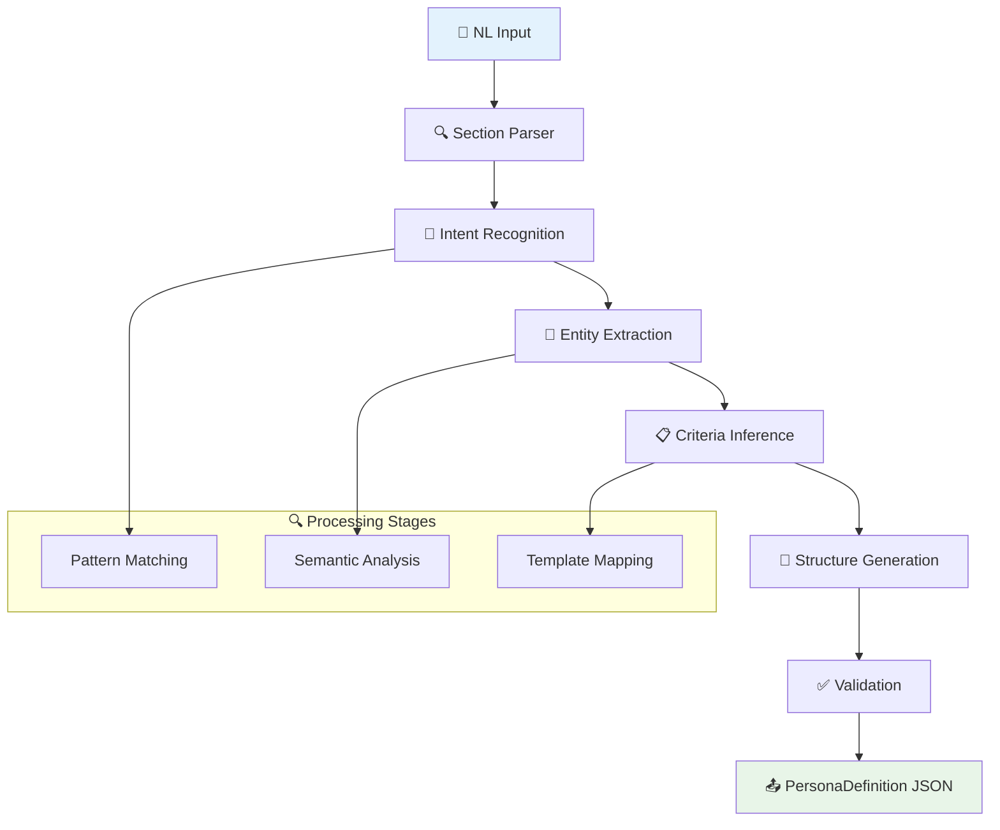

#### **🔄 NLPP Processing Stages**

```typescript
interface INaturalLanguagePromptParser {
  // 🎯 Main parsing entry point
  parsePersonaDescription(description: string): Promise<IPersonaDefinition>;
  
  // 🔍 Component extraction
  extractIdentity(text: string): PersonaIdentity;
  extractCapabilities(text: string): string[];
  extractBehaviorPatterns(text: string): BehaviorConfig;
  extractAdaptationRules(text: string): ContextualPromptElement[];
  
  // 🧠 Intelligence methods
  inferSafetyLevel(text: string): SafetyLevel;
  detectToolRequirements(text: string): string[];
  mapConditionalRules(text: string): ContextualPromptElement[];
  
  // ✅ Validation and optimization
  validateGeneratedPersona(persona: IPersonaDefinition): ValidationResult;
  suggestImprovements(persona: IPersonaDefinition): Suggestion[];
}
```

#### **🧩 Mapping Examples: NL → Structured Config**

| Natural Language | Structured Output |
|------------------|-------------------|
| `"If user is beginner, use simple explanations"` | ```typescript<br/>{ type: "system_instruction_addon", content: "Use simple, clear explanations", criteria: { userSkillLevel: "beginner" } }``` |
| `"Tools: calculator, web_search"` | ```typescript<br/>{ autoGrantedTools: ["calculator", "web_search"] }``` |
| `"Remember user coding preferences"` | ```typescript<br/>{ memoryConfig: { categories: ["user_coding_preferences"] } }``` |
| `"Professional communication style"` | ```typescript<br/>{ behaviorConfig: { communicationStyle: "professional" } }``` |

### **🔧 Serialization Process**

The "serialization" transforms high-level intent into executable configuration:

```typescript
class PersonaSerializer {
  async serialize(nlDescription: string): Promise<IPersonaDefinition> {
    // 🔍 Parse sections and extract components
    const sections = this.parseSections(nlDescription);
    const identity = this.extractIdentity(sections.header);
    const capabilities = this.extractCapabilities(sections.capabilities);
    const behaviorRules = this.extractBehaviorRules(sections.behavior);
    
    // 🧩 Generate contextual elements
    const contextualElements = this.generateContextualElements(behaviorRules);
    
    // 📋 Assemble persona definition
    const persona: IPersonaDefinition = {
      identity,
      promptConfig: {
        baseSystemPrompt: this.generateBasePrompt(identity, capabilities),
        contextualElements,
        metaPrompts: this.generateMetaPrompts(identity),
        exampleSets: this.generateExamples(capabilities),
        triggerModules: this.generateTriggers(behaviorRules)
      },
      cognitiveConfig: this.generateCognitiveConfig(capabilities),
      adaptationConfig: this.generateAdaptationConfig(behaviorRules),
      ragConfig: this.generateRagConfig(capabilities),
      memoryLifecycleConfig: this.generateMemoryConfig(identity)
    };
    
    return persona;
  }
  
  private generateContextualElements(rules: BehaviorRule[]): ContextualPromptElement[] {
    return rules.map(rule => ({
      id: this.generateElementId(rule),
      type: this.inferElementType(rule),
      content: this.formatRuleContent(rule),
      criteria: this.mapRuleToCriteria(rule),
      priority: this.calculatePriority(rule)
    }));
  }
}
```

---

## ⚡ Advanced Prompting Techniques and Strategies in AgentOS

### **🎯 Effective ContextualPromptElement Design**

```typescript
// ✅ Good: Specific and reusable
const beginnerMathHelper: ContextualPromptElement = {
  id: "beginner_math_support",
  type: "system_instruction_addon",
  content: "Use step-by-step explanations with visual analogies. Check understanding frequently with simple questions.",
  criteria: {
    userSkillLevel: "beginner",
    domain: "mathematics"
  },
  priority: 10,
  weight: 1.5
};

// ❌ Bad: Too general and conflicting
const genericHelper: ContextualPromptElement = {
  id: "help_everything",
  type: "system_instruction_addon", 
  content: "Help the user with anything they need",
  criteria: {}, // No specific criteria
  priority: 5
};
```

### **📊 Instructional Layer Management**

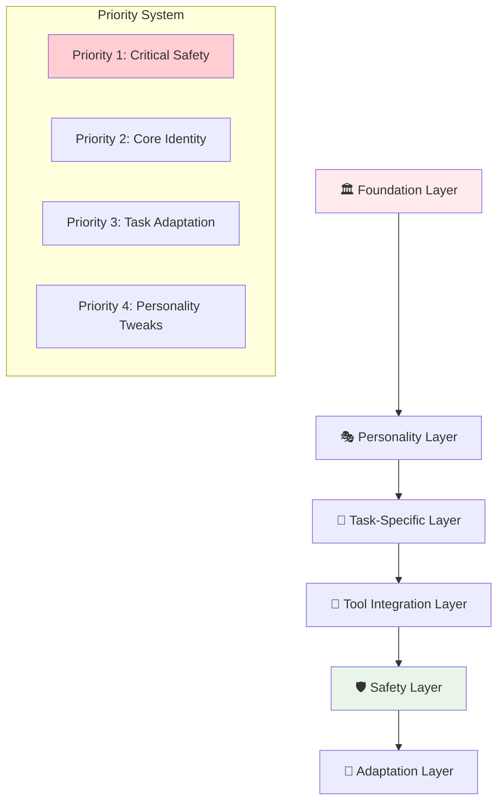

### **🎲 Dynamic Few-Shot Example Strategies**

```typescript
interface DynamicExampleSelector {
  selectExamples(
    availableExamples: WeightedExample[],
    context: PromptExecutionContext,
    tokenBudget: number
  ): WeightedExample[];
}

class ContextualExampleSelector implements DynamicExampleSelector {
  selectExamples(
    examples: WeightedExample[],
    context: PromptExecutionContext,
    budget: number
  ): WeightedExample[] {
    // 🎯 Score examples based on context relevance
    const scoredExamples = examples.map(example => ({
      example,
      relevanceScore: this.calculateRelevance(example, context),
      tokenCost: this.estimateTokens(example.content)
    }));
    
    // 📊 Sort by relevance and fit within budget
    const sorted = scoredExamples
      .sort((a, b) => b.relevanceScore - a.relevanceScore);
    
    const selected: WeightedExample[] = [];
    let usedTokens = 0;
    
    for (const scored of sorted) {
      if (usedTokens + scored.tokenCost <= budget) {
        selected.push(scored.example);
        usedTokens += scored.tokenCost;
      }
    }
    
    return selected;
  }
  
  private calculateRelevance(
    example: WeightedExample, 
    context: PromptExecutionContext
  ): number {
    let score = example.weight || 1.0;
    
    // 🎯 Skill level matching
    if (example.userSkillLevel === context.userSkillLevel) {
      score *= 1.5;
    }
    
    // 🏷️ Domain matching
    if (example.domain === context.domain) {
      score *= 1.3;
    }
    
    // 📈 Success rate weighting
    if (example.successRate) {
      score *= example.successRate;
    }
    
    return score;
  }
}
```

### **🔄 Meta-Prompting for Self-Regulation**

```typescript
const selfCorrectionMetaPrompt = `
## 🔍 Self-Correction Protocol

Before finalizing your response, evaluate it systematically:

### 📊 Quality Checklist
1. **Accuracy** (1-10): Are all facts correct and verifiable?
2. **Completeness** (1-10): Have I addressed all aspects of the question?
3. **Clarity** (1-10): Is my explanation clear and well-structured?
4. **Relevance** (1-10): Does my response directly address the user's needs?
5. **Safety** (1-10): Are there any risks or concerns to address?

### 🔄 Correction Process
- If any score is below 7/10, identify specific issues
- Revise the problematic sections
- Re-evaluate until all scores are 7+
- Only then provide the final response

### 🎯 Context Awareness
Current user skill level: {{userSkillLevel}}
Task complexity: {{taskComplexity}}
Domain focus: {{activeDomain}}
`;
```

### **🧠 Chain-of-Thought Implementation**

```typescript
const complexReasoningProtocol: ContextualPromptElement = {
  id: "advanced_reasoning_cot",
  type: "reasoning_protocol",
  content: `
## 🧠 Advanced Reasoning Protocol

For complex problems, follow this structured approach:

### 1️⃣ Problem Decomposition
- Break the problem into 3-5 sub-components
- Identify dependencies between components
- Estimate complexity and required resources

### 2️⃣ Multi-Path Analysis
- Generate 2-3 different solution approaches
- For each approach, list:
  - Required steps and timeline
  - Potential risks and mitigations
  - Resource requirements
  - Expected confidence level

### 3️⃣ Solution Synthesis
- Compare approaches using weighted criteria
- Select optimal path or hybrid approach
- Justify selection with specific reasoning

### 4️⃣ Implementation Planning
- Create step-by-step action plan
- Identify checkpoints and validation steps
- Plan for contingencies and alternatives

### 5️⃣ Confidence Assessment
- Rate confidence in solution (1-10)
- Identify biggest uncertainty factors
- Suggest validation or testing strategies
  `,
  criteria: {
    taskComplexity: "complex",
    domain: ["engineering", "research", "planning"]
  },
  priority: 15
};
```

---

## 🔗 Prompting System Interactions with Other AgentOS Modules

### **💾 RAG System Integration**

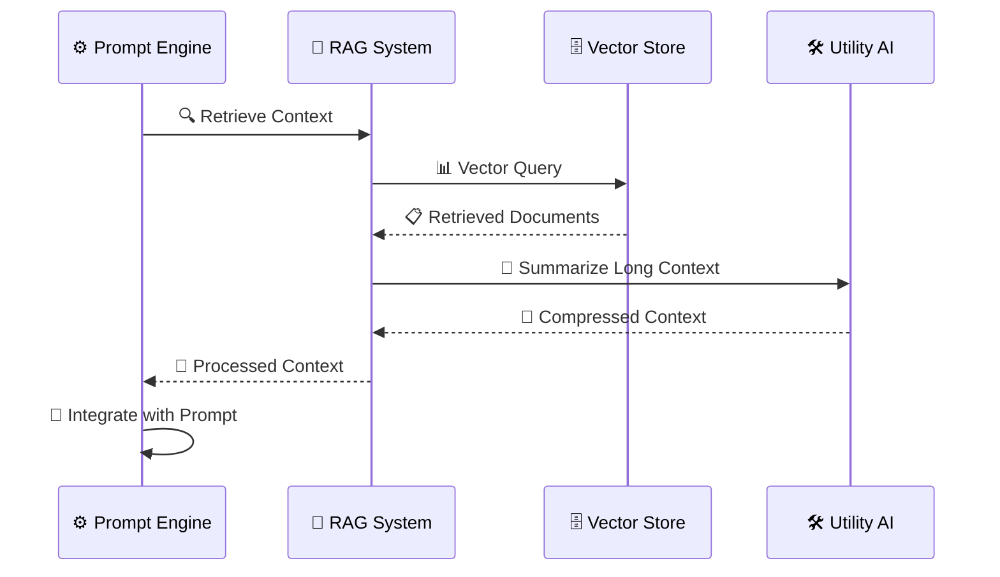

```typescript
class PromptEngine {
  private async integrateRAGContext(
    components: PromptComponents,
    budget: TokenBudget
  ): Promise<ProcessedComponents> {
    if (!components.retrievedContext) return components;
    
    const ragContent = components.retrievedContext;
    const availableTokens = budget.contextAllocation;
    
    // 📏 Check if context fits in budget
    if (ragContent.totalTokensUsed <= availableTokens) {
      return {
        ...components,
        systemMessages: [
          ...components.systemMessages,
          {
            role: 'system',
            content: `## 📚 Relevant Context\n${ragContent.augmentedPromptText}`
          }
        ]
      };
    }
    
    // 📝 Summarize if too long
    const summarized = await this.utilityAI.summarizeContext(
      ragContent.augmentedPromptText,
      availableTokens - 100 // Buffer for formatting
    );
    
    return {
      ...components,
      systemMessages: [
        ...components.systemMessages,
        {
          role: 'system',
          content: `## 📚 Key Context (Summarized)\n${summarized.content}`
        }
      ]
    };
  }
}
```

### **🛠️ Tool System Integration**

```typescript
class PromptEngine {
  private formatToolsForProvider(
    tools: ToolDefinition[],
    toolSupport: ToolSupportInfo
  ): FormattedTools {
    switch (toolSupport.format) {
      case 'openai_functions':
        return this.formatOpenAIFunctions(tools);
      case 'anthropic_tools':
        return this.formatAnthropicTools(tools);
      case 'custom_schema':
        return this.formatCustomSchema(tools, toolSupport.schema);
      default:
        throw new Error(`Unsupported tool format: ${toolSupport.format}`);
    }
  }
  
  private formatOpenAIFunctions(tools: ToolDefinition[]): OpenAIFunction[] {
    return tools.map(tool => ({
      type: "function",
      function: {
        name: tool.id,
        description: tool.description,
        parameters: {
          type: "object",
          properties: this.convertToJSONSchema(tool.inputSchema),
          required: tool.requiredFields || []
        }
      }
    }));
  }
}
```

### **🔧 Utility AI Services**

```typescript
interface IUtilityAI {
  summarizeConversation(
    messages: ChatMessage[],
    targetLength: number
  ): Promise<SummarizationResult>;
  
  analyzePromptComplexity(prompt: string): PromptComplexityAnalysis;
  optimizePromptStructure(prompt: string): OptimizationSuggestions;
}

class PromptEngine {
  private async manageLongHistory(
    history: ChatMessage[],
    budget: TokenBudget
  ): Promise<ChatMessage[]> {
    const historyTokens = this.estimateTokens(history);
    
    if (historyTokens <= budget.historyAllocation) {
      return history;
    }
    
    // 🎯 Keep recent messages + summarize older ones
    const recentMessages = history.slice(-10);
    const olderMessages = history.slice(0, -10);
    
    if (olderMessages.length > 0) {
      const summary = await this.utilityAI.summarizeConversation(
        olderMessages,
        budget.historyAllocation - this.estimateTokens(recentMessages)
      );
      
      return [
        {
          role: 'system',
          content: `## 📋 Conversation Summary\n${summary.content}`
        },
        ...recentMessages
      ];
    }
    
    return recentMessages;
  }
}
```

---

## 🛡️ Constitutional AI and Safeguards via Prompting

### **📜 Constitutional Framework**

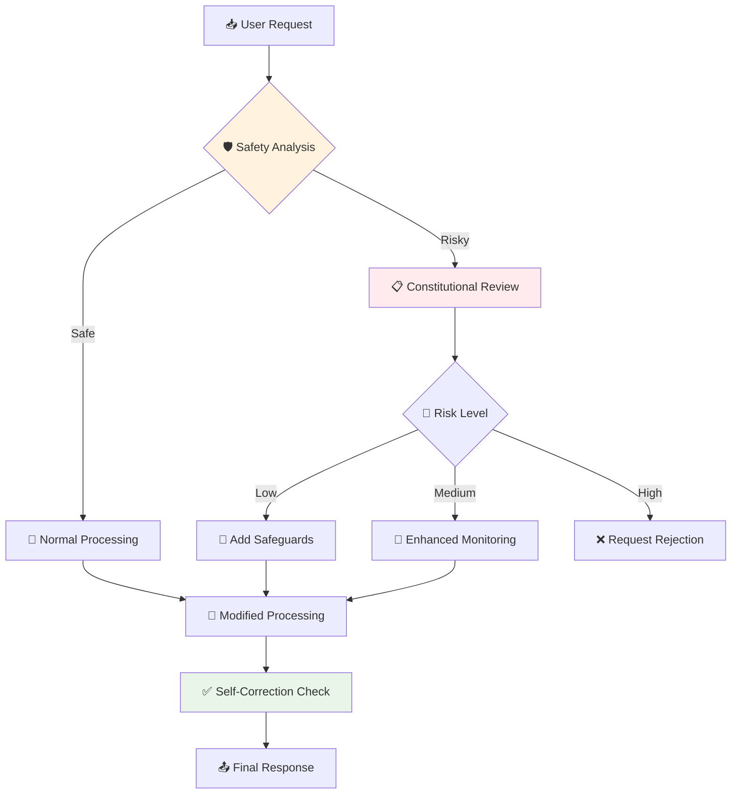

### **🔒 Safety Layer Implementation**

```typescript
interface ConstitutionalConfig {
  // 📜 Core principles (highest priority)
  corePrinciples: string[];
  
  // 🔍 Contextual safeguards
  contextualSafeguards: ContextualSafeguard[];
  
  // 🔄 Self-correction protocol
  selfCorrectionProtocol: string;
  
  // 🚨 Escalation rules
  escalationRules: EscalationRule[];
}

interface ContextualSafeguard {
  triggers: string[];           // What activates this safeguard
  restrictions: string[];       // What restrictions to apply
  alternatives: string[];       // Alternative approaches to suggest
  severity: 'low' | 'medium' | 'high' | 'critical';
  requiresHumanReview?: boolean;
}

const medicalQuerySafeguard: ContextualSafeguard = {
  triggers: ['medical_query', 'health_advice', 'diagnosis'],
  restrictions: [
    'Do not provide specific medical diagnoses',
    'Do not recommend specific treatments',
    'Always suggest consulting healthcare professionals'
  ],
  alternatives: [
    'Provide general health information',
    'Explain when to seek medical attention',
    'Offer lifestyle and wellness guidance'
  ],
  severity: 'high'
};
```

### **🔄 Self-Correction Integration**

```typescript
const constitutionalSelfCorrection: ContextualPromptElement = {
  id: "constitutional_self_correction",
  type: "safety_guideline",
  content: `
## 🛡️ Constitutional Self-Review

Before finalizing your response, conduct this mandatory review:

### 📋 Principle Adherence Check
1. **Accuracy**: Is all information factual and verifiable?
2. **Safety**: Could this response cause harm if misused?
3. **Privacy**: Am I respecting user and third-party privacy?
4. **Bias**: Have I avoided unfair bias or discrimination?
5. **Ethics**: Does this align with ethical AI principles?

### 🚨 Risk Assessment
- **Medical/Health**: Am I providing medical advice? → Add disclaimers
- **Financial**: Am I giving financial advice? → Suggest professional consultation  
- **Legal**: Am I providing legal guidance? → Recommend legal expert
- **Safety**: Could this information be dangerous? → Emphasize safety precautions

### ✅ Correction Protocol
If any concerns are identified:
1. Modify the response to address the concern
2. Add appropriate disclaimers or caveats
3. Suggest professional alternatives when relevant
4. Re-evaluate the modified response

Only proceed when all principles are satisfied.
  `,
  criteria: {
    // Applied to all responses
  },
  priority: 100 // Highest priority
};
```

---

## 📚 Foundational Research and Inspirations

### **🧠 Research Foundations**

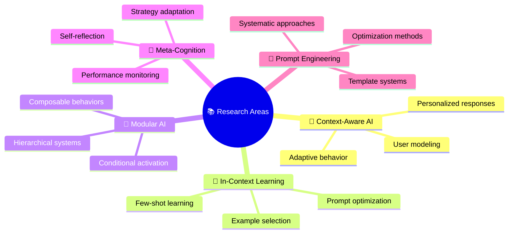

### **📖 Key Research Papers & Concepts**

| Research Area | Key Papers/Concepts | Application in AgentOS |
|---------------|-------------------|----------------------|
| **Few-Shot Learning** | Brown et al. (2020) "Language Models are Few-Shot Learners" | Dynamic example selection in `ContextualPromptElement` |
| **Constitutional AI** | Bai et al. (2022) "Constitutional AI" | Self-correction protocols and safety layers |
| **Chain-of-Thought** | Wei et al. (2022) "Chain-of-Thought Prompting" | Reasoning protocols in complex tasks |
| **Instruction Following** | Ouyang et al. (2022) "Training language models to follow instructions" | Adaptive instruction generation |
| **Persona-based AI** | Li et al. (2016) "A Persona-Based Neural Conversation Model" | `IPersonaDefinition` and personality consistency |

### **🔬 Novel Contributions**

AgentOS advances the field through:

- **🎯 Contextual Prompt Composition**: Dynamic assembly based on multi-dimensional context
- **🧠 GMI-Negotiated Memory**: AI-assisted memory lifecycle management
- **🔄 Natural Language Serialization**: NL descriptions → executable configurations
- **🎭 Hierarchical Persona Architecture**: Layered personality and capability systems
- **🛡️ Integrated Constitutional AI**: Built-in ethical reasoning and self-correction

---

## 🧪 Testing and Debugging Adaptive Prompts

### **🔧 Testing Strategy**

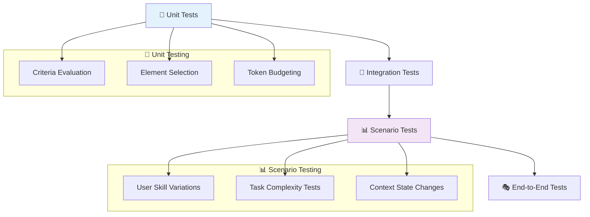

### **🔍 Debugging Tools**

```typescript
interface PromptDebugger {
  // 🔍 Analysis methods
  explainElementSelection(
    persona: IPersonaDefinition,
    context: PromptExecutionContext
  ): ElementSelectionExplanation;
  
  tracePromptConstruction(
    components: PromptComponents,
    context: PromptExecutionContext
  ): PromptConstructionTrace;
  
  // 📊 Performance analysis
  analyzePromptPerformance(
    promptId: string,
    timeRange: TimeRange
  ): PerformanceAnalysis;
  
  // 🧪 Testing utilities
  simulateContext(overrides: Partial<PromptExecutionContext>): PromptExecutionContext;
  validatePersonaLogic(persona: IPersonaDefinition): ValidationResult[];
}

interface ElementSelectionExplanation {
  selectedElements: {
    element: ContextualPromptElement;
    matchedCriteria: string[];
    selectionScore: number;
    reasoning: string;
  }[];
  rejectedElements: {
    element: ContextualPromptElement;
    failedCriteria: string[];
    reasoning: string;
  }[];
  conflictResolutions: {
    conflictingElements: ContextualPromptElement[];
    resolution: string;
    reasoning: string;
  }[];
}
```

### **📊 Scenario-Based Testing**

```typescript
describe('Adaptive Prompting System', () => {
  describe('Beginner User Scenarios', () => {
    test('should provide simple explanations for complex topics', async () => {
      const context = createTestContext({
        userSkillLevel: 'beginner',
        taskHint: 'complex_programming_concept',
        domain: 'software_engineering'
      });
      
      const result = await promptEngine.constructPrompt(
        baseComponents,
        modelInfo,
        context
      );
      
      // 🔍 Verify beginner-friendly elements were selected
      expect(result.metadata.selectedElements).toContainEqual(
        expect.objectContaining({
          id: 'beginner_explanation_support'
        })
      );
      
      // 📝 Verify simplified language in prompt
      expect(result.formattedPrompt.messages).toContainEqual(
        expect.objectContaining({
          content: expect.stringContaining('step-by-step')
        })
      );
    });
  });
  
  describe('Expert User Scenarios', () => {
    test('should provide detailed technical information', async () => {
      const context = createTestContext({
        userSkillLevel: 'expert',
        taskHint: 'architecture_design',
        domain: 'distributed_systems'
      });
      
      const result = await promptEngine.constructPrompt(
        baseComponents,
        modelInfo,
        context
      );
      
      expect(result.metadata.selectedElements).toContainEqual(
        expect.objectContaining({
          id: 'expert_technical_depth'
        })
      );
    });
  });
});
```

### **📈 Performance Monitoring**

```typescript
class PromptPerformanceMonitor {
  async trackPromptEffectiveness(
    promptId: string,
    context: PromptExecutionContext,
    userFeedback: UserFeedback
  ): Promise<void> {
    const metrics = {
      promptId,
      timestamp: new Date(),
      context: this.sanitizeContext(context),
      selectedElements: context.selectedElements?.map(e => e.id),
      userSatisfaction: userFeedback.rating,
      taskSuccess: userFeedback.taskCompleted,
      responseQuality: userFeedback.qualityRating
    };
    
    await this.metricsStore.record(metrics);
    
    // 🔍 Analyze patterns for optimization
    await this.analyzeElementPerformance(metrics);
  }
  
  private async analyzeElementPerformance(metrics: PromptMetrics): Promise<void> {
    // 📊 Track which elements correlate with success
    for (const elementId of metrics.selectedElements) {
      await this.updateElementStats(elementId, {
        usageCount: 1,
        averageSatisfaction: metrics.userSatisfaction,
        successRate: metrics.taskSuccess ? 1 : 0
      });
    }
  }
}
```

---

## 🔮 The Future of Prompting in AgentOS

### **🚀 Planned Enhancements**

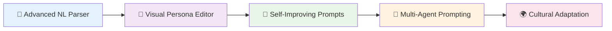

| Enhancement | Timeline | Impact | Description |
|-------------|----------|---------|-------------|
| **🧠 Advanced NL Parser** | Q3 2024 | 🔥 High | LLM-powered parsing with 95%+ accuracy |
| **🎨 Visual Persona Editor** | Q4 2024 | 🔥 High | Drag-and-drop persona creation interface |
| **🔄 Self-Improving Prompts** | 2025 | 🔥 High | Prompts that optimize based on performance |
| **🤝 Multi-Agent Prompting** | 2025 | 🟡 Medium | Collaborative prompt construction |
| **🌍 Cultural Adaptation** | 2025 | 🟡 Medium | Region-specific communication patterns |

### **🧪 Research Directions**

#### **🧠 Adaptive Learning Systems**

```typescript
interface AdaptivePromptSystem {
  // 📊 Performance analysis
  analyzePromptPerformance(
    promptHistory: PromptExecution[],
    outcomeMetrics: OutcomeMetrics[]
  ): PerformanceInsights;
  
  // 🔄 Automatic optimization
  proposeOptimizations(
    persona: IPersonaDefinition,
    performanceData: PerformanceInsights
  ): OptimizationProposal[];
  
  // 🧠 Learning integration
  updatePersonaFromLearning(
    persona: IPersonaDefinition,
    learningData: LearningData
  ): IPersonaDefinition;
}
```

#### **🤝 Multi-Agent Prompt Coordination**

```typescript
interface MultiAgentPromptCoordinator {
  // 🎯 Task decomposition
  decomposeComplexTask(
    task: ComplexTask,
    availableAgents: GMI[]
  ): TaskDecomposition;
  
  // 🔗 Prompt chaining
  chainPrompts(
    agents: GMI[],
    taskPlan: TaskDecomposition
  ): PromptChain;
  
  // 🤝 Collaborative context
  shareContext(
    fromAgent: GMI,
    toAgent: GMI,
    sharedContext: SharedContext
  ): Promise<void>;
}
```

### **🌟 Vision: Emergent Intelligence**

The ultimate goal is GMIs that can:

- **🧠 Self-Author Prompts**: Create their own contextual elements based on experience
- **🔄 Meta-Learn**: Improve their own prompting strategies through reflection
- **🤝 Collaborate**: Work together on complex tasks with coordinated prompting
- **🌍 Adapt Culturally**: Automatically adjust communication patterns for different regions
- **🎯 Predict Needs**: Anticipate user requirements and pre-adapt prompts

```typescript
// 🔮 Future vision: Self-evolving personas
interface EvolvingPersona extends IPersonaDefinition {
  // 🧠 Learning capabilities
  learningHistory: LearningEvent[];
  adaptationRate: number;
  performanceMetrics: PerformanceTracker;
  
  // 🔄 Self-modification methods
  proposeNewElement(
    trigger: InteractionPattern,
    success: boolean
  ): ContextualPromptElement;
  
  refineExistingElement(
    elementId: string,
    feedback: PerformanceFeedback
  ): ContextualPromptElement;
  
  // 🤝 Collaborative learning
  shareInsightsWith(otherPersona: EvolvingPersona): Promise<void>;
  incorporatePeerLearning(insights: PeerInsight[]): Promise<void>;
}
```

---

## 🤝 Contributing to the Prompting System

### **🛠️ Development Areas**

| Area | Skills | Impact | Entry Barrier |
|------|--------|---------|---------------|
| **🧠 NL Parser** | NLP, ML, Python | 🔥 High | 🔴 High |
| **🎨 Visual Editor** | Vue.js, UI/UX | 🔥 High | 🟡 Medium |
| **🧪 Testing Framework** | Jest, Testing | 🟡 Medium | 🟢 Low |
| **📚 Documentation** | Technical Writing | 🟡 Medium | 🟢 Low |
| **💡 Persona Templates** | Prompt Engineering | 🟡 Medium | 🟢 Low |

### **🚀 Getting Started**

```bash
# 📥 Set up development environment
git clone https://github.com/agentos/agentos.git
cd agentos
npm install

# 🧪 Run prompting system tests
npm run test:prompts
npm run test:integration:prompts

# 🎯 Work on specific components
cd backend/agentos/cognitive_substrate/prompting
npm run dev:watch
```

---

<div align="center">

**🧠 The Future of AI Communication is Adaptive**

*Building intelligent agents that understand context, adapt to users, and evolve through interaction*

[⭐ Star on GitHub](https://github.com/agentos/agentos) • [📧 Newsletter](https://agentos.ai/newsletter) • [🤝 Contribute](../CONTRIBUTING.md)

</div>