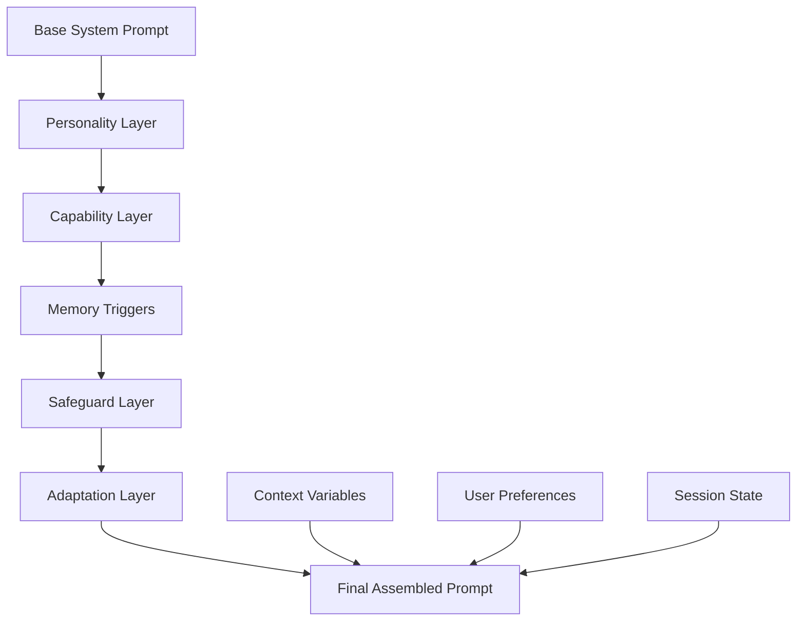

# AgentOS Advanced Prompting System Guide 🎯

**Version:** 2.0 (Natural Language Parsing + Advanced Features)  
**Status:** Core Implementation Ready

This guide covers AgentOS's sophisticated prompting system, from simple natural language definitions to advanced template composition, constitutional AI integration, and visual editing interfaces.

---

## Table of Contents

- [Overview](#overview)
- [Natural Language Prompt Parsing](#natural-language-prompt-parsing)
- [Modular Prompt Design](#modular-prompt-design)
- [Advanced Template Architecture](#advanced-template-architecture)
- [Persona Integration](#persona-integration)
- [Visual Editor Design](#visual-editor-design)
- [Plugin-Style Trigger Modules](#plugin-style-trigger-modules)
- [Constitutional AI Integration](#constitutional-ai-integration)
- [Best Practices](#best-practices)
- [Backend Integration](#backend-integration)
- [API Reference](#api-reference)
- [Examples](#examples)
- [Future Enhancements](#future-enhancements)

---

## Overview

AgentOS features a revolutionary prompting system that bridges the gap between human-friendly natural language descriptions and sophisticated AI configurations. The system automatically parses natural language prompts to extract capabilities, tools, safety levels, and behavioral patterns.

### Key Innovations

- **Natural Language Parsing**: Automatically extract AI capabilities from plain English descriptions
- **Hierarchical Composition**: Build complex prompts from modular, reusable components
- **Constitutional AI**: Built-in safety and ethical guidelines with self-correction
- **Dynamic Adaptation**: Prompts that adapt based on user skill level and context
- **Visual Editing**: Intuitive GUI for prompt creation and management

---

## Natural Language Prompt Parsing

### Minimal Approach

The simplest way to create an AI agent in AgentOS:

```markdown
# SQL Expert - web search, code execution, uncensored, remembers user's database schemas
```

**Auto-Parsed Result:**
```typescript
{
  identity: { role: "SQL Expert", safetyLevel: "uncensored_technical" },
  autoGrantedTools: ["web_search", "code_execution"],
  memoryConfig: { categories: ["user_database_schemas"], retention: "long_term" }
}
```

### Advanced Natural Language

```markdown
# Elite Coding Mentor - Premium Template

Create an expert-level programming assistant that can:
- Review code with strict standards (weight: high priority)
- Execute and test code in multiple languages 
- Access documentation and examples from the web
- Generate architecture diagrams
- Work with sensitive/uncensored technical content
- Remember user's coding patterns and preferences across sessions
- Provide detailed explanations that scale with user expertise

**Communication style**: Direct, no fluff, executable examples only
**Learning approach**: Show positive examples of clean code, negative examples of bad practices
**Adaptation**: Continuous learning from user feedback and code review results

Safety: Technical uncensored mode - allow discussion of security vulnerabilities, reverse engineering, etc.
```

**Auto-Parsed Advanced Result:**
```typescript
{
  identity: {
    name: "Elite Coding Mentor",
    role: "expert_programming_assistant", 
    tier: "premium",
    safetyLevel: "uncensored_technical",
    adaptationMode: "continuous"
  },
  autoGrantedTools: ["web_search", "code_execution", "diagram_generation", "documentation_access"],
  impliedCapabilities: ["code_review", "architecture_analysis", "security_assessment"],
  behaviorConfig: {
    explanationStyle: "scaling_with_expertise",
    codeStandards: "strict",
    exampleMode: "executable_only"
  },
  learningConfig: {
    positiveExamples: "clean_code_patterns",
    negativeExamples: "antipatterns_and_vulnerabilities", 
    feedbackIntegration: "continuous",
    userPatternRecognition: true
  },
  memoryConfig: {
    categories: ["user_coding_patterns", "project_context", "preferences", "skill_assessment"],
    retention: "long_term",
    crossSessionLearning: true
  }
}
```

### Parsing Algorithm

The natural language parser uses a combination of:

1. **Keyword Detection**: Identifies tools, safety levels, and capabilities
2. **Pattern Recognition**: Recognizes common prompt structures and intentions
3. **Semantic Analysis**: Uses lightweight NLP to understand requirements
4. **Template Matching**: Maps parsed elements to standard configurations

```typescript
interface PromptParser {
  parseNaturalLanguage(prompt: string): ParsedPromptConfig;
  extractCapabilities(text: string): string[];
  inferSafetyLevel(text: string): SafetyLevel;
  detectTools(text: string): string[];
  identifyMemoryNeeds(text: string): MemoryConfig;
}
```

---

## Modular Prompt Design

### Hierarchical Structure

Build prompts as a stack of modular components:

```typescript
interface ModularPrompt {
  baseSystemPrompt: string;        // Core persona instructions
  personalityLayer: string;        // Personality and tone
  capabilityLayer: string[];       // Available tools and skills
  memoryTriggers: string[];        // Memory integration points
  safeguardLayer: string;          // Safety and ethical guidelines
  adaptationLayer: string;         // Dynamic behavior adjustments
}
```

### Layer Composition



### Example Layer Breakdown

```markdown
## Base System Prompt
You are an expert coding assistant with deep knowledge of software development.

## Personality Layer
- Communication: Direct and technical
- Tone: Professional but approachable
- Style: Focus on executable solutions

## Capability Layer
- Code execution and testing
- Web search for documentation
- Architecture diagram generation
- Security vulnerability analysis

## Memory Triggers
- Remember user's preferred languages
- Store successful debugging patterns
- Track project context across sessions

## Safeguard Layer
- Always validate code before execution
- Warn about security implications
- Respect intellectual property

## Adaptation Layer
- Adjust explanation depth based on user expertise
- Modify communication style based on user feedback
```

---

## Advanced Template Architecture

### Structured Prompt Definition

```typescript
interface AdvancedPromptStructure {
  identity: {
    name: string;
    role: string;
    expertise: string[];
    safetyLevel: SafetyLevel;
    adaptationMode: 'static' | 'continuous' | 'session_based';
    complexityLevel: 'basic' | 'intermediate' | 'advanced' | 'expert';
  };

  examples: {
    positive: WeightedExample[];
    negative: WeightedExample[];
    contextual: ContextualExample[];
  };

  reasoningConfig: {
    chainOfThought: boolean;
    selfCorrection: boolean;
    confidenceScoring: boolean;
    multiplePathways: boolean;
    stepByStepExplicit: boolean;
  };

  adaptationConfig: {
    userSkillDetection: boolean;
    complexityScaling: boolean;
    domainSpecialization: boolean;
    preferenceTracking: boolean;
  };

  qualityConfig: {
    selfCritique: boolean;
    solutionValidation: boolean;
    alternativeGeneration: boolean;
    completenessCheck: boolean;
  };

  metaLearning: {
    patternRecognition: boolean;
    successTracking: boolean;
    adaptiveImprovement: boolean;
    interactionAnalysis: boolean;
  };
}
```

### Weighted Examples System

```typescript
interface WeightedExample {
  content: string;
  weight: number; // 0.1 to 2.0, default 1.0
  context?: string[];
  userSkillLevel?: 'beginner' | 'intermediate' | 'expert';
  domain?: string;
  successRate?: number;
}

interface ContextualExample {
  triggers: string[];
  content: string;
  adaptiveWeight: (context: any) => number;
}
```

### Chain-of-Thought Configuration

```markdown
## Chain-of-Thought Reasoning Protocol

For complex problems, always follow this reasoning pattern:
1. **Problem Analysis**: Break down the issue
2. **Multiple Approaches**: Consider 2-3 different solutions
3. **Trade-off Evaluation**: Compare pros/cons
4. **Implementation Strategy**: Step-by-step approach
5. **Self-Validation**: Check solution completeness
6. **Confidence Assessment**: Rate solution quality (1-10)
```

---

## Persona Integration

### Persona Definition Structure

```typescript
interface IPersonaDefinition {
  // Core identity
  identity: PersonaIdentity;
  traits: PersonaTraits;
  
  // Prompt configuration
  promptConfig: {
    baseSystemPrompt: string;
    metaPrompts: MetaPrompts;
    exampleSets: ExampleSet[];
    triggerModules: TriggerModule[];
  };
  
  // Cognitive configuration
  cognitiveConfig: CognitiveConfiguration;
  
  // Dynamic behavior
  adaptationConfig: AdaptationConfiguration;
  
  // Memory and RAG
  ragConfig: PersonaRagConfig;
  memoryLifecycleConfig: PersonaMemoryLifecycleConfig;
}
```

### Meta-Prompts for Self-Regulation

```typescript
interface MetaPrompts {
  explainUnexpectedSituation: string;
  generateMemoryMergeProposal: string;
  negotiateMemoryEviction: string;
  selfCritiqueResponse: string;
  adaptToUserFeedback: string;
  generateFollowUpQuestions: string;
}
```

### Example Meta-Prompt

```markdown
## Self-Critique Meta-Prompt

Before finalizing your response, evaluate it using these criteria:
1. **Accuracy**: Is the information correct and up-to-date?
2. **Completeness**: Have I addressed all aspects of the question?
3. **Clarity**: Is my explanation clear and well-structured?
4. **Actionability**: Can the user implement my suggestions?
5. **Safety**: Are there any risks or considerations I should mention?

If any area scores below 8/10, revise your response before sending.
```

---

## Visual Editor Design

### Vue 3 + Tailwind Implementation

The prompt editor features a modern, intuitive interface:

#### Component Structure

```vue
<template>
  <div class="prompt-editor">
    <!-- Header with save