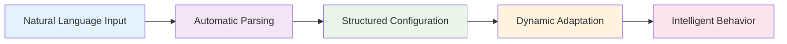
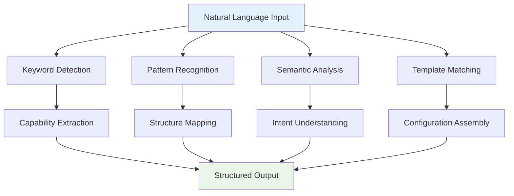
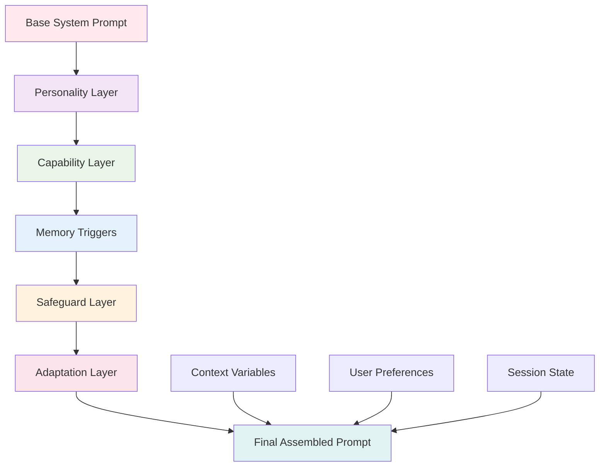
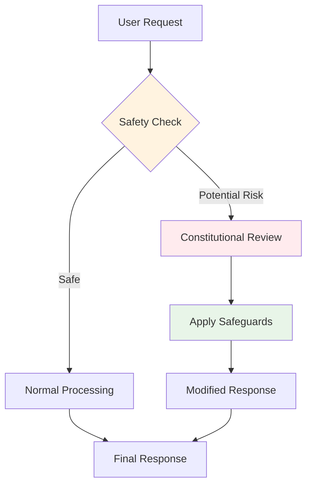

# 🎯 AgentOS Advanced Prompting System

[](#) [](#)

> **Revolutionary prompting system that bridges natural language descriptions and sophisticated AI configurations**

---

## 🚀 Quick Navigation

| Section | Description | Jump To |
|---------|-------------|---------|
| 🌟 **[Overview](#-overview)** | System introduction and key innovations | [↓](#-overview) |
| 🧠 **[Natural Language Parsing](#-natural-language-parsing)** | Automatic prompt configuration from plain English | [↓](#-natural-language-parsing) |
| 🏗️ **[Modular Design](#️-modular-prompt-design)** | Building complex prompts from components | [↓](#️-modular-prompt-design) |
| ⚡ **[Template Architecture](#-advanced-template-architecture)** | Sophisticated prompt structures | [↓](#-advanced-template-architecture) |
| 🎭 **[Persona Integration](#-persona-integration)** | AI personality system | [↓](#-persona-integration) |
| 🎨 **[Visual Editor](#-visual-editor-design)** | GUI for prompt creation | [↓](#-visual-editor-design) |

**🔗 Related Documentation:**
- [📖 Main README](../README.md) - AgentOS overview and getting started
- [🚀 Getting Started](GETTING-STARTED.md) - Getting Started
- [🔧 LLM Providers](../backend/agentos/core/llm/providers/README.md) - Multi-provider LLM integration
- [💾 RAG System](RAG.md) - Memory and knowledge retrieval
- [🧠 Technical Deep Dive](ARCHITECTURE.md) - Complete system architecture
- [⚙️ API Reference](API.md) - Development documentation

---

## 📋 Table of Contents

- [🌟 Overview](#-overview)
- [🧠 Natural Language Parsing](#-natural-language-parsing)
- [🏗️ Modular Prompt Design](#️-modular-prompt-design)
- [⚡ Advanced Template Architecture](#-advanced-template-architecture)
- [🎭 Persona Integration](#-persona-integration)
- [🎨 Visual Editor Design](#-visual-editor-design)
- [🔌 Plugin-Style Trigger Modules](#-plugin-style-trigger-modules)
- [🛡️ Constitutional AI Integration](#️-constitutional-ai-integration)
- [✨ Best Practices](#-best-practices)
- [🔧 Backend Integration](#-backend-integration)
- [📚 API Reference](#-api-reference)
- [💡 Examples](#-examples)
- [🔮 Future Enhancements](#-future-enhancements)

---

## 🌟 Overview

AgentOS features a revolutionary prompting system that transforms how we create and manage AI agents. Instead of complex configurations, you can describe what you want in natural language, and the system automatically builds sophisticated AI personalities.

### **🎯 Key Innovations**



| Innovation | Description | Benefit |
|------------|-------------|---------|
| 🧠 **Natural Language Parsing** | Extract AI capabilities from plain English | Intuitive persona creation |
| 🏗️ **Hierarchical Composition** | Build complex prompts from reusable components | Maintainable and scalable |
| 🛡️ **Constitutional AI** | Built-in safety and ethical guidelines | Self-correcting behavior |
| ⚡ **Dynamic Adaptation** | Prompts adapt based on context and user skill | Personalized interactions |
| 🎨 **Visual Editing** | Intuitive GUI for prompt management | Accessible to non-developers |

---

## 🧠 Natural Language Parsing

### **✨ The Minimal Approach**

The simplest way to create an AI agent in AgentOS:

```markdown
# SQL Expert - web search, code execution, uncensored, remembers user's database schemas
```

**🔄 Auto-Parsed Result:**
```typescript
{
  identity: { 
    role: "SQL Expert", 
    safetyLevel: "uncensored_technical" 
  },
  autoGrantedTools: ["web_search", "code_execution"],
  memoryConfig: { 
    categories: ["user_database_schemas"], 
    retention: "long_term" 
  }
}
```

### **🚀 Advanced Natural Language Configuration**

```markdown
# Elite Coding Mentor - Premium Template

Create an expert-level programming assistant that can:
- Review code with strict standards (weight: high priority)
- Execute and test code in multiple languages 
- Access documentation and examples from the web
- Generate architecture diagrams
- Work with sensitive/uncensored technical content
- Remember user's coding patterns and preferences across sessions
- Provide detailed explanations that scale with user expertise

**Communication style**: Direct, no fluff, executable examples only
**Learning approach**: Show positive examples of clean code, negative examples of bad practices
**Adaptation**: Continuous learning from user feedback and code review results

Safety: Technical uncensored mode - allow discussion of security vulnerabilities, reverse engineering, etc.
```

**🔄 Advanced Parsed Result:**
```typescript
{
  identity: {
    name: "Elite Coding Mentor",
    role: "expert_programming_assistant", 
    tier: "premium",
    safetyLevel: "uncensored_technical",
    adaptationMode: "continuous"
  },
  autoGrantedTools: [
    "web_search", 
    "code_execution", 
    "diagram_generation", 
    "documentation_access"
  ],
  impliedCapabilities: [
    "code_review", 
    "architecture_analysis", 
    "security_assessment"
  ],
  behaviorConfig: {
    explanationStyle: "scaling_with_expertise",
    codeStandards: "strict",
    exampleMode: "executable_only"
  },
  learningConfig: {
    positiveExamples: "clean_code_patterns",
    negativeExamples: "antipatterns_and_vulnerabilities", 
    feedbackIntegration: "continuous",
    userPatternRecognition: true
  },
  memoryConfig: {
    categories: [
      "user_coding_patterns", 
      "project_context", 
      "preferences", 
      "skill_assessment"
    ],
    retention: "long_term",
    crossSessionLearning: true
  }
}
```

### **🔍 Parsing Algorithm**

The natural language parser combines multiple techniques:



```typescript
interface PromptParser {
  parseNaturalLanguage(prompt: string): ParsedPromptConfig;
  extractCapabilities(text: string): string[];
  inferSafetyLevel(text: string): SafetyLevel;
  detectTools(text: string): string[];
  identifyMemoryNeeds(text: string): MemoryConfig;
}
```

---

## 🏗️ Modular Prompt Design

### **📐 Hierarchical Structure**

Build prompts as a stack of modular components:



### **🧩 Layer Composition**

```typescript
interface ModularPrompt {
  baseSystemPrompt: string;        // Core persona instructions
  personalityLayer: string;        // Personality and tone
  capabilityLayer: string[];       // Available tools and skills
  memoryTriggers: string[];        // Memory integration points
  safeguardLayer: string;          // Safety and ethical guidelines
  adaptationLayer: string;         // Dynamic behavior adjustments
}
```

### **💡 Example Layer Breakdown**

```markdown
## 🎯 Base System Prompt
You are an expert coding assistant with deep knowledge of software development.

## 🎭 Personality Layer
- **Communication:** Direct and technical
- **Tone:** Professional but approachable  
- **Style:** Focus on executable solutions

## ⚡ Capability Layer
- Code execution and testing
- Web search for documentation
- Architecture diagram generation
- Security vulnerability analysis

## 🧠 Memory Triggers
- Remember user's preferred languages
- Store successful debugging patterns
- Track project context across sessions

## 🛡️ Safeguard Layer
- Always validate code before execution
- Warn about security implications
- Respect intellectual property

## 🔄 Adaptation Layer
- Adjust explanation depth based on user expertise
- Modify communication style based on user feedback
```

---

## ⚡ Advanced Template Architecture

### **🏗️ Structured Prompt Definition**

```typescript
interface AdvancedPromptStructure {
  identity: {
    name: string;
    role: string;
    expertise: string[];
    safetyLevel: SafetyLevel;
    adaptationMode: 'static' | 'continuous' | 'session_based';
    complexityLevel: 'basic' | 'intermediate' | 'advanced' | 'expert';
  };

  examples: {
    positive: WeightedExample[];
    negative: WeightedExample[];
    contextual: ContextualExample[];
  };

  reasoningConfig: {
    chainOfThought: boolean;
    selfCorrection: boolean;
    confidenceScoring: boolean;
    multiplePathways: boolean;
    stepByStepExplicit: boolean;
  };

  adaptationConfig: {
    userSkillDetection: boolean;
    complexityScaling: boolean;
    domainSpecialization: boolean;
    preferenceTracking: boolean;
  };

  qualityConfig: {
    selfCritique: boolean;
    solutionValidation: boolean;
    alternativeGeneration: boolean;
    completenessCheck: boolean;
  };

  metaLearning: {
    patternRecognition: boolean;
    successTracking: boolean;
    adaptiveImprovement: boolean;
    interactionAnalysis: boolean;
  };
}
```

### **⚖️ Weighted Examples System**

```typescript
interface WeightedExample {
  content: string;
  weight: number; // 0.1 to 2.0, default 1.0
  context?: string[];
  userSkillLevel?: 'beginner' | 'intermediate' | 'expert';
  domain?: string;
  successRate?: number;
}

interface ContextualExample {
  triggers: string[];
  content: string;
  adaptiveWeight: (context: any) => number;
}
```

### **🧠 Chain-of-Thought Configuration**

```markdown
## 🔗 Chain-of-Thought Reasoning Protocol

For complex problems, always follow this reasoning pattern:

1. **🔍 Problem Analysis**: Break down the issue
2. **🔀 Multiple Approaches**: Consider 2-3 different solutions  
3. **⚖️ Trade-off Evaluation**: Compare pros/cons
4. **📋 Implementation Strategy**: Step-by-step approach
5. **✅ Self-Validation**: Check solution completeness
6. **📊 Confidence Assessment**: Rate solution quality (1-10)
```

---

## 🎭 Persona Integration

### **🏗️ Persona Definition Structure**

```typescript
interface IPersonaDefinition {
  // Core identity
  identity: PersonaIdentity;
  traits: PersonaTraits;
  
  // Prompt configuration
  promptConfig: {
    baseSystemPrompt: string;
    metaPrompts: MetaPrompts;
    exampleSets: ExampleSet[];
    triggerModules: TriggerModule[];
  };
  
  // Cognitive configuration
  cognitiveConfig: CognitiveConfiguration;
  
  // Dynamic behavior
  adaptationConfig: AdaptationConfiguration;
  
  // Memory and RAG
  ragConfig: PersonaRagConfig;
  memoryLifecycleConfig: PersonaMemoryLifecycleConfig;
}
```

### **🔄 Meta-Prompts for Self-Regulation**

```typescript
interface MetaPrompts {
  explainUnexpectedSituation: string;
  generateMemoryMergeProposal: string;
  negotiateMemoryEviction: string;
  selfCritiqueResponse: string;
  adaptToUserFeedback: string;
  generateFollowUpQuestions: string;
}
```

### **💡 Example Meta-Prompt**

```markdown
## 🔍 Self-Critique Meta-Prompt

Before finalizing your response, evaluate it using these criteria:

| Criterion | Score (1-10) | Question |
|-----------|--------------|----------|
| **🎯 Accuracy** | _/10 | Is the information correct and up-to-date? |
| **✅ Completeness** | _/10 | Have I addressed all aspects of the question? |
| **💡 Clarity** | _/10 | Is my explanation clear and well-structured? |
| **🚀 Actionability** | _/10 | Can the user implement my suggestions? |
| **🛡️ Safety** | _/10 | Are there risks or considerations to mention? |

**📏 Quality Threshold**: If any area scores below 8/10, revise your response before sending.
```

---

## 🎨 Visual Editor Design

### **🖥️ Vue 3 + Tailwind Implementation**

The prompt editor features a modern, intuitive interface:

```mermaid
graph TD
    subgraph "🎨 Visual Editor Components"
        A[Prompt Canvas] --> B[Layer Manager]
        B --> C[Property Panel]
        C --> D[Preview Pane]
        D --> E[Template Library]
    end
    
    subgraph "🔧 Core Features"
        F[Drag & Drop] --> A
        G[Real-time Preview] --> D
        H[Version Control] --> B
        I[Export/Import] --> E
    end
    
    style A fill:#e3f2fd
    style D fill:#e8f5e8
```



#### **🧩 Component Structure**

```vue
<template>
  <div class="prompt-editor bg-gradient-to-br from-blue-50 to-purple-50 min-h-screen">
    <!-- 🎯 Header Section -->
    <header class="bg-white shadow-sm border-b border-gray-200">
      <div class="max-w-7xl mx-auto px-4 sm:px-6 lg:px-8">
        <div class="flex justify-between items-center py-4">
          <div class="flex items-center space-x-4">
            <h1 class="text-2xl font-bold text-gray-900">🎯 Prompt Designer</h1>
            <span class="px-3 py-1 bg-green-100 text-green-800 rounded-full text-sm font-medium">
              v2.0
            </span>
          </div>
          <div class="flex items-center space-x-3">
            <button class="btn-secondary">💾 Save Draft</button>
            <button class="btn-primary">🚀 Deploy Persona</button>
          </div>
        </div>
      </div>
    </header>

    <!-- 🏗️ Main Editor Grid -->
    <div class="max-w-7xl mx-auto px-4 sm:px-6 lg:px-8 py-6">
      <div class="grid grid-cols-12 gap-6 h-[calc(100vh-120px)]">
        
        <!-- 📚 Template Library Sidebar -->
        <aside class="col-span-3 bg-white rounded-lg shadow-sm border border-gray-200 overflow-hidden">
          <div class="p-4 bg-gray-50 border-b border-gray-200">
            <h2 class="font-semibold text-gray-900">📚 Template Library</h2>
          </div>
          <div class="p-4 space-y-3 overflow-y-auto">
            <template-card 
              v-for="template in templates" 
              :key="template.id"
              :template="template"
              @select="addTemplate"
            />
          </div>
        </aside>

        <!-- 🎨 Main Canvas -->
        <main class="col-span-6 bg-white rounded-lg shadow-sm border border-gray-200 overflow-hidden">
          <div class="p-4 bg-gray-50 border-b border-gray-200 flex justify-between items-center">
            <h2 class="font-semibold text-gray-900">🎨 Prompt Canvas</h2>
            <div class="flex items-center space-x-2">
              <button class="text-sm text-gray-600 hover:text-gray-800">🔍 Zoom</button>
              <button class="text-sm text-gray-600 hover:text-gray-800">📐 Grid</button>
            </div>
          </div>
          <div class="p-4 h-full overflow-y-auto">
            <prompt-canvas
              :layers="promptLayers"
              :selected="selectedLayer"
              @update="updateLayer"
              @select="selectLayer"
            />
          </div>
        </main>

        <!-- ⚙️ Properties Panel -->
        <aside class="col-span-3 bg-white rounded-lg shadow-sm border border-gray-200 overflow-hidden">
          <div class="p-4 bg-gray-50 border-b border-gray-200">
            <h2 class="font-semibold text-gray-900">⚙️ Properties</h2>
          </div>
          <div class="p-4 space-y-4 overflow-y-auto">
            <property-panel
              :layer="selectedLayer"
              @update="updateLayerProperty"
            />
          </div>
        </aside>
      </div>
    </div>

    <!-- 👁️ Live Preview Modal -->
    <preview-modal
      v-if="showPreview"
      :persona="compiledPersona"
      @close="showPreview = false"
    />
  </div>
</template>
```

---

## 🔌 Plugin-Style Trigger Modules

### **🎯 Trigger Module Architecture**

```typescript
interface TriggerModule {
  id: string;
  name: string;
  description: string;
  triggers: TriggerCondition[];
  actions: TriggerAction[];
  priority: number;
  enabled: boolean;
}

interface TriggerCondition {
  type: 'context' | 'user_input' | 'system_state' | 'time_based';
  operator: 'equals' | 'contains' | 'matches' | 'greater_than' | 'less_than';
  value: any;
  negate?: boolean;
}

interface TriggerAction {
  type: 'add_instruction' | 'modify_tone' | 'inject_example' | 'activate_tool';
  content: string;
  weight?: number;
}
```

### **💡 Example Trigger Modules**

```typescript
// 🎓 Beginner Helper Module
const beginnerHelperModule: TriggerModule = {
  id: "beginner_helper",
  name: "🎓 Beginner Helper",
  description: "Provides extra guidance for novice users",
  triggers: [
    {
      type: "context",
      operator: "equals", 
      value: "beginner",
      field: "userSkillLevel"
    }
  ],
  actions: [
    {
      type: "add_instruction",
      content: "Provide step-by-step explanations and define technical terms.",
      weight: 1.5
    },
    {
      type: "inject_example",
      content: "Always include a simple example to illustrate your point."
    }
  ],
  priority: 10,
  enabled: true
};

// 🚨 Error Recovery Module  
const errorRecoveryModule: TriggerModule = {
  id: "error_recovery",
  name: "🚨 Error Recovery",
  description: "Activates when user indicates confusion or errors",
  triggers: [
    {
      type: "user_input",
      operator: "contains",
      value: ["confused", "error", "doesn't work", "help"]
    }
  ],
  actions: [
    {
      type: "modify_tone",
      content: "empathetic_supportive"
    },
    {
      type: "add_instruction", 
      content: "Acknowledge the issue and provide clear troubleshooting steps."
    }
  ],
  priority: 15,
  enabled: true
};
```

---

## 🛡️ Constitutional AI Integration

### **📜 Constitutional Principles**

AgentOS integrates safety and ethical guidelines directly into the prompting system:



### **🔒 Safety Layers**

```typescript
interface ConstitutionalConfig {
  corePrinciples: string[];
  contextualSafeguards: ContextualSafeguard[];
  selfCorrectionProtocol: string;
  escalationRules: EscalationRule[];
}

interface ContextualSafeguard {
  triggers: string[];
  restrictions: string[];
  alternatives: string[];
  severity: 'low' | 'medium' | 'high' | 'critical';
}
```

### **📋 Example Constitutional Setup**

```markdown
## 🛡️ Core Constitutional Principles

### 🎯 Fundamental Guidelines
1. **Accuracy First**: Always provide correct, verifiable information
2. **User Safety**: Never provide information that could cause harm
3. **Privacy Respect**: Protect user data and personal information  
4. **Intellectual Property**: Respect copyrights and attribution
5. **Bias Awareness**: Actively work to minimize harmful biases

### 🔍 Contextual Safeguards

| Context | Safeguard | Action |
|---------|-----------|---------|
| 🏥 **Medical Query** | Require disclaimer | Add "Consult healthcare professional" |
| 💰 **Financial Advice** | Limit scope | Provide general info only |
| ⚖️ **Legal Question** | Redirect to expert | Suggest professional consultation |
| 🔒 **Security Topic** | Check intent | Ensure educational purpose |

### 🔄 Self-Correction Protocol
```markdown
Before finalizing any response:
1. **Review** against constitutional principles
2. **Identify** potential risks or concerns
3. **Modify** content if necessary
4. **Verify** final response aligns with guidelines
```
```

---

## ✨ Best Practices

### **🎯 Effective Prompt Design**

| ✅ Do | ❌ Don't | 💡 Why |
|-------|----------|---------|
| Use clear, specific language | Write vague instructions | Precision improves results |
| Include relevant examples | Overload with too many examples | Quality over quantity |
| Test with different contexts | Assume one-size-fits-all | Context matters |
| Version control your prompts | Make changes without tracking | Maintainability is key |
| Monitor performance metrics | Ignore feedback loops | Continuous improvement |

### **🧠 Memory Integration**

```typescript
// 💡 Good: Specific memory categories
memoryConfig: {
  categories: [
    "user_coding_preferences",
    "successful_debugging_patterns", 
    "project_specific_context"
  ],
  retention: "long_term"
}

// ❌ Bad: Generic memory setup  
memoryConfig: {
  categories: ["everything"],
  retention: "forever"
}
```

### **⚡ Performance Optimization**

```markdown
## 🚀 Optimization Checklist

- **Token Management**: Keep prompts under model limits
- **Caching**: Reuse computed embeddings and templates
- **Batching**: Group similar operations
- **Monitoring**: Track response times and quality
- **A/B Testing**: Compare prompt variations
```

---

## 🔧 Backend Integration

### **🏗️ System Integration Flow**

```mermaid
sequenceDiagram
    participant UI as 🎨 Frontend
    participant API as 🔌 API Layer  
    participant Engine as ⚙️ Prompt Engine
    participant Parser as 🧠 NL Parser
    participant Storage as 💾 Storage
    participant LLM as 🤖 LLM Provider
    
    UI->>API: Create Persona (Natural Language)
    API->>Parser: Parse NL Description
    Parser->>Parser: Extract Components
    Parser-->>API: Structured PersonaDefinition
    API->>Storage: Store Persona Config
    Storage-->>API: Confirmation
    API-->>UI: Persona Created
    
    Note over UI,LLM: Runtime Execution
    UI->>API: User Query + Persona ID
    API->>Storage: Load Persona Config
    Storage-->>API: PersonaDefinition
    API->>Engine: Construct Adaptive Prompt
    Engine->>Engine: Apply Context & Rules
    Engine-->>API: Formatted Prompt
    API->>LLM: Execute with Context
    LLM-->>API: AI Response
    API-->>UI: Final Response
```



### **📡 API Endpoints**

```typescript
// 🎯 Persona Management
POST   /api/personas                 // Create from natural language
GET    /api/personas/:id            // Retrieve persona definition  
PUT    /api/personas/:id            // Update persona
DELETE /api/personas/:id            // Delete persona
GET    /api/personas                // List all personas

// ⚡ Prompt Operations  
POST   /api/prompts/construct       // Build adaptive prompt
POST   /api/prompts/preview         // Preview prompt output
POST   /api/prompts/analyze         // Analyze prompt performance

// 🧠 Parsing Services
POST   /api/parse/natural-language  // Parse NL to structured config
POST   /api/parse/validate          // Validate persona definition
POST   /api/parse/suggestions       // Get improvement suggestions
```

### **🔧 Integration Example**

```typescript
import { AgentOS, PersonaBuilder } from '@agentos/core';

// 🚀 Initialize AgentOS
const agentOS = new AgentOS({
  llmProvider: 'openai',
  vectorStore: 'pinecone',
  apiKey: process.env.OPENAI_API_KEY
});

// 🎯 Create persona from natural language
const persona = await PersonaBuilder
  .fromNaturalLanguage(`
    # Expert Data Scientist - web search, code execution, visualization tools
    - Communication: Technical but approachable
    - Learning: Continuous adaptation from user feedback
    - Memory: Remember dataset contexts and analysis patterns
  `)
  .withSafetyLevel('professional')
  .withMemoryCategories(['data_patterns', 'user_preferences'])
  .build();

// 🧠 Create GMI instance
const gmi = await agentOS.createGMI(persona);

// 💬 Interact with adaptive prompting
const response = await gmi.process({
  input: "Help me analyze this sales dataset",
  context: { userSkillLevel: 'intermediate', taskType: 'data_analysis' }
});
```

---

## 📚 API Reference

### **🎯 Core Classes**

#### **PersonaBuilder**
```typescript
class PersonaBuilder {
  static fromNaturalLanguage(description: string): PersonaBuilder;
  static fromTemplate(templateId: string): PersonaBuilder;
  
  withIdentity(identity: PersonaIdentity): PersonaBuilder;
  withTools(tools: string[]): PersonaBuilder;
  withMemory(config: MemoryConfig): PersonaBuilder;
  withSafety(level: SafetyLevel): PersonaBuilder;
  
  build(): Promise<IPersonaDefinition>;
  validate(): ValidationResult;
  preview(): PersonaPreview;
}
```

#### **PromptEngine** 
```typescript
interface IPromptEngine {
  constructPrompt(
    components: PromptComponents,
    modelInfo: ModelTargetInfo,
    context: PromptExecutionContext
  ): Promise<PromptEngineResult>;
  
  validatePrompt(prompt: string): ValidationResult;
  analyzePerformance(promptId: string): PerformanceMetrics;
  optimizeForModel(prompt: string, modelId: string): OptimizedPrompt;
}
```

#### **NaturalLanguageParser**
```typescript
interface INaturalLanguageParser {
  parse(description: string): Promise<ParsedPersonaConfig>;
  extractCapabilities(text: string): Capability[];
  inferSafetyRequirements(text: string): SafetyConfig;
  suggestImprovements(config: PersonaConfig): Suggestion[];
}
```

---

## 💡 Examples

### **🎓 Educational Tutor**

```markdown
# Adaptive Math Tutor - web search, step-by-step explanations, remembers student progress

Create a patient mathematics tutor that:
- Adapts explanations based on student skill level
- Provides encouraging feedback and celebrates progress  
- Uses visual aids and real-world examples
- Tracks learning patterns and adjusts teaching approach
- Can search for additional practice problems and resources

**Communication**: Encouraging and supportive, age-appropriate language
**Teaching method**: Socratic method with guided discovery
**Progress tracking**: Remember successful explanation strategies per student
**Safety**: Educational content appropriate for all ages
```

### **💼 Business Analyst** 

```markdown
# Senior Business Analyst - data analysis, web research, presentation tools, confidential mode

Professional business intelligence assistant with:
- Advanced data analysis and visualization capabilities
- Market research and competitive intelligence gathering
- Financial modeling and forecasting expertise  
- Presentation and report generation skills
- Strict confidentiality for sensitive business information

**Communication**: Executive-level professional tone
**Analysis depth**: Comprehensive with actionable insights
**Data handling**: Secure processing of confidential information
**Output format**: Executive summaries with detailed appendices
```

### **🔧 DevOps Engineer**

```markdown
# DevOps Automation Expert - code execution, system monitoring, infrastructure tools, security focused

Create a skilled DevOps engineer persona that can:
- Diagnose and troubleshoot infrastructure issues
- Write and execute automation scripts safely
- Monitor system performance and suggest optimizations
- Handle security-sensitive operations with appropriate caution
- Remember infrastructure patterns and successful solutions

**Expertise areas**: AWS, Docker, Kubernetes, CI/CD, monitoring
**Safety approach**: Always validate before executing system changes
**Documentation**: Comprehensive logging of all changes and decisions
**Learning**: Adapt to new technologies and update best practices
```

---

## 🔮 Future Enhancements

### **🚀 Planned Features**

| Feature | Status | Timeline | Impact |
|---------|--------|----------|---------|
| 🎨 **Visual Persona Designer** | 🔄 In Development | Q2 2024 | 🔥 High |
| 🧠 **Advanced NL Parser** | 📋 Planned | Q3 2024 | 🔥 High |
| 🔌 **Plugin Marketplace** | 💭 Research | Q4 2024 | 🟡 Medium |
| 🌐 **Multi-language Support** | 💭 Research | 2025 | 🟡 Medium |
| 🤖 **Self-improving Prompts** | 💭 Research | 2025 | 🔥 High |

### **🔬 Research Areas**

```mermaid
mindmap
  root((🔮 Future Research))
    🧠 Intelligence
      🎯 Goal-oriented prompting
      🔄 Self-modifying prompts
      📊 Performance prediction
    🤝 Collaboration  
      👥 Multi-agent prompting
      🔗 Prompt chaining
      📋 Shared context pools
    🛡️ Safety
      🔍 Automated safety checking
      ⚖️ Ethical reasoning
      🚨 Risk assessment
    🎨 Usability
      🗣️ Voice-based creation
      👁️ Visual prompt debugging
      📱 Mobile optimization
```



### **🧪 Experimental Features**

- **🎭 Personality Interpolation**: Blend multiple personas for unique behaviors
- **📈 Performance Prediction**: AI-powered prompt optimization suggestions  
- **🔄 Self-Healing Prompts**: Automatic correction based on failure patterns
- **🌍 Cultural Adaptation**: Region-specific communication patterns
- **🎵 Mood-based Adaptation**: Emotional intelligence in prompt selection

---

## 🤝 Contributing

### **🛠️ Development Setup**

```bash
# 📥 Clone the repository
git clone https://github.com/agentos/agentos.git
cd agentos

# 📦 Install dependencies  
npm install
npm run setup:dev

# 🧪 Run tests
npm test
npm run test:prompts

# 🚀 Start development server
npm run dev:prompts
```

### **🎯 Contribution Areas**

| Area | Skills Needed | Impact | Difficulty |
|------|---------------|---------|------------|
| 🎨 **Visual Editor** | Vue.js, UI/UX | 🔥 High | 🟡 Medium |
| 🧠 **NL Parser** | NLP, ML | 🔥 High | 🔴 Hard |
| 📚 **Templates** | Prompt Engineering | 🟡 Medium | 🟢 Easy |
| 🧪 **Testing** | Jest, Testing | 🟡 Medium | 🟢 Easy |
| 📖 **Documentation** | Technical Writing | 🟡 Medium | 🟢 Easy |

### **📝 Contribution Guidelines**

```markdown
## 🎯 Before Contributing

1. **📖 Read the docs**: Understand the architecture and principles
2. **🎯 Check issues**: Look for `good-first-issue` labels  
3. **💬 Discuss ideas**: Open an issue for significant changes
4. **✅ Write tests**: All features need comprehensive testing
5. **📚 Update docs**: Keep documentation in sync

## 🔄 Development Workflow

1. Fork the repository
2. Create a feature branch: `git checkout -b feature/amazing-feature`
3. Make your changes with tests
4. Run the test suite: `npm test`
5. Submit a pull request with clear description

## 📏 Code Standards

- TypeScript for all core components
- Vue 3 + Composition API for UI
- Comprehensive JSDoc documentation  
- 90%+ test coverage for new features
- Follow existing architectural patterns
```

---

## 📄 License & Links

### **📜 License**
This project is licensed under the MIT License - see the [LICENSE](../LICENSE) file for details.

### **🔗 Related Documentation**
- **[📖 Main README](../README.md)** - AgentOS overview and getting started
- **[🔧 LLM Provider System](../backend/agentos/core/llm/providers/README.md)** - Multi-provider integration  
- **[💾 RAG System](RAG.md)** - Memory and knowledge retrieval
- **[⚙️ System Architecture](ARCHITECTURE.md)** - Technical architecture details

### **🌐 Community Links**
- **[🐙 GitHub Repository](https://github.com/agentos/agentos)**
- **[📚 Documentation Site](https://docs.agentos.ai)**  
- **[💬 Discord Community](https://discord.gg/agentos)**
- **[🐦 Twitter Updates](https://twitter.com/agentos_ai)**

---

<div align="center">

**🎯 Built with ❤️ by the AgentOS Team**

*Transforming how we create and interact with AI agents*

[⭐ Star on GitHub](https://github.com/agentos/agentos) • [📧 Newsletter](https://agentos.ai/newsletter) • [🤝 Contribute](../CONTRIBUTING.md)

</div>