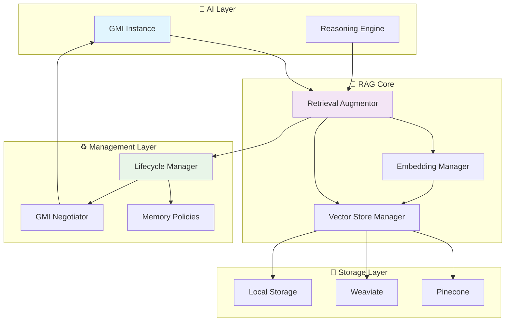
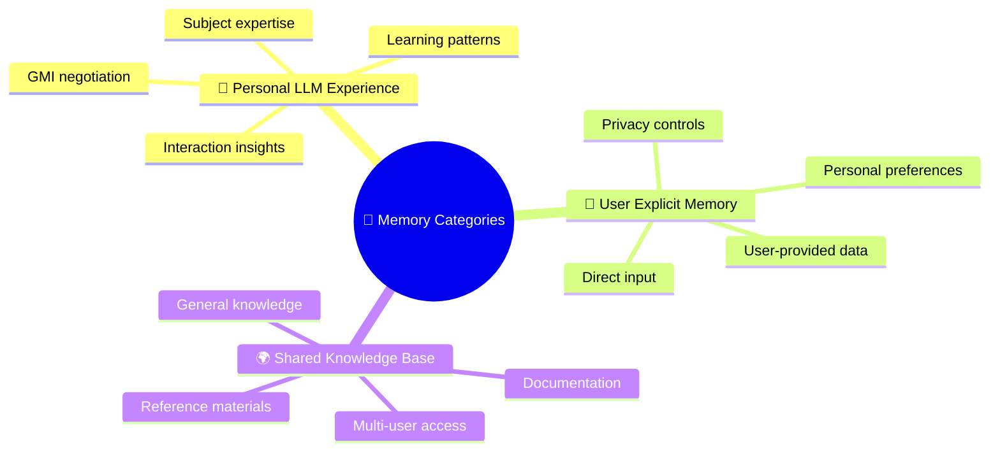
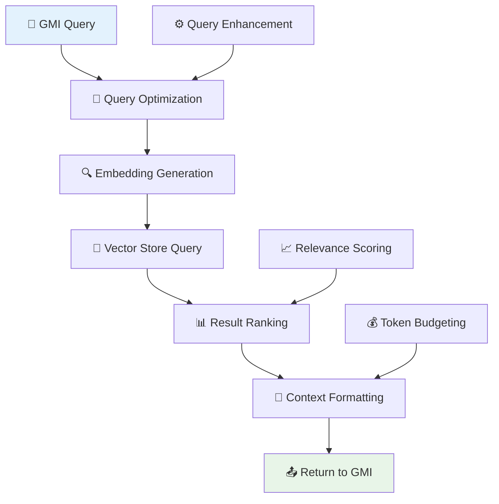
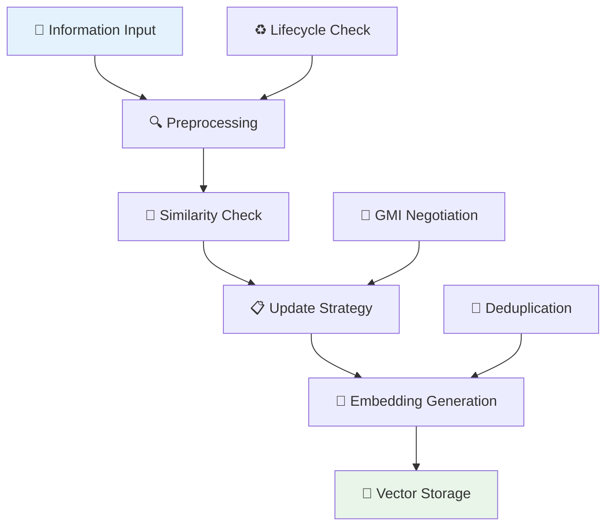
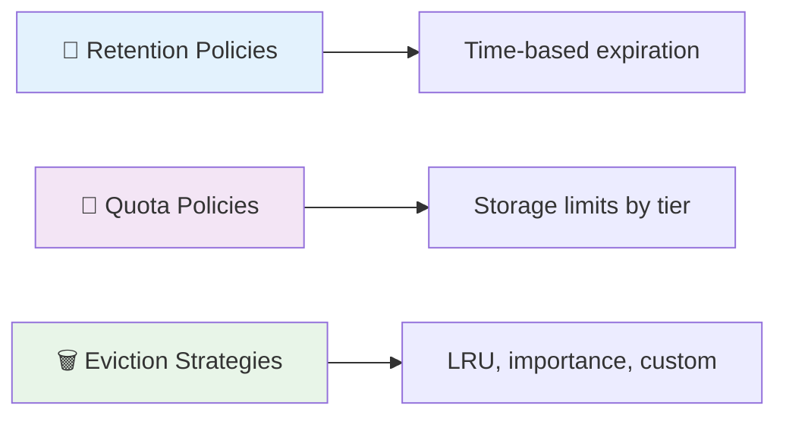
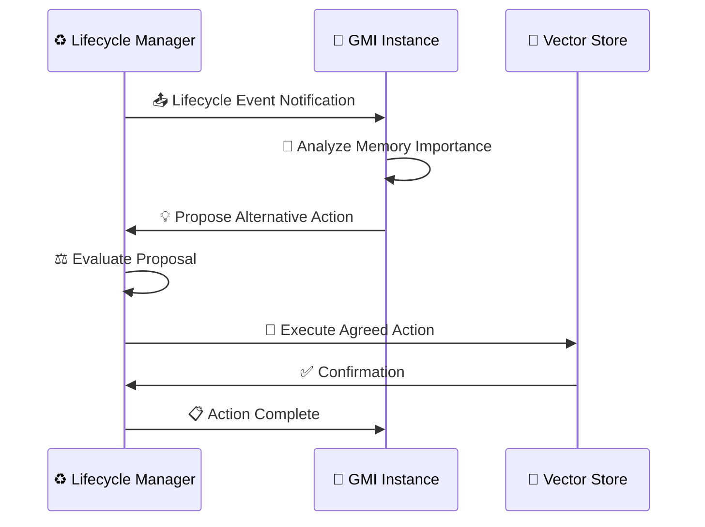

# 💾 AgentOS RAG System

[](#) [](#)

> **Intelligent memory and knowledge retrieval system that provides GMIs with sophisticated long-term memory capabilities**

---

## 🚀 Quick Navigation

| Component | Description | Jump To |
|-----------|-------------|---------|
| 🌟 **[Overview](#-overview)** | System introduction and key features | [↓](#-overview) |
| 🏗️ **[Core Components](#️-core-components)** | Architecture and key classes | [↓](#️-core-components) |
| 📂 **[Memory Categories](#-memory-categories)** | Information organization system | [↓](#-memory-categories) |
| 🔄 **[Information Flow](#-information-flow)** | Data processing pipelines | [↓](#-information-flow) |
| 💽 **[Vector Stores](#-vector-store-implementations)** | Storage backend options | [↓](#-vector-store-implementations) |
| ♻️ **[Memory Lifecycle](#️-memory-lifecycle-management)** | Automated memory management | [↓](#️-memory-lifecycle-management) |

**🔗 Related Documentation:**
- [📖 Main README](../README.md) - AgentOS overview and getting started
- [🎯 Prompting System](PROMPTS.md) - Advanced prompt engineering and personas
- [🔧 LLM Providers](../backend/agentos/core/llm/providers/README.md) - Multi-provider LLM integration
- [🧠 Technical Deep Dive](ARCHITECTURE.md) - Complete system architecture
- [🚀 Getting Started](GETTING_STARTED.md) - Step-by-step setup guide

---

## 📋 Table of Contents

- [🌟 Overview](#-overview)
- [🏗️ Core Components](#️-core-components)
- [📂 Memory Categories](#-memory-categories)
- [🔄 Information Flow](#-information-flow)
- [💽 Vector Store Implementations](#-vector-store-implementations)
- [♻️ Memory Lifecycle Management](#️-memory-lifecycle-management)
- [⚙️ Configuration](#️-configuration)
- [📚 API Reference](#-api-reference)
- [🚀 Getting Started](#-getting-started)
- [✨ Best Practices](#-best-practices)

---

## 🌟 Overview

The AgentOS RAG system transcends simple vector lookups to provide sophisticated, AI-powered memory management. It enables GMIs to maintain rich, contextual memory that evolves and adapts over time.

### **🎯 Key Features**


| Feature | Description | Benefit |
|---------|-------------|---------|
| 📂 **Categorized Memory** | Organized information storage by type and purpose | Efficient retrieval and management |
| 🧠 **Intelligent Ingestion** | Smart preprocessing and deduplication | High-quality knowledge base |
| ♻️ **Lifecycle Management** | Automated memory policies with GMI negotiation | Optimal storage utilization |
| 🤖 **GMI Integration** | Seamless AI decision-making integration | Natural memory usage |
| ⚡ **Real-time Context** | Fast retrieval for AI responses | Enhanced user experiences |

### **🏗️ System Architecture**



---

## 🏗️ Core Components

### **🎯 RetrievalAugmentor**

The central orchestrator for all RAG operations - the brain of the memory system.

```typescript
interface IRetrievalAugmentor {
  retrieveContext(request: RetrievalRequest): Promise<ProcessedRetrievedContext>;
  ingestInformation(request: IngestionRequest): Promise<IngestionResult>;
  deleteInformation(request: DeletionRequest): Promise<DeletionResult>;
}
```

**🔑 Key Responsibilities:**
- 🔍 Handle retrieval queries from GMIs
- 📥 Process and store new information intelligently
- 🔗 Coordinate with memory lifecycle manager
- 🔄 Apply update strategies for similar content

### **🧠 EmbeddingManager** 

Manages text-to-vector conversion using various embedding models.

```typescript
interface IEmbeddingManager {
  generateEmbeddings(text: string, options?: EmbeddingOptions): Promise<number[]>;
  generateBatchEmbeddings(texts: string[], options?: EmbeddingOptions): Promise<number[][]>;
}
```

**✨ Features:**
- 🎯 Support for multiple embedding models
- ⚡ Caching for improved performance  
- 📦 Batch processing capabilities
- 💰 Cost tracking and optimization

### **💽 VectorStoreManager**

Abstracts interaction with different vector database providers.

```typescript
interface IVectorStoreManager {
  getProvider(providerId: string): IVectorStore;
  upsertDocument(collectionId: string, document: VectorDocument): Promise<void>;
  queryDocuments(collectionId: string, query: VectorQuery): Promise<VectorDocument[]>;
}
```

**🎯 Supported Providers:**
- ☁️ **Pinecone** - Cloud-hosted, high-performance
- 🏠 **Weaviate** - Self-hosted, feature-rich
- 💾 **In-memory** - Development and testing
- 📁 **Local file** - Embedded databases

---

## 📂 Memory Categories

The RAG system organizes information into logical categories for optimal management and retrieval:



### **🤖 Personal LLM Experience** (`personal_llm_experience`)

**Purpose:** GMI's learned knowledge and behavioral patterns
```typescript
{
  category: MemoryCategory.PERSONAL_LLM_EXPERIENCE,
  content: "User prefers concise Python explanations with working examples",
  metadata: {
    confidence: 0.95,
    learningSource: "interaction_pattern",
    reinforcements: 12
  }
}
```

**Characteristics:**
- 🧠 GMI's learned knowledge and patterns
- 📊 Interaction summaries and insights  
- 🤝 Subject to GMI negotiation for lifecycle events
- 🔄 Continuously updated through interactions

### **👤 User Explicit Memory** (`user_explicit_memory`)

**Purpose:** User-provided information and preferences
```typescript
{
  category: MemoryCategory.USER_EXPLICIT_MEMORY,
  content: "Project uses FastAPI with PostgreSQL, deployed on AWS ECS",
  metadata: {
    source: "user_direct_input",
    importance: "high",
    projectContext: "web_api_development"
  }
}
```

**Characteristics:**
- 📝 User-provided information and preferences
- 🔒 Personal data and context with privacy controls
- 👤 Subject to user privacy controls
- 🎯 High retention priority

### **🌍 Shared Knowledge Base** (`shared_knowledge_base`)

**Purpose:** General knowledge accessible to multiple users
```typescript
{
  category: MemoryCategory.SHARED_KNOWLEDGE_BASE,
  content: "FastAPI best practices for async database operations",
  metadata: {
    source: "documentation_crawl",
    lastUpdated: "2024-01-15",
    reliability: "high"
  }
}
```

**Characteristics:**
- 📚 General knowledge accessible to multiple users
- 📖 Documentation and reference materials
- ⏰ Longer retention policies
- 🔄 Periodic updates from authoritative sources

```typescript
enum MemoryCategory {
  PERSONAL_LLM_EXPERIENCE = 'personal_llm_experience',
  USER_EXPLICIT_MEMORY = 'user_explicit_memory', 
  SHARED_KNOWLEDGE_BASE = 'shared_knowledge_base'
}
```

---

## 🔄 Information Flow

### **📥 Retrieval Process**



**Process Steps:**
1. **🎯 Query Analysis** - Parse and optimize the search query
2. **🔍 Embedding Generation** - Convert query to vector representation
3. **💽 Vector Search** - Query across configured vector stores
4. **📊 Result Processing** - Rank and filter results by relevance
5. **🔧 Context Formatting** - Format for GMI consumption within token limits

### **📤 Ingestion Process**



**Process Steps:**
1. **🔍 Preprocessing** - Clean and structure the input information
2. **🔄 Similarity Check** - Identify similar existing content
3. **📋 Strategy Selection** - Choose appropriate update strategy
4. **🧠 Embedding Generation** - Create vector representations
5. **💾 Storage** - Persist in configured vector store

### **🔄 Update Strategies**

The system supports several strategies for handling similar content:

| Strategy | When to Use | GMI Involvement | Description |
|----------|-------------|-----------------|-------------|
| 🔄 **Overwrite** | Content is clearly outdated | ❌ No | Replace existing content completely |
| 🚫 **Deduplicate** | Highly similar content exists | ❌ No | Skip storage to avoid redundancy |
| 🤝 **Merge** | Complementary information | ✅ Yes | GMI assists in combining content |
| 📚 **Version** | Historical tracking needed | ❌ No | Create versioned entries |

---

## 💽 Vector Store Implementations

### **☁️ Pinecone Integration**

```typescript
class PineconeVectorStore implements IVectorStore {
  constructor(private config: PineconeConfig) {}
  
  async upsert(documents: VectorDocument[]): Promise<UpsertResult> {
    // Pinecone-specific implementation with batching
    const batches = this.createBatches(documents, 100);
    const results = await Promise.all(
      batches.map(batch => this.pineconeIndex.upsert({ vectors: batch }))
    );
    return this.aggregateResults(results);
  }
  
  async query(queryVector: number[], options: QueryOptions): Promise<QueryResult> {
    const response = await this.pineconeIndex.query({
      vector: queryVector,
      topK: options.maxResults,
      filter: options.metadataFilter,
      includeMetadata: true
    });
    return this.formatResults(response);
  }
}
```

**✨ Features:**
- ⚡ High-performance cloud hosting
- 📈 Automatic scaling
- 🔍 Advanced filtering capabilities
- 💰 Usage-based pricing

### **🏠 Weaviate Integration**

```typescript
class WeaviateVectorStore implements IVectorStore {
  constructor(private config: WeaviateConfig) {}
  
  async upsert(documents: VectorDocument[]): Promise<UpsertResult> {
    const batch = this.weaviate.batch.objectsBatcher();
    documents.forEach(doc => {
      batch.withObject({
        class: this.config.className,
        properties: doc.metadata,
        vector: doc.embedding
      });
    });
    return await batch.do();
  }
  
  async query(queryVector: number[], options: QueryOptions): Promise<QueryResult> {
    const result = await this.weaviate.graphql
      .get()
      .withClassName(this.config.className)
      .withNearVector({ vector: queryVector })
      .withLimit(options.maxResults)
      .withFields('_additional { certainty distance }')
      .do();
    return this.formatResults(result);
  }
}
```

**✨ Features:**
- 🏠 Self-hosted control
- 🔍 Rich query capabilities
- 📊 Built-in analytics
- 🛡️ Data sovereignty

### **💾 Local Development Options**

For development and testing environments:

```typescript
// ⚡ Fast, ephemeral storage
class InMemoryVectorStore implements IVectorStore {
  private documents: Map<string, VectorDocument> = new Map();
  
  async query(queryVector: number[], options: QueryOptions): Promise<QueryResult> {
    const results = Array.from(this.documents.values())
      .map(doc => ({
        document: doc,
        similarity: this.cosineSimilarity(queryVector, doc.embedding)
      }))
      .sort((a, b) => b.similarity - a.similarity)
      .slice(0, options.maxResults);
    
    return { documents: results.map(r => r.document) };
  }
}

// 💾 Persistent file-based storage  
class LocalFileVectorStore implements IVectorStore {
  constructor(private dataPath: string) {}
  
  async upsert(documents: VectorDocument[]): Promise<UpsertResult> {
    const existingData = await this.loadFromFile();
    documents.forEach(doc => existingData.set(doc.id, doc));
    await this.saveToFile(existingData);
    return { upsertedCount: documents.length };
  }
}
```

---

## ♻️ Memory Lifecycle Management

### **🎯 MemoryLifecycleManager**

Automates memory management based on policies and user tiers.

```typescript
interface IMemoryLifecycleManager {
  enforceStoragePolicy(event: LifecycleEvent): Promise<PolicyResult>;
  scheduleCleanupTasks(): void;
  negotiateWithGMI(gmi: IGMI, event: MemoryLifecycleEvent): Promise<NegotiationResult>;
}
```

### **📋 Policy Types**



| Policy Type | Description | Configuration |
|-------------|-------------|---------------|
| **📅 Retention** | Time-based document expiration | `retentionDays: 90` |
| **💾 Quota** | Storage limits based on user tiers | `maxDocuments: 10000` |
| **🗑️ Eviction** | Smart removal strategies | `strategy: "importance_based"` |

### **🤖 GMI Negotiation Process**

When personal memories are affected, the system engages in intelligent negotiation:



**Negotiation Example:**
```typescript
interface MemoryLifecycleEvent {
  type: 'eviction' | 'archival' | 'expiration';
  documentId: string;
  reason: string;
  proposedAction: LifecycleAction;
  negotiable: boolean;
}

// GMI can propose alternatives like:
const gmiProposal = {
  action: 'summarize_and_compress',
  reasoning: 'This contains important user context patterns',
  alternativeRetention: '30_days_compressed'
};
```

---

## ⚙️ Configuration

### **🏗️ Vector Store Configuration**

```typescript
interface RagSystemConfig {
  providers: VectorStoreProviderConfig[];
  collections: RagCollectionConfig[];
  defaultEmbeddingModel: string;
  lifecyclePolicies: LifecyclePolicyConfig[];
}
```

### **📂 Collection Configuration**

```typescript
interface RagCollectionConfig {
  id: string;
  name: string;
  category: MemoryCategory;
  vectorStoreProviderId: string;
  embeddingDimensions: number;
  defaultRetentionDays?: number;
  maxDocuments?: number;
  evictionStrategy: EvictionStrategy;
}
```

### **💡 Example Configuration**

```json
{
  "providers": [
    {
      "id": "pinecone-main",
      "type": "pinecone",
      "config": {
        "apiKey": "${PINECONE_API_KEY}",
        "environment": "us-west1-gcp",
        "indexName": "agentos-memory"
      }
    },
    {
      "id": "weaviate-local", 
      "type": "weaviate",
      "config": {
        "url": "http://localhost:8080",
        "className": "AgentMemory"
      }
    }
  ],
  "collections": [
    {
      "id": "user-memory",
      "name": "User Explicit Memory",
      "category": "user_explicit_memory",
      "vectorStoreProviderId": "pinecone-main",
      "embeddingDimensions": 1536,
      "defaultRetentionDays": 365,
      "maxDocuments": 10000,
      "evictionStrategy": "importance_based"
    },
    {
      "id": "gmi-experience",
      "name": "GMI Learning Experience", 
      "category": "personal_llm_experience",
      "vectorStoreProviderId": "pinecone-main",
      "embeddingDimensions": 1536,
      "defaultRetentionDays": 180,
      "maxDocuments": 5000,
      "evictionStrategy": "lru_with_gmi_negotiation"
    }
  ],
  "lifecyclePolicies": [
    {
      "category": "shared_knowledge_base",
      "retentionDays": 730,
      "maxSizeGB": 10,
      "compressionEnabled": true
    }
  ]
}
```

---

## 📚 API Reference

### **🔍 RetrievalRequest**

```typescript
interface RetrievalRequest {
  query: string;                           // Search query text
  targetCategories: MemoryCategory[];      // Which memory categories to search
  userId: string;                          // User identifier
  gmiId?: string;                         // Optional GMI identifier
  maxResults?: number;                    // Maximum results to return (default: 5)
  similarityThreshold?: number;           // Minimum similarity score (0-1)
  filters?: QueryFilter[];                // Additional metadata filters
  contextWindow?: number;                 // Token budget for context
}
```

### **📥 IngestionRequest**

```typescript
interface IngestionRequest {
  textContent: string;                    // Content to store
  category: MemoryCategory;              // Memory category
  userId: string;                        // User identifier  
  gmiId?: string;                       // Optional GMI identifier
  documentId?: string;                  // Optional document ID for updates
  updateStrategy: UpdateStrategy;       // How to handle similar content
  metadata?: Record<string, any>;       // Additional metadata
  importance?: number;                  // Importance score (0-1)
  source?: string;                      // Content source identifier
}
```

### **📤 ProcessedRetrievedContext**

```typescript
interface ProcessedRetrievedContext {
  augmentedPromptText: string;          // Formatted context for LLM
  sourceDocuments: RetrievedDocument[]; // Source documents with metadata
  totalTokensUsed: number;             // Token count for budgeting
  queryEmbeddingCost: number;          // Embedding generation cost
  retrievalLatencyMs: number;          // Query latency metrics
  relevanceScores: number[];           // Similarity scores for each result
  categoriesSearched: MemoryCategory[]; // Which categories were queried
}
```

---

## 🚀 Getting Started

### **📦 Basic Setup**

```bash
# 📥 Install dependencies
npm install @agentos/rag
```

### **⚙️ Configure Vector Store**

```typescript
// 📌 Pinecone Configuration
const pineconeConfig = {
  provider: 'pinecone',
  apiKey: process.env.PINECONE_API_KEY,
  environment: 'us-west1-gcp',
  indexName: 'agentos-memory'
};

// 🏠 Weaviate Configuration  
const weaviateConfig = {
  provider: 'weaviate',
  url: 'http://localhost:8080',
  className: 'AgentMemory'
};
```

### **🚀 Initialize RAG System**

```typescript
import { 
  RetrievalAugmentor, 
  VectorStoreManager, 
  EmbeddingManager, 
  MemoryLifecycleManager 
} from '@agentos/rag';

const ragSystem = new RetrievalAugmentor({
  vectorStoreManager: new VectorStoreManager({
    providers: [pineconeConfig, weaviateConfig],
    defaultProvider: 'pinecone'
  }),
  embeddingManager: new EmbeddingManager({
    model: 'text-embedding-ada-002',
    batchSize: 100,
    cachingEnabled: true
  }),
  memoryLifecycleManager: new MemoryLifecycleManager({
    policies: lifecyclePolicies,
    gmiNegotiationEnabled: true
  })
});
```

### **💡 Usage Examples**

#### **📥 Storing Information**

```typescript
// 💾 Store user preference
await ragSystem.ingestInformation({
  textContent: "User prefers concise explanations in Python with working examples",
  category: MemoryCategory.USER_EXPLICIT_MEMORY,
  userId: 'user123',
  updateStrategy: 'merge_if_similar_propose_gmi',
  importance: 0.8,
  metadata: {
    domain: 'programming_preferences',
    language: 'python'
  }
});

// 🧠 Store GMI learning
await ragSystem.ingestInformation({
  textContent: "Successfully debugging FastAPI async issues using print statements was effective for this user",
  category: MemoryCategory.PERSONAL_LLM_EXPERIENCE, 
  userId: 'user123',
  gmiId: 'gmi-coding-assistant',
  updateStrategy: 'merge_with_existing',
  importance: 0.6,
  metadata: {
    interaction_type: 'debugging_session',
    success_rate: 0.9
  }
});
```

#### **🔍 Retrieving Context**

```typescript
// 🎯 Retrieve relevant context for coding question
const context = await ragSystem.retrieveContext({
  query: "How should I explain this Python async/await concept?",
  targetCategories: [
    MemoryCategory.USER_EXPLICIT_MEMORY,
    MemoryCategory.PERSONAL_LLM_EXPERIENCE
  ],
  userId: 'user123',
  maxResults: 5,
  similarityThreshold: 0.7,
  contextWindow: 1000 // Token budget
});

console.log('Retrieved context:', context.augmentedPromptText);
console.log('Source documents:', context.sourceDocuments.length);
console.log('Tokens used:', context.totalTokensUsed);
```

#### **🔍 Advanced Querying with Filters**

```typescript
// 🎯 Search with metadata filters
const filteredContext = await ragSystem.retrieveContext({
  query: "debugging techniques for web APIs",
  targetCategories: [MemoryCategory.PERSONAL_LLM_EXPERIENCE],
  userId: 'user123',
  maxResults: 3,
  filters: [
    { field: 'domain', operator: 'equals', value: 'web_development' },
    { field: 'success_rate', operator: 'greater_than', value: 0.8 }
  ]
});
```

---

## ✨ Best Practices

### **📊 Content Organization**

| ✅ Do | ❌ Don't | 💡 Why |
|-------|----------|---------|
| Use appropriate memory categories | Mix different content types | Better retrieval accuracy |
| Include rich metadata | Store bare minimum data | Enhanced filtering capabilities |
| Structure content for chunking | Store very long, unstructured text | Optimal embedding quality |
| Set importance scores | Treat all content equally | Better lifecycle management |

### **⚡ Performance Optimization**

```markdown
## 🚀 Optimization Checklist

### 📦 Batching
- ✅ Generate embeddings in batches of 100
- ✅ Batch vector store operations
- ✅ Use async processing for large datasets

### 💾 Caching  
- ✅ Cache frequently accessed embeddings
- ✅ Implement query result caching
- ✅ Use CDN for static knowledge base content

### 🎯 Query Optimization
- ✅ Set appropriate similarity thresholds
- ✅ Use metadata filters to narrow searches
- ✅ Implement query rewriting for better results

### 📊 Monitoring
- ✅ Track query latency and accuracy
- ✅ Monitor storage costs and usage
- ✅ Analyze retrieval patterns for optimization
```

### **♻️ Memory Management**

```typescript
// ✅ Good: Specific retention policies
const retentionPolicy = {
  category: MemoryCategory.USER_EXPLICIT_MEMORY,
  retentionDays: 365,
  compressionAfterDays: 90,
  gmiNegotiationEnabled: true
};

// ❌ Bad: Generic "keep everything forever"
const badPolicy = {
  retentionDays: -1, // Never delete
  compressionEnabled: false
};
```

### **🔒 Security Considerations**

```markdown
## 🛡️ Security Best Practices

### 🔐 Data Isolation
- Ensure proper user data separation
- Implement access controls for sensitive information
- Use encrypted connections to vector stores

### 👤 Privacy Protection
- Allow users to delete their memory data
- Implement data anonymization for shared knowledge
- Regular auditing of stored content

### 🏢 Compliance
- Follow GDPR/CCPA requirements for data retention
- Implement data portability features
- Maintain audit logs for data operations
```

---

## 🤝 Contributing

### **🛠️ Development Setup**

```bash
# 📥 Clone and setup
git clone https://github.com/agentos/agentos.git
cd agentos
npm install

# 🧪 Run RAG-specific tests
npm run test:rag
npm run test:integration:rag

# 🚀 Start development environment with local vector store
npm run dev:rag-local
```

### **🎯 Contribution Areas**

| Area | Skills | Impact | Difficulty |
|------|--------|---------|------------|
| 💽 **Vector Store Integrations** | Database APIs, TypeScript | 🔥 High | 🟡 Medium |
| 🧠 **Embedding Models** | ML, Python/TypeScript | 🔥 High | 🔴 Hard |
| ♻️ **Lifecycle Policies** | Algorithms, Policy Design | 🟡 Medium | 🟡 Medium |
| 🧪 **Testing & Benchmarks** | Testing, Performance | 🟡 Medium | 🟢 Easy |
| 📚 **Documentation** | Technical Writing | 🟡 Medium | 🟢 Easy |

### **🔧 Adding New Vector Store**

```typescript
// 1. Implement the IVectorStore interface
class MyVectorStore implements IVectorStore {
  async upsert(documents: VectorDocument[]): Promise<UpsertResult> {
    // Your implementation
  }
  
  async query(query: VectorQuery): Promise<QueryResult> {
    // Your implementation  
  }
  
  async delete(documentIds: string[]): Promise<DeletionResult> {
    // Your implementation
  }
}

// 2. Register with VectorStoreManager
const storeManager = new VectorStoreManager();
storeManager.registerProvider('my-store', MyVectorStore);

// 3. Add configuration schema
interface MyVectorStoreConfig {
  apiKey: string;
  endpoint: string;
  // Other config options
}
```

---

## 📄 License & Links

### **📜 License**
This project is licensed under the MIT License - see the [LICENSE](../LICENSE) file for details.

### **🔗 Related Documentation**
- **[📖 Main README](../README.md)** - AgentOS overview and getting started
- **[🎯 Advanced Prompting System](PROMPTS.md)** - Prompt engineering and persona creation
- **[🔧 LLM Provider System](../backend/agentos/core/llm/providers/README.md)** - Multi-provider LLM integration
- **[🧠 Technical Deep Dive](ARCHITECTURE.md)** - Complete technical architecture
- **[🚀 Getting Started Guide](GETTING_STARTED.md)** - Step-by-step setup tutorial

### **🌐 Community & Support**
- **[🐙 GitHub Repository](https://github.com/agentos/agentos)**
- **[📚 Documentation Site](https://docs.agentos.ai)**
- **[💬 Discord Community](https://discord.gg/agentos)**
- **[🐛 Issue Tracker](https://github.com/agentos/agentos/issues)**
- **[💡 Feature Requests](https://github.com/agentos/agentos/discussions)**

---

<div align="center">

**💾 Intelligent Memory for Intelligent Agents**

*Empowering AI with sophisticated, adaptive memory capabilities*

[⭐ Star on GitHub](https://github.com/agentos/agentos) • [📧 Newsletter](https://agentos.ai/newsletter) • [🤝 Contribute](../CONTRIBUTING.md)

</div>