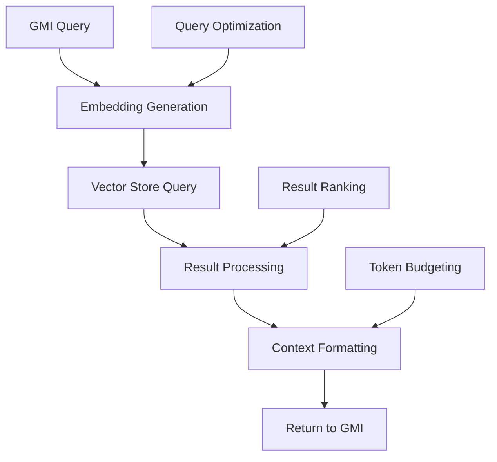
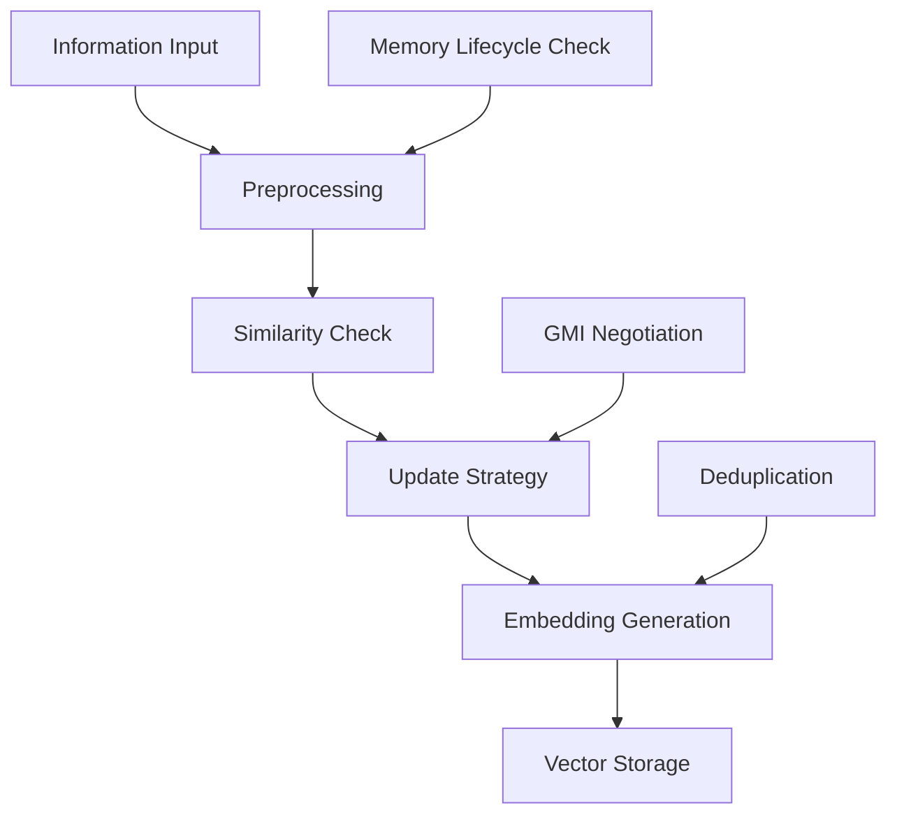

# AgentOS RAG System Documentation

The Retrieval Augmented Generation (RAG) system is a core component of AgentOS that provides Generalized Mind Instances (GMIs) with sophisticated long-term memory capabilities.

---

## Table of Contents

1. [Overview](#overview)
2. [Core Components](#core-components)
3. [Memory Categories](#memory-categories)
4. [Information Flow](#information-flow)
5. [Vector Store Implementations](#vector-store-implementations)
6. [Memory Lifecycle Management](#memory-lifecycle-management)
7. [Configuration](#configuration)
8. [API Reference](#api-reference)
9. [Getting Started](#getting-started)
10. [Best Practices](#best-practices)

---

## Overview

The AgentOS RAG system goes beyond simple vector lookups to provide:

- **Categorized Memory**: Organized information storage by type and purpose
- **Intelligent Ingestion**: Smart preprocessing and deduplication
- **Lifecycle Management**: Automated memory management with policies
- **GMI Integration**: Seamless integration with AI decision-making

### Key Features

- Multiple vector store backends (Pinecone, Weaviate, local options)
- Automated memory lifecycle with GMI negotiation
- Smart content updates and merging
- User-specific memory quotas and policies
- Real-time context retrieval for AI responses

---

## Core Components

### RetrievalAugmentor

The central orchestrator for all RAG operations.

```typescript
interface IRetrievalAugmentor {
  retrieveContext(request: RetrievalRequest): Promise<ProcessedRetrievedContext>;
  ingestInformation(request: IngestionRequest): Promise<IngestionResult>;
  deleteInformation(request: DeletionRequest): Promise<DeletionResult>;
}
```

**Key Responsibilities**:
- Handle retrieval queries from GMIs
- Process and store new information
- Coordinate with memory lifecycle manager
- Apply update strategies for similar content

### EmbeddingManager

Manages text-to-vector conversion using various embedding models.

```typescript
interface IEmbeddingManager {
  generateEmbeddings(text: string, options?: EmbeddingOptions): Promise<number[]>;
  generateBatchEmbeddings(texts: string[], options?: EmbeddingOptions): Promise<number[][]>;
}
```

**Features**:
- Support for multiple embedding models
- Caching for improved performance
- Batch processing capabilities
- Cost tracking and optimization

### VectorStoreManager

Abstracts interaction with different vector database providers.

```typescript
interface IVectorStoreManager {
  getProvider(providerId: string): IVectorStore;
  upsertDocument(collectionId: string, document: VectorDocument): Promise<void>;
  queryDocuments(collectionId: string, query: VectorQuery): Promise<VectorDocument[]>;
}
```

**Supported Providers**:
- Pinecone (cloud-hosted)
- Weaviate (self-hosted)
- In-memory (development/testing)
- Local file storage (embedded databases)

---

## Memory Categories

The RAG system organizes information into logical categories:

### 1. Personal LLM Experience (`personal_llm_experience`)
- GMI's learned knowledge and patterns
- Interaction summaries and insights
- Subject to GMI negotiation for lifecycle events

### 2. User Explicit Memory (`user_explicit_memory`)
- User-provided information and preferences
- Personal data and context
- Subject to user privacy controls

### 3. Shared Knowledge Base (`shared_knowledge_base`)
- General knowledge accessible to multiple users
- Documentation and reference materials
- Longer retention policies

```typescript
enum MemoryCategory {
  PERSONAL_LLM_EXPERIENCE = 'personal_llm_experience',
  USER_EXPLICIT_MEMORY = 'user_explicit_memory',
  SHARED_KNOWLEDGE_BASE = 'shared_knowledge_base'
}
```

---

## Information Flow

### Retrieval Process



### Ingestion Process



### Update Strategies

The system supports several strategies for handling similar content:

1. **Overwrite**: Replace existing content
2. **Deduplicate**: Skip if highly similar content exists
3. **Merge**: Combine similar content (with GMI assistance)
4. **Version**: Create versioned entries

---

## Vector Store Implementations

### Pinecone Integration

```typescript
class PineconeVectorStore implements IVectorStore {
  constructor(private config: PineconeConfig) {}
  
  async upsert(documents: VectorDocument[]): Promise<UpsertResult> {
    // Pinecone-specific implementation
  }
  
  async query(queryVector: number[], options: QueryOptions): Promise<QueryResult> {
    // Pinecone query implementation
  }
}
```

### Weaviate Integration

```typescript
class WeaviateVectorStore implements IVectorStore {
  constructor(private config: WeaviateConfig) {}
  
  async upsert(documents: VectorDocument[]): Promise<UpsertResult> {
    // Weaviate-specific implementation
  }
}
```

### Local Development Options

For development and testing:

- **InMemoryVectorStore**: Fast, ephemeral storage
- **LocalFileVectorStore**: Persistent file-based storage

---

## Memory Lifecycle Management

### MemoryLifecycleManager

Automates memory management based on policies and user tiers.

```typescript
interface IMemoryLifecycleManager {
  enforceStoragePolicy(event: LifecycleEvent): Promise<PolicyResult>;
  scheduleCleanupTasks(): void;
  negotiateWithGMI(gmi: IGMI, event: MemoryLifecycleEvent): Promise<NegotiationResult>;
}
```

### Policy Types

- **Retention Policies**: Time-based document expiration
- **Quota Policies**: Storage limits based on user tiers
- **Eviction Strategies**: LRU, importance-based, or custom

### GMI Negotiation

When personal memories are affected:

1. GMI receives lifecycle event notification
2. GMI can propose alternatives (e.g., summarization)
3. System executes agreed-upon action
4. GMI receives confirmation

```typescript
interface MemoryLifecycleEvent {
  type: 'eviction' | 'archival' | 'expiration';
  documentId: string;
  reason: string;
  proposedAction: LifecycleAction;
  negotiable: boolean;
}
```

---

## Configuration

### Vector Store Configuration

```typescript
interface RagSystemConfig {
  providers: VectorStoreProviderConfig[];
  collections: RagCollectionConfig[];
  defaultEmbeddingModel: string;
}
```

### Collection Configuration

```typescript
interface RagCollectionConfig {
  id: string;
  name: string;
  category: MemoryCategory;
  vectorStoreProviderId: string;
  embeddingDimensions: number;
  defaultRetentionDays?: number;
  maxDocuments?: number;
  evictionStrategy: EvictionStrategy;
}
```

### Example Configuration

```json
{
  "providers": [
    {
      "id": "pinecone-main",
      "type": "pinecone",
      "config": {
        "apiKey": "${PINECONE_API_KEY}",
        "environment": "us-west1-gcp"
      }
    }
  ],
  "collections": [
    {
      "id": "user-memory",
      "name": "User Explicit Memory",
      "category": "user_explicit_memory",
      "vectorStoreProviderId": "pinecone-main",
      "embeddingDimensions": 1536,
      "defaultRetentionDays": 365,
      "maxDocuments": 10000
    }
  ]
}
```

---

## API Reference

### RetrievalRequest

```typescript
interface RetrievalRequest {
  query: string;
  targetCategories: MemoryCategory[];
  userId: string;
  gmiId?: string;
  maxResults?: number;
  similarityThreshold?: number;
  filters?: QueryFilter[];
}
```

### IngestionRequest

```typescript
interface IngestionRequest {
  textContent: string;
  category: MemoryCategory;
  userId: string;
  gmiId?: string;
  documentId?: string;
  updateStrategy: UpdateStrategy;
  metadata?: Record<string, any>;
}
```

### ProcessedRetrievedContext

```typescript
interface ProcessedRetrievedContext {
  augmentedPromptText: string;
  sourceDocuments: RetrievedDocument[];
  totalTokensUsed: number;
  queryEmbeddingCost: number;
  retrievalLatencyMs: number;
}
```

---

## Getting Started

### Basic Setup

1. **Install Dependencies**:
```bash
npm install @agentos/rag
```

2. **Configure Vector Store**:
```typescript
const vectorStoreConfig = {
  provider: 'pinecone',
  apiKey: process.env.PINECONE_API_KEY,
  environment: 'us-west1-gcp'
};
```

3. **Initialize RAG System**:
```typescript
const ragSystem = new RetrievalAugmentor({
  vectorStoreManager: new VectorStoreManager(vectorStoreConfig),
  embeddingManager: new EmbeddingManager(embeddingConfig),
  memoryLifecycleManager: new MemoryLifecycleManager(lifecycleConfig)
});
```

### Usage Examples

#### Storing Information

```typescript
await ragSystem.ingestInformation({
  textContent: "User prefers concise explanations in Python",
  category: MemoryCategory.USER_EXPLICIT_MEMORY,
  userId: 'user123',
  updateStrategy: 'merge_if_similar_propose_gmi'
});
```

#### Retrieving Context

```typescript
const context = await ragSystem.retrieveContext({
  query: "How should I explain this Python concept?",
  targetCategories: [
    MemoryCategory.USER_EXPLICIT_MEMORY,
    MemoryCategory.PERSONAL_LLM_EXPERIENCE
  ],
  userId: 'user123',
  maxResults: 5
});
```

---

## Best Practices

### Content Organization

- Use appropriate memory categories for different types of information
- Include relevant metadata for better filtering and retrieval
- Structure content for optimal chunking and embedding

### Performance Optimization

- Batch embedding generation when possible
- Use appropriate similarity thresholds to balance precision and recall
- Implement caching for frequently accessed content

### Memory Management

- Set appropriate retention policies for different content types
- Monitor storage usage and costs
- Use GMI negotiation for important personal memories

### Security Considerations

- Ensure proper data isolation between users
- Implement access controls for sensitive information
- Regular auditing of stored content

---

## Related Documentation

- [ARCHITECTURE.md](ARCHITECTURE.md) - Overall system architecture
- [README.md](README.md) - Project overview and setup
- [CONTRIBUTING.md](CONTRIBUTING.md) - Development guidelines