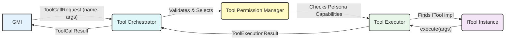

# 🛠️ AgentOS Unified Tool System

**Version:** 1.0  
**Status:** Design & Core Interface Definition  
**Last Updated:** May 23, 2025

## 1. Overview

The AgentOS Unified Tool System empowers Generalized Mind Instances (GMIs) with the ability to interact with the external world, perform actions, retrieve specialized information, and execute complex computations. It provides a standardized framework for defining, managing, discovering, and securely executing tools.

This system is a cornerstone of making GMIs capable and versatile agents, moving beyond simple text generation to become active participants in problem-solving and task completion.

**Key Goals:**

* **Extensibility:** Easily add new tools with diverse functionalities.
* **Discoverability:** Allow GMIs (and underlying LLMs) to understand available tools and their usage.
* **Security:** Provide mechanisms for permission checking and safe execution.
* **Standardization:** Define a clear contract (`ITool`) for all tools.
* **Orchestration:** Manage the lifecycle and execution flow of tool calls.
* **Observability:** Enable logging and tracing of tool usage and outcomes.

## 2. Core Concepts



### 2.1. ITool Interface

The ITool interface (defined in `backend/agentos/tools/ITool.ts`) is the fundamental contract for any tool. Any class wishing to be usable as a tool by a GMI must implement this interface.

**Key properties of ITool:**

* `id`: Unique system identifier (e.g., "web-search-advanced").
* `name`: Functional name for LLM interaction (e.g., "searchWeb").
* `displayName`: Human-readable name (e.g., "Advanced Web Search").
* `description`: Detailed explanation for LLM understanding.
* `inputSchema`: JSON Schema defining expected input arguments.
* `outputSchema` (Optional): JSON Schema defining the expected output structure.
* `requiredCapabilities` (Optional): Persona capabilities needed to use the tool.
* `category`, `version`, `hasSideEffects` (Optional): Additional metadata.
* `execute(args: TInput, context: ToolExecutionContext): Promise<ToolExecutionResult<TOutput>>`: The core method that performs the tool's action.
* `validateArgs` (Optional): Custom argument validation.
* `shutdown` (Optional): Resource cleanup.

### 2.2. Tool Discovery and Registration

Tools must be registered with the system (typically via the ToolOrchestrator) to be discoverable and executable. The ToolOrchestrator maintains a registry of available ITool instances.

The GMI, often guided by an LLM, discovers available tools through their name, description, and inputSchema. The PromptEngine may inject a list of available tools and their schemas into the prompt context.

### 2.3. Tool Execution Flow

1. **GMI/LLM Decides to Use a Tool**: Based on the user's query and its goals, the GMI (or the LLM it uses) decides to call a tool. It formulates a ToolCallRequest containing the tool name and arguments.
2. **Tool Orchestrator Receives Request**: The ToolOrchestrator (or initially, a more comprehensive ToolExecutor) receives this request.
3. **Permission & Capability Checks**:
   - The ToolPermissionManager (or logic within the Orchestrator/Executor) verifies if the active Persona has the requiredCapabilities defined by the tool.
   - It may also check user-level permissions if applicable (e.g., based on subscription tier).
4. **Argument Validation**: The ToolExecutor validates the provided arguments against the tool's inputSchema using a JSON Schema validator (e.g., Ajv).
5. **Tool Execution**: If checks pass, the ToolExecutor retrieves the specific ITool instance and calls its execute() method with the validated arguments and an ToolExecutionContext.
6. **Result Handling**: The ITool instance returns a ToolExecutionResult (containing success, output or error).
7. **Response to GMI**: The ToolOrchestrator/ToolExecutor formats this into a ToolCallResult and sends it back to the GMI. The GMI then incorporates this result into its reasoning process, potentially generating a response to the user or deciding on further actions.

### 2.4. Schema-Driven Interaction

The use of JSON Schema for inputSchema and outputSchema is critical:

* **LLMs**: Can reliably understand how to structure arguments for a tool.
* **Validation**: Allows for automatic and robust validation of inputs before execution and outputs after execution.
* **Type Safety**: Provides type information for developers implementing and using tools.
* **Documentation**: Schemas serve as a form of machine-readable documentation.

## 3. Key Components

### 3.1. ITool.ts

* **Location**: `backend/agentos/tools/ITool.ts`
* **Responsibility**: Defines the universal contract for all tools. (As detailed above).

### 3.2. ToolExecutor.ts (Refactoring Candidate)

* **Current Location**: `backend/agentos/core/tools/ToolExecutor.ts` (as per user-provided code).
* **Future Location (Suggestion)**: `backend/agentos/tools/ToolExecutor.ts`
* **Responsibilities (Evolving)**:
  - Manages a registry of ITool instances (may move to ToolOrchestrator).
  - Validates arguments against inputSchema (using a JSON schema validator like Ajv).
  - Invokes the execute() method of the specific ITool instance.
  - Handles basic error wrapping from tool execution.
  - The existing ToolExecutor also has some capability checking and registration logic that might be partially distributed to ToolPermissionManager and ToolOrchestrator.

### 3.3. ToolOrchestrator.ts (New Component)

* **Proposed Location**: `backend/agentos/tools/ToolOrchestrator.ts`
* **Responsibilities**:
  - Maintains the central registry of all available and active ITool instances.
  - Provides methods for tools to register/unregister.
  - Handles ToolCallRequests from the GMI.
  - May perform initial selection or routing of the tool call if multiple tools could satisfy a request (though often the LLM makes the specific choice).
  - Coordinates with ToolPermissionManager and ToolExecutor.
  - Manages the lifecycle of tool execution, especially if asynchronous/long-running tools are introduced.
  - Formats ToolExecutionResult into ToolCallResult for the GMI.

### 3.4. ToolPermissionManager.ts (New Component)

* **Proposed Location**: `backend/agentos/tools/ToolPermissionManager.ts`
* **Responsibilities**:
  - Checks if an active Persona possesses the requiredCapabilities for a requested tool.
  - (Future) Integrates with AuthService and SubscriptionService to check user-level permissions or feature flags that might gate access to certain tools or tool functionalities.
  - Provides a clear decision (allow/deny) for tool execution based on these checks.

### 3.5. CapabilityValidator.ts (New Utility)

* **Proposed Location**: `backend/agentos/tools/utils/CapabilityValidator.ts`
* **Responsibilities**:
  - A utility class or set of functions to help check if a set of possessed capabilities satisfies a set of required capabilities.
  - May handle wildcard capabilities or hierarchical capability structures in the future.

## 4. Tool Definition Best Practices

### Clarity for LLMs:
* **name**: Use a clear, descriptive, camelCase or snake_case name (e.g., searchWeb, sendEmail).
* **description**: Be explicit about what the tool does, its inputs, its outputs, and any important side effects or limitations. Provide examples if helpful.

### Precise Schemas:
* Define `inputSchema` and `outputSchema` as accurately as possible using JSON Schema.
* Clearly specify required properties in the input schema.
* Use appropriate types (string, number, boolean, array, object) and formats (date-time, email, uri).

### Idempotency: 
Design tools to be idempotent where possible. If a tool is called multiple times with the same arguments, it should ideally produce the same result or have the same effect without causing unintended consequences.

### Error Handling:
* Tools should catch their own internal errors and return a ToolExecutionResult with success: false and a clear error message.
* Avoid letting unexpected exceptions propagate out of the execute method.

### Single Responsibility: 
Tools should ideally adhere to the single responsibility principle. A tool that does too many things becomes hard for the LLM to use effectively.

### Security:
* **Input Sanitization**: Always sanitize and validate inputs, even after schema validation, especially if inputs are used in system commands, database queries, or external API calls.
* **Least Privilege**: Tools should operate with the minimum privileges necessary.
* **Code Execution**: Tools that execute code (e.g., Python interpreter) MUST be heavily sandboxed and restricted.

## 5. Developing and Registering a New Tool

### Create the Tool Class:
1. Create a new TypeScript class in the `backend/agentos/tools/implementations/` directory (e.g., `MyCustomTool.ts`).
2. Implement the ITool interface.
3. Define `id`, `name`, `displayName`, `description`, `inputSchema`, `outputSchema` (optional), and `requiredCapabilities` (optional).
4. Implement the `execute(args: TInput, context: ToolExecutionContext): Promise<ToolExecutionResult<TOutput>>` method with the tool's core logic.
5. Implement `validateArgs` and `shutdown` if necessary.

**Example:**

```typescript
// Example: backend/agentos/tools/implementations/SimpleCalculatorTool.ts
import { ITool, ToolExecutionResult, ToolExecutionContext, JSONSchemaObject } from '../ITool';
import { GMIError, GMIErrorCode } from '../../../utils/errors';

interface CalculatorInput {
  operation: 'add' | 'subtract' | 'multiply' | 'divide';
  num1: number;
  num2: number;
}

interface CalculatorOutput {
  result: number;
}

export class SimpleCalculatorTool implements ITool<CalculatorInput, CalculatorOutput> {
  readonly id = "simple-calculator";
  readonly name = "calculate";
  readonly displayName = "Simple Calculator";
  readonly description = "Performs basic arithmetic operations (add, subtract, multiply, divide) on two numbers.";
  readonly inputSchema: JSONSchemaObject = {
    type: "object",
    properties: {
      operation: { 
        type: "string", 
        enum: ["add", "subtract", "multiply", "divide"], 
        description: "The operation to perform." 
      },
      num1: { type: "number", description: "The first number." },
      num2: { type: "number", description: "The second number." }
    },
    required: ["operation", "num1", "num2"]
  };
  readonly outputSchema: JSONSchemaObject = {
    type: "object",
    properties: {
      result: { type: "number", description: "The result of the calculation." }
    },
    required: ["result"]
  };

  async execute(args: CalculatorInput, context: ToolExecutionContext): Promise<ToolExecutionResult<CalculatorOutput>> {
    try {
      let result: number;
      switch (args.operation) {
        case 'add': 
          result = args.num1 + args.num2; 
          break;
        case 'subtract': 
          result = args.num1 - args.num2; 
          break;
        case 'multiply': 
          result = args.num1 * args.num2; 
          break;
        case 'divide':
          if (args.num2 === 0) {
            return { success: false, error: "Division by zero." };
          }
          result = args.num1 / args.num2;
          break;
        default:
          return { success: false, error: `Unknown operation: ${args.operation}` };
      }
      return { success: true, output: { result } };
    } catch (e: any) {
      return { 
        success: false, 
        error: `Calculation error: ${e.message}`, 
        details: e 
      };
    }
  }
}
```

### Register the Tool:

The ToolOrchestrator (or initially the ToolExecutor) will provide a method to register tool instances. This typically happens at application startup or when a GMI/Persona is initialized with a specific set of tools.

```typescript
// In ToolOrchestrator.ts or a setup file:
// import { ToolOrchestrator } from './ToolOrchestrator';
// import { SimpleCalculatorTool } from './implementations/SimpleCalculatorTool';
//
// const toolOrchestrator = new ToolOrchestrator(/* dependencies */);
// toolOrchestrator.registerTool(new SimpleCalculatorTool());
```

## 6. Security Model

Security is paramount when allowing an AI to invoke tools.

### Persona Capabilities (requiredCapabilities): 
Each tool declares the capabilities a Persona must have. The ToolPermissionManager enforces this. Personas are configured with a list of granted capabilities.

### User Permissions (Future): 
For multi-user systems, tool access might also be gated by user roles or subscription tiers. The ToolPermissionManager would integrate with AuthService and SubscriptionService.

### Input Validation & Sanitization:
* All tool arguments must be validated against the inputSchema by the ToolExecutor.
* Tools themselves should perform additional sanitization if inputs are used in sensitive contexts (e.g., SQL queries, shell commands, file paths). Never trust LLM-generated arguments directly in sensitive operations without strict validation and sanitization.

### Sandboxing: 
Tools that execute arbitrary code (e.g., Python or JavaScript interpreters) must run in a heavily restricted sandbox environment (e.g., using Docker containers, WebAssembly runtimes, or specialized secure execution environments) to prevent system compromise.

### Rate Limiting & Quotas: 
The ToolOrchestrator or individual tools might implement rate limiting or quotas to prevent abuse or excessive resource consumption.

### Least Privilege Principle: 
Tools should be designed to operate with the minimum necessary permissions.

### Auditing: 
All tool calls, arguments, and results should be logged for auditing and debugging. The ReasoningTrace in the GMI can capture this.

## 7. Future Enhancements

* **Asynchronous & Long-Running Tools**: Support for tools that take a long time to execute and return results asynchronously. This would involve the ToolOrchestrator managing callbacks or polling.
* **Streaming Tools**: Tools that can stream partial results back to the GMI (e.g., a tool fetching a large dataset).
* **Dynamic Tool Schemas**: Tools whose input schema might change based on context (advanced).
* **Tool Discovery Services**: More sophisticated mechanisms for GMIs to discover and learn about new tools at runtime.
* **User-Defined Tools**: Allowing users to securely define and register their own custom tools.
* **GUI for Tool Management**: An admin interface to manage, configure, and monitor tools.
* **Standardized Tool Error Codes**: A more granular system of error codes for tool failures.

This document provides the foundational design for the AgentOS Unified Tool System. As the platform evolves, this system will be refined and expanded.

---

*This completes the definition of `ITool.ts` and the `TOOLS.MD` documentation for this turn. The next steps would be to refactor `ToolExecutor.ts` based on the new `ITool.ts` and then implement the new components like `ToolOrchestrator.ts` and `ToolPermissionManager.ts`.*