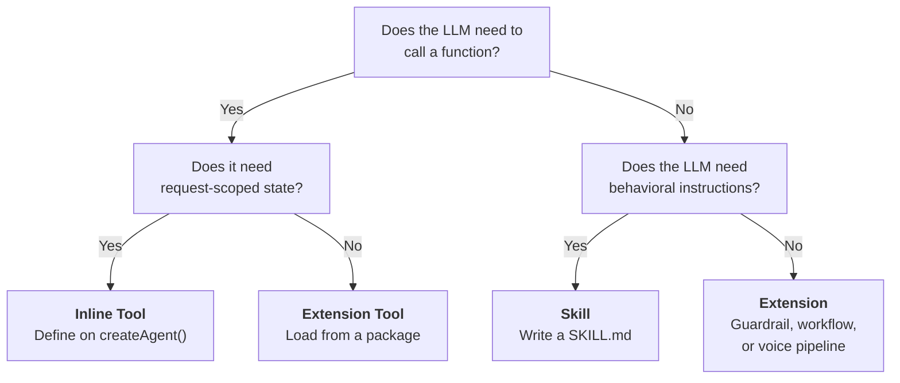
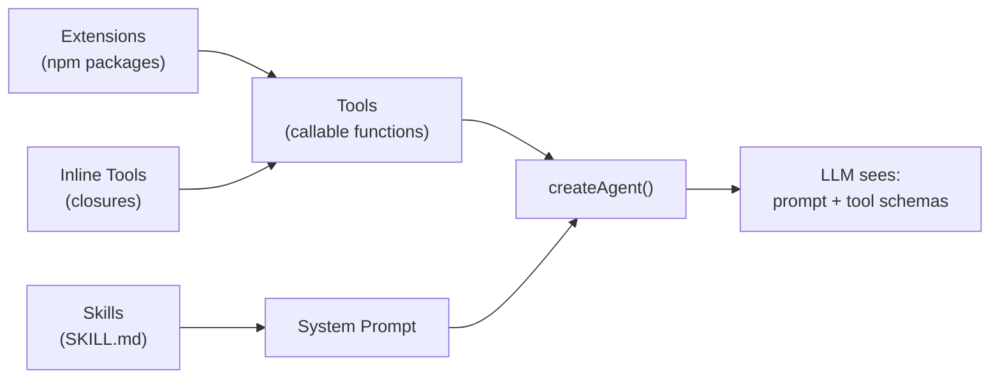

AgentOS has three systems for giving agents capabilities. They solve different problems, load at different times, and compose together.

| | Skills | Tools | Extensions |
|---|---|---|---|
| **What it is** | A `SKILL.md` file with YAML frontmatter and markdown body | A function definition with schema, description, and `execute()` callback | An npm package that exports tools, guardrails, or workflows |
| **How it loads** | `SkillRegistry` scans directories at startup | Inline on `createAgent()`, or resolved from an extension pack | `ExtensionsRegistry` resolves packages at initialization |
| **What the LLM sees** | Text injected into the system prompt | A function call schema (name, description, parameters) | Nothing directly. Extensions provide tools, which the LLM sees. |
| **When it runs** | At agent construction (prompt injection) | During generation (the LLM calls it as a function) | At app initialization (tool and guardrail setup) |
| **Can access runtime state** | No. Prompt text only. | Yes. Closures capture request-scoped state. | Package-scoped config only. |
| **Use case** | Behavioral guidelines, workflow instructions, "how to" knowledge | API calls, DB queries, vision analysis, media search, memory retrieval | Reusable tool packages, guardrail packs, voice pipelines |

## Decision Flowchart



## Skills: Prompt Modules

Skills are `SKILL.md` files that get injected into the agent's system prompt. They teach the LLM *when* and *how* to use its capabilities. A skill cannot execute code. It provides instructions.

```markdown
---
name: web-search
description: Search the web for current information
metadata:
  requires:
    env: [SERPAPI_API_KEY]
---

# Web Search

When the user asks about current events, recent news, or information
that may have changed since your training cutoff, use the `web_search`
tool. Prefer specific queries over broad ones.
```

Load skills with `SkillRegistry`:

```typescript
import { SkillRegistry } from '@framers/agentos/skills';

const registry = new SkillRegistry();
await registry.loadFromDirs(['./skills']);
const snapshot = registry.buildSnapshot({ platform: process.platform });

// Inject into agent system prompt
const agent = createAgent({
  instructions: baseInstructions + '\n\n' + snapshot.prompt,
  tools: myTools,
});
```

Skills load once at startup. They don't auto-update at runtime.

**Source:** [`packages/agentos/src/skills/`](https://github.com/framersai/agentos)

## Tools: Callable Functions

Tools are functions the LLM invokes during generation. The LLM sees the tool's name, description, and parameter schema. When it decides to call a tool, AgentOS executes the function and returns the result to the LLM for the next generation step.

### Inline tools (the production pattern)

The most powerful pattern for production apps: define tools as closures on `createAgent()` that capture request-scoped state.

```typescript
const agent = createAgent({
  name: 'Alice',
  tools: {
    analyze_image: {
      description: 'Look at an image URL to see what it contains.',
      parameters: {
        type: 'object',
        properties: {
          image_url: { type: 'string' },
        },
        required: ['image_url'],
      },
      execute: async ({ image_url }) => {
        // This closure captures actorId, policyTier, etc.
        const description = await describeImage(image_url);
        return { description };
      },
    },
  },
  maxSteps: 8,
});
```

This pattern is used in production on [wilds.ai](https://wilds.ai), where each companion has 11 agentic tools (memory recall, GIF search, vision analysis, web search, selfie generation) that capture the current user's ID, companion slug, and content policy tier.

Inline tools cannot come from a registry because they need runtime closures. If a tool needs to know *who is asking*, define it inline.

### Extension tools

Tools that don't need request-scoped state can be loaded from extension packages:

```typescript
import { createCuratedManifest } from '@framers/agentos-extensions-registry';

const manifest = await createCuratedManifest({
  tools: ['web-search', 'giphy', 'image-search'],
});
```

**Source:** [`packages/agentos/src/tools/`](https://github.com/framersai/agentos)

## Extensions: Reusable Packages

Extensions are npm packages that export tools, guardrails, workflows, or voice pipelines. They're the distribution mechanism for capabilities that don't need request-scoped state.

```typescript
import { createCuratedManifest } from '@framers/agentos-extensions-registry';

const manifest = await createCuratedManifest({
  tools: ['web-search', 'web-browser'],
  guardrails: ['pii-redaction', 'grounding-guard'],
  voice: ['speech-runtime'],
});
```

The extensions registry resolves packages, checks API key availability, and instantiates tool/guardrail instances. Extensions are loaded once at app initialization.

**Source:** [`packages/agentos-extensions/`](https://github.com/framersai/agentos)

## How They Compose

All three systems work together. The loading order:

1. **Extensions** resolve tool packages and guardrail packs at initialization
2. **Inline tools** are defined on `createAgent()` alongside extension tools
3. **Skills** are injected into the system prompt, teaching the LLM how to use the tools



The LLM sees a system prompt (from skills) and a set of tool schemas (from inline tools + extension tools). It generates text and tool calls. AgentOS executes the tool calls and feeds results back.

## Common Mistakes

**Writing a skill when you need a tool.** A skill can tell the LLM "use web search when the user asks about current events." It cannot execute a web search. If you need side effects, write a tool.

**Writing an extension when you need an inline tool.** An extension provides tools from a package with package-scoped config. If your tool needs to know the current user's ID, session, or policy tier, it can't come from an extension. Define it inline on `createAgent()`.

**Skipping skills for complex tools.** A tool schema has a name, description, and parameters. That's enough for simple tools like `web_search`. But complex tools (like `analyze_image` or `recall_memories`) benefit from a skill that teaches the LLM *when* to call them. Without the skill, the LLM might call `analyze_image` on text content or skip it when the user clearly references an image.
