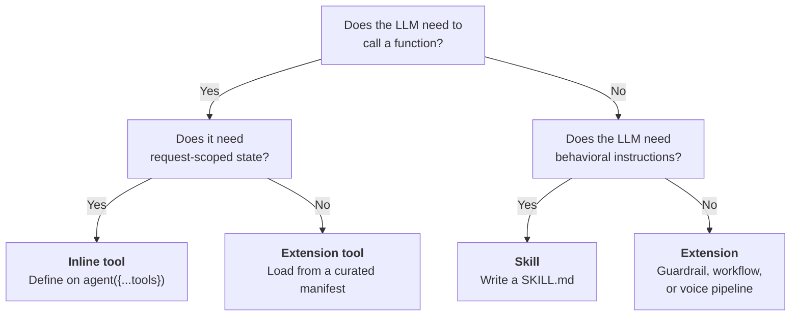
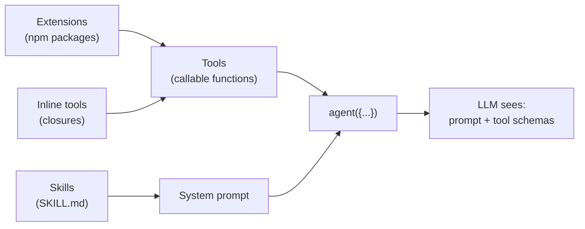

> "Make each program do one thing well. To do a new job, build afresh rather than complicate old programs by adding new features."
>
> — *The Bell System Technical Journal*, M. D. McIlroy, E. N. Pinson, and B. A. Tague, 1978

The Unix philosophy is the right starting frame for the three capability systems in AgentOS. Each one does exactly one thing. Skills tell the LLM *when* to do something. Tools are the things the LLM actually invokes. Extensions are the npm-package distribution mechanism for reusable tool sets, guardrail packs, and voice pipelines. Confusion only sets in when someone reaches for one of them to do another's job — writing a skill that tries to "execute," writing an extension that needs to know which user is asking. The page below is a map for picking the right one the first time.

## At a glance

| | Skills | Tools | Extensions |
|---|---|---|---|
| **What it is** | A `SKILL.md` file with YAML frontmatter and markdown body | A function with a JSON-schema'd parameter list, a description, and an `execute()` callback | An npm package that exports tools, guardrails, workflows, or voice pipelines |
| **How it loads** | [`SkillRegistry`](https://github.com/framersai/agentos/blob/master/src/skills/SkillRegistry.ts) scans directories at startup | Inline on `agent({...tools})`, or resolved from an extension manifest | [`createCuratedManifest()`](https://github.com/framersai/agentos-extensions-registry) resolves packages at initialization |
| **What the LLM sees** | Text injected into the system prompt | A function-call schema (name, description, parameter shape) | Nothing directly — extensions provide tools, the LLM sees the tools |
| **When it runs** | At agent construction (prompt assembly) | During generation, when the LLM emits a tool-call | At app initialization (one-time setup) |
| **Can capture request-scoped state?** | No — prompt text only, written before the request exists | **Yes** — closures capture actorId, sessionId, policy tier, anything in scope | No — package-scoped config only |
| **Right for** | Behavioral guidelines, workflow instructions, "how to" knowledge | API calls, DB queries, vision analysis, media search, memory retrieval | Reusable bundles published once and consumed across many agents |

## The decision



Most production apps use all three. The question is never "which one" — it's "which one for *this* capability."

## Skills — prompt modules

A skill is a markdown file with YAML frontmatter. It teaches the LLM *when* and *how* to use a tool, but it cannot itself execute anything. The skill body becomes part of the system prompt; the frontmatter declares prerequisites the runtime checks before exposing the skill.

```markdown
---
name: web-search
description: Search the web for current information
metadata:
  requires:
    env: [SERPAPI_API_KEY]
---

# Web Search

When the user asks about current events, recent news, or information
that may have changed since your training cutoff, use the `web_search`
tool. Prefer specific queries over broad ones. Avoid asking the user
to confirm — search first, then respond with what you found.
```

Load skills with [`SkillRegistry`](https://github.com/framersai/agentos/blob/master/src/skills/SkillRegistry.ts):

```typescript
import { SkillRegistry } from '@framers/agentos/skills';
import { agent } from '@framers/agentos';

const registry = new SkillRegistry();
await registry.loadFromDirs(['./skills']);

// buildSnapshot() supports platform filters, eligibility gating,
// and runtime-config-driven `requires.config` checks.
const snapshot = registry.buildSnapshot({ platform: process.platform });

const myAgent = agent({
  instructions: baseInstructions + '\n\n' + snapshot.prompt,
  tools: myTools,
});
```

Skills load once at startup. They don't auto-update at runtime — if you change a `SKILL.md` while the process is running, call `registry.reload()` or restart. The frontmatter `requires.env` / `requires.bins` / `requires.config` checks are evaluated against the host environment at snapshot time, so a skill that needs `SERPAPI_API_KEY` is silently filtered out when the key isn't set.

## Tools — callable functions

Tools are what the LLM actually invokes. The LLM sees the tool's name, description, and parameter JSON schema; when it decides to call one, the runtime executes the `execute()` function and feeds the result back into the next generation step.

### Inline tools — the production pattern

The most powerful pattern, and the one used in production on [wilds.ai](https://wilds.ai): define tools as closures on `agent({...})` so they capture request-scoped state.

```typescript
import { agent } from '@framers/agentos';

function buildCompanionAgent(actorId: string, slug: string, policyTier: string) {
  return agent({
    name: 'Alice',
    tools: {
      analyze_image: {
        description: 'Look at an image URL to see what it contains.',
        parameters: {
          type: 'object',
          properties: {
            image_url: { type: 'string' },
          },
          required: ['image_url'],
        },
        execute: async ({ image_url }) => {
          // Closure captures actorId, slug, policyTier from the enclosing scope.
          // No global state. No registry. The tool knows who is asking.
          const description = await describeImage(image_url, { actorId, policyTier });
          await recordVisionUsage(actorId, slug, image_url);
          return { description };
        },
      },
    },
    maxSteps: 8,
  });
}
```

The wilds.ai companion ships eleven of these per session — memory recall, GIF search, vision analysis, web search, selfie generation, conversation stats, attachment recall — all closing over the current actor, companion slug, and content policy tier. None of those values exist at registry-load time. They only exist per-request.

If a tool needs to know *who is asking*, it has to be inline. There is no other shape that fits.

### Extension tools

For tools that don't need request-scoped state — `web-search`, `giphy`, generic API wrappers — extension packages are cleaner. They live in their own npm packages, ship with API-key checks and lazy initialization, and can be enabled or disabled per agent without code changes:

```typescript
import { createCuratedManifest } from '@framers/agentos-extensions-registry';

const manifest = await createCuratedManifest({
  tools: ['web-search', 'giphy', 'image-search'],
});
```

`createCuratedManifest` checks API key availability per tool, lazy-imports only the requested packages, and returns a manifest the runtime can wire into `agent({...})` or `AgentOS.initialize()`.

## Extensions — reusable packages

Extensions are the distribution mechanism. They're npm packages under [`packages/agentos-extensions/registry/curated/`](https://github.com/framersai/agentos-extensions/tree/master/registry/curated) that export one of four descriptor kinds:

| Kind | What it provides |
|---|---|
| `tool` | Callable function for the LLM (web-search, weather, email, etc.) |
| `guardrail` | Input or output safety check (`pii-redaction`, `grounding-guard`, `topicality`, etc.) |
| `workflow` | Reusable workflow definition for the orchestration engine |
| `provenance` | Content-anchoring provider (blockchain attestation, signature verification) |

The same `createCuratedManifest()` resolves any combination:

```typescript
const manifest = await createCuratedManifest({
  tools: ['web-search', 'web-browser'],
  guardrails: ['pii-redaction', 'grounding-guard'],
  voice: ['speech-runtime'],
});
```

Resolution is per-extension: missing API keys produce skipped tools rather than hard failures, so a manifest that asks for ten tools and only has keys for seven yields seven loaded tools and seven warnings. This is intentional — production manifests are stable across environments where some integrations are deployment-specific.

## How they compose

All three layers cooperate per agent. Loading order:

1. **Extensions** resolve at app initialization — packages are imported, factories called, instances cached
2. **Inline tools** are defined on `agent({...})` per request, alongside whichever extension tools the manifest provides
3. **Skills** are injected into the system prompt at agent construction, teaching the LLM *when* to reach for which tool



The LLM ends up with one system prompt (assembled from skills + persona + memory + RAG context) and one set of tool schemas (inline + extension). It generates text and tool calls. The runtime executes the tool calls and feeds results back into the loop.

## Common mistakes

**Writing a skill when you need a tool.** A skill can tell the LLM "use web search when the user asks about current events." It cannot perform the search. If you need side effects, you need a tool.

**Writing an extension when you need an inline tool.** Extensions provide tools from packages with package-scoped config. If your tool needs to know the current user's ID, the conversation slug, or the policy tier — anything that only exists per-request — it cannot come from an extension. Define it inline on `agent({...})`.

**Skipping skills for complex tools.** A tool's name + description + parameter schema is enough for self-explanatory tools (`web_search`, `get_weather`). Less obvious ones (`analyze_image`, `recall_memories`, `forge_tool`) benefit from a SKILL.md that teaches the LLM when each is appropriate. Without the skill, you get the LLM calling `analyze_image` on text content, or skipping it when the user clearly references an image.

**Treating the registry as the source of truth.** Skills load at startup; the registry is a convenience for organizing them, not a runtime authority. The system prompt the LLM actually sees is whatever you assembled at `agent({...})` construction. If you forgot to inject `snapshot.prompt`, the skill is functionally invisible no matter what the registry says.

## Source

- Skills: [`packages/agentos/src/skills/`](https://github.com/framersai/agentos/tree/master/src/skills)
- Tools: [`packages/agentos/src/core/tools/`](https://github.com/framersai/agentos/tree/master/src/core/tools)
- Extension runtime: [`packages/agentos/src/extensions/`](https://github.com/framersai/agentos/tree/master/src/extensions)
- Curated extensions: [`packages/agentos-extensions/registry/curated/`](https://github.com/framersai/agentos-extensions/tree/master/registry/curated)
- Curated manifest builder: [`packages/agentos-extensions-registry/`](https://github.com/framersai/agentos-extensions-registry)
