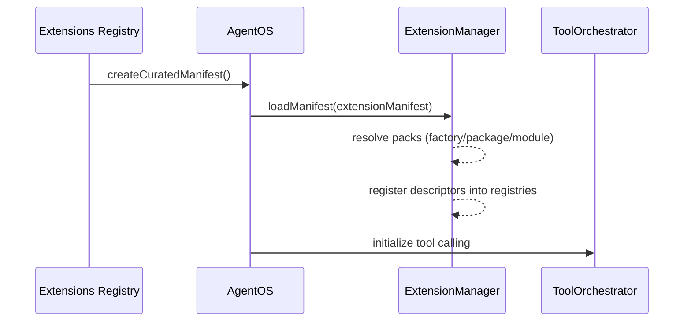

AgentOS loads extensions from an explicit `extensionManifest`. There is no hidden “plugin marketplace” behavior in core (no background npm installs, no hot-reload, no implicit caching).

So when we say “auto-loading” in the AgentOS ecosystem, it typically means:

- **Automatically build a manifest** from whatever curated extension packages are installed.
- **Load that manifest** during `AgentOS.initialize()`, making tool schemas available for tool calling.

## Recommended: Build a Curated Manifest

Use `@framers/agentos-extensions-registry` to build a manifest from installed curated packages. Missing optional dependencies are skipped.

```ts
import { AgentOS } from '@framers/agentos';
import { createCuratedManifest } from '@framers/agentos-extensions-registry';

const extensionSecrets = {
  'serper.apiKey': process.env.SERPER_API_KEY!,
  'giphy.apiKey': process.env.GIPHY_API_KEY!,
};

const manifest = await createCuratedManifest({
  tools: 'all',
  // Channels can have side effects (connect/poll/webhook). Enable explicitly.
  channels: 'none',
  secrets: extensionSecrets,
});

const agentos = new AgentOS();
await agentos.initialize({
  extensionManifest: manifest,
  extensionSecrets,
  // ...other required AgentOS config
});
```

## Load Flow



## What "Lazy Loading" Means (Today)

You'll see "lazy" used in a few different ways:

- **Lazy optional dependencies**: the curated registry uses dynamic `import()` to include only installed extension packages.
- **Lazy heavy deps inside tools**: a tool's `execute()` can dynamically `import()` heavy libraries on first call.
- **Lazy heavy deps shared across descriptors**: `SharedServiceRegistry.getOrCreate()` registers a factory at activation and only constructs the resource on the first call that needs it. Subsequent callers (other tools, the streaming guardrail) share the same instance.
- **Lazy skills**: `SkillRegistry` from `@framers/agentos/skills` exposes `skills_list` / `skills_read` tools so the model can fetch `SKILL.md` content on demand. Curated skill content ships in `@framers/agentos-skills`.

What AgentOS does not do by default: wait for the model to request a tool and then reveal its schema. Tool calling requires schemas up front, so the host decides which tools to expose for a given session/turn.

## End-to-End Walkthrough: A Lazy-Loaded Guardrail Pack

Walking through what actually happens when a host installs the PII redaction guardrail extension and runs a request. This is the same shape every guardrail pack follows.

### Step 1. Install only what you need

```bash
npm install @framers/agentos @framers/agentos-extensions-registry @framers/agentos-ext-pii-redaction
```

Nothing else from the 100+ extension catalog enters `node_modules`. The registry is a small SDK; the catalog of metadata it carries is independent of which packages are installed.

### Step 2. Build the manifest

```ts
import { AgentOS } from '@framers/agentos';
import { createCuratedManifest } from '@framers/agentos-extensions-registry';

const manifest = await createCuratedManifest({
  tools: 'all',
  channels: 'none',
  secrets: {
    // Optional: unlocks the LLM-judge tier in pii-redaction.
    'anthropic.apiKey': process.env.ANTHROPIC_API_KEY,
  },
});
// → manifest.packs.length === 1 (only the installed pii-redaction pack).
```

`createCuratedManifest()` calls `import.meta.resolve()` on every catalog entry. The 99 entries that are not installed get dropped with no error. The one installed pack lands in `manifest.packs`.

### Step 3. Activate the pack

```ts
const agentos = new AgentOS();
await agentos.initialize({ extensionManifest: manifest });
```

`ExtensionManager.loadManifest()` runs `pack.onActivate(ctx)`, which registers a `pii:ner-model` factory in `ctx.services` (`SharedServiceRegistry`). The 110MB BERT NER model file does not enter the module graph yet. The factory is the only thing registered.

### Step 4. Register descriptors

The pack emits three descriptors:

- `pii_scan` (kind: `tool`)
- `pii_redact` (kind: `tool`)
- The PII redaction guardrail itself (kind: `guardrail`, with `config.canSanitize = true` and `config.evaluateStreamingChunks = true`)

`ExtensionManager` checks `requiredSecrets` per descriptor before activating. If `anthropic.apiKey` was not provided, the optional LLM-judge resolver descriptor is skipped, and the rest of the pack activates.

### Step 5. First request loads the model

A user message hits the input pipeline. The two-phase guardrail dispatcher runs:

1. **Phase 1 (sequential sanitizers).** The PII guardrail's `evaluateInput()` fires. On this first call, the NER pipeline reaches into `services.getOrCreate('pii:ner-model', ...)` and the model loads. The guardrail returns a `SANITIZE` result with redacted text.
2. **Phase 2 (parallel classifiers).** Any remaining classifier guardrails run concurrently against the sanitized text via `Promise.allSettled`, with worst-action aggregation (`BLOCK > FLAG > ALLOW`).

### Step 6. Streaming output reuses the same model

As the LLM streams tokens, each `TEXT_DELTA` chunk passes through the guardrail's `evaluateOutput()`. The NER model is already loaded and cached in `SharedServiceRegistry`, so chunk evaluation is fast. `SANITIZE` results returned in Phase 1 chain deterministically; Phase 2 `SANITIZE` is downgraded to `FLAG` to keep output deterministic when classifiers run in parallel.

### Step 7. Tear-down releases everything

`AgentOS.shutdown()` calls `pack.onDeactivate(ctx)` in reverse order. `SharedServiceRegistry` releases the NER model. The kind-specific registries clear. Future processes start cold.

### What changes for the other guardrail packs

The pattern is identical. Only the heavy resource changes:

| Pack | Heavy resource | Lazy via |
|------|---------------|----------|
| `agentos-ext-pii-redaction` | BERT NER model (~110MB) | `services.getOrCreate('pii:ner-model', ...)` |
| `agentos-ext-ml-classifiers` | ONNX BERT classifiers (toxicity, injection, NSFW) | `services.getOrCreate('ml:classifier-orchestrator', ...)` |
| `agentos-ext-grounding-guard` | NLI entailment pipeline | `services.getOrCreate('grounding:nli-pipeline', ...)` |
| `agentos-ext-topicality` | Embedding model + drift tracker | `services.getOrCreate('topicality:embedder', ...)` |
| `agentos-ext-code-safety` | None (regex-only) | No lazy load needed |

For the dispatcher mechanics and configuration flags, see [Guardrails](https://docs.agentos.sh/features/guardrails). For the kind-specific registry internals, see [Extension Loading](https://docs.agentos.sh/architecture/extension-loading).

## What Is Not Automatic (Yet)

- No core auto-install (`npm install`) of missing extensions.
- No core “extension marketplace UI”.
- No hot reload of extension packs.

There is an `ExtensionLoader` utility in `@framers/agentos` that experiments with registry scanning and auto-install, but it is not wired into `AgentOS.initialize()` and should be treated as experimental.
