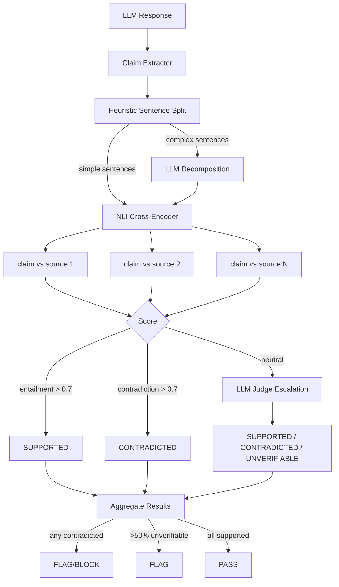

RAG-grounded hallucination detection using a hybrid NLI cross-encoder and LLM-as-judge pipeline. Verifies that claims in LLM output are faithful to retrieved source documents.

**Package:** `@framers/agentos-ext-grounding-guard`

---

## Overview



The Grounding Guard extension provides two modes of operation:

- **Passive protection** via a built-in guardrail that automatically verifies response faithfulness against RAG source documents during streaming and on final response
- **Active capability** via an agent-callable tool (`check_grounding`) for on-demand grounding verification

It checks each claim in the agent's response against the retrieved source chunks:

- **Supported** -- claim is entailed by at least one source document
- **Contradicted** -- claim directly contradicts a source document
- **Unverifiable** -- claim cannot be found in any source (potential hallucination)

The verification pipeline uses two tiers:

1. **Tier 1: NLI Cross-Encoder** (`cross-encoder/nli-deberta-v3-small`, ~40MB INT8) -- fast entailment/contradiction detection at ~30ms per claim-source pair
2. **Tier 2: LLM-as-Judge** -- chain-of-thought verification for ambiguous claims (~150--500ms, only when configured)

Only runs when RAG sources are present. No sources means no verification (no-op).

---

## Prerequisites

The grounding guard requires RAG source plumbing -- specifically, `ragSources` must be present on the `GuardrailOutputPayload`. This is populated automatically by AgentOS when RAG retrieval is performed for a request.

The `ragSources` field contains `RagRetrievedChunk[]` from the `RetrievalAugmentor`, threaded from the GMI through the response stream to the guardrail layer. When no RAG retrieval was performed, the field is undefined and the guardrail is a no-op.

---

## Installation

```bash
npm install @framers/agentos-ext-grounding-guard
```

The NLI model requires `@huggingface/transformers` (already an AgentOS dependency):

```bash
npm install @huggingface/transformers
```

---

## Usage

### Direct factory usage

```typescript
import { AgentOS } from '@framers/agentos';
import { createGroundingGuardrail } from '@framers/agentos-ext-grounding-guard';

const groundingPack = createGroundingGuardrail({
  entailmentThreshold: 0.7,
  contradictionThreshold: 0.7,
  maxUnverifiableRatio: 0.5,
  contradictionAction: 'flag',
  llm: {
    provider: 'anthropic',
    model: 'claude-haiku-4-5-20251001',
    apiKey: process.env.ANTHROPIC_API_KEY,
  },
});

const agent = new AgentOS();
await agent.initialize({
  ...config,
  manifest: { packs: [{ factory: () => groundingPack }] },
});
```

### Manifest-based loading

```typescript
await agent.initialize({
  manifest: {
    packs: [
      {
        package: '@framers/agentos-ext-grounding-guard',
        options: {
          contradictionAction: 'block',
          maxUnverifiableRatio: 0.3,
        },
      },
    ],
  },
});
```

---

## ClaimExtractor

Decomposes response text into atomic factual claims for grounding verification using a two-tier extraction approach.

### Tier 1: Heuristic Sentence Splitting

For simple sentences (20 words or fewer, single clause):

1. Split on sentence boundaries (`. `, `? `, `! `, `\n`)
2. Filter non-factual content (questions, hedges, meta-commentary, greetings, code blocks)
3. Simple sentences pass through as-is

**Heuristic filters** (sentences that are NOT factual claims):

- Questions: ends with `?`
- Hedges: starts with "I think", "maybe", "perhaps", "it seems", "I believe"
- Meta: "I hope this helps", "let me know if", "feel free to", "here's"
- Greetings: "hello", "hi there", "sure!", "great question", "of course"
- Code blocks: anything inside triple-backtick fences

### Tier 2: LLM Decomposition

For complex sentences (>20 words or multiple clauses):

Detected by: word count > 20, independent-clause conjunctions (", and ", "; ", " while ", " however "), or 3+ numbers/proper nouns.

Sent to a lightweight LLM with a structured decomposition prompt that returns an array of atomic factual claims.

When no LLM is configured, all sentences use heuristic mode (no decomposition).

---

## GroundingChecker

Verifies claims against source documents using the two-tier pipeline.

### Tier 1: NLI Cross-Encoder

- **Model:** `cross-encoder/nli-deberta-v3-small` (~40MB, INT8 quantized)
- **Input:** `pipeline({ text: claim, text_pair: source_text })`
- **Output:** entailment / contradiction / neutral scores

For each claim, all top N source chunks (default 5, sorted by relevance score) are compared in parallel. The best-matching source is returned as the attribution:

```
Claim: "The API rate limit is 1000 req/min"

Source 1 (relevance 0.91): "Premium users get 1000 requests per minute"
  -> NLI: entailment 0.92 -> SUPPORTED

Source 2 (relevance 0.85): "Free tier is limited to 500 req/min"
  -> NLI: contradiction 0.78 -> (not best match, source 1 wins)

Best match: Source 1, verdict: SUPPORTED, confidence: 0.92
```

### Tier 2: LLM-as-Judge Escalation

When NLI scores are ambiguous (neither entailment nor contradiction above threshold), the claim is escalated to an LLM with a chain-of-thought verification prompt:

1. What does the claim assert?
2. Does the source explicitly support, contradict, or not address this?
3. Are there any subtle contradictions or missing context?

Returns: verdict (supported/contradicted/unverifiable), confidence, and reasoning.

If no source produces entailment or contradiction above threshold and no LLM is configured, the verdict is `unverifiable`.

---

## Streaming and Final Evaluation

### Streaming Phase (TEXT_DELTA)

During streaming, the guardrail buffers text at sentence boundaries:

1. Append TEXT_DELTA to sentence buffer
2. On sentence boundary: extract sentence, filter non-factual content
3. For factual claims: run NLI against top-5 `ragSources`
4. Contradiction > 0.7: FLAG immediately (fast first-pass)
5. Entailment > 0.7: pass (supported)
6. Neutral: defer to final phase

### Final Phase (isFinal / FINAL_RESPONSE)

On stream completion, a comprehensive check runs:

1. Extract ALL claims from the full response text (heuristic + LLM decomposition for complex sentences)
2. For each claim: NLI against ragSources (top-5 per claim)
3. Ambiguous claims: escalate to LLM-as-judge
4. Aggregate results:
   - Any contradicted claim: FLAG or BLOCK (per `contradictionAction`)
   - Unverifiable ratio > `maxUnverifiableRatio`: FLAG (per `unverifiableAction`)
   - All supported: pass

---

## Verdicts

| Verdict        | Meaning                                  | Trigger                                                                     |
| -------------- | ---------------------------------------- | --------------------------------------------------------------------------- |
| `supported`    | Claim is entailed by at least one source | NLI entailment > threshold                                                  |
| `contradicted` | Claim directly contradicts a source      | NLI contradiction > threshold, or LLM confirms contradiction                |
| `unverifiable` | Claim not found in any source            | Neither entailment nor contradiction above threshold; LLM says unverifiable |

---

## Configuration

### `GroundingGuardOptions`

| Option                   | Type                                     | Default                                | Description                                                                                                               |
| ------------------------ | ---------------------------------------- | -------------------------------------- | ------------------------------------------------------------------------------------------------------------------------- |
| `nliModelId`             | `string`                                 | `'cross-encoder/nli-deberta-v3-small'` | NLI cross-encoder model ID.                                                                                               |
| `entailmentThreshold`    | `number`                                 | `0.7`                                  | NLI score threshold for entailment (SUPPORTED).                                                                           |
| `contradictionThreshold` | `number`                                 | `0.7`                                  | NLI score threshold for contradiction (CONTRADICTED).                                                                     |
| `maxUnverifiableRatio`   | `number`                                 | `0.5`                                  | Maximum fraction of unverifiable claims before flagging.                                                                  |
| `contradictionAction`    | `'flag' \| 'block'`                      | `'flag'`                               | Action when a contradiction is detected.                                                                                  |
| `unverifiableAction`     | `'flag' \| 'block'`                      | `'flag'`                               | Action when unverifiable ratio is exceeded.                                                                               |
| `llm`                    | `{ provider, model, apiKey?, baseUrl? }` | —                                      | LLM config for claim decomposition and ambiguous escalation. When omitted, heuristic-only claims + NLI-only verification. |
| `maxSourcesPerClaim`     | `number`                                 | `5`                                    | Max source chunks to compare each claim against.                                                                          |
| `enableStreamingChecks`  | `boolean`                                | `true`                                 | Enable streaming sentence-level NLI checks. When false, only the final comprehensive check runs.                          |
| `quantized`              | `boolean`                                | `true`                                 | Use INT8 quantized NLI model for lower memory.                                                                            |
| `guardrailScope`         | `'input' \| 'output' \| 'both'`          | `'output'`                             | Grounding verification only applies to output.                                                                            |

---

## Agent Tools

### `check_grounding`

On-demand grounding verification. Lets agents proactively verify claims against source text before including them in responses.

```
Agent: Let me verify this synthesized answer is grounded in the sources.
-> check_grounding({
    text: "The API rate limit is 1000 req/min",
    sources: ["Premium users get 1000 requests per minute."]
  })
<- {
    grounded: true,
    claims: [{
      claim: "The API rate limit is 1000 req/min",
      verdict: "supported",
      confidence: 0.92,
      bestSource: { chunkId: "tool-source-0", content: "Premium users...", score: 0.92 },
      escalated: false
    }],
    totalClaims: 1,
    supportedCount: 1,
    contradictedCount: 0,
    unverifiableCount: 0,
    unverifiableRatio: 0.0,
    summary: "1/1 claims supported"
  }
```

The tool accepts `sources: string[]` (plain text) for simplicity. These are wrapped as synthetic `RagRetrievedChunk` objects internally.

---

## Reason Codes

| Reason Code               | Trigger                                             | Metadata                                    |
| ------------------------- | --------------------------------------------------- | ------------------------------------------- |
| `GROUNDING_CONTRADICTION` | Claim contradicts a source                          | Per-claim verification results, best source |
| `GROUNDING_UNVERIFIABLE`  | Too many claims not found in sources                | Unverifiable ratio, claim details           |
| `GROUNDING_NO_SOURCES`    | Informational flag when response has no RAG sources | --                                          |

---

## Memory Impact

| Component                             | Memory          | When Loaded           |
| ------------------------------------- | --------------- | --------------------- |
| NLI model (nli-deberta-v3-small INT8) | ~40MB           | First grounding check |
| ClaimExtractor (heuristic rules)      | ~5KB            | Pack load             |
| Per-stream sentence buffer            | ~1KB per stream | First TEXT_DELTA      |
| **Total**                             | **~40MB**       | --                    |

The NLI model is lazy-loaded and shared via `ISharedServiceRegistry`. If another extension uses the same model, zero additional memory.

---

## Graceful Degradation

| Condition                            | Behavior                                                                     |
| ------------------------------------ | ---------------------------------------------------------------------------- |
| No `ragSources` on payload           | No-op -- returns null (cannot ground without sources)                        |
| NLI model fails to load              | Falls back to LLM-only (if configured), else no-op                           |
| LLM not configured                   | NLI-only mode -- heuristic claims, no decomposition, no ambiguous escalation |
| Both NLI and LLM unavailable         | No-op with warning logged                                                    |
| Empty response (no claims extracted) | Returns null                                                                 |
| `ragSources` present but empty array | Returns null (no sources to compare against)                                 |

---

## Related Documentation

- [Guardrails](/features/guardrails)
- [Extension Architecture](/extensions/extension-architecture)
- [Extensions Overview](/extensions/overview)
- [RAG Memory](/features/rag-memory)
- [PII Redaction](/extensions/built-in/pii-redaction)
- [ML Content Classifiers](/extensions/built-in/ml-classifiers)
- [Topicality](/extensions/built-in/topicality)
- [Code Safety](/extensions/built-in/code-safety)
