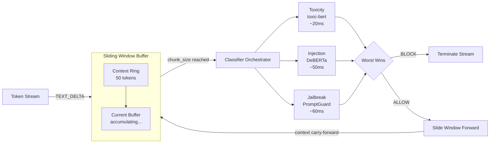

Streaming ML content safety classification using BERT-family models with sliding-window chunk-based evaluation. Detects toxicity, prompt injection, and jailbreak attempts in real-time during LLM streaming.

**Package:** `@framers/agentos-ext-ml-classifiers`

---

## Overview



The ML Content Classifiers extension provides two modes of operation:

- **Passive protection** via a built-in guardrail that automatically classifies input and output content using three BERT-family models running in parallel
- **Active capability** via an agent-callable tool (`classify_content`) for on-demand content safety classification

It detects:

- **Toxicity** -- toxic, severe toxic, obscene, threat, insult, identity hate (via `unitary/toxic-bert`)
- **Prompt injection** -- paraphrased, obfuscated, and indirect injection attacks (via `protectai/deberta-v3-small-prompt-injection-v2`)
- **Jailbreak** -- role-play attacks, system prompt extraction, constraint bypasses (via `meta-llama/PromptGuard-86M`)

All models run via `@huggingface/transformers` with ONNX Runtime. Models are INT8 quantized by default for ~50% smaller footprint with minimal accuracy loss. Lazy-loaded on first use via `ISharedServiceRegistry`.

---

## Installation

```bash
npm install @framers/agentos-ext-ml-classifiers
```

The extension requires `@huggingface/transformers` (already an AgentOS dependency):

```bash
npm install @huggingface/transformers
```

---

## Usage

### Direct factory usage

```typescript
import { AgentOS } from '@framers/agentos';
import { createMLClassifierGuardrail } from '@framers/agentos-ext-ml-classifiers';

const mlPack = createMLClassifierGuardrail({
  classifiers: {
    toxicity: true,
    injection: true,
    jailbreak: true,
  },
  streamingMode: 'hybrid',
  chunkSize: 200,
  contextSize: 50,
});

const agent = new AgentOS();
await agent.initialize({
  ...config,
  manifest: { packs: [{ factory: () => mlPack }] },
});
```

### Manifest-based loading

```typescript
await agent.initialize({
  manifest: {
    packs: [
      {
        package: '@framers/agentos-ext-ml-classifiers',
        options: {
          classifiers: { toxicity: true, injection: true, jailbreak: false },
          streamingMode: 'non-blocking',
        },
      },
    ],
  },
});
```

### Via curated registry

```typescript
import { createCuratedManifest } from '@framers/agentos-extensions-registry';

const manifest = await createCuratedManifest({
  tools: ['ml-classifiers'],
  channels: 'none',
});
```

---

## Default Classifiers

### Toxicity Classifier

| Property    | Value                                                                   |
| ----------- | ----------------------------------------------------------------------- |
| **Model**   | `unitary/toxic-bert` (66M params, INT8 ~33MB)                           |
| **Labels**  | `toxic`, `severe_toxic`, `obscene`, `threat`, `insult`, `identity_hate` |
| **Latency** | ~20ms CPU ONNX, ~5ms GPU                                                |
| **AUC**     | 98.28 mean across 6 categories                                          |
| **Output**  | Multi-label (each label scored independently 0.0--1.0)                  |

Default thresholds: block > 0.9, flag > 0.7, warn > 0.4

### Injection Classifier

| Property    | Value                                                                            |
| ----------- | -------------------------------------------------------------------------------- |
| **Model**   | `protectai/deberta-v3-small-prompt-injection-v2` (44M params, INT8 ~22MB)        |
| **Labels**  | `INJECTION`, `SAFE` (binary classification)                                      |
| **Latency** | ~50ms CPU ONNX, ~15ms GPU                                                        |
| **Focus**   | Paraphrased, obfuscated, and indirect injections via tool outputs or RAG context |

Default thresholds: block INJECTION > 0.85, flag INJECTION > 0.5

### Jailbreak Classifier

| Property    | Value                                                      |
| ----------- | ---------------------------------------------------------- |
| **Model**   | `meta-llama/PromptGuard-86M` (86M params, INT8 ~43MB)      |
| **Labels**  | `jailbreak`, `injection`, `benign` (multi-class, one wins) |
| **Latency** | ~60ms CPU ONNX, ~15ms GPU                                  |
| **Origin**  | Meta's LlamaFirewall                                       |

Default thresholds: block jailbreak > 0.8, flag jailbreak > 0.5 OR injection > 0.5

---

## IContentClassifier Interface

Add custom classifiers by implementing the `IContentClassifier` interface:

```typescript
interface IContentClassifier {
  /** Unique identifier (e.g., 'my-custom-classifier') */
  readonly id: string;
  /** Human-readable display name */
  readonly displayName: string;
  /** What this classifier detects */
  readonly description: string;
  /** HuggingFace model ID or local path */
  readonly modelId: string;
  /** Whether the model is loaded and ready */
  readonly isLoaded: boolean;

  /** Classify text and return a ClassificationResult */
  classify(text: string): Promise<ClassificationResult>;

  /** Release model resources */
  dispose?(): Promise<void>;
}
```

Register custom classifiers in the pack options:

```typescript
const pack = createMLClassifierGuardrail({
  customClassifiers: [new MyCustomClassifier()],
  classifiers: { toxicity: true }, // defaults still run alongside
});
```

---

## SlidingWindowBuffer

The sliding window buffer manages token accumulation and context carry-forward for streaming classification. It decides _when_ a chunk is ready for classification, decoupled from the classification logic itself.

### How It Works

1. TEXT_DELTA chunks feed into the buffer via `push(streamId, text)`
2. Tokens accumulate until `chunkSize` (default 200) tokens are reached
3. When ready, the buffer returns the chunk text with `contextSize` (default 50) tokens carried forward from the previous chunk's tail
4. On stream end, `flush()` returns any remaining buffered text

### Configuration

| Parameter         | Default | Description                                                                                                                          |
| ----------------- | ------- | ------------------------------------------------------------------------------------------------------------------------------------ |
| `chunkSize`       | `200`   | Tokens to accumulate before triggering classification. Larger = better accuracy, slower detection.                                   |
| `contextSize`     | `50`    | Tokens carried forward from previous chunk tail as overlap context. Prevents violations spanning chunk boundaries from being missed. |
| `maxEvaluations`  | `100`   | Cap on total classifier invocations per stream.                                                                                      |
| `streamTimeoutMs` | `30000` | Stale stream cleanup timeout.                                                                                                        |

### Token Estimation

Token count is estimated at ~4 characters per token (standard for English text). This is intentionally approximate -- the buffer decides _when_ to classify, not how to tokenize for the model (the model's own tokenizer handles that).

---

## Streaming Modes

The guardrail supports three streaming modes, all implemented within the `IGuardrailService` contract:

### Non-blocking (default)

`evaluateOutput()` returns `null` immediately for accumulating chunks. Classification fires asynchronously in the background. On the _next_ `evaluateOutput()` call, the guardrail checks the previous async result -- if it was a violation, returns BLOCK then. Tokens stream with ~0ms added latency; violations are caught with a one-chunk delay (~2s at chunkSize=200).

### Blocking

`evaluateOutput()` awaits classification before returning. When the buffer has not reached chunkSize, returns `null` immediately. When the buffer _is_ ready, the call blocks for ~20--60ms while classifiers run. Users see smooth streaming with imperceptible ~60ms micro-pauses every ~2 seconds.

### Hybrid (recommended)

First chunk uses blocking mode (catches injection in the first response -- the most dangerous attack vector). Subsequent chunks use non-blocking for smooth streaming with one-chunk-delayed violation detection.

```typescript
const pack = createMLClassifierGuardrail({
  streamingMode: 'hybrid', // first chunk blocking, rest non-blocking
});
```

---

## Configuration

### `MLClassifierPackOptions`

| Option              | Type                                       | Default                 | Description                                                                                           |
| ------------------- | ------------------------------------------ | ----------------------- | ----------------------------------------------------------------------------------------------------- |
| `classifiers`       | `{ toxicity?, injection?, jailbreak? }`    | all `true`              | Toggle each classifier independently. Pass `true` for defaults or a `ClassifierConfig` for overrides. |
| `customClassifiers` | `IContentClassifier[]`                     | `[]`                    | Additional classifiers to run alongside defaults.                                                     |
| `modelCacheDir`     | `string`                                   | `~/.wunderland/models/` | Model cache directory (Node.js only).                                                                 |
| `quantized`         | `boolean`                                  | `true`                  | Use INT8 quantized models for lower memory.                                                           |
| `runtime`           | `'node' \| 'browser' \| 'edge' \| 'auto'`  | `'auto'`                | Runtime environment hint. Auto-detected if omitted.                                                   |
| `browser`           | `BrowserConfig`                            | —                       | Browser-specific configuration (Web Worker, cache strategy).                                          |
| `chunkSize`         | `number`                                   | `200`                   | Tokens per sliding window chunk.                                                                      |
| `contextSize`       | `number`                                   | `50`                    | Context overlap tokens carried forward.                                                               |
| `maxEvaluations`    | `number`                                   | `100`                   | Max evaluations per stream.                                                                           |
| `streamingMode`     | `'non-blocking' \| 'blocking' \| 'hybrid'` | `'non-blocking'`        | Streaming evaluation strategy.                                                                        |
| `thresholds`        | `Partial<ClassifierThresholds>`            | —                       | Default action thresholds for all classifiers.                                                        |
| `guardrailScope`    | `'input' \| 'output' \| 'both'`            | `'both'`                | Which direction(s) the guardrail applies to.                                                          |

### `ClassifierThresholds`

| Threshold        | Default | Description                                             |
| ---------------- | ------- | ------------------------------------------------------- |
| `blockThreshold` | `0.9`   | Score above which the stream is BLOCKED immediately.    |
| `flagThreshold`  | `0.7`   | Score above which the result is FLAGGED for escalation. |
| `warnThreshold`  | `0.4`   | Score above which a warning is logged (no action).      |

### Per-Classifier Overrides

```typescript
const pack = createMLClassifierGuardrail({
  classifiers: {
    toxicity: {
      modelId: 'custom/my-toxicity-model', // override model
      thresholds: { blockThreshold: 0.95 }, // override thresholds
      labelActions: { identity_hate: 'block' }, // always block this label
    },
    injection: true, // use defaults
    jailbreak: false, // disable entirely
  },
});
```

---

## Browser Support

The extension runs in browser environments using ONNX Runtime WASM:

### Web Worker

By default, classification is offloaded to a Web Worker to avoid blocking the UI thread for 50--100ms per chunk. The worker is created lazily on first classification call and falls back to main-thread execution if Worker creation fails (e.g., CSP restrictions).

### Cache API

Models are cached in the browser using the Cache API (default) or IndexedDB for persistence across page loads. LRU eviction when `maxCacheSize` (default 200MB) is exceeded.

### Configuration

```typescript
const pack = createMLClassifierGuardrail({
  runtime: 'browser',
  browser: {
    useWebWorker: true,
    cacheStrategy: 'cache-api',
    maxCacheSize: 200 * 1024 * 1024,
    onProgress: ({ modelId, percent }) => {
      console.log(`Downloading ${modelId}: ${percent}%`);
    },
  },
});
```

---

## Agent Tools

### `classify_content`

On-demand content safety classification. Lets agents proactively classify arbitrary text before forwarding to external APIs, including in responses, or presenting to users.

```
Agent: I'll check this user comment for safety before posting.
-> classify_content({ text: "user-submitted comment", classifiers: ["toxicity"] })
<- {
    results: [{ classifierId: "toxicity", topLabel: "toxic", topScore: 0.02 }],
    recommendedAction: "allow",
    triggeredBy: null,
    totalLatencyMs: 22
  }
```

---

## Memory Impact

| Component                            | Memory          | When Loaded               |
| ------------------------------------ | --------------- | ------------------------- |
| Toxicity model (toxic-bert INT8)     | ~33MB           | First classification call |
| Injection model (DeBERTa INT8)       | ~22MB           | First classification call |
| Jailbreak model (PromptGuard INT8)   | ~43MB           | First classification call |
| SlidingWindowBuffer state            | ~1KB per stream | First TEXT_DELTA          |
| **Total (all 3 models, 10 streams)** | **~98MB**       | --                        |

All models are lazy-loaded. If only toxicity is enabled, memory cost is ~33MB. Models are shared across extensions via `ISharedServiceRegistry` -- if another extension uses the same model, zero additional memory.

---

## Graceful Degradation

| Condition                                 | Behavior                                                                 |
| ----------------------------------------- | ------------------------------------------------------------------------ |
| `@huggingface/transformers` not installed | Pack logs error, all messages pass (fail-open)                           |
| Model download fails                      | That classifier marked `unavailable`, contributes ALLOW to aggregation   |
| ONNX Runtime not available                | Falls back to WASM backend (browser/edge)                                |
| Single classifier throws                  | Warning logged, other classifiers continue, failed one contributes ALLOW |
| Max evaluations exceeded                  | Remaining chunks pass without classification                             |
| Stream timeout                            | Buffer state cleaned up, no memory leak                                  |

---

## Related Documentation

- [Guardrails](/features/guardrails)
- [Extension Architecture](/extensions/extension-architecture)
- [Extensions Overview](/extensions/overview)
- [PII Redaction](/extensions/built-in/pii-redaction)
- [Topicality](/extensions/built-in/topicality)
- [Code Safety](/extensions/built-in/code-safety)
- [Grounding Guard](/extensions/built-in/grounding-guard)
