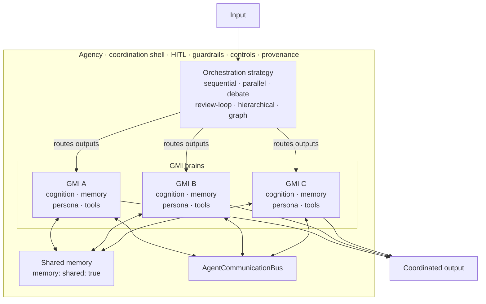

> **Live runs**: side-by-side code + captured output for both the `graph` strategy (research → writer ‖ illustrator → reviewer DAG) and the `sequential` strategy with streaming + HITL approval are on the [agentos.sh demo gallery](https://agentos.sh/#live-demo). Source: [`examples/agency-graph.mjs`](https://github.com/framersai/agentos/blob/master/examples/agency-graph.mjs), [`examples/agency-streaming.mjs`](https://github.com/framersai/agentos/blob/master/examples/agency-streaming.mjs).

`agency()` is the high-level multi-agent factory in AgentOS. It coordinates a
named roster of sub-agents under a chosen orchestration strategy and returns a
single `Agent`-compatible interface so callers can swap a single agent for an
entire team without changing call sites.

Implemented features: strategy orchestration, session history, aggregate
usage/cost tracking, resource controls, [HITL](/features/human-in-the-loop), guardrail evaluation, structured
Zod output, RAG context injection (v1 placeholder), `listen()` for voice
WebSocket transport, `connect()` for channel adapters, and real per-agent
streaming events on the sequential strategy.

## Mental Model

Agency is the multi-brain primitive. Each `agent()` in the roster carries a full
[GMI](/architecture/gmi) brain: cognition (PAD mood, HEXACO traits, eight cognitive
mechanisms), memory (episodic, semantic, procedural, working), persona, and
tools. The agency layer adds three things on top of those brains.

**1. Orchestration strategy declares how outputs flow between brains.**
Sequential chains them, parallel fans them out and synthesises, debate has them
argue and refine, hierarchical lets a coordinator dispatch, graph DAG declares
explicit dependencies. The strategy is the data-flow shape. Picking the
strategy picks how brain-to-brain context propagates; the work itself happens
inside each brain.

**2. Shared coordination primitives connect the brains.** A shared memory store
(`memory: { shared: true }`), an [`AgentCommunicationBus`](https://github.com/framersai/agentos/blob/master/src/agents/agency/AgentCommunicationBus.ts)
for structured agent-to-agent messages, RAG with per-agent access controls, and
runtime synthesis via [`EmergentAgentForge`](https://github.com/framersai/agentos/blob/master/src/cognition/emergent/EmergentAgentForge.ts)
when the static roster runs out of specialists.

**3. A team-wide coordination shell wraps the whole agency.** HITL approval
gates, guardrails, resource controls (token, cost, time, call caps), provenance
and audit logging, structured Zod output. These apply uniformly to the team
rather than per-agent.



Three frames worth keeping:

- **Per-agent isolation still holds.** Each GMI has its own `brainId` and scopes
  its private memory by `thread | user | persona | organization`. The shared
  layer is additive. Leave it off (the default) and every brain stays isolated.
- **Strategy is the flow, not the work.** Strategies define how state
  propagates between brains. The work happens inside each brain; the strategy
  decides who reads what and when.
- **Flows compose.** `agency()` returns an `Agent`, so an entire agency can sit
  inside another agency, or as a step inside `workflow()`, or as a node inside
  `AgentGraph`. The brain abstraction stacks at every layer.

The `agency()` factory returns an `Agent`-compatible interface, so anywhere you
called `agent().generate(input)` you can drop in `agency().generate(input)`. The
team becomes a single composable unit.

## Scope: when to reach for `agency()`

`agency()` is for **single-request multi-agent coordination** — patterns where
one external request produces one coordinated multi-agent response. It is
deliberately *not* a general "all multi-agent patterns" abstraction; some
multi-agent patterns belong in your own orchestrator with `agent()` plus
agentos's lower-level primitives.

| Pattern | Use `agency()`? | Why |
|---|---|---|
| Research workflow: user asks a question, a researcher → writer → reviewer team produces one answer | Yes | Single request → coordinated response is the canonical fit |
| Customer support escalation: one user message routed through triage → specialist → supervisor | Yes | Same shape — one in, one coordinated out |
| Code review pipeline: one PR, parallel reviewers (style + security + tests) produce one review | Yes (use `parallel` or `graph`) | Fan-out / fan-in over a single input |
| Multi-agent debate to consensus on a single question | Yes (use `debate`) | The strategy is built for it |
| Long-running world simulation where a fixed roster of agents all run in parallel every turn against an evolving world state (e.g. paracosm) | **No** | Each simulation turn is closer to N independent `agent().session()` calls coordinated by your loop than to one `agency().generate()` call. Build your own turn loop; use `agent()` + (optionally) [`EmergentAgentForge`](https://github.com/framersai/agentos/blob/master/src/cognition/emergent/EmergentAgentForge.ts) / [`EmergentAgentJudge`](https://github.com/framersai/agentos/blob/master/src/cognition/emergent/EmergentAgentJudge.ts) for runtime synthesis |
| Multi-turn conversation with persistent agent roster, shared [`AgencyMemoryManager`](https://github.com/framersai/agentos/blob/master/src/agents/agency/AgencyMemoryManager.ts), and persistent specialists from `spawn_specialist` across turns | **Not yet** | `agency().session()` exists but only persists message history + usage. Roster, shared memory, and `tier: 'session'` synthesised specialists reset between `.send()` calls. Build your own multi-call coordination on top, or [open an issue](https://github.com/framersai/agentos/issues) describing the use case |
| Companion app where a single agent has a persistent identity across many user turns | **No** — use `agent()` directly | `agent().session()` already covers this. agency() is overkill for single-agent stateful chat |

The shared rule: if your problem decomposes into "one external request →
one coordinated response", `agency()` is the right primitive. If your problem
is fundamentally multi-turn with state evolving between turns, build your
own orchestrator and reach into agentos for the lower-level primitives
(`agent()`, `AgencyMemoryManager`, [`AgentCommunicationBus`](https://github.com/framersai/agentos/blob/master/src/agents/agency/AgentCommunicationBus.ts), `EmergentAgentForge`,
`EmergentAgentJudge`, the cognitive memory layer) directly.

---

## Table of Contents

1. [Mental Model](#mental-model)
2. [Scope: when to reach for agency()](#scope-when-to-reach-for-agency)
3. [API Hierarchy](#api-hierarchy)
4. [Minimal Example](#minimal-example)
5. [Orchestration Strategies](#orchestration-strategies)
6. [Adaptive Mode](#adaptive-mode)
7. [Emergent Agent Creation](#emergent-agent-creation)
8. [Human-in-the-Loop (HITL)](#human-in-the-loop-hitl)
9. [Memory and RAG](#memory-and-rag)
10. [Voice and Channels](#voice-and-channels)
11. [Guardrails and Security](#guardrails-and-security)
12. [Permissions](#permissions)
13. [Resource Controls](#resource-controls)
14. [Observability and Callbacks](#observability-and-callbacks)
15. [Structured Output with Zod](#structured-output-with-zod)
16. [Nested Agencies](#nested-agencies)
17. [Hierarchical Delegation — Manager Dispatches Dynamically](#hierarchical-delegation--manager-dispatches-dynamically)
18. [Full-Featured Example](#full-featured-example)

---

## API Hierarchy

AgentOS exposes a layered public API.  Each layer adds coordination features
on top of the one below it.

```
generateText()     — single stateless LLM call, no history
  └── agent()      — stateful multi-turn session, optional tools
        └── agency()   — multi-agent team with orchestration strategy
              └── workflow()   — imperative DAG of agency runs
                    └── AgentGraph  — programmatic graph builder (advanced)
```

Use the lowest layer that satisfies your requirements:

| Entry point | Adds over previous | Best for |
|---|---|---|
| `generateText()` | Nothing — raw call | One-shot prompts, evals |
| `streamText()` | Streaming tokens | Chat UIs, long responses |
| `generateImage()` | Image generation | Visuals, multi-modal pipelines |
| `agent()` | Session history, tools | Single-agent assistants |
| `agency()` | Multi-agent orchestration, HITL, guardrails, controls | Research pipelines, content teams, autonomous workflows |
| `workflow()` | Imperative DAG sequencing of agencies | Multi-stage pipelines with branching logic |
| [`AgentGraph`](https://github.com/framersai/agentos/blob/master/src/orchestration/builders/AgentGraph.ts) | Programmatic graph construction + edge callbacks | Custom topologies, dynamic routing |

---

## Minimal Example

Three lines to create and run a two-agent research pipeline:

```typescript
import { agency } from '@framers/agentos';

const team = agency({
  agents: {
    researcher: { instructions: 'Find relevant facts.' },
    writer:     { instructions: 'Write a clear, concise summary.' },
  },
  strategy: 'sequential',
});

const result = await team.generate('Summarise recent advances in fusion energy.');
console.log(result.text);
```

Set `OPENAI_API_KEY` (or another provider's key) and the agency auto-detects
the provider.  Pass `provider: 'openai', model: 'gpt-4o'` (or any other
provider/model pair) to control the model explicitly.

---

## Orchestration Strategies

### sequential (default)

Agents run one after another.  Each agent receives the previous agent's output
as context, forming a progressive refinement chain.

```typescript
const pipeline = agency({
  provider: 'openai', model: 'gpt-4o',
  agents: {
    researcher: { instructions: 'Gather facts on the topic.' },
    editor:     { instructions: 'Edit for clarity and concision.' },
    reviewer:   { instructions: 'Check tone and factual accuracy.' },
  },
  strategy: 'sequential',
});

const { text, agentCalls } = await pipeline.generate('Write about quantum computing.');
console.log(agentCalls.length); // 3 — one record per agent
```

### parallel

All agents run concurrently.  Their outputs are merged by a synthesis step that
uses the agency-level `model`.  Requires `model` or `provider` at the agency
level.

```typescript
const panel = agency({
  provider: 'openai', model: 'gpt-4o',
  agents: {
    optimist:  { instructions: 'Argue in favour.' },
    pessimist: { instructions: 'Argue against.' },
    neutral:   { instructions: 'Give a balanced view.' },
  },
  strategy: 'parallel',
});

const { text } = await panel.generate('Should AI systems have legal rights?');
```

### debate

Agents argue and refine a shared answer over multiple rounds.  The number of
rounds is controlled by `maxRounds` (default: 3).  Requires an agency-level
`model` for the synthesis step.

```typescript
const debaters = agency({
  provider: 'openai', model: 'gpt-4o',
  agents: {
    proponent: { instructions: 'Defend your position vigorously.' },
    critic:    { instructions: 'Challenge every claim you hear.' },
  },
  strategy: 'debate',
  maxRounds: 4,
});

const { text } = await debaters.generate('Is remote work better than in-office?');
```

### review-loop

One agent produces output; another reviews it and requests revisions.  The loop
continues until the reviewer is satisfied or `maxRounds` is reached.

```typescript
const loop = agency({
  provider: 'openai', model: 'gpt-4o-mini',
  agents: {
    drafter:  { instructions: 'Draft a press release.' },
    reviewer: { instructions: 'Review for brand voice and accuracy. Request changes if needed.' },
  },
  strategy: 'review-loop',
  maxRounds: 3,
});

const { text } = await loop.generate('Announce our new product launch.');
```

### hierarchical

A coordinator agent dispatches sub-tasks to specialist agents via tool calls.
The coordinator decides which agents to invoke and in what order at runtime.
Required for emergent agent synthesis.

```typescript
const team = agency({
  provider: 'openai', model: 'gpt-4o',
  agents: {
    researcher: { instructions: 'Find factual information.' },
    coder:      { instructions: 'Write and explain code.' },
    writer:     { instructions: 'Produce polished prose.' },
  },
  strategy: 'hierarchical',
});

const { text } = await team.generate('Explain and demonstrate the quicksort algorithm.');
```

### graph

Agents declare explicit dependencies via `dependsOn`.  The orchestrator
topologically sorts agents into tiers and runs each tier concurrently.  Every
agent receives the original user prompt plus the concatenated plain-text outputs
of its direct dependencies.

**Auto-detection:** when _any_ agent in the roster has a `dependsOn` array, the
strategy is automatically set to `'graph'` — you don't need to specify it
explicitly (though doing so is fine).

**Cycle detection:** the orchestrator validates the dependency DAG at
construction time and throws if it contains a cycle.

**Context passing:** each agent's prompt is assembled as:

```
<original user prompt>

--- Output from <dependencyName> ---
<plain text output>
```

There is no expression language (no `$steps.<name>` references).  Each agent
simply receives plain text from its predecessors.

#### Agent config — `dependsOn`

| Option | Type | Default | Description |
|---|---|---|---|
| `dependsOn` | `string[]` | `[]` | Names of agents in the same agency that must complete before this agent runs.  Agents with no `dependsOn` are roots and execute first. |

#### Full example — research team

```typescript
const team = agency({
  provider: 'openai', model: 'gpt-4o',
  agents: {
    // Tier 0 — no dependencies, runs first
    researcher: {
      instructions: 'Research the topic thoroughly. Provide facts, statistics, and sources.',
    },

    // Tier 1 — both depend on researcher, run concurrently
    writer: {
      instructions: 'Write a polished article based on the research provided.',
      dependsOn: ['researcher'],
    },
    illustrator: {
      instructions: 'Describe 3 illustrations that would complement the article.',
      dependsOn: ['researcher'],
    },

    // Tier 2 — depends on both writer and illustrator, runs last
    reviewer: {
      instructions: 'Review the article and illustrations for consistency and accuracy.',
      dependsOn: ['writer', 'illustrator'],
    },
  },
  strategy: 'graph', // optional — auto-detected from dependsOn
});

const { text, agentCalls } = await team.generate('Write about the James Webb Space Telescope.');
console.log(text);
console.log(agentCalls.map(c => `${c.agent} (${c.durationMs}ms)`));
// researcher (2100ms)
// writer (1800ms)        — ran concurrently with illustrator
// illustrator (1200ms)   — ran concurrently with writer
// reviewer (1500ms)
```

#### Streaming

```typescript
const stream = team.stream('Write about the James Webb Space Telescope.');
for await (const chunk of stream.textStream) {
  process.stdout.write(chunk);
}
```

Important: `textStream` is the raw live stream. If output guardrails or
`beforeReturn` HITL approval rewrite the answer, the finalized output is
available via:

- `stream.text`
- `stream.finalTextStream`
- `final-output` events on `stream.fullStream`

Use `textStream` for low-latency token UX and `finalTextStream` when the client
must only ever see the approved answer. See
[Streaming Semantics](/architecture/streaming-semantics) for the exact contract.

---

## Adaptive Mode

Set `adaptive: true` to let the orchestrator choose the best strategy at
runtime based on task complexity signals.  The default strategy acts as a
hint; the coordinator may override it.

```typescript
const smart = agency({
  provider: 'openai', model: 'gpt-4o',
  agents: {
    analyst:  { instructions: 'Analyse data and trends.' },
    reporter: { instructions: 'Write clear reports.' },
  },
  strategy: 'sequential', // default hint
  adaptive: true,          // may switch to hierarchical if the task is complex
});

const { text } = await smart.generate('Analyse this dataset and write a report.');
```

Adaptive mode is also the second way to unlock emergent agent synthesis (the
first is `strategy: 'hierarchical'`).

---

## Emergent Agent Creation

When enabled, the orchestrator may synthesise new specialist agents at runtime
to handle tasks not covered by the statically defined roster. Mechanically, the
hierarchical manager gets one extra tool — `spawn_specialist({ role,
instructions, justification? })` — alongside its `delegate_to_<name>` tools.
Calling it forges a new sub-agent via [`EmergentAgentForge`](https://github.com/framersai/agentos/blob/master/src/emergent/EmergentAgentForge.ts)
and (when `judge: true`) gates it through [`EmergentAgentJudge`](https://github.com/framersai/agentos/blob/master/src/emergent/EmergentAgentJudge.ts)
before it joins the live roster. Emergent agents are also subject to HITL
approval when `hitl.approvals.beforeEmergent` is set.

Emergent requires either `strategy: 'hierarchical'` or `adaptive: true`.

```typescript
const research = agency({
  provider: 'openai', model: 'gpt-4o',
  agents: {
    researcher: { instructions: 'Find sources and pull verbatim quotes.' },
    writer: { instructions: 'Write clear, well-cited prose.' },
  },
  strategy: 'hierarchical',
  emergent: {
    enabled: true,
    tier: 'session',          // 'session' | 'agent' | 'shared'
    judge: true,              // EmergentAgentJudge gates each spawn
    planner: {
      maxSpecialists: 3,      // hard cap per run; default 5
      requireJustification: true,  // manager must explain each spawn
    },
  },
});
```

| `tier` | Lifetime of synthesised agents |
|---|---|
| `"session"` | Discarded when the `generate()` call ends |
| `"agent"` | Persist for the lifetime of the agency instance |
| `"shared"` | Persist globally across all agency instances |

| `planner` field | Default | Effect |
|---|---|---|
| `maxSpecialists` | `5` | Hard cap on **successful** synthesis count per run. Past the cap, `spawn_specialist` returns an error to the manager. |
| `requireJustification` | `false` | Forces the manager to supply a `justification` string explaining why no static agent fits. Surfaces on the `emergentForge` callback's [`ForgeEvent`](https://github.com/framersai/agentos/blob/master/src/api/types.ts). |
| `maxJudgeCalls` | `maxSpecialists * 2` | Bounds the judge LLM cost — counts rejected spawns too (the judge already ran). Has no effect when `judge: false`. |
| `judgeModel` | small-model default per provider (`gpt-4o-mini`, `claude-haiku-4-5-20251001`, `gemini-2.5-flash`, `llama-3.3-70b-versatile`) → falls back to agency model | Override when you want a more capable judge or the small-model default does not exist for your provider. |

Tested rejection paths (each surfaces a structured tool-result error the manager can recover from): empty instructions, reserved role name (e.g. `spawn_specialist`, `final_answer`), invalid identifier (spaces / leading digit), missing justification when required, `maxSpecialists` cap reached, `maxJudgeCalls` cap reached, role collision with existing roster entry, HITL `beforeEmergent` rejection, judge rejection, judge LLM error / malformed JSON.

---

## Human-in-the-Loop (HITL)

Gate any lifecycle point behind an async approval handler.

### Built-in handlers

```typescript
import { hitl } from '@framers/agentos';

hitl.autoApprove()                      // always approve — use in tests / CI
hitl.autoReject('dry-run mode')         // always reject with an optional reason
hitl.cli()                              // interactive stdin/stdout prompt
hitl.webhook('https://my-service/ok')   // POST to an HTTP endpoint
hitl.slack({ channel: '#approvals', token: process.env.SLACK_BOT_TOKEN })
hitl.llmJudge({                         // delegate to an LLM judge
  model: 'gpt-4o-mini',
  criteria: 'Is this action safe and non-destructive?',
  confidenceThreshold: 0.8,
  fallback: hitl.cli(),                 // escalate uncertain decisions to human
})
```

### Approval triggers

```typescript
const guarded = agency({
  provider: 'openai', model: 'gpt-4o',
  agents: { worker: { instructions: 'Execute tasks.' } },
  hitl: {
    approvals: {
      beforeTool:             ['delete-record', 'send-email'],
      beforeAgent:            ['financial-agent'],
      beforeEmergent:         true,
      beforeReturn:           true,
      beforeStrategyOverride: true,
    },
    handler: hitl.autoApprove(), // replace with hitl.cli() in production
    timeoutMs:  30_000,
    onTimeout:  'reject',        // 'reject' | 'approve' | 'error'
    guardrailOverride: true,     // run post-approval safety checks after HITL
    postApprovalGuardrails: ['pii-redaction', 'code-safety'],
  },
});
```

### Custom handler

```typescript
const custom = agency({
  agents: { worker: { instructions: 'Do work.' } },
  hitl: {
    approvals: { beforeReturn: true },
    handler: async (request) => {
      // request.type, request.agent, request.action, request.description
      const ok = await myApprovalDatabase.lookup(request.id);
      return {
        approved: ok,
        reason: ok ? 'Approved by policy' : 'Blocked by policy',
        modifications: ok ? undefined : { output: '[redacted]' },
      };
    },
  },
});
```

### LLM-as-judge handler

`hitl.llmJudge()` delegates approval decisions to an LLM that evaluates the
request against configurable criteria and returns a structured decision with a
confidence score. When the LLM's confidence falls below the threshold, the
decision is escalated to a fallback handler.

```typescript
import { agency, hitl } from '@framers/agentos';

// Automated quality gate — LLM decides, uncertain cases go to a human.
const qualityGated = agency({
  provider: 'openai', model: 'gpt-4o',
  agents: { writer: { instructions: 'Write marketing copy.' } },
  hitl: {
    approvals: { beforeReturn: true },
    handler: hitl.llmJudge({
      model: 'gpt-4o-mini',
      criteria: 'Is this response factually accurate, on-brand, and free of hallucinations?',
      confidenceThreshold: 0.8,
      fallback: hitl.cli(), // low-confidence decisions escalate to interactive CLI
    }),
  },
});
```

**`hitl.llmJudge()` options:**

| Option | Type | Default | Description |
|---|---|---|---|
| `model` | `string` | `'gpt-4o-mini'` | LLM model to use for evaluation. |
| `provider` | `string` | `'openai'` | LLM provider. |
| `criteria` | `string` | `'Evaluate whether this action is safe, relevant, and appropriate.'` | Custom rubric the judge evaluates against. |
| `confidenceThreshold` | `number` | `0.7` | Confidence threshold (0-1). Below this the fallback handler is used. |
| `fallback` | [`HitlHandler`](https://github.com/framersai/agentos/blob/master/src/api/hitl.ts) | `hitl.autoReject(...)` | Handler invoked when confidence is below threshold or LLM call fails. |
| `apiKey` | `string` | - | Optional API key override. |

---

## Memory and RAG

### Shared conversation memory

```typescript
const remembering = agency({
  provider: 'openai', model: 'gpt-4o',
  agents: {
    a: { instructions: 'Agent A.' },
    b: { instructions: 'Agent B.' },
  },
  strategy: 'sequential',
  memory: {
    shared: true,             // all agents share one memory store
    types: ['episodic', 'semantic'],
    working: { enabled: true, maxTokens: 4096, strategy: 'sliding-window' },
    consolidation: { enabled: true, interval: 'PT1H' },
  },
});
```

> ⚠️ **Scope of `memory: { shared: true }` — per-call, not per-session.** The shared memory store is built fresh for each `generate()` or `stream()` call and torn down when that call returns. Inside `agency().session()`, only the user/assistant message history and aggregate usage persist between `.send()` turns — the agency roster, the shared `AgencyMemoryManager`, and `tier: 'session'` emergent specialists all reset on every turn. To carry shared memory across turns, wire a [`Brain`](https://github.com/framersai/agentos/blob/master/src/cognition/memory/retrieval/store/Brain.ts) yourself (one `brainId` shared across agents) or run your own multi-call coordinator on top of `agent()` + [`AgencyMemoryManager`](https://github.com/framersai/agentos/blob/master/src/agents/agency/AgencyMemoryManager.ts). Per-agent isolation (each `agent()` keeps its own `brainId`) is unaffected — that boundary still holds across turns.

### RAG configuration

```typescript
const withRag = agency({
  provider: 'openai', model: 'gpt-4o',
  agents: {
    retriever: { instructions: 'Find relevant context from the knowledge base.' },
    answerer:  { instructions: 'Answer based on retrieved context.' },
  },
  strategy: 'sequential',
  rag: {
    vectorStore: {
      provider: 'in-memory',
      embeddingModel: 'text-embedding-3-small',
    },
    documents: [
      { path: './docs/manual.pdf', loader: 'pdf' },
      { url: 'https://example.com/spec.html', loader: 'html' },
    ],
    topK: 5,
    minScore: 0.75,
    graphRag: { enabled: true },
    agentAccess: {
      answerer: { topK: 10, collections: ['manuals'] },
    },
  },
});
```

---

## Voice and Channels

### Voice pipeline

When `voice.enabled` is `true` the agency exposes a `listen()` method that
starts a local WebSocket server.  Callers receive the bound port and URL and can
connect any audio client.  The full STT → LLM → TTS pipeline is provided by
`src/voice-pipeline/`; the agency wires `generate()` as the LLM backend.

```typescript
const voiceAgent = agency({
  provider: 'openai', model: 'gpt-4o',
  agents: { assistant: { instructions: 'You are a helpful voice assistant.' } },
  voice: {
    enabled:     true,
    transport:   'streaming',
    stt:         'deepgram',
    tts:         'elevenlabs',
    ttsVoice:    'rachel',
    endpointing: 'silero-vad',
    bargeIn:     'threshold',
    language:    'en-US',
  },
});

// Bind to an OS-assigned port; connect audio clients to the returned URL.
const server = await voiceAgent.listen();
console.log(`Voice WS server ready at ${server.url}`);
// ...
await server.close();
```

Requires the `ws` package (`npm install ws`).

### Channel adapters

When `channels` contains at least one entry the agency exposes a `connect()`
method.  Calling it logs each configured channel and defers real adapter
initialisation to the runtime.  Full adapter wiring (Discord, Telegram, Slack,
etc.) is handled by the channel adapter infrastructure in
`src/channels/`; `connect()` is the hook point for that wiring.

```typescript
const social = agency({
  provider: 'openai', model: 'gpt-4o',
  agents: { community: { instructions: 'Engage helpfully with community messages.' } },
  channels: {
    discord:  { token: process.env.DISCORD_BOT_TOKEN, guildId: '...' },
    telegram: { token: process.env.TELEGRAM_BOT_TOKEN },
    slack:    { token: process.env.SLACK_BOT_TOKEN, signingSecret: '...' },
  },
});

await social.connect(); // logs each channel; real adapter connection is a follow-up
```

---

## Guardrails and Security

### Shorthand (applies to both input and output)

```typescript
const safe = agency({
  provider: 'openai', model: 'gpt-4o',
  agents: { assistant: { instructions: 'Be helpful.' } },
  guardrails: ['pii-redaction', 'toxicity-filter', 'grounding-guard'],
});
```

### Structured guardrails config

```typescript
const audited = agency({
  provider: 'openai', model: 'gpt-4o',
  agents: { assistant: { instructions: 'Be helpful.' } },
  guardrails: {
    input:  ['injection-shield', 'pii-redaction'],
    output: ['grounding-guard', 'code-safety'],
    tier:   'strict',
  },
  security: { tier: 'balanced' }, // 'dangerous'|'permissive'|'balanced'|'strict'|'paranoid'
});
```

### Security tiers

| Tier | Description |
|---|---|
| `"dangerous"` | No restrictions — internal trusted pipelines only |
| `"permissive"` | Most capabilities on; network + filesystem allowed |
| `"balanced"` | Sensible defaults; destructive actions require approval |
| `"strict"` | Read-only filesystem, no shell spawn, narrow tool allow-list |
| `"paranoid"` | Minimal surface; all side-effecting tools blocked |

---

## Permissions

```typescript
const restricted = agency({
  provider: 'openai', model: 'gpt-4o',
  agents: { analyst: { instructions: 'Analyse data.' } },
  permissions: {
    tools:          ['read-file', 'query-db'],  // explicit allow-list
    network:        false,
    filesystem:     true,
    spawn:          false,
    requireApproval: ['delete-record'],          // these still need HITL
  },
});
```

---

## Resource Controls

Hard and soft limits on token spend, duration, and call counts.

```typescript
const budgeted = agency({
  provider: 'openai', model: 'gpt-4o',
  agents: {
    a: { instructions: 'Step 1.' },
    b: { instructions: 'Step 2.' },
  },
  strategy: 'sequential',
  controls: {
    maxTotalTokens:   50_000,   // across all agents in the run
    maxCostUSD:       0.50,
    maxDurationMs:    30_000,
    maxAgentCalls:    20,
    maxStepsPerAgent: 5,
    maxEmergentAgents: 3,
    onLimitReached:   'warn',   // 'stop' | 'warn' | 'error'
  },
  on: {
    limitReached: (e) => {
      console.warn(`Limit breached: ${e.metric} = ${e.value} (limit ${e.limit})`);
    },
  },
});
```

---

## Observability and Callbacks

### Lifecycle callbacks

```typescript
const observed = agency({
  provider: 'openai', model: 'gpt-4o',
  agents: {
    researcher: { instructions: 'Research.' },
    writer:     { instructions: 'Write.' },
  },
  strategy: 'sequential',
  observability: {
    logLevel:    'info',
    traceEvents: true,
    otel:        { enabled: true },
  },
  on: {
    agentStart:      (e) => console.log(`[START] ${e.agent} — ${e.input.slice(0, 60)}`),
    agentEnd:        (e) => console.log(`[END]   ${e.agent} — ${e.durationMs}ms`),
    handoff:         (e) => console.log(`[HANDOFF] ${e.fromAgent} -> ${e.toAgent}: ${e.reason}`),
    toolCall:        (e) => console.log(`[TOOL] ${e.agent} called ${e.toolName}`),
    guardrailResult: (e) => console.log(`[GUARD] ${e.guardrailId}: ${e.passed ? 'pass' : 'block'}`),
    emergentForge:   (e) => console.log(`[FORGE] ${e.agentName} approved=${e.approved}`),
    approvalRequested: (e) => console.log(`[HITL] ${e.type}: ${e.description}`),
    limitReached:    (e) => console.warn(`[LIMIT] ${e.metric}: ${e.value}/${e.limit}`),
    error:           (e) => console.error(`[ERROR] ${e.agent}: ${e.error.message}`),
  },
});
```

### Provenance / audit trail

```typescript
const auditable = agency({
  provider: 'openai', model: 'gpt-4o',
  agents: { worker: { instructions: 'Do auditable work.' } },
  provenance: {
    enabled:   true,
    hashChain: true,
    record:    { toolCalls: true, agentOutputs: true },
    export:    'jsonl',  // 'jsonl' | 'otlp' | 'solana'
  },
});
```

---

## Structured Output with Zod

Pass a Zod schema to `output` and the final agent's response is validated and
parsed against it.  The result's `object` field carries the typed value.

```typescript
import { z } from 'zod';
import { agency } from '@framers/agentos';

const schema = z.object({
  title:    z.string(),
  summary:  z.string(),
  keyPoints: z.array(z.string()).min(3),
  sentiment: z.enum(['positive', 'neutral', 'negative']),
});

const extractor = agency({
  provider: 'openai', model: 'gpt-4o',
  agents: {
    extractor: { instructions: 'Extract structured information from the text.' },
  },
  output: schema,
});

const result = await extractor.generate('...article text...');
const data = result.object as z.infer<typeof schema>;
console.log(data.title, data.keyPoints);
```

---

## Nested Agencies

An `agency()` instance satisfies the `Agent` interface and can be placed
directly in another agency's `agents` roster.  The outer strategy treats it
as a single opaque agent call.

```typescript
import { agency } from '@framers/agentos';

// Inner agency — dedicated research pipeline
const researchTeam = agency({
  provider: 'openai', model: 'gpt-4o-mini',
  agents: {
    searcher: { instructions: 'Search for sources.' },
    analyst:  { instructions: 'Analyse and rank sources.' },
  },
  strategy: 'sequential',
});

// Outer agency — uses researchTeam as one of its agents
const publishingTeam = agency({
  provider: 'openai', model: 'gpt-4o',
  agents: {
    researchTeam,                                         // nested agency
    writer:  { instructions: 'Write from research.' },
    editor:  { instructions: 'Polish and fact-check.' },
  },
  strategy: 'sequential',
});

const { text, agentCalls } = await publishingTeam.generate('Write about quantum computing.');
// agentCalls[0] represents the entire researchTeam run as a single call
```

Nesting can go arbitrarily deep.  `usage` and `agentCalls` are aggregated
through all layers.  `close()` propagates inward — the outer agency calls
`close()` on every nested agency in its roster.

---

## Hierarchical Delegation — Manager Dispatches Dynamically

In the hierarchical strategy, a coordinator agent receives delegation tools for
every specialist in the roster. The coordinator decides which agents to invoke,
in what order, and how to merge their outputs -- all at runtime. Combine with
`emergent` so the coordinator can also synthesise new specialists on the fly
when the static roster is insufficient.

```typescript
import { agency, type ITool } from '@framers/agentos';

// Stand-ins for the host-supplied tools the researcher delegates to.
// Replace with real implementations (Tavily, arxiv-api, etc.).
const webSearchTool: ITool = {
  name: 'web_search',
  description: 'Search the web.',
  inputSchema: { type: 'object', properties: { query: { type: 'string' } }, required: ['query'] },
  execute: async ({ query }) => ({ success: true, output: `(stub) ${query}` }),
};
const arxivTool: ITool = {
  name: 'arxiv_search',
  description: 'Search arXiv for papers.',
  inputSchema: { type: 'object', properties: { query: { type: 'string' } }, required: ['query'] },
  execute: async ({ query }) => ({ success: true, output: `(stub) arxiv: ${query}` }),
};

// Hierarchical agency where manager delegates dynamically
const dynamicTeam = agency({
  agents: {
    manager: {
      provider: 'openai', model: 'gpt-4o',
      instructions:
        'You coordinate the team. Delegate research, analysis, and writing tasks to specialists.',
    },
    researcher: {
      provider: 'openai', model: 'gpt-4o',
      instructions: 'Find information from web and academic sources.',
      tools: [webSearchTool, arxivTool],
    },
    analyst: {
      provider: 'openai', model: 'gpt-4o',
      instructions: 'Analyze data and extract insights.',
    },
    writer: {
      provider: 'openai', model: 'gpt-4o',
      instructions: 'Write polished content based on research and analysis.',
    },
  },
  strategy: 'hierarchical',
  // manager gets delegate_to_researcher, delegate_to_analyst, delegate_to_writer tools
});

const result = await dynamicTeam.generate(
  'Write a comprehensive report on the state of AI agents in 2026'
);
console.log(result.text);
```

### Adding Emergent Agent Creation

Enable `emergent` so the manager can spawn ad-hoc specialists via the
`spawn_specialist` tool when the predefined roster does not cover a sub-task.
With `judge: true`, [`EmergentAgentJudge`](https://github.com/framersai/agentos/blob/master/src/emergent/EmergentAgentJudge.ts)
runs one LLM-as-judge call evaluating the spec on safety / scope / risk
before it joins the roster.

```typescript
const emergentTeam = agency({
  provider: 'openai', model: 'gpt-4o',
  agents: {
    researcher: {
      instructions: 'Research topics using web and academic sources.',
      tools: [webSearchTool, arxivTool],
    },
    writer: {
      instructions: 'Produce polished, well-structured content.',
    },
  },
  strategy: 'hierarchical',
  emergent: {
    enabled: true,
    tier: 'session',           // synthesised agents discarded after generate() returns
    judge: true,               // EmergentAgentJudge gates each spawn
    planner: {
      maxSpecialists: 3,       // hard cap per run
      requireJustification: true,  // manager must explain each spawn
    },
  },
  hitl: {
    approvals: { beforeEmergent: true },
    handler: async (request) => {
      console.log(`Emergent agent requested: ${request.description}`);
      return { approved: true };
    },
  },
  on: {
    emergentForge: (e) =>
      console.log(`[FORGE] ${e.agentName} — approved: ${e.approved}`),
  },
});

// The manager may spawn a "data-visualiser" or "statistician" agent on the fly
const report = await emergentTeam.generate(
  'Analyze the 2026 State of AI survey data and produce an executive brief with charts'
);
console.log(report.text);
```

---

## Full-Featured Example

The following example combines all major features in one agency configuration.

```typescript
import { z } from 'zod';
import { agency, hitl } from '@framers/agentos';

// Reusable inner team handling research
const researchTeam = agency({
  provider: 'openai', model: 'gpt-4o-mini',
  agents: {
    searcher: { instructions: 'Search for authoritative sources on the topic.' },
    fact:     { instructions: 'Verify claims and flag unsupported assertions.' },
  },
  strategy: 'sequential',
  controls: { maxTotalTokens: 20_000 },
});

// Outer agency orchestrating the full content pipeline
const contentPipeline = agency({
  name: 'content-pipeline',
  provider: 'openai', model: 'gpt-4o',

  agents: {
    research: researchTeam,    // nested agency
    writer: {
      instructions: 'Write a compelling, well-structured article.',
      maxSteps: 5,
    },
    editor: {
      instructions: 'Edit for clarity, grammar, and brand voice.',
    },
  },

  strategy: 'sequential',
  adaptive: true,

  emergent: {
    enabled: true,
    tier: 'session',
    judge: true,
  },

  memory: {
    shared: true,
    types: ['episodic', 'semantic'],
    working: { enabled: true, maxTokens: 8192 },
  },

  rag: {
    vectorStore: { provider: 'in-memory', embeddingModel: 'text-embedding-3-small' },
    topK: 5,
    minScore: 0.7,
  },

  guardrails: {
    input:  ['injection-shield'],
    output: ['grounding-guard', 'pii-redaction'],
    tier:   'balanced',
  },

  security: { tier: 'balanced' },

  permissions: {
    tools:      'all',
    network:    true,
    filesystem: false,
    spawn:      false,
  },

  hitl: {
    approvals: {
      beforeReturn:   true,
      beforeEmergent: true,
    },
    handler:   hitl.autoApprove(), // swap for hitl.cli() or hitl.webhook() in production
    timeoutMs: 60_000,
    onTimeout: 'reject',
  },

  controls: {
    maxTotalTokens:  100_000,
    maxCostUSD:      2.00,
    maxDurationMs:   120_000,
    maxAgentCalls:   50,
    onLimitReached:  'warn',
  },

  observability: {
    logLevel:    'info',
    traceEvents: true,
  },

  on: {
    agentStart:      (e) => console.log(`[>] ${e.agent}`),
    agentEnd:        (e) => console.log(`[<] ${e.agent} (${e.durationMs}ms)`),
    limitReached:    (e) => console.warn(`limit: ${e.metric} = ${e.value}`),
    error:           (e) => console.error(`error in ${e.agent}: ${e.error.message}`),
  },

  output: z.object({
    title:      z.string(),
    body:       z.string(),
    wordCount:  z.number(),
    readingTime: z.string(),
  }),
});

// Non-streaming call
const result = await contentPipeline.generate('Write an article about large language models.');
console.log(result.text);
console.log(result.agentCalls.length, 'agent calls');
console.log(result.usage.totalTokens, 'total tokens');

// Streaming call
const stream = contentPipeline.stream('Write about transformers.');
for await (const chunk of stream.textStream) {
  process.stdout.write(chunk);
}

// Multi-turn session
const session = contentPipeline.session('article-001');
await session.send('Outline the article.');
await session.send('Now write the introduction.');
const history = session.messages(); // [{role:'user',content:'...'}, ...]
console.log(history.length, 'messages in session');

// Cleanup
await contentPipeline.close();
```

---

## See Also

- [`docs/HIGH_LEVEL_API.md`](/getting-started/high-level-api) — `generateText()`, `streamText()`, `generateImage()`, single `agent()`
- [`docs/HUMAN_IN_THE_LOOP.md`](/features/human-in-the-loop) — HITL handler deep-dive
- [`docs/GUARDRAILS_USAGE.md`](/features/guardrails) — guardrail policies and custom guardrail authoring
- [`docs/RAG_MEMORY_CONFIGURATION.md`](/features/rag-memory) — RAG and memory configuration reference
- [`docs/OBSERVABILITY.md`](/architecture/observability) — OTEL integration and trace event reference
- [`docs/STRUCTURED_OUTPUT.md`](/features/structured-output) — Zod schema output and extraction patterns
- [`docs/AGENT_GRAPH.md`](/features/agent-graph) — `AgentGraph` programmatic graph builder (advanced)
- [`src/api/types.ts`](https://github.com/framersai/agentos/blob/master/src/api/types.ts) — canonical TypeScript type definitions
- [`src/api/agency.ts`](https://github.com/framersai/agentos/blob/master/src/api/agency.ts) — `agency()` implementation
- [`src/api/hitl.ts`](https://github.com/framersai/agentos/blob/master/src/api/hitl.ts) — HITL handler factories
