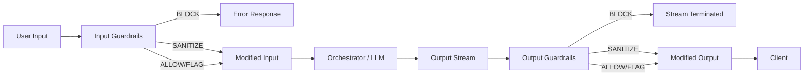
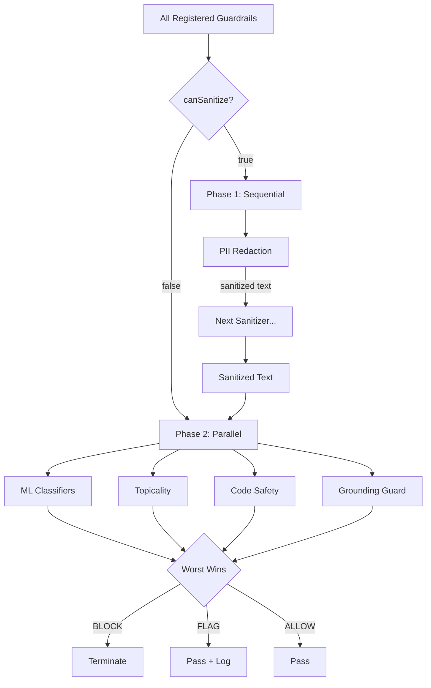
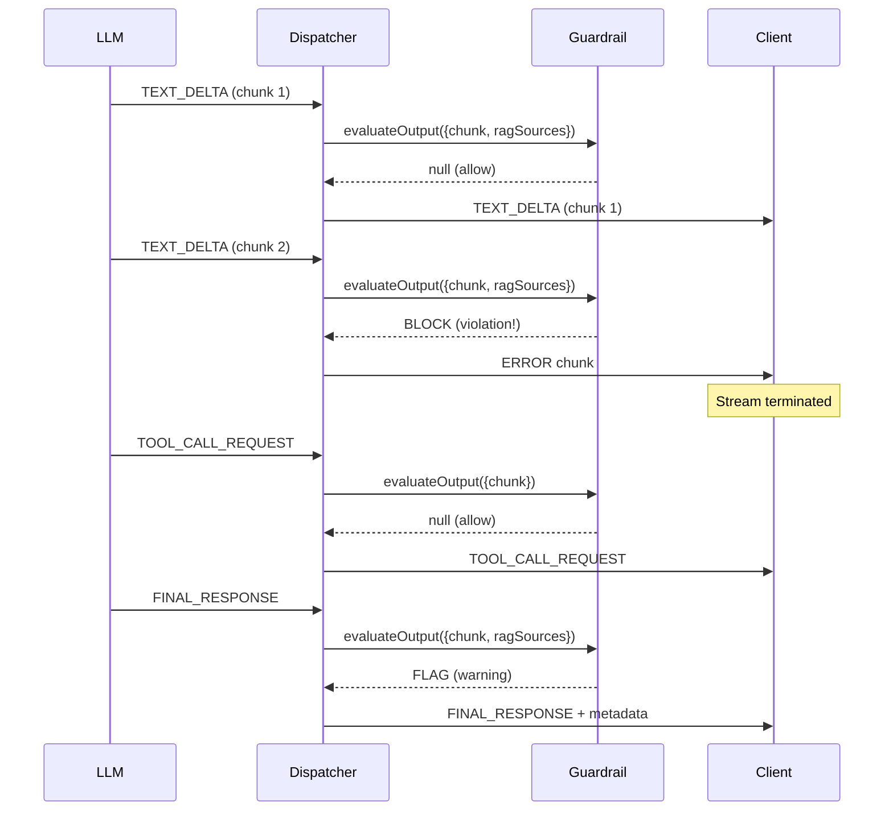

Deep dive into how the guardrail system works internally.

---

## Request Lifecycle

Every user message and LLM response passes through the guardrail dispatcher. Input guardrails run before the orchestrator sees the message; output guardrails run on each streaming chunk as it leaves the LLM.

The three possible verdicts are:

- **ALLOW** — content passes through unchanged.
- **SANITIZE** — content is modified in-place (e.g., PII replaced with `[PERSON]`) and the modified version continues downstream.
- **BLOCK** — content is rejected. For input, an error response is returned immediately. For output, the stream is terminated with an `ERROR` chunk.
- **FLAG** — content passes through unchanged, but metadata is attached for downstream logging and auditing.

---

## Two-Phase Parallel Execution

The dispatcher splits registered guardrails into two phases based on whether they can modify content (`canSanitize`). Sanitizers must run sequentially (each one's output feeds the next). Non-sanitizing guardrails run in parallel for maximum throughput.

**Worst-wins aggregation:** if any parallel guardrail returns `BLOCK`, the final verdict is `BLOCK` regardless of what the others returned. `FLAG` wins over `ALLOW`.

---

## Streaming Chunk Lifecycle

Output guardrails evaluate each chunk as it arrives from the LLM. A `BLOCK` verdict on any chunk terminates the entire stream. `SYSTEM_PROGRESS` chunks are passed through without evaluation.

---

## Chunk Types

| Type                   | Key Fields                                         | When It Appears                        |
| ---------------------- | -------------------------------------------------- | -------------------------------------- |
| `TEXT_DELTA`           | `textDelta`, `isFinal: false`                      | Each token/word as LLM generates       |
| `FINAL_RESPONSE`       | `finalResponseText`, `ragSources`, `isFinal: true` | Complete response at end of stream     |
| `TOOL_CALL_REQUEST`    | `toolCalls: [{id, name, arguments}]`               | LLM wants to call a tool               |
| `TOOL_RESULT_EMISSION` | `toolCallId`, `result`                             | Tool execution result                  |
| `SYSTEM_PROGRESS`      | `progressMessage`                                  | Status updates (ignored by guardrails) |
| `ERROR`                | `code`, `message`                                  | Error (including guardrail blocks)     |

---

## Memory Budget

All models lazy-load on first use. Nothing is loaded until a guardrail actually evaluates content.

| Pack            | Idle      | Active     | What Loads                            |
| --------------- | --------- | ---------- | ------------------------------------- |
| PII Redaction   | 0         | ~115MB     | OpenRedaction + compromise + BERT NER |
| ML Classifiers  | 0         | ~98MB      | toxic-bert + DeBERTa + PromptGuard    |
| Topicality      | 0         | ~1.7MB     | Topic centroid embeddings             |
| Code Safety     | ~10KB     | ~10KB      | Compiled regex (always loaded)        |
| Grounding Guard | 0         | ~40MB      | NLI cross-encoder                     |
| **Combined**    | **~10KB** | **~255MB** | Only if ALL packs + ALL tiers active  |

---

## Related Documentation

- [Guardrails Overview](/features/guardrails)
- [Creating Custom Guardrails](/features/creating-guardrails)
- [PII Redaction](/extensions/built-in/pii-redaction)
- [ML Classifiers](/extensions/built-in/ml-classifiers)
- [Grounding Guard](/extensions/built-in/grounding-guard)
- [Safety Primitives](/features/safety-primitives)
