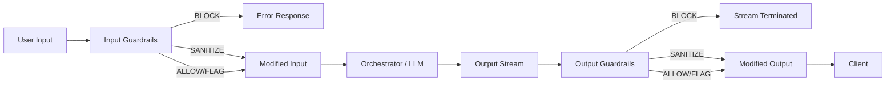
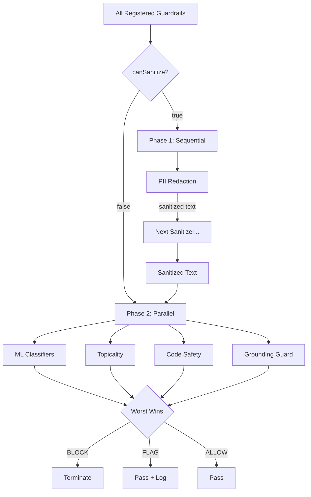
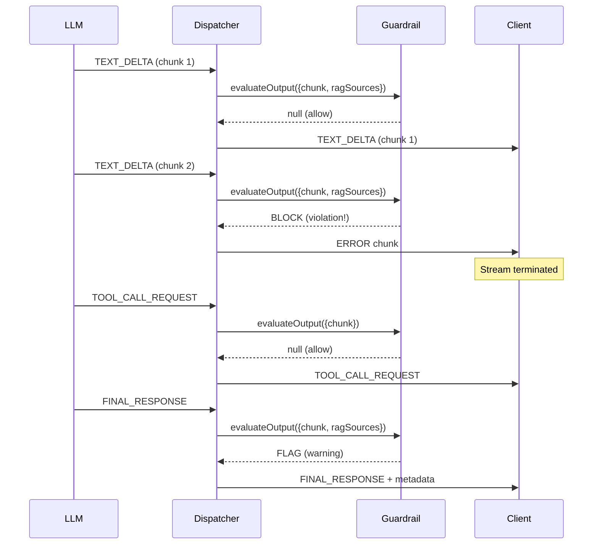

Deep dive into how the guardrail system works internally.

---

## Request Lifecycle

Every user message and LLM response passes through the guardrail dispatcher. Input guardrails run before the orchestrator sees the message; output guardrails run on each streaming chunk as it leaves the LLM.

The three possible verdicts are:

- **ALLOW** — content passes through unchanged.
- **SANITIZE** — content is modified in-place (e.g., PII replaced with `[PERSON]`) and the modified version continues downstream.
- **BLOCK** — content is rejected. For input, an error response is returned immediately. For output, the stream is terminated with an `ERROR` chunk.
- **FLAG** — content passes through unchanged, but metadata is attached for downstream logging and auditing.

---

## Two-Phase Parallel Execution

The dispatcher splits registered guardrails into two phases based on whether they can modify content (`canSanitize`). Sanitizers must run sequentially (each one's output feeds the next). Non-sanitizing guardrails run in parallel for maximum throughput.

**Worst-wins aggregation:** if any parallel guardrail returns `BLOCK`, the final verdict is `BLOCK` regardless of what the others returned. `FLAG` wins over `ALLOW`.

---

## Streaming Chunk Lifecycle

Output guardrails evaluate each chunk as it arrives from the LLM. A `BLOCK` verdict on any chunk terminates the entire stream. `SYSTEM_PROGRESS` chunks are passed through without evaluation.

---

## Chunk Types

| Type                   | Key Fields                                         | When It Appears                        |
| ---------------------- | -------------------------------------------------- | -------------------------------------- |
| `TEXT_DELTA`           | `textDelta`, `isFinal: false`                      | Each token/word as LLM generates       |
| `FINAL_RESPONSE`       | `finalResponseText`, `ragSources`, `isFinal: true` | Complete response at end of stream     |
| `TOOL_CALL_REQUEST`    | `toolCalls: [{id, name, arguments}]`               | LLM wants to call a tool               |
| `TOOL_RESULT_EMISSION` | `toolCallId`, `result`                             | Tool execution result                  |
| `SYSTEM_PROGRESS`      | `progressMessage`                                  | Status updates (ignored by guardrails) |
| `ERROR`                | `code`, `message`                                  | Error (including guardrail blocks)     |

---

## Memory Budget

All models lazy-load on first use. Nothing is loaded until a guardrail actually evaluates content.

| Pack            | Idle      | Active     | What Loads                            |
| --------------- | --------- | ---------- | ------------------------------------- |
| PII Redaction   | 0         | ~115MB     | OpenRedaction + compromise + BERT NER |
| ML Classifiers  | 0         | ~98MB      | toxic-bert + DeBERTa + PromptGuard    |
| Topicality      | 0         | ~1.7MB     | Topic centroid embeddings             |
| Code Safety     | ~10KB     | ~10KB      | Compiled regex (always loaded)        |
| Grounding Guard | 0         | ~40MB      | NLI cross-encoder                     |
| **Combined**    | **~10KB** | **~255MB** | Only if ALL packs + ALL tiers active  |

---

## Related Documentation

- [Guardrails Overview](/features/guardrails)
- [Creating Custom Guardrails](/features/creating-guardrails)
- [PII Redaction](/extensions/built-in/pii-redaction)
- [ML Classifiers](/extensions/built-in/ml-classifiers)
- [Grounding Guard](/extensions/built-in/grounding-guard)
- [Safety Primitives](/features/safety-primitives)

---

## References

### LLM safety surveys

- Wei, A., Haghtalab, N., & Steinhardt, J. (2023). *Jailbroken: How does LLM safety training fail?* NeurIPS 2023. — Foundational analysis of why prompt-injection and jailbreak attacks succeed; motivates the per-chunk evaluation model used here. [arXiv:2307.02483](https://arxiv.org/abs/2307.02483)
- Greshake, K., Abdelnabi, S., Mishra, S., Endres, C., Holz, T., & Fritz, M. (2023). *Not what you've signed up for: Compromising real-world LLM-integrated applications with indirect prompt injection.* AISec '23. — Indirect prompt injection threat model the input-side guardrails defend against. [arXiv:2302.12173](https://arxiv.org/abs/2302.12173)

### Toxicity + harm classification

- Hartvigsen, T., Gabriel, S., Palangi, H., Sap, M., Ray, D., & Kamar, E. (2022). *ToxiGen: A large-scale machine-generated dataset for adversarial and implicit hate speech detection.* ACL 2022. — Training-data foundation for the ML classifier pack's toxicity probes. [arXiv:2203.09509](https://arxiv.org/abs/2203.09509)
- Markov, T., Zhang, C., Agarwal, S., Eloundou, T., Lee, T., Adler, S., Jiang, A., & Weng, L. (2023). *A holistic approach to undesired content detection in the real world.* AAAI 2023. — OpenAI's content-classifier methodology; informs the multi-category labeling approach in the ml-classifiers pack. [arXiv:2208.03274](https://arxiv.org/abs/2208.03274)

### PII detection

- Pilán, I., Lison, P., Øvrelid, L., Papadopoulou, A., Sánchez, D., & Batet, M. (2022). *The Text Anonymization Benchmark (TAB): A dedicated corpus and evaluation framework for text anonymization.* *Computational Linguistics*, 48(4), 1053–1101. — Evaluation methodology for the pii-redaction sanitizer. [arXiv:2202.00443](https://arxiv.org/abs/2202.00443)

### Grounding / hallucination detection

- Ji, Z., Lee, N., Frieske, R., Yu, T., Su, D., Xu, Y., Ishii, E., Bang, Y. J., Madotto, A., & Fung, P. (2023). *Survey of hallucination in natural language generation.* *ACM Computing Surveys*, 55(12), 1–38. — Survey of hallucination types the grounding-guard pack targets. [arXiv:2202.03629](https://arxiv.org/abs/2202.03629)
- Min, S., Krishna, K., Lyu, X., Lewis, M., Yih, W.-t., Koh, P. W., Iyyer, M., Zettlemoyer, L., & Hajishirzi, H. (2023). *FactScore: Fine-grained atomic evaluation of factual precision in long form text generation.* EMNLP 2023. — Atomic-fact verification methodology behind grounding-guard's per-claim source-attribution check. [arXiv:2305.14251](https://arxiv.org/abs/2305.14251)

### Streaming guardrails

- Bai, Y., Jones, A., Ndousse, K., Askell, A., Chen, A., DasSarma, N., Drain, D., Fort, S., Ganguli, D., Henighan, T., Joseph, N., Kadavath, S., Kernion, J., Conerly, T., El-Showk, S., Elhage, N., Hatfield-Dodds, Z., Hernandez, D., Hume, T., ... Kaplan, J. (2022). *Constitutional AI: Harmlessness from AI feedback.* arXiv preprint. — Critique-and-revise pattern that informs the content-policy-rewriter pack's sanitize-rather-than-block design. [arXiv:2212.08073](https://arxiv.org/abs/2212.08073)

### Implementation references

- `packages/agentos/src/safety/guardrails/` — `IGuardrailService`, `ParallelGuardrailDispatcher`, `GuardrailAction`
- `packages/agentos-extensions/registry/curated/safety/` — six built-in packs: `pii-redaction`, `ml-classifiers`, `topicality`, `code-safety`, `grounding-guard`, `content-policy-rewriter`
- `packages/agentos/src/safety/runtime/` — `CircuitBreaker`, `CostGuard`, `StuckDetector` (the runtime safety supervisor primitives that compose with the guardrail layer)
