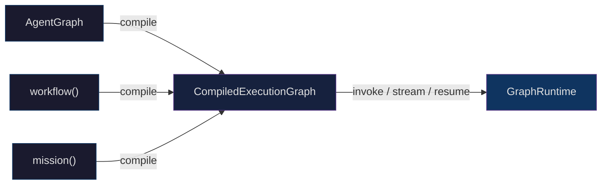
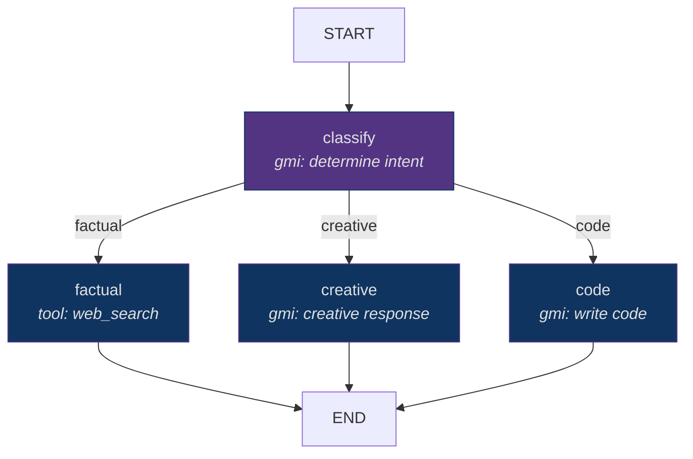
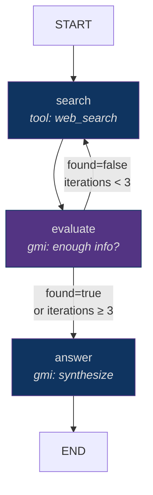
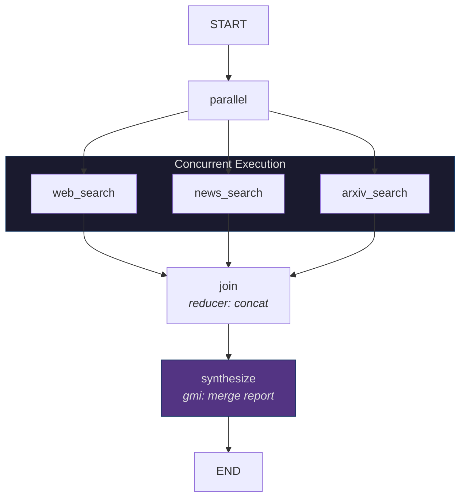
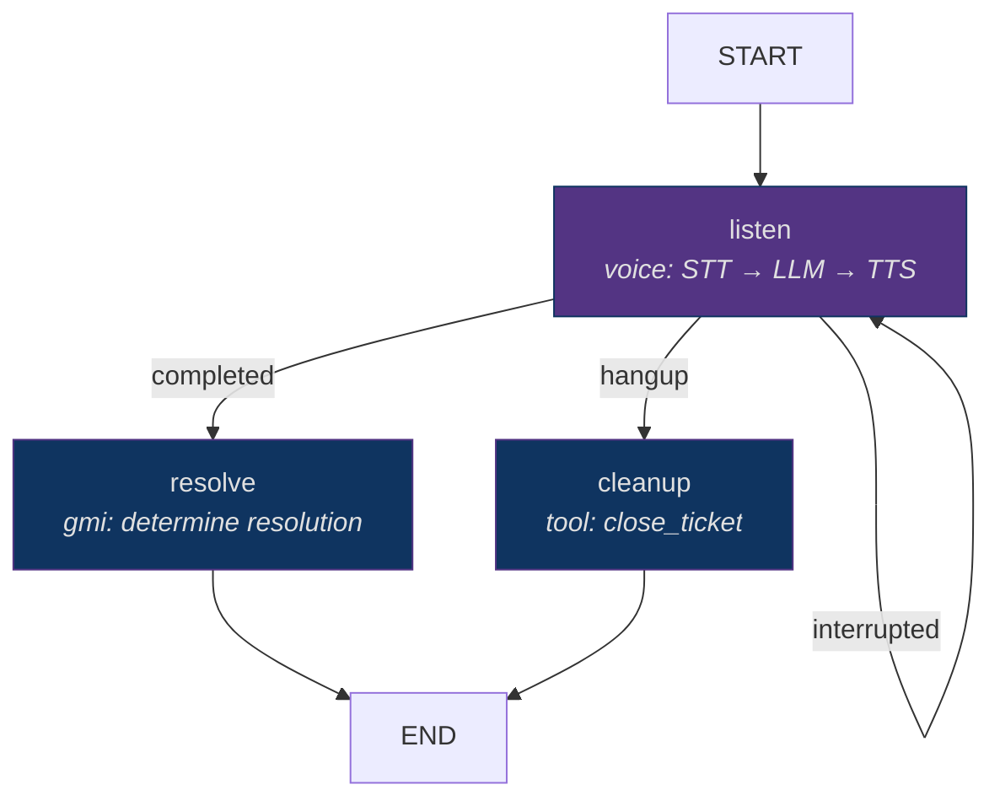

Hands-on walkthrough of AgentOS orchestration — from single-node graphs to multi-agent missions with voice, memory, and checkpointing.

All three APIs (`AgentGraph`, `workflow()`, `mission()`) compile to the same `CompiledExecutionGraph` IR and run on the same `GraphRuntime`. You can compose them freely — a mission can embed a workflow as a subgraph step; a graph can invoke a compiled workflow as a node.



---

## AgentGraph — Full Graph Builder

Use `AgentGraph` when you need cycles, complex conditional routing, subgraph composition, or fine-grained control over graph topology.

### Minimal Example

A two-node graph: search the web, then summarize results.

```typescript
import { AgentGraph, START, END, gmiNode, toolNode } from '@framers/agentos/orchestration';
import { z } from 'zod';

const graph = new AgentGraph(
  {
    input:     z.object({ topic: z.string() }),
    scratch:   z.object({ sources: z.array(z.string()).default([]) }),
    artifacts: z.object({ summary: z.string().default('') }),
  },
  { reducers: { 'scratch.sources': 'concat' } },
)
  .addNode('search',    toolNode('web_search'))
  .addNode('summarize', gmiNode({ instructions: 'Summarize the search results in 3 sentences.' }))
  .addEdge(START, 'search')
  .addEdge('search', 'summarize')
  .addEdge('summarize', END)
  .compile();

const result = await graph.invoke({ topic: 'quantum computing' });
console.log(result.artifacts.summary);
```

**State schema:** The graph declares `input` (immutable after start), `scratch` (mutable working state), and `artifacts` (final output). Reducers control how concurrent node writes merge — `concat` appends arrays, `merge` deep-merges objects, `replace` overwrites.

### Conditional Routing

Route execution based on intermediate results. The classifier determines intent, then a routing function sends the query to the appropriate handler.

```typescript
import { AgentGraph, START, END, gmiNode, toolNode } from '@framers/agentos/orchestration';
import { z } from 'zod';

const graph = new AgentGraph({
  input:     z.object({ query: z.string() }),
  scratch:   z.object({ intent: z.string().default('') }),
  artifacts: z.object({ answer: z.string().default('') }),
})
  .addNode('classify', gmiNode({
    instructions: 'Classify the query as "factual", "creative", or "code". Reply with only the label.',
  }))
  .addNode('factual',  toolNode('web_search'))
  .addNode('creative', gmiNode({ instructions: 'Write a creative, engaging response.' }))
  .addNode('code',     gmiNode({ instructions: 'Write clean, documented code with an explanation.' }))
  .addEdge(START, 'classify')
  .addConditionalEdge('classify', (state) => state.scratch.intent, {
    factual:  'factual',
    creative: 'creative',
    code:     'code',
  })
  .addEdge('factual',  END)
  .addEdge('creative', END)
  .addEdge('code',     END)
  .compile();
```



### Agent Loop with Cycle

A research loop that searches, evaluates whether it has enough information, and cycles back if not. The `maxIterations` guard prevents runaway loops.

```typescript
const graph = new AgentGraph({
  input:     z.object({ question: z.string() }),
  scratch:   z.object({ iterations: z.number().default(0), found: z.boolean().default(false) }),
  artifacts: z.object({ answer: z.string().default('') }),
})
  .addNode('search',   toolNode('web_search'))
  .addNode('evaluate', gmiNode({
    instructions: 'Evaluate whether the search results contain enough information to answer the question. Set found=true if yes.',
  }))
  .addNode('answer',   gmiNode({
    instructions: 'Synthesize the research into a comprehensive answer with citations.',
  }))
  .addEdge(START, 'search')
  .addEdge('search', 'evaluate')
  .addConditionalEdge('evaluate', (state) => {
    if (state.scratch.found || state.scratch.iterations >= 3) return 'answer';
    return 'search'; // cycle back for more research
  })
  .addEdge('answer', END)
  .compile();
```



### Subgraph Composition

Embed a compiled graph as a node inside another graph. The inner graph runs to completion and its artifacts merge into the outer state.

```typescript
const researchGraph = new AgentGraph({ /* ... research loop above ... */ }).compile();

const productionGraph = new AgentGraph({
  input:     z.object({ topic: z.string() }),
  scratch:   z.object({}),
  artifacts: z.object({ post: z.string().default(''), image: z.string().default('') }),
})
  .addNode('research', subgraphNode(researchGraph))
  .addNode('write',    gmiNode({ instructions: 'Write a blog post from the research.' }))
  .addNode('illustrate', toolNode('image_generate'))
  .addEdge(START, 'research')
  .addEdge('research', 'write')
  .addEdge('write', 'illustrate')
  .addEdge('illustrate', END)
  .compile();
```

### Node Configuration

Every node builder accepts an optional `policies` object controlling memory, guardrails, checkpointing, and execution mode:

```typescript
gmiNode(
  {
    instructions: 'Summarize the document.',
    executionMode: 'react_bounded',
    maxInternalIterations: 5,
    maxTokens: 2048,
    temperature: 0.3,
  },
  {
    memory: {
      consistency: 'snapshot',
      read:  { types: ['semantic', 'episodic'], semanticQuery: '{input.topic}', maxTraces: 10 },
      write: { autoEncode: true, type: 'episodic', scope: 'session' },
    },
    guardrails: { output: ['content-safety', 'pii-redaction'], onViolation: 'sanitize' },
    checkpoint: 'after',
  }
)
```

**Execution modes for `gmiNode`:**

| Mode | Behavior |
|------|----------|
| `single_turn` | One LLM call, no internal tool loop. Default in `workflow()` for cost-bounded execution. |
| `react_bounded` | ReAct loop up to `maxInternalIterations`. Default in `AgentGraph`. Agent can call tools, observe results, and reason across multiple turns. |
| `planner_controlled` | PlanningEngine drives the loop. Default in `mission()`. The planner decides when to stop based on goal satisfaction. |

---

## WorkflowBuilder — Sequential Pipelines

Use `workflow()` for deterministic pipelines where steps are known upfront. Cycles are rejected at compile time — if you need them, use `AgentGraph`.

### Quick Start

```typescript
import { workflow } from '@framers/agentos/orchestration';
import { z } from 'zod';

const pipeline = workflow('content-pipeline')
  .input(z.object({ url: z.string() }))
  .returns(z.object({ summary: z.string(), tags: z.array(z.string()) }))
  .step('fetch',     { tool: 'web_fetch', effectClass: 'external' })
  .step('summarize', { gmi: { instructions: 'Summarize in 3 sentences.' } })
  .step('tag',       { gmi: { instructions: 'Extract 5 topic tags as a JSON array.' } })
  .compile();

const result = await pipeline.invoke({ url: 'https://example.com/article' });
console.log(result.summary);
console.log(result.tags);
```

### Branching

Route to different processing paths based on classification:

```typescript
workflow('triage')
  .input(z.object({ ticket: z.string() }))
  .returns(z.object({ response: z.string() }))
  .step('classify', { gmi: { instructions: 'Classify as "billing", "technical", or "general".' } })
  .branch(
    (state) => state.scratch.classification,
    {
      billing:   (wf) => wf.step('billing-agent',   { gmi: { instructions: 'Handle billing issue. Check account status, explain charges, process refunds.' } }),
      technical: (wf) => wf.step('technical-agent',  { gmi: { instructions: 'Diagnose and resolve the technical issue. Check logs, suggest fixes.' } }),
      general:   (wf) => wf.step('general-agent',    { gmi: { instructions: 'Handle general inquiry with helpful, clear responses.' } }),
    }
  )
  .compile();
```

### Parallel Steps

Execute independent steps concurrently with configurable reducers to merge results:

```typescript
workflow('multi-source-research')
  .input(z.object({ query: z.string() }))
  .returns(z.object({ report: z.string() }))
  .parallel(
    { reducers: { 'scratch.results': 'concat' } },
    (wf) => wf.step('web',    { tool: 'web_search' }),
    (wf) => wf.step('news',   { tool: 'news_search' }),
    (wf) => wf.step('papers', { tool: 'arxiv_search' }),
  )
  .step('synthesize', {
    gmi: { instructions: 'Synthesize all sources into a coherent research report with citations.' },
    memory: { read: { types: ['semantic'], maxTraces: 5 } },
  })
  .compile();
```



### Human-in-the-Loop Step

Suspend execution and wait for human approval before proceeding:

```typescript
workflow('content-approval')
  .input(z.object({ brief: z.string() }))
  .returns(z.object({ publishedPost: z.string() }))
  .step('draft',   { gmi: { instructions: 'Write a blog post draft based on the brief.' } })
  .step('approve', { human: { prompt: 'Review the draft. Approve or request changes.' } })
  .step('publish', { tool: 'cms_publish', effectClass: 'external' })
  .compile();
```

The `human` step emits a `human_input_required` event on the stream and pauses execution. The host application presents the prompt to the user, collects their response, and calls `graph.resumeWithHumanInput(runId, response)` to continue.

### Memory-Aware Steps

Steps can read from and write to cognitive memory:

```typescript
workflow('personalized-response')
  .input(z.object({ userId: z.string(), question: z.string() }))
  .returns(z.object({ answer: z.string() }))
  .step('recall', {
    gmi: { instructions: 'Answer the question using past interaction context.' },
    memory: {
      read: { types: ['episodic', 'semantic'], semanticQuery: '{input.question}', maxTraces: 10 },
      write: { autoEncode: true, type: 'episodic', scope: 'user' },
    },
  })
  .compile();
```

---

## MissionBuilder — Goal-Oriented Execution

Use `mission()` when you want to describe what the agent should achieve rather than how to achieve it. The mission compiler uses Tree of Thought planning to decompose the goal into an execution graph.

### Quick Start

```typescript
import { mission } from '@framers/agentos/orchestration';
import { z } from 'zod';

const researchMission = mission('research')
  .input(z.object({ topic: z.string() }))
  .goal('Research {{topic}} and produce a concise 3-paragraph summary with citations.')
  .returns(z.object({ summary: z.string(), citations: z.array(z.string()) }))
  .planner({ strategy: 'tree_of_thought', branches: 3, maxSteps: 8 })
  .autonomy('guardrailed')
  .providerStrategy('balanced')
  .costCap(5.00)
  .compile();

const result = await researchMission.invoke({ topic: 'quantum error correction' });
console.log(result.summary);
```

### Planner Strategies

The planner decomposes the goal into a graph structure. Three strategies are available:

| Strategy | Behavior |
|----------|----------|
| `linear` | Sequential decomposition — each step feeds the next. Fastest planning, simplest graph. |
| `tree_of_thought` | Generates N candidate decompositions, evaluates each on feasibility/cost/latency/robustness, selects the best or synthesizes a hybrid. Based on Yao et al. 2023. |
| `react` | ReAct-style observe-think-act loop — the planner observes intermediate results and decides the next step dynamically. |

```typescript
// Tree of Thought — explores 3 candidate plans, picks the best
.planner({ strategy: 'tree_of_thought', branches: 3, maxSteps: 12 })

// Linear — fast, deterministic decomposition
.planner({ strategy: 'linear', maxSteps: 8 })

// ReAct — adaptive, observes results between steps
.planner({ strategy: 'react', maxIterations: 5 })
```

### Autonomy Modes

Control how much the mission can self-expand during execution:

| Mode | Behavior |
|------|----------|
| `autonomous` | All expansion requests auto-approve. Only stops at cost/agent caps. |
| `guided` | Every expansion proposal pauses for human approval. |
| `guardrailed` | Auto-approves below thresholds (cost, agent count, tool forges). Above thresholds, pauses for approval. |

```typescript
mission('deep-research')
  .goal('...')
  .autonomy('guardrailed')
  .costCap(10.00)
  .maxAgents(8)
  .compile();
```

### Provider Strategy

Assign LLM providers per node based on task complexity:

```typescript
// Balanced — expensive models for complex reasoning, cheap for routing
.providerStrategy('balanced')

// Explicit — assign providers per role
.providerStrategy('explicit', {
  researcher: { provider: 'anthropic', model: 'claude-sonnet-4-6' },
  writer: { provider: 'openai', model: 'gpt-4o' },
  _default: { provider: 'openai', model: 'gpt-4o-mini' },
})

// Cheapest — minimize cost across all nodes
.providerStrategy('cheapest')
```

### Anchor Nodes

Inject fixed logic at specific positions in the planner's output — anchors persist regardless of what the planner generates:

```typescript
mission('audited-research')
  .input(z.object({ topic: z.string() }))
  .goal('Research {{topic}} thoroughly.')
  .returns(z.object({ report: z.string() }))
  .anchor({ position: 'before_first', node: humanNode({ prompt: 'Approve the research topic?' }) })
  .anchor({ position: 'after_last',   node: toolNode('report_publisher') })
  .compile();
```

---

## Voice Nodes in Graphs

Embed full voice pipeline turns directly inside any graph — STT, LLM reasoning, and TTS as a single node:

```typescript
import { AgentGraph, START, END, voiceNode, gmiNode } from '@framers/agentos/orchestration';

const callGraph = new AgentGraph({
  input:     z.object({ callerId: z.string() }),
  scratch:   z.object({ transcript: z.string().default('') }),
  artifacts: z.object({ resolution: z.string().default('') }),
})
  .addNode(
    'listen',
    voiceNode('listen', {
      mode: 'conversation',
      maxTurns: 10,
      sttProvider: 'deepgram',
      ttsProvider: 'elevenlabs',
      bargeIn: true,
    })
      .on('completed',   'resolve')
      .on('interrupted', 'listen')
      .on('hangup',      'cleanup')
      .build()
  )
  .addNode('resolve', gmiNode({ instructions: 'Determine the resolution based on the conversation transcript.' }))
  .addNode('cleanup', toolNode('close_ticket'))
  .addEdge(START, 'listen')
  .addEdge('resolve', END)
  .addEdge('cleanup', END)
  .compile();
```



**Voice node options:**

| Option | Type | Default | Description |
|--------|------|---------|-------------|
| `mode` | `'single_turn' \| 'conversation'` | `'single_turn'` | One exchange vs multi-turn dialogue |
| `maxTurns` | `number` | `5` | Hard cap on dialogue turns |
| `sttProvider` | `string` | global config | Override STT provider for this node |
| `ttsProvider` | `string` | global config | Override TTS provider for this node |
| `bargeIn` | `boolean` | `false` | Allow user to interrupt TTS playback |
| `vadSensitivity` | `number` | `0.5` | Voice activity detection threshold (0-1) |

---

## Checkpointing and Resume

Any compiled graph supports durable checkpoints. Swap in a persistent store for production — the interface is the same.

```typescript
import { SqliteCheckpointStore } from '@framers/agentos/orchestration/checkpoint';

const store = new SqliteCheckpointStore('./runs.db');

const graph = new AgentGraph({ /* ... */ })
  .compile({ checkpointStore: store, checkpointPolicy: 'every_node' });

// First run
const runId = 'run-abc-123';
try {
  await graph.invoke({ topic: 'fusion energy' }, { runId });
} catch (err) {
  console.error('Run failed mid-way, will resume later.');
}

// Resume from the last completed node
const resumed = await graph.resume(runId);
console.log(resumed.artifacts);
```

**Checkpoint policies:**

| Policy | Behavior |
|--------|----------|
| `'none'` | No checkpoints. Default. |
| `'every_node'` | Checkpoint after each node completes. Full recoverability, higher storage cost. |
| `'explicit'` | Checkpoint only at nodes with `checkpoint: 'after'` in their policy. Selective. |

### Time-Travel and Forking

Fork from a historical checkpoint to explore alternative execution paths with modified state:

```typescript
// Fork from checkpoint, patch the state, run from that point
const forkedRunId = await store.fork(checkpointId, {
  scratch: { iterations: 0, confidence: 0.9 },
});
const altResult = await graph.resume(forkedRunId);

// List all checkpoints for a run
const checkpoints = await store.list(runId);
// → [{ id, nodeId, timestamp, stateSnapshot }, ...]
```

---

## GraphEvent Streaming

All graph executions emit a unified event stream. Subscribe via `for await...of` for real-time UI updates, logging, and debugging:

```typescript
const stream = graph.stream({ topic: 'AI safety' });

for await (const event of stream) {
  switch (event.type) {
    case 'node_started':
      console.log(`→ ${event.nodeId} started`);
      break;
    case 'node_completed':
      console.log(`✓ ${event.nodeId} completed in ${event.durationMs}ms`);
      break;
    case 'text_delta':
      process.stdout.write(event.delta);
      break;
    case 'tool_call':
      console.log(`  tool: ${event.toolName}(${JSON.stringify(event.args)})`);
      break;
    case 'tool_result':
      console.log(`  result: ${JSON.stringify(event.result).slice(0, 100)}`);
      break;
    case 'human_input_required':
      console.log(`  PAUSED: ${event.prompt}`);
      break;
    case 'checkpoint_saved':
      console.log(`  checkpoint: ${event.checkpointId}`);
      break;
    case 'guardrail_violation':
      console.log(`  violation: ${event.guardrailId} — ${event.action}`);
      break;
    case 'graph_completed':
      console.log('\nDone.', event.artifacts);
      break;
    case 'graph_error':
      console.error('Failed:', event.error);
      break;
  }
}
```

**Full event type reference:**

| Event | Payload | When |
|-------|---------|------|
| `node_started` | `nodeId`, `nodeType` | Node execution begins |
| `node_completed` | `nodeId`, `durationMs`, `output` | Node execution completes |
| `text_delta` | `delta`, `nodeId` | Streaming LLM text chunk |
| `tool_call` | `toolName`, `args`, `nodeId` | Tool invocation |
| `tool_result` | `toolName`, `result`, `nodeId` | Tool execution result |
| `human_input_required` | `prompt`, `nodeId`, `runId` | Human-in-the-loop pause |
| `checkpoint_saved` | `checkpointId`, `runId`, `nodeId` | Checkpoint persisted |
| `state_update` | `path`, `value`, `reducer` | Graph state mutation |
| `guardrail_check` | `guardrailId`, `nodeId`, `passed` | Guardrail evaluation |
| `guardrail_violation` | `guardrailId`, `action`, `details` | Guardrail triggered |
| `memory_read` | `types`, `traceCount`, `nodeId` | Memory traces retrieved |
| `memory_write` | `type`, `scope`, `nodeId` | Memory trace encoded |
| `discovery_match` | `query`, `matchedCapability`, `confidence` | Capability discovery resolved |
| `graph_completed` | `artifacts`, `durationMs`, `tokenCount` | Graph execution finished |
| `graph_error` | `error`, `nodeId?` | Graph execution failed |

---

## YAML Workflow Authoring

For non-TypeScript environments or declarative pipeline definitions, workflows can be authored as YAML:

```yaml
# workflows/summarize.yaml
name: summarize-article
input:
  schema:
    type: object
    properties:
      url: { type: string }
    required: [url]
returns:
  schema:
    type: object
    properties:
      summary: { type: string }
      tags: { type: array, items: { type: string } }

steps:
  - id: fetch
    tool: web_fetch
    effectClass: external

  - id: summarize
    gmi:
      instructions: Summarize the article in 3 sentences.
    memory:
      read:
        types: [semantic]
        maxTraces: 5

  - id: tag
    gmi:
      instructions: Extract 5 topic tags as a JSON array.

  - id: review
    human:
      prompt: Review the summary and tags. Approve or request changes.
```

Load and execute:

```typescript
import { loadWorkflowFromYaml } from '@framers/agentos/orchestration';
import { readFileSync } from 'fs';

const yaml = readFileSync('./workflows/summarize.yaml', 'utf8');
const wf = await loadWorkflowFromYaml(yaml);
const result = await wf.invoke({ url: 'https://example.com/article' });
```

YAML workflows support the full feature set — branching, parallelism, memory, guardrails, and human-in-the-loop steps.

---

## Choosing the Right API

| If you need... | Use | Why |
|----------------|-----|-----|
| Known steps in a fixed order | `workflow()` | Compile-time DAG validation, deterministic cost |
| Conditional branching or cycles | `AgentGraph` | Full graph model, arbitrary routing |
| The agent to figure out its own steps | `mission()` | Tree of Thought planning, self-expansion |
| Multiple specialized agents coordinating | `agency()` | Strategy-based multi-agent (debate, pipeline, supervisor) |
| One-off LLM call | `generateText()` / `streamText()` | No graph overhead, direct provider call |
| Voice conversation flow | `AgentGraph` + `voiceNode` | Full IVR support with barge-in and hangup handling |
| Cost-bounded pipeline | `workflow()` | Single-turn GMI, no runaway loops |
| Prototype → production | `mission()` → `AgentGraph` | Start with a goal, extract the generated IR, hand-tune |

---

## Related Guides

- [AgentGraph](/features/agent-graph) — Complete API reference, all node/edge types, subgraph patterns
- [workflow() DSL](/features/workflow-dsl) — Sequential pipelines, branching, parallel execution
- [mission() API](/features/mission-api) — Intent-driven orchestration, planners, anchors, autonomy
- [Checkpointing](/features/checkpointing) — `ICheckpointStore`, resume semantics, time-travel
- [Unified Orchestration](/features/unified-orchestration) — Shared IR, five differentiators, architecture
- [Human-in-the-Loop](/features/human-in-the-loop) — HITL patterns, approval workflows, step-up auth
- [Voice Pipeline](/features/voice-pipeline) — STT/TTS providers, VAD, telephony integration
