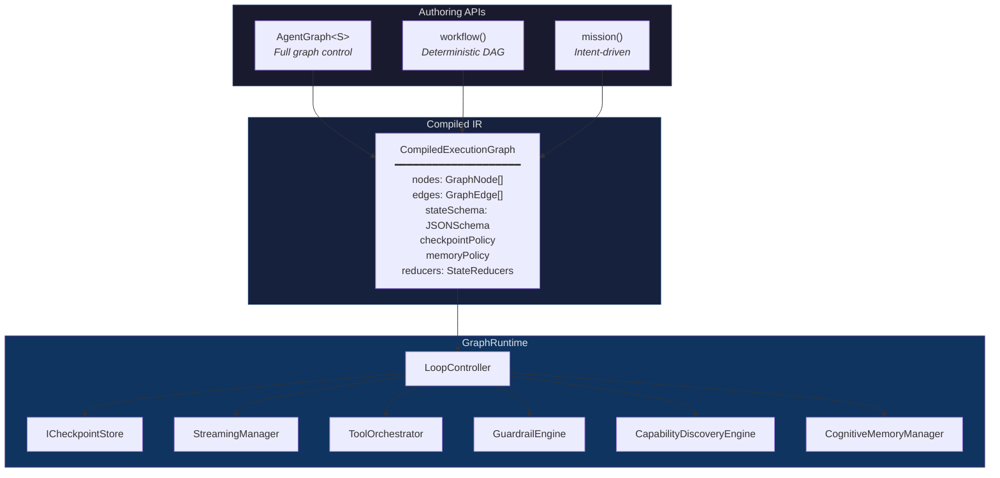
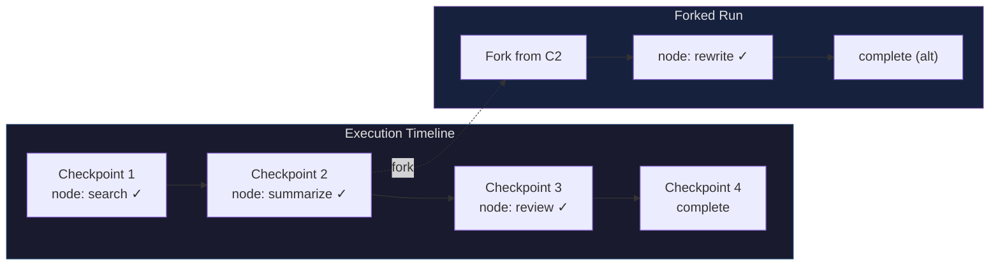

Three authoring APIs. One compiled intermediate representation. A single runtime that executes every graph with streaming, checkpointing, guardrails, memory, and capability discovery built in.

## Architecture

Every orchestration surface in AgentOS — `AgentGraph`, `workflow()`, and `mission()` — compiles to the same `CompiledExecutionGraph` IR. The `GraphRuntime` executes that IR identically regardless of which API produced it.



### Node Types

The IR supports eight node types, each with a specialized executor:

| Node Type | Purpose | Example |
|---|---|---|
| `gmi` | LLM reasoning with tool calling | Agent that researches a topic |
| `tool` | Single tool invocation | `web_search`, `send_email` |
| `extension` | Extension pack execution | Channel adapter, media generator |
| `human` | Human-in-the-loop gate | Approval step before deployment |
| `guardrail` | Safety check node | PII scan, content policy |
| `router` | Conditional branching | Route by intent classification |
| `subgraph` | Nested graph execution | Agency within a mission |
| `voice` | Voice pipeline node | STT → LLM → TTS |

### Edge Types

Four edge types control how execution flows between nodes:

| Edge Type | Behavior |
|---|---|
| `static` | Unconditional transition: A always flows to B |
| `conditional` | Arbitrary routing function evaluates state and returns next node |
| `discovery` | Semantic search over the capability registry determines the next node |
| `personality` | HEXACO trait thresholds determine branching |

## Three APIs

### AgentGraph — Full Graph Control

Explicit nodes, edges, cycles, and subgraphs. `AgentGraph` exposes the complete graph model: conditional routing with arbitrary logic, agent loops that cycle back on themselves, memory-aware state machines, and personality-driven branching.

```typescript
import { AgentGraph, START, END, gmiNode, toolNode } from '@framers/agentos/orchestration';

const graph = new AgentGraph({
  input: z.object({ topic: z.string() }),
  output: z.object({ summary: z.string() }),
})
  .addNode('search', toolNode('web_search'))
  .addNode('summarize', gmiNode({ instructions: 'Summarize the results.' }))
  .addNode('review', gmiNode({ instructions: 'Check for factual accuracy.' }))
  .addEdge(START, 'search')
  .addEdge('search', 'summarize')
  .addConditionalEdge('summarize', (state) =>
    state.scratch.confidence < 0.8 ? 'review' : END
  )
  .addEdge('review', 'summarize') // cycle back for revision
  .compile();

const result = await graph.invoke({ topic: 'quantum computing' });
```

**Use AgentGraph when:** You need cycles, subgraph composition, discovery-based routing, or fine-grained control over every node and edge.

### workflow() — Deterministic DAG

Fluent DSL for sequential pipelines with branching and parallelism. Every workflow is a strict DAG — cycles are caught at compile time. All GMI steps default to `single_turn` to keep execution deterministic and cost-bounded.

```typescript
import { workflow } from '@framers/agentos/orchestration';

const pipeline = workflow('content-pipeline')
  .input(z.object({ topic: z.string() }))
  .returns(z.object({ post: z.string(), image: z.string() }))
  .step('research', { tool: 'web_search' })
  .step('write', {
    gmi: { instructions: 'Write a blog post from the research.' },
    memory: { read: { types: ['episodic'], maxTraces: 5 } },
  })
  .parallel([
    { name: 'generate-image', tool: 'image_generate' },
    { name: 'proofread', gmi: { instructions: 'Proofread for errors.' } },
  ])
  .step('publish', { tool: 'send_email', effectClass: 'external' })
  .compile();
```

**Use workflow() when:** Steps are known upfront, execution must be deterministic and cost-bounded, and you want compile-time cycle rejection.

### mission() — Intent-Driven Orchestration

Describe the goal. The mission compiler decomposes it into a graph using Tree of Thought planning, assigns providers per node, and executes with self-expansion capabilities.

```typescript
import { mission } from '@framers/agentos/orchestration';

const m = mission('competitive-analysis')
  .input(z.object({ topic: z.string() }))
  .goal('Research {{topic}}, compare the top 5 players, and produce a structured report')
  .returns(z.object({ report: z.string() }))
  .planner({ strategy: 'tree_of_thought', branches: 3, maxSteps: 12 })
  .autonomy('guardrailed')
  .providerStrategy('balanced')
  .costCap(5.00)
  .compile();

for await (const event of m.stream()) {
  if (event.type === 'text_delta') process.stdout.write(event.content);
}
```

**Use mission() when:** You want goal-first authoring where the planner generates the graph structure, agents self-expand to meet the goal, and you want one command to orchestrate an entire multi-agent operation.

### Decision Guide

| Situation | API | Why |
|---|---|---|
| Exact steps known upfront | `workflow()` | Compile-time DAG validation, deterministic cost |
| Complex branching with cycles | `AgentGraph` | Full graph model, arbitrary routing functions |
| Goal-first, agents decide the steps | `mission()` | Tree of Thought planning, self-expansion |
| Agent loops that retry/refine | `AgentGraph` | Cycles are first-class |
| Cost-bounded pipeline | `workflow()` | Single-turn GMI steps, no runaway loops |
| Multi-agent coordination | `mission()` | Provider mixing, autonomy modes, dynamic agency spawning |
| Prototype → production | `mission()` → `AgentGraph` | Start with a goal, extract the generated IR, hand-tune the graph |

## Differentiators

Five capabilities that are architectural to AgentOS, not bolted on:

### Memory-Aware State

Cognitive memory — episodic, semantic, procedural, prospective — is a first-class graph citizen. Nodes declare a `MemoryPolicy` specifying which memory types to read before execution and which to write after. Memory retrieval uses the full RAG pipeline (HyDE, RAPTOR, GraphRAG, BM25) with HEXACO-modulated Ebbinghaus decay curves, meaning agents with high conscientiousness retain procedural memories longer while agents with high openness surface more distant associative connections.

```typescript
gmiNode(
  { instructions: 'Answer based on past interactions.' },
  {
    memory: {
      consistency: 'snapshot',
      read: { types: ['episodic', 'semantic'], semanticQuery: '{input.topic}', maxTraces: 10 },
      write: { autoEncode: true, type: 'episodic', scope: 'session' },
    },
  }
)
```

Memory reads happen before the LLM call. Memory writes happen after. The `snapshot` consistency mode reads all requested traces atomically so the agent sees a consistent view.

### Capability Discovery Routing

Edges can route via semantic search over the capability registry rather than hardcoded logic. The `CapabilityDiscoveryEngine` uses the 3-tier system (Tier 0 category summaries → Tier 1 semantic matches → Tier 2 full schemas) to find the best tool, skill, or extension for the task at hand.

```typescript
graph.addDiscoveryEdge('router', {
  query: 'find a tool that can search the web',
  kind: 'tool',
  fallbackTarget: 'default-search',
});
```

Discovery edges resolve at runtime — the graph adapts to whatever capabilities are registered. Add a new extension, and discovery edges that match it will route to it automatically.

### Personality-Driven Routing

Agent HEXACO personality traits influence routing decisions without conditional logic in your code. A conscientious agent routes drafts through human review. An open agent takes the creative path. An agreeable agent defers to the supervisor.

```typescript
graph.addPersonalityEdge('draft', {
  trait: 'conscientiousness',
  threshold: 0.7,
  above: 'human-review',
  below: END,
});
```

Personality edges read from the agent's `HEXACOProfile` at runtime. The same graph compiled with different personality configurations produces different execution paths — same structure, different behavior.

### Inter-Step Guardrails

Guardrails run between every step, not just on final output. Each node can declare input guardrails (validate what it receives), output guardrails (sanitize what it produces), and edge guardrails (check transitions). The 5-tier pipeline (regex → keyword → ML classifier → dual-LLM auditor → signed output verifier) runs on sentence boundaries with streaming, so guardrails don't buffer entire responses.

```typescript
toolNode('web_search', {}, {
  guardrails: {
    output: ['pii-redaction', 'content-safety'],
    onViolation: 'sanitize', // or 'block' or 'warn'
  },
})
```

Violations emit `guardrail:violation` events on the stream, so the host application can log, alert, or escalate in real time.

### Checkpointing and Time-Travel

Every graph run can be checkpointed to persistent storage, resumed after failure, and forked to explore alternative execution paths. The `ICheckpointStore` interface abstracts the storage backend — `InMemoryCheckpointStore` for tests, `SqliteCheckpointStore` for production, with Postgres support via the same interface.

```typescript
const graph = new AgentGraph(...)
  .compile({ checkpointStore: new SqliteCheckpointStore('./runs.db') });

// Resume from failure — picks up at the last completed node
const result = await graph.resume(checkpointId);

// Fork from a past checkpoint with modified state
const forkedRunId = await store.fork(checkpointId, {
  scratch: { confidence: 0.9 },
});
const forkedResult = await graph.invoke(forkedRunId);
```

Checkpoints capture the full graph state: node results, scratch state, memory traces, and pending transitions. Forking creates a new run ID with a copy of the checkpoint state, so you can replay from any point with different inputs.



## Event Streaming

All graph executions emit a unified `GraphEvent` stream consumable via `for await...of`:

```typescript
for await (const event of graph.stream({ topic: 'AI safety' })) {
  switch (event.type) {
    case 'node_start':      // node execution begins
    case 'node_end':        // node execution completes
    case 'text_delta':      // streaming LLM text chunk
    case 'tool_call':       // tool invocation with args
    case 'tool_result':     // tool execution result
    case 'guardrail:check': // guardrail evaluation
    case 'checkpoint':      // checkpoint saved
    case 'state_update':    // graph state mutation
    // ... 21+ event types
  }
}
```

Events carry the full context — node ID, timestamp, duration, token counts — needed to build dashboards, audit logs, and real-time UIs on top of the orchestration layer.

## Detailed Guides

- **[AgentGraph](/features/agent-graph)** — Full API reference, node builders, edge types, subgraph composition, cycles
- **[workflow() DSL](/features/workflow-dsl)** — Sequential pipelines, branching, parallel execution, compile-time validation
- **[mission() API](/features/mission-api)** — Intent-driven orchestration, Tree of Thought planning, autonomy modes, provider strategies
- **[Checkpointing](/features/checkpointing)** — `ICheckpointStore`, resume semantics, time-travel, fork/merge
- **[Orchestration Guide](./orchestration-guide.md)** — Hands-on walkthrough with 15+ runnable examples
