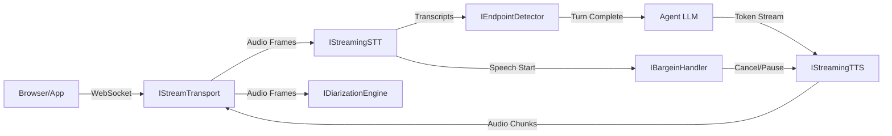
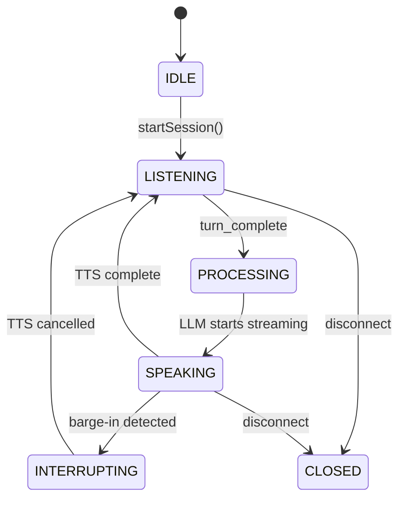

A voice agent that talks back is straightforward to build if you don't care that it interrupts the user, never knows when they've stopped speaking, can't recover when the network blips for half a second, and will keep happily generating into a phone that the user already hung up. A voice agent you actually want to use has to handle all of those, which is why the voice path through AgentOS is its own subsystem rather than a thin wrapper over text generation. Turn-taking is a first-class concern. Barge-in is a first-class concern. The fact that audio chunks arrive on a different schedule than text tokens is a first-class concern. The state machine has six states because conversation has at least six distinct things going on at any moment.

This page is the architectural map. The configuration surface is at the bottom; the conceptual model and the wiring sit on top.

## Architecture

The pipeline is six interfaces wired together by the [`VoicePipelineOrchestrator`](https://github.com/framersai/agentos/blob/master/src/voice-pipeline/VoicePipelineOrchestrator.ts):



## State Machine

The orchestrator manages a conversational loop through these states:



## Quick Start

### Programmatic

The `agent({ voice })` field is typed against [`VoiceConfig`](https://github.com/framersai/agentos/blob/master/src/api/types.ts#L289). The factory is **synchronous** — it does not return a Promise.

```typescript
import { agent } from '@framers/agentos';

// Basic voice mode (Whisper STT + OpenAI TTS)
const basic = agent({
  voice: { enabled: true },
});

// Deepgram STT + ElevenLabs TTS with diarization
const advanced = agent({
  provider: 'openai',                           // LLM provider
  voice: {
    enabled: true,
    stt: 'deepgram',
    tts: 'elevenlabs',
    ttsVoice: 'nova',
    endpointing: 'heuristic',
    diarization: true,                          // boolean, not an object
    bargeIn: 'hard-cut',
    language: 'en-US',
  },
});
```

Install the matching streaming voice packs and set the required API keys before
enabling voice:

- `@framers/agentos-ext-streaming-stt-whisper` + `OPENAI_API_KEY`
- `@framers/agentos-ext-streaming-stt-deepgram` + `DEEPGRAM_API_KEY`
- `@framers/agentos-ext-streaming-tts-openai` + `OPENAI_API_KEY`
- `@framers/agentos-ext-streaming-tts-elevenlabs` + `ELEVENLABS_API_KEY`

`semantic` endpointing also requires an LLM callback to be wired into the
pipeline; when that callback is absent, the runtime falls back to heuristic
endpointing.

### Wunderland CLI

The same shape is consumed by the [Wunderland](https://wunderland.sh) CLI's
`chat` command via `--voice` flags ([documented in TELEPHONY_PROVIDERS.md](/features/telephony-providers#cli-flags)). For example:

```sh
wunderland chat \
  --voice \
  --voice-stt=deepgram \
  --voice-tts=elevenlabs \
  --voice-endpointing=heuristic \
  --voice-barge-in=hard-cut \
  --voice-port=8765
```

CLI flags override values configured in code.

## Core Interfaces

| Interface | Purpose |
|-----------|---------|
| `IStreamTransport` | Bidirectional audio pipe (WebSocket now, WebRTC later) |
| `IStreamingSTT` | Real-time speech-to-text with interim results |
| `IEndpointDetector` | Turn-taking: decides when the user is done speaking |
| `IDiarizationEngine` | Speaker identification and labeling |
| `IStreamingTTS` | Token-stream to audio synthesis |
| `IBargeinHandler` | Handles user interruption during agent speech |

## Endpointing Modes

| Mode | How it works | Latency | Cost |
|------|-------------|---------|------|
| `acoustic` | Pure energy-based VAD + silence timeout | Highest (~3s) | Free |
| `heuristic` | Punctuation/syntax analysis + silence fallback | Low (~0.5s for `. ? !`) | Free |
| `semantic` | LLM classifier for ambiguous pauses | Lowest (smart) | LLM API call per ambiguous turn |

## Barge-in Modes

| Mode | Behavior |
|------|----------|
| `hard-cut` | Immediately cancel TTS after 300ms of user speech. Injects `[interrupted]` marker into conversation history. |
| `soft-fade` | Fade TTS over 200ms. If user speaks < 2s (backchannel), resume. If > 2s, cancel. |
| `disabled` | Agent speaks to completion regardless of user speech. |

## Extension Packs

| Pack | npm Package | Provider | Env Var |
|------|------------|----------|---------|
| Deepgram STT | `@framers/agentos-ext-streaming-stt-deepgram` | Deepgram Nova-2 | `DEEPGRAM_API_KEY` |
| Whisper STT | `@framers/agentos-ext-streaming-stt-whisper` | OpenAI Whisper | `OPENAI_API_KEY` |
| OpenAI TTS | `@framers/agentos-ext-streaming-tts-openai` | OpenAI TTS-1 | `OPENAI_API_KEY` |
| ElevenLabs TTS | `@framers/agentos-ext-streaming-tts-elevenlabs` | ElevenLabs | `ELEVENLABS_API_KEY` |
| Diarization | `@framers/agentos-ext-diarization` | Local x-vector | — |
| Semantic Endpoint | `@framers/agentos-ext-endpoint-semantic` | Any LLM | LLM API key |

## WebSocket Protocol

The voice server communicates via WebSocket:

- **Binary messages**: Raw audio (client→server: PCM Float32 mono; server→client: encoded mp3/opus)
- **Text messages**: JSON control/metadata

### Client → Server

```typescript
// Text messages
{ type: 'config', sampleRate: 16000, voice: 'nova', language: 'en-US' }
{ type: 'control', action: 'mute' | 'unmute' | 'stop' }

// Binary messages: raw PCM Float32 mono audio
```

### Server → Client

```typescript
{ type: 'session_started', sessionId: '...', config: { sampleRate: 24000, format: 'opus' } }
{ type: 'transcript', text: 'Hello', isFinal: false, speaker: 'Speaker_0' }
{ type: 'agent_thinking' }
{ type: 'agent_speaking', text: 'Hi there!' }
{ type: 'agent_done' }
{ type: 'barge_in', action: 'cancelled' }
{ type: 'session_ended', reason: 'disconnect' }

// Binary messages: encoded audio (mp3/opus) in negotiated format
```

## Error Recovery

| Failure | Recovery |
|---------|----------|
| STT connection drops | Auto-reconnect with exponential backoff (100ms → 5s). Audio frames buffered during reconnect. |
| TTS connection drops | Cancel current utterance, re-create session, re-send buffered text. |
| Transport disconnects | Tear down all sessions. Client must reconnect. |
| Endpoint stuck | 30s watchdog timer forces `turn_complete`. |
| Diarization lag | Non-blocking. Transcript sent to LLM immediately; speaker labels backfilled. |

## Known Limitations

The voice pipeline is functional but has these known limitations that will be addressed in future releases:

### No True Incremental LLM Streaming

The current `chat --voice` implementation gets the full LLM text reply first, then chunks it for TTS. This means:
- First audio playback is delayed until the LLM finishes generating
- Barge-in cannot cancel in-flight LLM generation — only TTS playback
- Future: wire a real streaming text-turn API from the chat runtime into `IVoicePipelineAgentSession`

### Semantic Endpointing Requires LLM Callback

The semantic endpoint detector (`@framers/agentos-ext-endpoint-semantic`) only invokes the LLM turn-completeness classifier when an explicit `llmCall` callback is provided. Without it, the detector falls back to heuristic endpointing (punctuation + silence timeout).

### Telephony Media Stream Bridge

The `TelephonyStreamTransport` bridges provider media streams (Twilio, Telnyx, Plivo) into the voice pipeline. Webhook routes handle call lifecycle via `CallManager`, and media stream WebSocket connections feed audio through the same `VoicePipelineOrchestrator` used by browser voice. The `VoiceTransportAdapter` now fully wires `deliverNodeOutput()` to `pushToTTS()` and `getNodeInput()` to `waitForUserTurn()` for IVR graph flows.

### Env-Based Provider Resolution

The `SpeechProviderResolver` and `createStreamingPipeline()` currently resolve voice components based on environment variables and static configuration. Future versions will resolve through a real `ExtensionManager` runtime with dynamic pack loading and hot-swapping.

### No Call Recording or Transcript Persistence

Call transcripts are held in memory during the call but are not persisted to storage after the call ends. Future: integrate with AgentOS storage/memory system.

---

## Voice-Graph Integration

AgentOS lets you embed voice I/O directly inside an orchestration graph. There are two complementary integration modes: **voice nodes** (one step in a larger graph is a voice session) and **voice transport** (the entire graph runs inside a phone call or real-time voice session).

### Voice as a Graph Node Type

Use the `voiceNode()` builder to create a `GraphNode` of type `'voice'`. The node manages a full multi-turn STT/TTS session and exits when one of its configured exit conditions fires.

```typescript
import { voiceNode } from '@framers/agentos/orchestration';

const listenNode = voiceNode('intake', {
  mode: 'conversation',
  stt: 'deepgram',
  tts: 'elevenlabs',
  maxTurns: 5,
  exitOn: 'keyword',
  exitKeywords: ['confirmed', 'cancel'],
})
  .on('keyword:confirmed', 'process-intake')
  .on('keyword:cancel',    'goodbye')
  .on('hangup',            'end')
  .on('turns-exhausted',   'fallback')
  .build();
```

The builder produces a `GraphNode` with:

| Property | Value |
|----------|-------|
| `type` | `'voice'` |
| `executorConfig.type` | `'voice'` |
| `executionMode` | `'react_bounded'` — models the multi-turn loop |
| `effectClass` | `'external'` — touches real-world audio I/O |
| `checkpoint` | `'before'` — snapshot taken before the session starts |

Exit reasons map to the next node via `.on(exitReason, targetNodeId)`. The `.on()` chain is order-independent; the voice executor resolves the correct edge after the session ends.

### Voice Transport Mode

When the entire workflow should run inside a single phone call, declare a `transport` at the workflow level. All nodes in the graph then receive input from STT and deliver output to TTS via a `VoiceTransportAdapter`.

```typescript
import { workflow } from '@framers/agentos/orchestration';
import { VoiceTransportAdapter } from '@framers/agentos/orchestration/runtime/VoiceTransportAdapter';

const callFlow = workflow('phone-intake')
  .input(inputSchema)
  .returns(outputSchema)
  .transport('voice', { stt: 'deepgram', tts: 'openai', voice: 'alloy' })
  .step('greet',    { voice: { mode: 'speak-only' } })
  .step('listen',   { voice: { mode: 'conversation', maxTurns: 3 } })
  .step('confirm',  { voice: { mode: 'conversation', exitOn: 'keyword', exitKeywords: ['yes', 'no'] } })
  .step('process',  { tool: 'crm_update' })
  .compile();
```

The `VoiceTransportAdapter` bridges the graph I/O cycle:

- `getNodeInput(nodeId)` — waits for the user's next speech turn (resolves on `turn_complete`).
- `deliverNodeOutput(nodeId, text)` — sends the node's response to TTS and emits a `voice_audio` graph event.
- `init(state)` — injects `state.scratch.voiceTransport` so voice nodes can access the transport.
- `dispose()` — emits `voice_session ended` and tears down the adapter.

### YAML Syntax

#### Voice step in a YAML workflow

```yaml
name: phone-intake
steps:
  - id: greet
    voice:
      mode: speak-only
      tts: openai
      voice: alloy

  - id: collect-info
    voice:
      mode: conversation
      stt: deepgram
      endpointing: heuristic
      bargeIn: hard-cut
      maxTurns: 5
      exitOn: keyword
      exitKeywords:
        - confirmed
        - cancel
```

#### Voice transport at workflow level

```yaml
name: phone-intake
transport:
  type: voice
  stt: deepgram
  tts: elevenlabs
  voice: nova
  bargeIn: hard-cut
  endpointing: heuristic
steps:
  - id: greet
    voice:
      mode: speak-only
  - id: intake
    voice:
      mode: conversation
      maxTurns: 3
      exitOn: keyword
      exitKeywords: [confirmed, done]
```

When `transport.type: voice` is present, `compileWorkflowYaml()` attaches the config to `compiled._transport` so the caller can detect that the workflow expects a `VoiceTransportAdapter` at runtime.

#### YAML voice step fields

| Field | Type | Description |
|-------|------|-------------|
| `mode` | `conversation` \| `listen-only` \| `speak-only` | **Required.** Session direction. |
| `stt` | string | STT provider override (e.g. `deepgram`, `openai`). |
| `tts` | string | TTS provider override (e.g. `openai`, `elevenlabs`). |
| `voice` | string | TTS voice name. |
| `endpointing` | `acoustic` \| `heuristic` \| `semantic` | Endpoint detection mode. |
| `bargeIn` | `hard-cut` \| `soft-fade` \| `disabled` | Barge-in handling. |
| `diarization` | boolean | Enable speaker diarization. |
| `language` | string | BCP-47 language tag (e.g. `en-US`). |
| `maxTurns` | number | Maximum turns before `turns-exhausted` exit. `0` = unlimited. |
| `exitOn` | string | Primary exit condition: `hangup`, `silence-timeout`, `keyword`, `turns-exhausted`, `manual`. |
| `exitKeywords` | string[] | Phrases that trigger keyword exit. Case-insensitive substring match. |

### Barge-in Routing with Exit Conditions

The `VoiceNodeExecutor` races multiple exit conditions simultaneously via a `Promise.race`. The first condition to fire determines the `exitReason` string, which is then looked up in the node's edge map to resolve the `routeTarget`.

| `exitReason` | Trigger | Typical edge target |
|---|---|---|
| `hangup` | Transport emits `close` or `disconnected` | `end` / cleanup node |
| `turns-exhausted` | `turn_complete` fires and `turnCount >= maxTurns` | summarize / fallback node |
| `keyword:<word>` | `final_transcript` contains a phrase from `exitKeywords` | intent-specific handler |
| `silence-timeout` | No speech for 30 s when `exitOn: silence-timeout` | timeout handler / retry |
| `interrupted` | `AbortController` fired with a `VoiceInterruptError` (barge-in) | re-listen / cancel TTS |

When a barge-in occurs, the executor catches the `VoiceInterruptError` and returns `exitReason: 'interrupted'`. Wire a loopback edge `.on('interrupted', 'listen')` to restart the listen cycle:

```typescript
voiceNode('listen', { mode: 'conversation' })
  .on('interrupted',      'listen')   // barge-in → re-listen
  .on('turns-exhausted',  'summarize')
  .on('hangup',           'end')
  .build();
```

### Graph Events for Voice

Voice nodes emit the following `GraphEvent` values in causal order:

| Event type | When |
|---|---|
| `voice_session` (action: `started`) | Immediately on `execute()` entry |
| `voice_transcript` (isFinal: false) | Each `interim_transcript` from STT |
| `voice_transcript` (isFinal: true) | Each confirmed `final_transcript` |
| `voice_turn_complete` | Each `turn_complete` from endpoint detector |
| `voice_audio` (direction: `outbound`) | When TTS delivery is triggered by `VoiceTransportAdapter.deliverNodeOutput()` |
| `voice_barge_in` | Each `barge_in` event from the pipeline session |
| `voice_session` (action: `ended`) | On node exit, with `exitReason` |

Consume events via the `GraphRuntime` stream:

```typescript
for await (const event of runtime.stream(graph, input)) {
  if (event.type === 'voice_transcript' && event.isFinal) {
    console.log(`[${event.speaker}] ${event.text}`);
  }
  if (event.type === 'voice_session' && event.action === 'ended') {
    console.log('Session exit reason:', event.exitReason);
  }
}
```

### Checkpoint Support

Voice nodes use `checkpoint: 'before'` so the runtime takes a state snapshot before each voice session starts. If the process crashes mid-call, the graph can be resumed from the beginning of that voice node.

In addition, the `VoiceNodeExecutor` writes a `VoiceNodeCheckpoint` to `scratchUpdate[nodeId]` after every execution:

```typescript
interface VoiceNodeCheckpoint {
  turnIndex: number;          // total turns completed (inclusive of prior runs)
  transcript: TranscriptEntry[]; // full buffered transcript
  lastExitReason: string | null;
  speakerMap: Record<string, string>;
  sessionConfig: VoiceNodeConfig;
}
```

Pass `state.scratch[nodeId].turnIndex` back as the `initialTurnCount` when constructing a `VoiceTurnCollector` to resume the turn counter from where the previous run left off — enabling a call that spans multiple graph runs (e.g. after a human-approval pause) to count turns continuously rather than resetting to zero.

---

## Provider Options (sttOptions / ttsOptions)

The orchestrator forwards pipeline-level `sttOptions` and `ttsOptions` to providers via `providerOptions`. This enables provider-specific features without changing the core interfaces.

### Deepgram STT Options

Pass through `VoicePipelineConfig.sttOptions`:

```typescript
const orchestrator = new VoicePipelineOrchestrator({
  stt: 'deepgram-streaming',
  tts: 'elevenlabs-streaming',
  sttOptions: {
    sentiment: true,           // Per-utterance sentiment analysis
    smart_format: true,        // Auto-punctuation, capitalization, numbers
    diarize: true,             // Speaker diarization labels
    utterance_end_ms: 1000,    // Server-side silence endpoint (ms)
    keywords: [                // Keyword boosting (name:weight format)
      'Gideon:2',
      'The Crevasse:1.5',
      'fireball:1.5',
    ],
  },
});
```

| Option | Type | Deepgram Param | Effect |
|--------|------|---------------|--------|
| `sentiment` | `boolean` | `sentiment=true` | Returns sentiment per utterance (`positive`/`negative`/`neutral` + confidence) |
| `smart_format` | `boolean` | `smart_format=true` | Auto-punctuates, capitalizes, formats numbers and dates |
| `diarize` | `boolean` | `diarize=true` | Labels speaker identity per word (`speaker: 0`, `speaker: 1`) |
| `utterance_end_ms` | `number` | `utterance_end_ms=N` | Server-side silence endpoint detection (supplements client-side heuristic) |
| `keywords` | `string[]` | `keywords=word:weight` | Boosts recognition of specific terms (names, game terms, spells) |

#### Sentiment in TranscriptEvent

When `sentiment: true` is enabled, `TranscriptEvent` includes a `sentiment` field:

```typescript
interface TranscriptEvent {
  text: string;
  confidence: number;
  words: TranscriptWord[];
  isFinal: boolean;
  durationMs?: number;
  sentiment?: {
    label: 'positive' | 'negative' | 'neutral';
    confidence: number;
  };
}
```

Consumers can use this for mood modulation, game mechanics, or UI feedback without additional NLP processing.

### ElevenLabs TTS Options

Pass through `VoicePipelineConfig.ttsOptions`:

```typescript
const orchestrator = new VoicePipelineOrchestrator({
  stt: 'deepgram-streaming',
  tts: 'elevenlabs-streaming',
  ttsOptions: {
    stability: 0.3,            // 0.0-1.0: lower = more expressive
    similarityBoost: 0.75,     // 0.0-1.0: voice clone fidelity
    style: 0.6,                // 0.0-1.0: style exaggeration
    useSpeakerBoost: true,     // Clarity enhancement
    speed: 0.85,               // 0.1-5.0: speaking rate
  },
});
```

| Option | Type | Range | Default | Effect |
|--------|------|-------|---------|--------|
| `stability` | `number` | 0.0-1.0 | 0.5 | Intonation variability. Low = more expressive. |
| `similarityBoost` | `number` | 0.0-1.0 | 0.75 | Voice clone fidelity. |
| `style` | `number` | 0.0-1.0 | 0.0 | Exaggeration of the voice's natural style. |
| `useSpeakerBoost` | `boolean` | — | true | Clarity enhancement filter. |
| `speed` | `number` | 0.1-5.0 | 1.0 | Speaking rate multiplier. |

These are sent in the ElevenLabs WebSocket BOS (beginning-of-stream) message as `voice_settings` and `generation_config.speed`.

### Dynamic Expressiveness

For applications that modulate voice based on character state (personality, mood, game context), compute `ttsOptions` per turn rather than setting them once at session start. The orchestrator creates a new TTS session per utterance, so changing `ttsOptions` between turns takes effect immediately.

```typescript
// Example: mood-reactive voice
const expressiveness = computeExpressiveness(personality, currentMood);
const orchestrator = new VoicePipelineOrchestrator({
  // ...
  ttsOptions: expressiveness,
});
```

---

## References

### Voice activity detection + endpoint detection

- Tan, Z.-H., Sarkar, A. K., & Dehak, N. (2020). [*rVAD: An unsupervised segment-based robust voice activity detection method.*](https://arxiv.org/abs/1906.03588) *Computer Speech & Language*, 59, 1–21. — Robust VAD baseline informing the heuristic endpoint detector's silence-vs-speech discrimination.
- Silero Team. (2024). [*Silero VAD: Pre-trained enterprise-grade voice activity detector.*](https://github.com/snakers4/silero-vad) — Production-grade VAD model widely used in real-time pipelines; reference for the acoustic endpoint detector design.
- Skerry-Ryan, R. J., Battenberg, E., Xiao, Y., Wang, Y., Stanton, D., Shor, J., Weiss, R., Clark, R., & Saurous, R. A. (2018). [*Towards end-to-end prosody transfer for expressive speech synthesis with Tacotron.*](https://arxiv.org/abs/1803.09047) ICML 2018. — Prosody-aware synthesis foundations behind the TTS provider abstraction.

### Streaming ASR

- Graves, A., Fernández, S., Gomez, F., & Schmidhuber, J. (2006). [*Connectionist temporal classification: Labelling unsegmented sequence data with recurrent neural networks.*](https://dl.acm.org/doi/10.1145/1143844.1143891) ICML 2006. — CTC foundations behind streaming ASR — informs how partial-transcript timing flows through the endpoint detector.
- Chiu, C.-C., Sainath, T. N., Wu, Y., Prabhavalkar, R., Nguyen, P., Chen, Z., Kannan, A., Weiss, R. J., Rao, K., Gonina, E., Jaitly, N., Li, B., Chorowski, J., & Bacchiani, M. (2018). [*State-of-the-art speech recognition with sequence-to-sequence models.*](https://arxiv.org/abs/1712.01769) ICASSP 2018. — Reference architecture for the streaming-STT provider interface.
- Radford, A., Kim, J. W., Xu, T., Brockman, G., McLeavey, C., & Sutskever, I. (2023). [*Robust speech recognition via large-scale weak supervision.*](https://arxiv.org/abs/2212.04356) ICML 2023. — Whisper, the default fallback STT in the pipeline.

### Barge-in / interruption handling

- Edlund, J., Heldner, M., & Hirschberg, J. (2009). [*Pause and gap length in face-to-face interaction.*](https://www.isca-speech.org/archive/interspeech_2009/edlund09_interspeech.html) Interspeech 2009. — Pause statistics informing the heuristic endpoint detector's silence thresholds.
- Skantze, G. (2021). [*Turn-taking in conversational systems and human-robot interaction: A review.*](https://doi.org/10.1016/j.csl.2020.101178) *Computer Speech & Language*, 67, 101178. — Survey of turn-taking strategies; the barge-in handler implements the "hard cut on speech-detected during TTS" pattern from this taxonomy.

### Real-time voice agents

- Anastassiou, P., Chen, J., Chen, J., Chen, Y., Chen, Z., Chen, Z., Cong, J., Deng, L., Ding, C., Gao, L., Gong, M., Huang, P., Huang, Q., Huang, Z., Huo, Y., Jia, D., Li, C., Li, F., Li, H., ... Wei, X. (2024). [*Seed-TTS: A family of high-quality versatile speech generation models.*](https://arxiv.org/abs/2406.02430) arXiv:2406.02430. — Reference for low-latency, prosody-controllable TTS — informs the SPEAKING-state design where TTS is allowed to overlap with EOL planning.

### Implementation references

- [`packages/agentos/src/voice-pipeline/VoicePipelineOrchestrator.ts`](https://github.com/framersai/agentos/blob/master/src/voice-pipeline/VoicePipelineOrchestrator.ts) — the state machine
- [`packages/agentos/src/voice-pipeline/HeuristicEndpointDetector.ts`](https://github.com/framersai/agentos/blob/master/src/voice-pipeline/HeuristicEndpointDetector.ts) + [`AcousticEndpointDetector.ts`](https://github.com/framersai/agentos/blob/master/src/voice-pipeline/AcousticEndpointDetector.ts) — endpoint detection strategies
- [`packages/agentos/src/voice-pipeline/HardCutBargeinHandler.ts`](https://github.com/framersai/agentos/blob/master/src/voice-pipeline/HardCutBargeinHandler.ts) + [`SoftFadeBargeinHandler.ts`](https://github.com/framersai/agentos/blob/master/src/voice-pipeline/SoftFadeBargeinHandler.ts) — barge-in handlers
- [`packages/agentos/src/voice-pipeline/types.ts`](https://github.com/framersai/agentos/blob/master/src/voice-pipeline/types.ts) — `IStreamTransport`, `IStreamingSTT`, `IStreamingTTS`, `IBargeinHandler` interfaces
