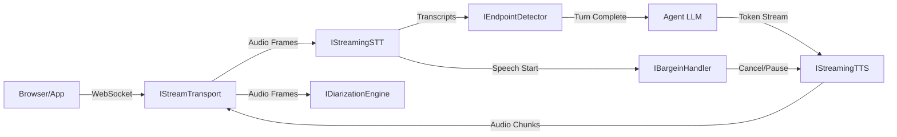
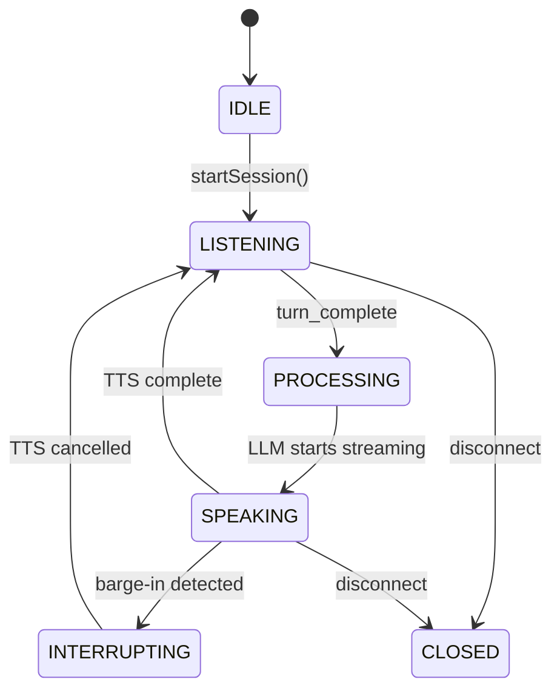

AgentOS provides a real-time streaming voice pipeline for building conversational voice agents. The pipeline handles bidirectional audio streaming, speech-to-text, turn-taking, text-to-speech, speaker diarization, and barge-in detection.

## Architecture

The pipeline consists of 6 core interfaces wired together by the `VoicePipelineOrchestrator`:



## State Machine

The orchestrator manages a conversational loop through these states:



## Quick Start

### CLI

```bash
# Basic voice mode (Whisper STT + OpenAI TTS)
wunderland chat --voice

# Deepgram + ElevenLabs
wunderland chat --voice \
  --voice-stt deepgram \
  --voice-tts elevenlabs \
  --voice-diarization
```

Install the matching streaming voice packs and set the required API keys before
using `--voice`:

- `@framers/agentos-ext-streaming-stt-whisper` + `OPENAI_API_KEY`
- `@framers/agentos-ext-streaming-stt-deepgram` + `DEEPGRAM_API_KEY`
- `@framers/agentos-ext-streaming-tts-openai` + `OPENAI_API_KEY`
- `@framers/agentos-ext-streaming-tts-elevenlabs` + `ELEVENLABS_API_KEY`

`semantic` endpointing also requires an LLM callback to be wired into the
pipeline; when that callback is absent, Wunderland falls back to heuristic
endpointing.

### Configuration

In `agent.config.json`:

```json
{
  "voice": {
    "enabled": true,
    "pipeline": "streaming",
    "stt": "deepgram",
    "tts": "elevenlabs",
    "ttsVoice": "nova",
    "endpointing": "heuristic",
    "diarization": {
      "enabled": true,
      "expectedSpeakers": 2
    },
    "bargeIn": "hard-cut",
    "language": "en-US",
    "server": {
      "port": 8765,
      "host": "127.0.0.1"
    }
  }
}
```

CLI flags override config file values.

## Core Interfaces

| Interface | Purpose |
|-----------|---------|
| `IStreamTransport` | Bidirectional audio pipe (WebSocket now, WebRTC later) |
| `IStreamingSTT` | Real-time speech-to-text with interim results |
| `IEndpointDetector` | Turn-taking: decides when the user is done speaking |
| `IDiarizationEngine` | Speaker identification and labeling |
| `IStreamingTTS` | Token-stream to audio synthesis |
| `IBargeinHandler` | Handles user interruption during agent speech |

## Endpointing Modes

| Mode | How it works | Latency | Cost |
|------|-------------|---------|------|
| `acoustic` | Pure energy-based VAD + silence timeout | Highest (~3s) | Free |
| `heuristic` | Punctuation/syntax analysis + silence fallback | Low (~0.5s for `. ? !`) | Free |
| `semantic` | LLM classifier for ambiguous pauses | Lowest (smart) | LLM API call per ambiguous turn |

## Barge-in Modes

| Mode | Behavior |
|------|----------|
| `hard-cut` | Immediately cancel TTS after 300ms of user speech. Injects `[interrupted]` marker into conversation history. |
| `soft-fade` | Fade TTS over 200ms. If user speaks < 2s (backchannel), resume. If > 2s, cancel. |
| `disabled` | Agent speaks to completion regardless of user speech. |

## Extension Packs

| Pack | npm Package | Provider | Env Var |
|------|------------|----------|---------|
| Deepgram STT | `@framers/agentos-ext-streaming-stt-deepgram` | Deepgram Nova-2 | `DEEPGRAM_API_KEY` |
| Whisper STT | `@framers/agentos-ext-streaming-stt-whisper` | OpenAI Whisper | `OPENAI_API_KEY` |
| OpenAI TTS | `@framers/agentos-ext-streaming-tts-openai` | OpenAI TTS-1 | `OPENAI_API_KEY` |
| ElevenLabs TTS | `@framers/agentos-ext-streaming-tts-elevenlabs` | ElevenLabs | `ELEVENLABS_API_KEY` |
| Diarization | `@framers/agentos-ext-diarization` | Local x-vector | — |
| Semantic Endpoint | `@framers/agentos-ext-endpoint-semantic` | Any LLM | LLM API key |

## WebSocket Protocol

The voice server communicates via WebSocket:

- **Binary messages**: Raw audio (client→server: PCM Float32 mono; server→client: encoded mp3/opus)
- **Text messages**: JSON control/metadata

### Client → Server

```typescript
// Text messages
{ type: 'config', sampleRate: 16000, voice: 'nova', language: 'en-US' }
{ type: 'control', action: 'mute' | 'unmute' | 'stop' }

// Binary messages: raw PCM Float32 mono audio
```

### Server → Client

```typescript
{ type: 'session_started', sessionId: '...', config: { sampleRate: 24000, format: 'opus' } }
{ type: 'transcript', text: 'Hello', isFinal: false, speaker: 'Speaker_0' }
{ type: 'agent_thinking' }
{ type: 'agent_speaking', text: 'Hi there!' }
{ type: 'agent_done' }
{ type: 'barge_in', action: 'cancelled' }
{ type: 'session_ended', reason: 'disconnect' }

// Binary messages: encoded audio (mp3/opus) in negotiated format
```

## Error Recovery

| Failure | Recovery |
|---------|----------|
| STT connection drops | Auto-reconnect with exponential backoff (100ms → 5s). Audio frames buffered during reconnect. |
| TTS connection drops | Cancel current utterance, re-create session, re-send buffered text. |
| Transport disconnects | Tear down all sessions. Client must reconnect. |
| Endpoint stuck | 30s watchdog timer forces `turn_complete`. |
| Diarization lag | Non-blocking. Transcript sent to LLM immediately; speaker labels backfilled. |

## Known Limitations

The voice pipeline is functional but has these known limitations that will be addressed in future releases:

### No True Incremental LLM Streaming

The current `chat --voice` implementation gets the full LLM text reply first, then chunks it for TTS. This means:
- First audio playback is delayed until the LLM finishes generating
- Barge-in cannot cancel in-flight LLM generation — only TTS playback
- Future: wire a real streaming text-turn API from the chat runtime into `IVoicePipelineAgentSession`

### Semantic Endpointing Requires LLM Callback

The semantic endpoint detector (`@framers/agentos-ext-endpoint-semantic`) only invokes the LLM turn-completeness classifier when an explicit `llmCall` callback is provided. Without it, the detector falls back to heuristic endpointing (punctuation + silence timeout).

### Telephony Media Stream Bridge Incomplete

The `telephony-webhook-server.ts` handles webhook routing and call control but does not yet automatically bridge provider media streams (Twilio `<Stream>`, Telnyx streaming, Plivo Audio Stream) into `TelephonyStreamTransport` and the voice pipeline. The media stream WebSocket connection must be established separately.

### Env-Based Provider Resolution

The `SpeechProviderResolver` and `createStreamingPipeline()` currently resolve voice components based on environment variables and static configuration. Future versions will resolve through a real `ExtensionManager` runtime with dynamic pack loading and hot-swapping.

### No Call Recording or Transcript Persistence

Call transcripts are held in memory during the call but are not persisted to storage after the call ends. Future: integrate with AgentOS storage/memory system.

---

## Voice-Graph Integration

AgentOS lets you embed voice I/O directly inside an orchestration graph. There are two complementary integration modes: **voice nodes** (one step in a larger graph is a voice session) and **voice transport** (the entire graph runs inside a phone call or real-time voice session).

### Voice as a Graph Node Type

Use the `voiceNode()` builder to create a `GraphNode` of type `'voice'`. The node manages a full multi-turn STT/TTS session and exits when one of its configured exit conditions fires.

```typescript
import { voiceNode } from '@framers/agentos/orchestration';

const listenNode = voiceNode('intake', {
  mode: 'conversation',
  stt: 'deepgram',
  tts: 'elevenlabs',
  maxTurns: 5,
  exitOn: 'keyword',
  exitKeywords: ['confirmed', 'cancel'],
})
  .on('keyword:confirmed', 'process-intake')
  .on('keyword:cancel',    'goodbye')
  .on('hangup',            'end')
  .on('turns-exhausted',   'fallback')
  .build();
```

The builder produces a `GraphNode` with:

| Property | Value |
|----------|-------|
| `type` | `'voice'` |
| `executorConfig.type` | `'voice'` |
| `executionMode` | `'react_bounded'` — models the multi-turn loop |
| `effectClass` | `'external'` — touches real-world audio I/O |
| `checkpoint` | `'before'` — snapshot taken before the session starts |

Exit reasons map to the next node via `.on(exitReason, targetNodeId)`. The `.on()` chain is order-independent; the voice executor resolves the correct edge after the session ends.

### Voice Transport Mode

When the entire workflow should run inside a single phone call, declare a `transport` at the workflow level. All nodes in the graph then receive input from STT and deliver output to TTS via a `VoiceTransportAdapter`.

```typescript
import { workflow } from '@framers/agentos/orchestration';
import { VoiceTransportAdapter } from '@framers/agentos/orchestration/runtime/VoiceTransportAdapter';

const callFlow = workflow('phone-intake')
  .input(inputSchema)
  .returns(outputSchema)
  .transport('voice', { stt: 'deepgram', tts: 'openai', voice: 'alloy' })
  .step('greet',    { voice: { mode: 'speak-only' } })
  .step('listen',   { voice: { mode: 'conversation', maxTurns: 3 } })
  .step('confirm',  { voice: { mode: 'conversation', exitOn: 'keyword', exitKeywords: ['yes', 'no'] } })
  .step('process',  { tool: 'crm_update' })
  .compile();
```

The `VoiceTransportAdapter` bridges the graph I/O cycle:

- `getNodeInput(nodeId)` — waits for the user's next speech turn (resolves on `turn_complete`).
- `deliverNodeOutput(nodeId, text)` — sends the node's response to TTS and emits a `voice_audio` graph event.
- `init(state)` — injects `state.scratch.voiceTransport` so voice nodes can access the transport.
- `dispose()` — emits `voice_session ended` and tears down the adapter.

### YAML Syntax

#### Voice step in a YAML workflow

```yaml
name: phone-intake
steps:
  - id: greet
    voice:
      mode: speak-only
      tts: openai
      voice: alloy

  - id: collect-info
    voice:
      mode: conversation
      stt: deepgram
      endpointing: heuristic
      bargeIn: hard-cut
      maxTurns: 5
      exitOn: keyword
      exitKeywords:
        - confirmed
        - cancel
```

#### Voice transport at workflow level

```yaml
name: phone-intake
transport:
  type: voice
  stt: deepgram
  tts: elevenlabs
  voice: nova
  bargeIn: hard-cut
  endpointing: heuristic
steps:
  - id: greet
    voice:
      mode: speak-only
  - id: intake
    voice:
      mode: conversation
      maxTurns: 3
      exitOn: keyword
      exitKeywords: [confirmed, done]
```

When `transport.type: voice` is present, `compileWorkflowYaml()` attaches the config to `compiled._transport` so the caller can detect that the workflow expects a `VoiceTransportAdapter` at runtime.

#### YAML voice step fields

| Field | Type | Description |
|-------|------|-------------|
| `mode` | `conversation` \| `listen-only` \| `speak-only` | **Required.** Session direction. |
| `stt` | string | STT provider override (e.g. `deepgram`, `openai`). |
| `tts` | string | TTS provider override (e.g. `openai`, `elevenlabs`). |
| `voice` | string | TTS voice name. |
| `endpointing` | `acoustic` \| `heuristic` \| `semantic` | Endpoint detection mode. |
| `bargeIn` | `hard-cut` \| `soft-fade` \| `disabled` | Barge-in handling. |
| `diarization` | boolean | Enable speaker diarization. |
| `language` | string | BCP-47 language tag (e.g. `en-US`). |
| `maxTurns` | number | Maximum turns before `turns-exhausted` exit. `0` = unlimited. |
| `exitOn` | string | Primary exit condition: `hangup`, `silence-timeout`, `keyword`, `turns-exhausted`, `manual`. |
| `exitKeywords` | string[] | Phrases that trigger keyword exit. Case-insensitive substring match. |

### Barge-in Routing with Exit Conditions

The `VoiceNodeExecutor` races multiple exit conditions simultaneously via a `Promise.race`. The first condition to fire determines the `exitReason` string, which is then looked up in the node's edge map to resolve the `routeTarget`.

| `exitReason` | Trigger | Typical edge target |
|---|---|---|
| `hangup` | Transport emits `close` or `disconnected` | `end` / cleanup node |
| `turns-exhausted` | `turn_complete` fires and `turnCount >= maxTurns` | summarize / fallback node |
| `keyword:<word>` | `final_transcript` contains a phrase from `exitKeywords` | intent-specific handler |
| `silence-timeout` | No speech for 30 s when `exitOn: silence-timeout` | timeout handler / retry |
| `interrupted` | `AbortController` fired with a `VoiceInterruptError` (barge-in) | re-listen / cancel TTS |

When a barge-in occurs, the executor catches the `VoiceInterruptError` and returns `exitReason: 'interrupted'`. Wire a loopback edge `.on('interrupted', 'listen')` to restart the listen cycle:

```typescript
voiceNode('listen', { mode: 'conversation' })
  .on('interrupted',      'listen')   // barge-in → re-listen
  .on('turns-exhausted',  'summarize')
  .on('hangup',           'end')
  .build();
```

### Graph Events for Voice

Voice nodes emit the following `GraphEvent` values in causal order:

| Event type | When |
|---|---|
| `voice_session` (action: `started`) | Immediately on `execute()` entry |
| `voice_transcript` (isFinal: false) | Each `interim_transcript` from STT |
| `voice_transcript` (isFinal: true) | Each confirmed `final_transcript` |
| `voice_turn_complete` | Each `turn_complete` from endpoint detector |
| `voice_audio` (direction: `outbound`) | When TTS delivery is triggered by `VoiceTransportAdapter.deliverNodeOutput()` |
| `voice_barge_in` | Each `barge_in` event from the pipeline session |
| `voice_session` (action: `ended`) | On node exit, with `exitReason` |

Consume events via the `GraphRuntime` stream:

```typescript
for await (const event of runtime.stream(graph, input)) {
  if (event.type === 'voice_transcript' && event.isFinal) {
    console.log(`[${event.speaker}] ${event.text}`);
  }
  if (event.type === 'voice_session' && event.action === 'ended') {
    console.log('Session exit reason:', event.exitReason);
  }
}
```

### Checkpoint Support

Voice nodes use `checkpoint: 'before'` so the runtime takes a state snapshot before each voice session starts. If the process crashes mid-call, the graph can be resumed from the beginning of that voice node.

In addition, the `VoiceNodeExecutor` writes a `VoiceNodeCheckpoint` to `scratchUpdate[nodeId]` after every execution:

```typescript
interface VoiceNodeCheckpoint {
  turnIndex: number;          // total turns completed (inclusive of prior runs)
  transcript: TranscriptEntry[]; // full buffered transcript
  lastExitReason: string | null;
  speakerMap: Record<string, string>;
  sessionConfig: VoiceNodeConfig;
}
```

Pass `state.scratch[nodeId].turnIndex` back as the `initialTurnCount` when constructing a `VoiceTurnCollector` to resume the turn counter from where the previous run left off — enabling a call that spans multiple graph runs (e.g. after a human-approval pause) to count turns continuously rather than resetting to zero.
