> Related repositories, packages, and resources for building with AgentOS.

---

## Architecture Overview

```mermaid
graph TB
    subgraph Applications
        WL[wunderland CLI]
        RH[Rabbithole Web App]
        WB[AgentOS Workbench]
        AS[agentos.sh Docs]
    end

    subgraph "Core Runtime — @framers/agentos"
        direction TB
        API["High-Level API<br/>generateText · streamText · agent()"]
        ORC["Orchestration Layer<br/>mission() · workflow() · AgentGraph"]
        GMI["GMI — General Model Interface<br/>21 LLM providers · streaming · tool calling"]
        MEM["Memory System<br/>cognitive mechanisms · Ebbinghaus decay<br/>working memory · graph memory"]
        RAG["RAG Pipeline<br/>HyDE · RAPTOR · GraphRAG · BM25<br/>vector + hybrid retrieval"]
        VP["Voice Pipeline<br/>STT · TTS · VAD · barge-in<br/>27 speech providers"]
        SEC["Security Pipeline<br/>PreLLM classifier · DualLLM auditor<br/>5 security tiers"]
        DISC["Capability Discovery<br/>3-tier semantic search<br/>~150 tokens always-on"]
        SKILLS_ENG["Skills Engine<br/>SkillLoader · SkillRegistry"]
        SAND["Sandbox<br/>subprocess · WASM · Docker<br/>permission tiers"]
    end

    subgraph "Content Packages"
        SKILLS["@framers/agentos-skills<br/>72 curated SKILL.md files"]
        SKILLS_REG["@framers/agentos-skills-registry<br/>catalog SDK · search · factories"]
        EXT["@framers/agentos-extensions<br/>tools · channels · integrations"]
        EXT_REG["@framers/agentos-extensions-registry<br/>createCuratedManifest()"]
    end

    subgraph "Infrastructure"
        SQL["@framers/sql-storage-adapter<br/>SQLite · PostgreSQL · in-memory"]
        PERS["@framers/agentos-personas<br/>personality templates"]
    end

    subgraph "LLM Providers"
        OAI[OpenAI]
        ANT[Anthropic]
        GEM[Google Gemini]
        GRQ[Groq]
        OLL[Ollama]
        OR[OpenRouter]
        TOG[Together]
        MIS[Mistral]
        XAI[xAI]
        MORE["+12 more"]
    end

    subgraph "Channels — 37 platforms"
        DC[Discord]
        TG[Telegram]
        SL[Slack]
        TW[Twitter/X]
        LI[LinkedIn]
        FB[Facebook]
        BS[Bluesky]
        WA[WhatsApp]
        MORE_CH["+29 more"]
    end

    subgraph "Speech Providers — 27 total"
        DG[Deepgram STT]
        EL[ElevenLabs TTS]
        OAITTS[OpenAI Whisper/TTS]
        AZ[Azure Speech]
        MORE_SP["+23 more"]
    end

    WL --> API
    RH --> API
    WB --> API

    API --> ORC
    ORC --> GMI
    ORC --> MEM
    ORC --> RAG
    ORC --> VP
    ORC --> SEC
    ORC --> DISC
    ORC --> SKILLS_ENG
    ORC --> SAND

    GMI --> OAI & ANT & GEM & GRQ & OLL & OR & TOG & MIS & XAI & MORE

    SKILLS_ENG --> SKILLS
    SKILLS_REG --> SKILLS
    DISC --> SKILLS_REG
    DISC --> EXT_REG

    EXT_REG --> EXT
    EXT --> DC & TG & SL & TW & LI & FB & BS & WA & MORE_CH

    VP --> DG & EL & OAITTS & AZ & MORE_SP

    MEM --> SQL
    RAG --> SQL

    style API fill:#00f5ff,stroke:#00f5ff,color:#0a0a14
    style ORC fill:#c9a227,stroke:#c9a227,color:#0a0a14
    style GMI fill:#10ffb0,stroke:#10ffb0,color:#0a0a14
    style MEM fill:#8b5cf6,stroke:#8b5cf6,color:#0a0a14
    style RAG fill:#4facfe,stroke:#4facfe,color:#0a0a14
    style VP fill:#e040fb,stroke:#e040fb,color:#0a0a14
    style SEC fill:#ff4444,stroke:#ff4444,color:#0a0a14
    style DISC fill:#ffd700,stroke:#ffd700,color:#0a0a14
```



## Core Packages

### [@framers/agentos](https://github.com/framersai/agentos)

**Main SDK** — The core orchestration runtime for building adaptive AI agents.

```bash
npm install @framers/agentos
```

**Key subsystems:**

| Subsystem | What it does | Key APIs |
|---|---|---|
| **High-Level API** | One-shot text/image generation, lightweight agents | `generateText()`, `streamText()`, `generateImage()`, `agent()` |
| **Orchestration** | Multi-agent workflows, missions, graph execution | `mission()`, `workflow()`, `AgentGraph`, `agency()` |
| **GMI** | Unified LLM interface across 21 providers | `GmiManager`, `buildLlmCaller()`, provider auto-detection |
| **Memory** | Cognitive memory with 8 neuroscience mechanisms | `CognitiveMemoryManager`, Ebbinghaus decay, HEXACO modulation |
| **RAG** | Multi-strategy retrieval with 5 retrieval modes | `UnifiedRetriever`, HyDE, RAPTOR, GraphRAG, BM25, vector |
| **Voice** | Full duplex voice with endpoint detection + barge-in | `VoicePipelineOrchestrator`, 27 speech providers |
| **Security** | 3-layer defense with 5 configurable tiers | `PreLLMClassifier`, `DualLLMAuditor`, `SignedOutputVerifier` |
| **Discovery** | Semantic capability search (~150 tokens always-on) | `CapabilityDiscoveryEngine`, 3-tier progressive disclosure |
| **Skills Engine** | Load and execute SKILL.md prompt modules | `SkillLoader`, `SkillRegistry`, `PresetSkillResolver` |
| **Sandbox** | Isolated code execution with permission tiers | Subprocess, WASM, Docker runtimes |

---

### [@framers/sql-storage-adapter](https://github.com/framersai/sql-storage-adapter)

**SQL Storage** — Cross-platform SQL storage abstraction with automatic fallbacks.

```bash
npm install @framers/sql-storage-adapter
```

| Backend | Package | Use case |
|---|---|---|
| SQLite (native) | `better-sqlite3` | Desktop, server, CLI |
| SQLite (WASM) | `sql.js` | Browser, edge functions |
| PostgreSQL | `pg` | Production, multi-tenant |
| In-memory | built-in | Testing, ephemeral agents |

Auto-detects the best backend at runtime. Vector storage support for RAG embedding persistence.

---

### [@framers/agentos-extensions-registry](https://github.com/framersai/agentos-extensions)

**Curated Extensions Registry** — Load all official extensions with a single `createCuratedManifest()` call.

```bash
npm install @framers/agentos-extensions-registry
```

```typescript
import { createCuratedManifest } from '@framers/agentos-extensions-registry';

const manifest = await createCuratedManifest({
  tools: 'all',
  channels: 'none',
  secrets: { 'serper.apiKey': process.env.SERPER_API_KEY! },
});

const agentos = new AgentOS();
await agentos.initialize({ extensionManifest: manifest });
```

Only installed extension packages will load — missing ones are skipped silently.

---

### [@framers/agentos-extensions](https://github.com/framersai/agentos-extensions)

**Extension Source** — Implementations, templates, and manifests for tools, channel adapters, and integrations.

```bash
npm install @framers/agentos-extensions
```

| Category | Extensions | Count |
|---|---|---|
| **Research** | web-search, web-browser, news-search, hacker-news | 4 |
| **Media** | giphy, image-search, speech-runtime, voice-synthesis | 4 |
| **System** | cli-executor, auth, document-export, widget-generator | 4 |
| **Social** | linkedin, facebook, threads, bluesky, mastodon, farcaster, lemmy | 7 |
| **Messaging** | telegram, discord, slack, whatsapp, webchat | 5 |
| **Content** | blog-publisher (Dev.to, Hashnode, Medium, WordPress) | 1 |
| **Orchestration** | multi-channel-post, social-analytics, media-upload, bulk-scheduler | 4 |
| **Provenance** | anchor-providers, tip-ingestion | 2 |

---

### [@framers/agentos-skills-registry](https://github.com/framersai/agentos-skills-registry)

**Curated Skills Catalog SDK** — Typed catalog, query helpers, and lazy-loading factories.

```bash
npm install @framers/agentos-skills-registry
```

```typescript
// Lightweight catalog queries (zero peer deps)
import { searchSkills, getSkillsByCategory } from '@framers/agentos-skills-registry/catalog';

// Full registry with lazy-loaded @framers/agentos
import { createCuratedSkillSnapshot } from '@framers/agentos-skills-registry';
const snapshot = await createCuratedSkillSnapshot({ skills: ['github', 'weather'] });
```

---

### [@framers/agentos-skills](https://github.com/framersai/agentos-skills)

**Skills Content** — 72 curated SKILL.md prompt modules + `registry.json` index.

```bash
npm install @framers/agentos-skills
```

This is the content package for skills. The runtime engine (SkillLoader, SkillRegistry, path utilities) lives in `@framers/agentos/skills`.

```
@framers/agentos/skills               ← Engine (SkillLoader, SkillRegistry, path utils)
@framers/agentos-skills               ← Content (72 SKILL.md files + registry.json)
@framers/agentos-skills-registry      ← Catalog SDK (SKILLS_CATALOG, query helpers, factories)
```

**Skill categories:** information, developer-tools, communication, productivity, devops, media, security, creative

---

## Applications

### [Wunderland](https://wunderland.sh)

**Autonomous Agent Framework + CLI** — Built on AgentOS with HEXACO personality, 5-tier security, adaptive inference routing, and a zero-config CLI.

```bash
npm install -g @framers/wunderland
wunderland mission "Research AI agent frameworks and write a comparison"
```

**Key features beyond AgentOS:**
- Natural language agent creation (`wunderland create "..."`)
- Natural language mission orchestration (`wunderland mission "..."`)
- HEXACO personality modeling (6-factor trait system)
- 8 agent presets (research-assistant, creative-writer, etc.)
- 37-channel social media automation
- Cognitive memory with personality-modulated mechanisms

**Docs:** [docs.wunderland.sh](https://docs.wunderland.sh)

---

### [Rabbithole](https://rabbithole.inc)

**Web Control Plane** — Next.js 16 app for managing agents, running missions, and monitoring execution.

**Features:**
- Mission Control — NL + voice input, live streaming events, execution graph visualization
- Mission Explorer — post-execution graph browser with timeline scrubber
- Dashboard — agent management, credentials, self-hosted deployment
- Pricing — Stripe integration for managed hosting

---

### [AgentOS Workbench](https://github.com/framersai/agentos-workbench)

**Development Workbench** — Visual development environment for building and testing AgentOS agents.

**Features:**
- Interactive agent playground
- Workflow builder (drag-and-drop graph editor)
- Tool testing interface
- Conversation history viewer
- Real-time streaming visualization

---

### [agentos.sh](https://agentos.sh)

**Documentation Website** — Official documentation and marketing site.

---

## LLM Providers (21 supported)

| Provider | Text | Image | Embedding | Voice |
|---|:---:|:---:|:---:|:---:|
| OpenAI | gpt-4o | gpt-image-1 | text-embedding-3-small | whisper / tts |
| Anthropic | claude-sonnet-4 | — | — | — |
| Google Gemini | gemini-2.5-flash | — | — | — |
| Groq | llama-3.3-70b | — | — | — |
| Ollama | llama3.2 | stable-diffusion | nomic-embed-text | — |
| OpenRouter | 200+ models | — | — | — |
| Together | mixtral-8x7b | — | — | — |
| Mistral | mistral-large | — | — | — |
| xAI | grok-2 | — | — | — |
| Stability | — | sdxl-1024 | — | — |
| Replicate | — | flux-1.1-pro | — | — |
| ElevenLabs | — | — | — | turbo-v2 |
| Deepgram | — | — | — | nova-2 |
| Azure | gpt-4o | dall-e-3 | ada-002 | speech |
| AWS Bedrock | claude/titan | — | titan-embed | — |
| Runway | — | — | — | — (video) |
| Suno | — | — | — | — (music) |
| PlayHT | — | — | — | play-3.0 |
| AssemblyAI | — | — | — | universal |
| BFL | — | flux-pro | — | — |
| Perplexity | sonar-large | — | — | — |

Auto-detection: set `OPENAI_API_KEY`, `ANTHROPIC_API_KEY`, etc. — AgentOS finds and uses them automatically.

---

## Quick Links

| Resource | Link |
|---|---|
| AgentOS Docs | [docs.agentos.sh](https://docs.agentos.sh) |
| Wunderland Docs | [docs.wunderland.sh](https://docs.wunderland.sh) |
| npm (AgentOS) | [@framers/agentos](https://www.npmjs.com/package/@framers/agentos) |
| npm (Wunderland) | [wunderland](https://www.npmjs.com/package/wunderland) |
| Discord | [Join Community](https://discord.gg/agentos) |
| Twitter | [@framersai](https://twitter.com/framersai) |

---

## Contributing

We welcome contributions to any repository in the ecosystem:

1. **Bug reports** — [Open an issue](https://github.com/framersai/agentos/issues)
2. **Feature requests** — [Start a discussion](https://github.com/framersai/agentos/discussions)
3. **Extensions** — Submit to [agentos-extensions](https://github.com/framersai/agentos-extensions)
4. **Skills** — Add SKILL.md files to [agentos-skills](https://github.com/framersai/agentos-skills)
5. **Documentation** — PRs welcome on any repo
