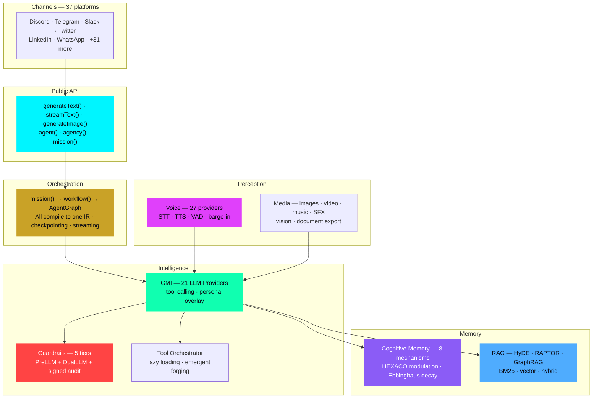

# AgentOS Documentation

[](https://www.npmjs.com/package/@framers/agentos)
[](https://github.com/framersai/agentos/actions/workflows/ci.yml)
[](https://github.com/framersai/agentos/actions/workflows/ci.yml)
[](https://codecov.io/gh/framersai/agentos)

Modular orchestration runtime for AI agent systems.

```bash
npm install @framers/agentos
```

:::tip Paracosm — AI Agent Swarm Simulation
**[Paracosm](https://paracosm.agentos.sh)** is an AI agent swarm simulation engine built on AgentOS. Define any scenario as JSON, run it with AI commanders that have different HEXACO personalities, and watch their decisions diverge into measurably different outcomes.

**[Live Demo](https://paracosm.agentos.sh/sim)** · **[GitHub](https://github.com/framersai/paracosm)** · **[npm](https://www.npmjs.com/package/paracosm)** · **[API Reference](/paracosm)**
:::

:::info Join the Community
Questions, feedback, or want to share what you're building? Join us on Discord.

**[Join Discord](https://wilds.ai/discord)**
:::

## Architecture



## Quick Navigation

### Start Here

- [High-Level API](/getting-started/high-level-api) — `generateText()`, `streamText()`, `generateImage()`, and `agent()`
- [Examples Cookbook](/getting-started/examples) — 18 runnable examples (agents, agencies, voice, orchestration)
- [TypeDoc API](/api/) — Generated API reference for the full runtime

### Getting Started

- [Documentation Index](/getting-started/documentation-index) — Installation and quick start
- [High-Level API](/getting-started/high-level-api) — `generateText()`, `streamText()`, `generateImage()`, and `agent()`
- [Ecosystem](/getting-started/ecosystem) — Related packages and resources
- [Releasing](/getting-started/releasing) — Version history and release process

### Architecture & Core

- [System Architecture](/architecture/system-architecture) — System design and core internals
- [Platform Support](/architecture/platform-support) — Supported environments
- [Tool Calling & Lazy Loading](/architecture/tool-calling-and-loading) — Extension loading, schema-on-demand, and descriptor IDs
- [Observability (OpenTelemetry)](/architecture/observability) — Traces, metrics, and OTEL-compatible logging (opt-in)
- [Logging (Pino + OpenTelemetry)](/architecture/logging) — Structured logs, trace correlation, and OTEL LogRecord export (opt-in)

### Planning & Orchestration

- [Unified Orchestration Layer](/features/unified-orchestration) — One runtime, three authoring APIs
- [AgentGraph](/features/agent-graph) — Explicit graph builder with node/edge control
- [workflow() DSL](/features/workflow-dsl) — Deterministic DAG pipelines
- [mission() API](/features/mission-api) — Goal-first orchestration
- [Checkpointing](/features/checkpointing) — Resume, replay, and forking
- [Planning Engine](/features/planning-engine) — Multi-step task planning
- [Human-in-the-Loop](/features/human-in-the-loop) — Approval workflows
- [Agent Communication](/features/agent-communication) — Inter-agent messaging
- [Multi-Agent Agency API](/features/agency-api) — agency(), strategies (sequential, parallel, graph, hierarchical), dependsOn

### Safety & Security

- [Guardrails](/features/guardrails) — Content filtering, PII redaction, and folder-level filesystem permissions
- [Creating Custom Guardrails](/features/creating-guardrails) — Building and composing guardrail pipelines
- [Safety Primitives](/features/safety-primitives) — Circuit breakers, cost guards, stuck detection, and tool execution guards
- [Provenance & Immutability](/features/provenance-immutability) — Signed event ledger, soft-delete tombstones, revision history, and autonomy guard
- [Immutable Agents](/features/immutable-agents) — Toolset pinning, secret rotation, and soft-forget memory patterns

### Memory & Storage

- [Cognitive Memory](/features/cognitive-memory) — Personality-modulated memory, retrieval, and consolidation
- [Working Memory](/features/working-memory) — Markdown notes and Baddeley slot-model working memory
- [RAG Memory](/features/rag-memory) — Vector storage and retrieval
- [Multimodal RAG](/features/multimodal-rag) — Image and audio embeddings
- [SQL Storage](/features/sql-storage) — Database adapters
- [Client-Side Storage](/features/client-side-storage) — Browser and local persistence

### Capabilities & AI

- [Capability Discovery](/features/capability-discovery) — Tiered semantic discovery (~90% token reduction)
- [Turn Planner](/features/turn-planner) — Per-turn execution policy, tool selection, and discovery integration
- [Emergent Capabilities](/features/emergent-capabilities) — Runtime tool creation, self-improvement tools, sandboxed execution, and LLM-as-judge verification
- [HEXACO Personality](/features/hexaco-personality) — 6-trait personality model, persona overlays, runtime mutation
- [Deep Research](/features/deep-research) — Multi-source research pipeline with query classification
- [Structured Output](/features/structured-output) — JSON schema validation
- [Evaluation Framework](/features/evaluation-framework) — Testing and benchmarks
- [Cost Optimization](/features/cost-optimization) — Token usage and caching

### Advanced

- [Recursive Self-Building](/features/recursive-self-building) — Self-modifying agent patterns
- [Agency Collaboration](/features/agency-collaboration) — Multi-agent coordination

### Voice & IVR

- [Voice Pipeline](/features/voice-pipeline) — End-to-end voice conversation architecture, VAD, barge-in, and turn detection
- [Speech Providers](/features/speech-providers) — Full catalog of STT, TTS, VAD, and wake-word providers
- [Telephony Providers](/features/telephony-providers) — Twilio, Telnyx, Plivo webhook setup and call management

### Skills

- [Skills Overview](/skills/overview) — SKILL.md format, loading, and semantic discovery integration
- [Skills Format](/skills/skill-format) — Authoring SKILL.md files
- [@framers/agentos-skills](/skills/agentos-skills) — Curated SKILL.md content package
- [Skills Registry](/skills/agentos-skills-registry) — Browsing and installing curated skills

### Extensions

- [Extensions Overview](/extensions/overview) — Available extensions catalog
- [How Extensions Work](/extensions/how-extensions-work) — Loading and lifecycle
- [Extension Architecture](/extensions/extension-architecture) — Building custom extensions
- [Auto-Loading](/extensions/auto-loading) — Automatic extension discovery
- [Extension Standards (RFC)](/extensions/extension-standards) — Interface contracts and versioning
- **Safety**: [PII Redaction](/extensions/built-in/pii-redaction), [Code Safety](/extensions/built-in/code-safety), [Grounding Guard](/extensions/built-in/grounding-guard), [ML Classifiers](/extensions/built-in/ml-classifiers), [Topicality](/extensions/built-in/topicality)
- **Research**: [Web Search](/extensions/built-in/web-search), [Web Browser](/extensions/built-in/web-browser), [News Search](/extensions/built-in/news-search)
- **Media**: [Voice Synthesis](/extensions/built-in/voice-synthesis), [Image Search](/extensions/built-in/image-search), [Giphy](/extensions/built-in/giphy)
- **Integrations**: [Auth](/extensions/built-in/auth), [Telegram](/extensions/built-in/telegram), [CLI Executor](/extensions/built-in/cli-executor)

### API Reference

- [TypeDoc API](/api/) — Auto-generated API documentation
