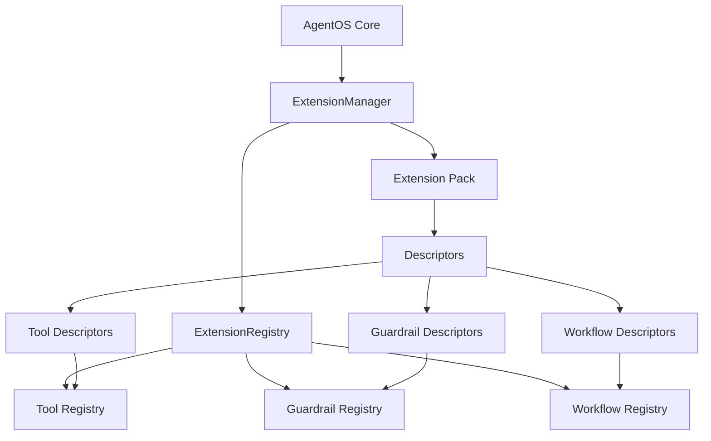

# How Extensions Work in AgentOS

## Overview

AgentOS uses a sophisticated extension system that allows developers to add new capabilities without modifying core code. Extensions can provide tools, guardrails, workflows, and more.

## Extension Architecture



## Core Components

### 1. Extension Pack
A collection of related extensions distributed together:
```typescript
export interface ExtensionPack {
  name: string;
  version?: string;
  descriptors: ExtensionDescriptor[];
}
```

### 2. Extension Descriptor
Metadata and payload for a single extension:
```typescript
export interface ExtensionDescriptor<TPayload = unknown> {
  id: string;                    // Unique identifier
  kind: ExtensionKind;           // 'tool', 'guardrail', etc.
  payload: TPayload;             // The actual implementation
  priority?: number;             // Loading priority (higher = later)
  enableByDefault?: boolean;     // Auto-enable when loaded
  metadata?: Record<string, unknown>;
  onActivate?: (context) => void;    // Lifecycle hook
  onDeactivate?: (context) => void;  // Lifecycle hook
}
```

### 3. Extension Manager
Coordinates loading and lifecycle:
```typescript
const extensionManager = new ExtensionManager();
await extensionManager.loadManifest(context);
```

## Loading Extensions

### Method 1: Factory Function (In-Process)
```typescript
const config: AgentOSConfig = {
  extensionManifest: {
    packs: [
      {
        factory: () => createSearchExtension({
          // ... options
        })
      }
    ]
  }
};
```

### Method 2: NPM Package (Coming Soon)
```typescript
const config: AgentOSConfig = {
  extensionManifest: {
    packs: [
      {
        package: '@framers/agentos-ext-search',
        version: '^1.0.0',
        options: { /* config */ }
      }
    ]
  }
};
```

### Method 3: Local Module
```typescript
const config: AgentOSConfig = {
  extensionManifest: {
    packs: [
      {
        module: './extensions/my-extension',
        options: { /* config */ }
      }
    ]
  }
};
```

## Priority & Overriding

### Extension Priority
Extensions with higher priority load later and can override earlier ones:
```typescript
{
  id: 'webSearch',
  kind: 'tool',
  priority: 10,  // Default priority
  payload: new WebSearchTool()
}

// Later extension can override:
{
  id: 'webSearch',  // Same ID
  kind: 'tool',
  priority: 20,     // Higher priority wins
  payload: new EnhancedWebSearchTool()
}
```

### Stacking
Multiple descriptors with the same ID form a stack. The highest priority becomes active:
```typescript
// Registry maintains stack:
webSearch: [
  { priority: 10, payload: BasicSearch },    // Inactive
  { priority: 20, payload: EnhancedSearch }  // Active
]
```

### Manual Overrides
Configure overrides in the manifest:
```typescript
{
  extensionManifest: {
    packs: [/* ... */],
    overrides: {
      tools: {
        'webSearch': {
          enabled: false,      // Disable specific tool
          priority: 100,       // Override priority
          options: { /* */ }   // Custom options
        }
      }
    }
  }
}
```

## Loading Multiple Extensions

### Parallel Loading
Multiple extension packs load in parallel:
```typescript
{
  extensionManifest: {
    packs: [
      { factory: () => createSearchExtension(opts1) },
      { factory: () => createDatabaseExtension(opts2) },
      { factory: () => createWeatherExtension(opts3) }
    ]
  }
}
```

### Load Order
1. Extensions load based on manifest order
2. Within each pack, descriptors apply by priority
3. Lifecycle hooks (`onActivate`) run after registration
4. Higher priority extensions can override lower ones

## Extension Lifecycle

### 1. Discovery
ExtensionManager reads manifest and identifies packs to load.

### 2. Loading
```typescript
for (const entry of manifest.packs) {
  const pack = await resolvePack(entry);
  await registerPack(pack, entry, context);
}
```

### 3. Registration
Each descriptor registers with its kind-specific registry:
```typescript
const toolRegistry = extensionManager.getRegistry('tool');
await toolRegistry.register(descriptor, context);
```

### 4. Activation
`onActivate` hook runs when descriptor becomes active:
```typescript
{
  onActivate: async (ctx) => {
    ctx.logger?.info('Tool activated');
    await initializeResources();
  }
}
```

### 5. Runtime
Tools available to agents via ToolExecutor:
```typescript
const tool = toolExecutor.getTool('webSearch');
const result = await tool.execute(input, context);
```

### 6. Deactivation
`onDeactivate` runs when overridden or removed:
```typescript
{
  onDeactivate: async (ctx) => {
    await cleanupResources();
  }
}
```

## Example: Complete Setup

```typescript
import { AgentOS } from '@agentos/core';
import searchExtension from '@framers/agentos-ext-search';
import weatherExtension from '@framers/agentos-ext-weather';

// Initialize AgentOS with multiple extensions
const agentos = new AgentOS();

await agentos.initialize({
  // Core configuration
  defaultPersonaId: 'v_researcher',
  
  // Extension configuration
  extensionManifest: {
    packs: [
      // Search extension with Serper
      {
        factory: () => searchExtension({
          manifestEntry: {} as any,
          source: { sourceName: '@framers/agentos-ext-search' },
          options: {
            search: {
              provider: 'serper',
              apiKey: process.env.SERPER_API_KEY,
              rateLimit: 10
            }
          }
        }),
        priority: 10,
        enabled: true
      },
      
      // Weather extension
      {
        factory: () => weatherExtension({
          manifestEntry: {} as any,
          source: { sourceName: '@framers/agentos-ext-weather' },
          options: {
            weather: {
              apiKey: process.env.WEATHER_API_KEY
            }
          }
        }),
        priority: 10,
        enabled: true
      }
    ],
    
    // Override specific tools
    overrides: {
      tools: {
        'researchAggregator': {
          enabled: true,  // Enable by default
          priority: 15
        },
        'factCheck': {
          enabled: false  // Disable fact checker
        }
      }
    }
  },
  
  // Other AgentOS config...
  modelProviderManagerConfig: {
    providers: [/* ... */]
  }
});

// Tools now available to agents
const gmi = await agentos.createGMI('v_researcher');
// Agent can now use webSearch, researchAggregator, weather tools
```

## Extension Discovery

### Runtime Discovery
```typescript
// Get all registered tools
const toolRegistry = extensionManager.getRegistry('tool');
const activeToos = toolRegistry.listActive();

// Check if specific tool exists
const hasSearch = toolRegistry.has('webSearch');

// Get tool metadata
const descriptor = toolRegistry.get('webSearch');
```

### Agent Discovery
Agents discover available tools through GMI configuration:
```typescript
const gmi = await gmiManager.createGMI({
  personaId: 'researcher',
  toolIds: ['webSearch', 'researchAggregator']  // Explicit tools
});
```

## Best Practices

### 1. Namespace Your IDs
Use reverse domain notation:
```typescript
id: 'com.yourcompany.ext.toolname'
```

### 2. Version Compatibility
Specify AgentOS version requirements:
```json
{
  "agentosVersion": "^2.0.0"
}
```

### 3. Configuration Validation
Validate options in factory:
```typescript
export function createExtensionPack(context: ExtensionPackContext) {
  const { options = {} } = context;
  
  if (!options.apiKey && !process.env.API_KEY) {
    throw new Error('API key required');
  }
  
  // ... create pack
}
```

### 4. Graceful Degradation
Handle missing dependencies:
```typescript
async execute(input, context) {
  if (!this.service.isConfigured()) {
    return {
      success: false,
      error: 'Service not configured',
      details: { helpUrl: 'https://...' }
    };
  }
  // ... normal execution
}
```

### 5. Resource Cleanup
Always cleanup in deactivate:
```typescript
onDeactivate: async (ctx) => {
  await this.closeConnections();
  await this.saveState();
  this.clearCache();
}
```

## Debugging Extensions

### Enable Logging
```typescript
{
  extensionManifest: {
    packs: [/* ... */]
  },
  debugging: {
    logExtensionEvents: true,
    logToolCalls: true
  }
}
```

### Extension Events
Listen to extension events:
```typescript
extensionManager.on((event) => {
  console.log('Extension event:', event.type, event.source);
});
```

### Tool Execution Tracking
```typescript
const toolOrchestrator = new ToolOrchestrator({
  logToolCalls: true,
  onToolCall: (tool, input, result) => {
    console.log(`Tool ${tool.name}:`, { input, result });
  }
});
```

## Security Considerations

### 1. Permission Scoping
Tools declare required permissions:
```typescript
readonly permissions = {
  requiredScopes: ['internet.access', 'file.read'],
  requiredCapabilities: ['web-search']
};
```

### 2. API Key Security
Never hardcode keys:
```typescript
// ❌ Bad
apiKey: 'sk-1234567890'

// ✅ Good
apiKey: process.env.API_KEY
```

### 3. Input Validation
Always validate tool inputs:
```typescript
async execute(input: any, context: ToolExecutionContext) {
  // Validate against schema
  const valid = ajv.validate(this.inputSchema, input);
  if (!valid) {
    return { success: false, error: 'Invalid input' };
  }
  // ... proceed
}
```

## Future Roadmap

- **Extension Marketplace**: Browse and install from UI
- **Hot Reloading**: Update extensions without restart
- **Sandboxing**: Isolate extension execution
- **Dependency Resolution**: Automatic dependency management
- **Visual Editor**: Create extensions without code
