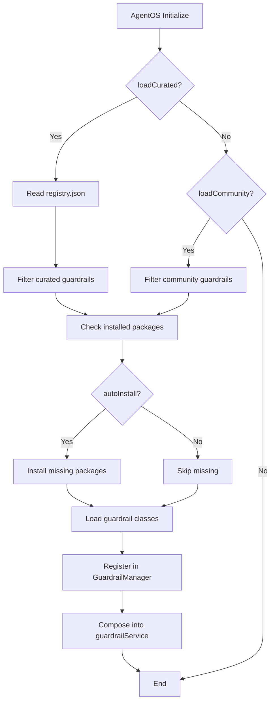

# Auto-Loading Guardrails in AgentOS

## Overview

AgentOS can automatically discover and load guardrails from:
1. **Local packages** installed via npm/pnpm
2. **Registry** defined in `registry.json`
3. **NPM search** for packages matching `@framersai/guardrail-*`

This eliminates manual wiring—just install a guardrail package and AgentOS finds it.

---

## Configuration

Enable auto-loading in `AgentOSConfig`:

```typescript
const config: AgentOSConfig = {
  // ... other config ...
  guardrailConfig: {
    /**
     * Load curated guardrails from registry/curated/
     * Default: true in production, false in dev
     */
    loadCurated: true,
    
    /**
     * Load community guardrails from registry/community/
     * Default: false (opt-in for security)
     */
    loadCommunity: false,
    
    /**
     * Auto-install missing guardrails from npm
     * Default: false (manual install required)
     */
    autoInstall: false,
    
    /**
     * Custom registry URL or local path
     * Default: reads from packages/agentos-guardrails/registry.json
     */
    registrySource: 'https://registry.agentos.sh/guardrails.json',
  },
};
```

---

## Loading Process



---

## Discovery Methods

### Method 1: Registry-Based Loading

AgentOS reads `packages/agentos-guardrails/registry.json` and loads listed guardrails:

```json
{
  "guardrails": {
    "curated": [
      {
        "id": "guardrail-keyword",
        "package": "@framersai/guardrail-keyword",
        "category": "safety"
      }
    ]
  }
}
```

If `loadCurated: true`, AgentOS will:
1. Check if `@framersai/guardrail-keyword` is installed
2. If `autoInstall: true`, run `pnpm add @framersai/guardrail-keyword`
3. Import the package and instantiate the guardrail

### Method 2: NPM Search

If `registrySource` is unavailable, AgentOS scans `node_modules/` for packages matching `@framersai/guardrail-*`:

```typescript
// Pseudo-code
const guardrailPackages = fs.readdirSync('node_modules/@framersai')
  .filter(name => name.startsWith('guardrail-'));

for (const pkg of guardrailPackages) {
  const module = await import(`@framersai/${pkg}`);
  // Instantiate and register
}
```

### Method 3: Explicit Imports

You can still manually import and configure:

```typescript
import { KeywordGuardrail } from '@framersai/guardrail-keyword';

const config: AgentOSConfig = {
  guardrailService: new KeywordGuardrail({ /* config */ }),
};
```

---

## Default Curated Guardrails

When `loadCurated: true`, AgentOS loads:

| Guardrail | Package | Auto-Loaded | Description |
|-----------|---------|-------------|-------------|
| Keyword Filter | `@framersai/guardrail-keyword` | ✅ | PII, regex patterns |
| Sensitive Topic | `@framersai/guardrail-sensitive-topic` | ✅ | Harmful content |
| Cost Ceiling | `@framersai/guardrail-cost-ceiling` | ❌ | Opt-in (budget control) |
| LLM Generic | `@framersai/guardrail-llm-generic` | ❌ | Opt-in (slower, requires API) |

**Curated guardrails are vetted, tested, and maintained by the AgentOS team.**

---

## Environment Variables

Override auto-loading behavior:

```bash
# Enable curated guardrails (default in production)
AGENTOS_LOAD_CURATED_GUARDRAILS=true

# Enable community guardrails (opt-in)
AGENTOS_LOAD_COMMUNITY_GUARDRAILS=false

# Auto-install missing guardrails from npm
AGENTOS_AUTO_INSTALL_GUARDRAILS=false

# Custom registry URL
AGENTOS_GUARDRAIL_REGISTRY=https://registry.agentos.sh/guardrails.json
```

---

## Example: Fully Auto-Loaded Stack

```typescript
// No imports needed—AgentOS loads from registry
const config: AgentOSConfig = {
  guardrailConfig: {
    loadCurated: true,
    loadCommunity: false,
    autoInstall: true,
  },
};

const agentos = new AgentOS();
await agentos.initialize(config);

// AgentOS now has keyword and sensitive-topic guardrails active!
```

---

## Testing Auto-Loading

```bash
# Install curated guardrails
pnpm add @framersai/guardrail-keyword @framersai/guardrail-sensitive-topic

# Start AgentOS with auto-loading enabled
AGENTOS_LOAD_CURATED_GUARDRAILS=true pnpm run dev

# Check logs for:
# ✅ Loaded guardrail: @framersai/guardrail-keyword
# ✅ Loaded guardrail: @framersai/guardrail-sensitive-topic
```

---

## Related Docs

- [HOW_GUARDRAILS_WORK.md](HOW_GUARDRAILS_WORK.md) - Architecture
- [GUARDRAIL_SCHEMAS.md](GUARDRAIL_SCHEMAS.md) - Serialization and UI
- [CONTRIBUTING.md](CONTRIBUTING.md) - Submit your own guardrails

