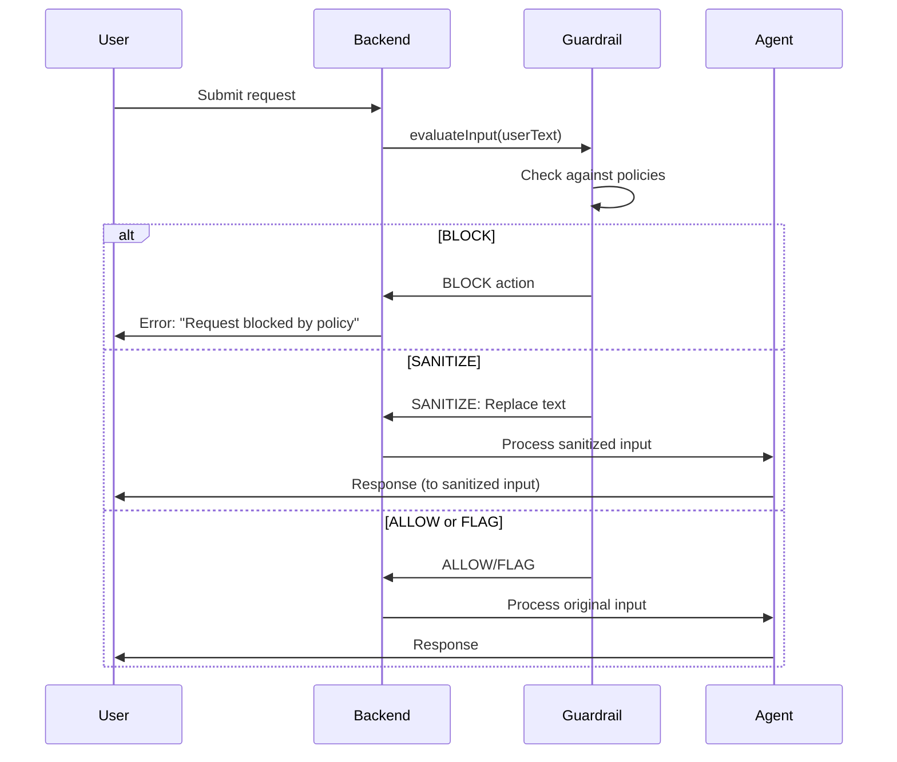
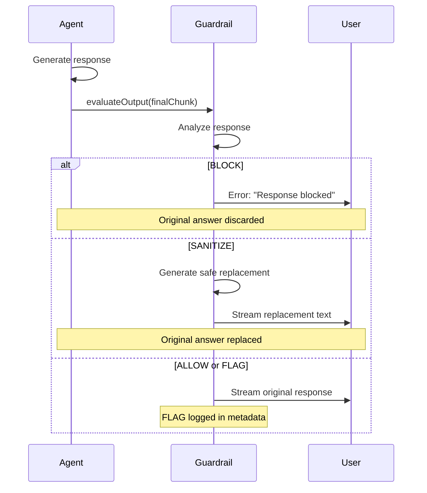

# How AgentOS Guardrails Work

## Overview

Guardrails are real-time safety and policy layers that inspect and modify AgentOS agent behavior **mid-stream**. Unlike traditional content filters that only check final outputs, AgentOS guardrails can:

1. **Intercept user input** before it reaches the agent
2. **Inspect streaming output** as the agent generates it
3. **Replace or abort responses** before they reach the user
4. **Log decisions** for audit and analytics

This enables agents to **"change their mind"** dynamically based on policy, cost, or safety constraints.

---

## Architecture

### Core Interface: `IGuardrailService`

All guardrails implement this interface from `@agentos/core`:

```typescript
export interface IGuardrailService {
  /**
   * Evaluate user input BEFORE orchestration.
   * Return null to allow, or a decision to sanitize/block/flag.
   */
  evaluateInput?(payload: GuardrailInputPayload): Promise<GuardrailEvaluationResult | null>;

  /**
   * Evaluate agent output BEFORE streaming to user.
   * This is where agents "change their mind" mid-stream.
   */
  evaluateOutput?(payload: GuardrailOutputPayload): Promise<GuardrailEvaluationResult | null>;
}
```

### Guardrail Actions

```typescript
export enum GuardrailAction {
  ALLOW = 'allow',       // Pass content through unchanged
  FLAG = 'flag',         // Allow but log for analytics/audit
  SANITIZE = 'sanitize', // Replace content with safe alternative
  BLOCK = 'block',       // Terminate stream and emit error
}
```

---

## Lifecycle

### 1. Input Evaluation



### 2. Output Evaluation (Agent "Changes Mind")



---

## Loading & Discovery

### Method 1: Explicit Configuration

```typescript
import { KeywordGuardrail } from '@framersai/guardrail-keyword';

const guardrail = new KeywordGuardrail({ /* config */ });

const config: AgentOSConfig = {
  guardrailService: guardrail, // Single guardrail
};
```

### Method 2: Composing Multiple Guardrails

```typescript
import { composeGuardrails } from '@framersai/agentos-guardrails';
import { KeywordGuardrail } from '@framersai/guardrail-keyword';
import { CostCeilingGuardrail } from '@framersai/guardrail-cost-ceiling';

const guardStack = composeGuardrails([
  new KeywordGuardrail({ /* config */ }),
  new CostCeilingGuardrail({ /* config */ }),
]);

const config: AgentOSConfig = {
  guardrailService: guardStack,
};
```

### Method 3: Auto-Loading from Registry

AgentOS can automatically load curated guardrails:

```typescript
const config: AgentOSConfig = {
  guardrailConfig: {
    loadCurated: true,      // Load from registry/curated/
    loadCommunity: false,   // Opt-in for community guardrails
    autoInstall: true,      // Install missing packages
  },
};
```

See [AUTO_LOADING_GUARDRAILS.md](AUTO_LOADING_GUARDRAILS.md) for details.

---

## Metadata & Audit Trail

Guardrail decisions are stored in chunk metadata:

```json
{
  "type": "final_response",
  "finalResponseText": "I cannot assist with that topic.",
  "metadata": {
    "guardrail": {
      "input": [
        {
          "action": "flag",
          "reason": "Sensitive topic detected (logged for review).",
          "reasonCode": "SENSITIVE_INPUT_FLAGGED",
          "metadata": { "detectedTopics": ["violence"] }
        }
      ],
      "output": [
        {
          "action": "sanitize",
          "reason": "Agent output sanitized due to policy violation.",
          "reasonCode": "SENSITIVE_OUTPUT_SANITIZED",
          "metadata": {
            "detectedTopics": ["violence"],
            "originalText": "[original content redacted]"
          }
        }
      ]
    }
  }
}
```

**Use cases:**
- Display "⚠️ Content filtered" banners in UI
- Track guardrail trigger rates in analytics
- Allow admins to review original content
- Generate compliance reports

---

## Guardrail Types

### 1. Keyword/Pattern Guardrails

**Best for**: Known prohibited terms, PII patterns, exact matches

**Examples**:
- Block credit card numbers: `/\b\d{4}-\d{4}-\d{4}-\d{4}\b/`
- Sanitize passwords: `password123` → `****`
- Flag sensitive domains: `internal.company.com`

**Performance**: O(n) single-pass, very fast

**Template**: `templates/keyword-template/`

### 2. LLM-Powered Guardrails

**Best for**: Nuanced policies, context-dependent decisions

**Examples**:
- "Block medical diagnosis requests"
- "Sanitize outputs revealing business secrets"
- "Flag responses with low factual confidence"

**Performance**: Slower (requires LLM API call), ~0.5–2s latency

**Template**: `templates/llm-template/`

### 3. Custom Logic Guardrails

**Best for**: Complex rules, external API integration, stateful checks

**Examples**:
- Check user entitlements via external service
- Enforce rate limits per user tier
- Validate output against domain-specific schemas

**Template**: `templates/basic-template/`

---

## Testing Standards

### Required Tests

1. **Positive match**: Guardrail triggers as expected
2. **Negative match**: Guardrail allows safe content
3. **Action verification**: BLOCK/SANITIZE/FLAG behaves correctly
4. **Edge cases**: Empty input, special characters, unicode

### Example Test Suite

```typescript
import { describe, it, expect } from 'vitest';
import { MyGuardrail } from '../src/MyGuardrail';
import { GuardrailAction } from '@agentos/core/guardrails/IGuardrailService';

describe('MyGuardrail', () => {
  it('blocks prohibited input', async () => {
    const guard = new MyGuardrail({ blockedTerms: ['forbidden'] });
    const result = await guard.evaluateInput({
      context: { userId: 'test', sessionId: 'test' },
      input: { textInput: 'forbidden content' },
    } as any);
    expect(result?.action).toBe(GuardrailAction.BLOCK);
  });

  it('allows safe input', async () => {
    const guard = new MyGuardrail({ blockedTerms: ['forbidden'] });
    const result = await guard.evaluateInput({
      context: { userId: 'test', sessionId: 'test' },
      input: { textInput: 'safe content' },
    } as any);
    expect(result).toBeNull();
  });

  it('sanitizes agent output with replacement', async () => {
    const guard = new MyGuardrail({ blockedTerms: ['secret'], replacement: '[REDACTED]' });
    const result = await guard.evaluateOutput({
      context: { userId: 'test', sessionId: 'test' },
      chunk: {
        type: 'final_response',
        finalResponseText: 'The secret is 123',
      },
    } as any);
    expect(result?.action).toBe(GuardrailAction.SANITIZE);
    expect(result?.modifiedText).toContain('[REDACTED]');
  });
});
```

### Running Tests

```bash
cd registry/community/guardrail-yourname
pnpm test                  # Run tests
pnpm test -- --coverage    # With coverage report
```

**CI will enforce**:
- ✅ 80% code coverage minimum
- ✅ All tests pass on Node 18, 20, 22
- ✅ No linter errors
- ✅ Type-checking passes

---

## Commit Standards

Follow these conventions (enforced by CI):

✅ **Good commits**:
```
add pii redaction guardrail

sanitizes SSN, email, phone patterns in output
```

```
fix cost ceiling calculation

handle fractional token counts correctly
```

❌ **Bad commits**:
```
feat(guardrails): Add PII redaction feature  ← No scopes
```

```
Update files  ← Too vague
```

**Rules:**
- 1-2 lines maximum
- Lowercase, no punctuation
- No conventional commit scopes `feat()`, `fix()`
- Human-readable, not LLM-generated

---

## PR Review Checklist

Before submitting your PR, ensure:

- [ ] Tests pass locally (`pnpm test`)
- [ ] Coverage ≥ 80% (`pnpm test -- --coverage`)
- [ ] No linter errors (`pnpm run lint`)
- [ ] README includes examples
- [ ] TSDoc on all exported items
- [ ] `manifest.json` complete
- [ ] No hardcoded secrets
- [ ] License is MIT-compatible

---

## Post-Merge

After your PR is merged:

1. **Automated publish**: CI publishes to npm within 5 minutes
2. **Registry update**: `registry.json` auto-updated
3. **Documentation**: TypeDoc regenerated
4. **Badge updates**: Downloads, version badges refresh

**Your guardrail is now live!** 🎉

Users can install it:
```bash
pnpm add @framersai/guardrail-yourname
```

---

## Questions?

- Open an issue: [New Guardrail Proposal](https://github.com/framersai/agentos-guardrails/issues/new/choose)
- Join Discord: [discord.gg/agentos](https://discord.gg/agentos)
- Email: guardrails@framers.ai

---

**Thank you for contributing to AgentOS safety!** 🛡️❤️

