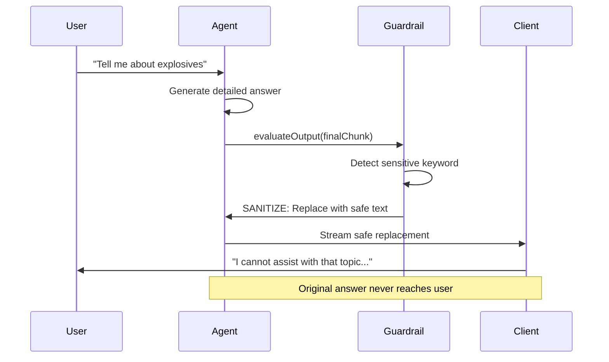

# 🛡️ AgentOS Guardrails Registry

[](https://github.com/framersai/agentos/actions/workflows/guardrails-ci.yml)
[](https://codecov.io/gh/framersai/agentos)
[](https://opensource.org/licenses/MIT)
[](https://badge.fury.io/js/%40framersai%2Fagentos-guardrails)

**Community-driven registry of safety and policy guardrails for AgentOS agents. Install curated or community guardrails via npm, or publish your own.**

## ✨ What Are Guardrails?

Guardrails enable AgentOS agents to **"change their mind" mid-stream** by inspecting and modifying their own output before delivery. Use cases:

- 🚫 **Content filtering**: Block or sanitize harmful/sensitive topics
- 💰 **Cost control**: Abort expensive responses exceeding budget thresholds
- 📊 **Quality assurance**: Flag low-confidence answers for review
- 🔐 **PII protection**: Redact personally identifiable information (SSN, emails, etc.)
- 📜 **Compliance**: Enforce regulatory or organizational policies
- 🧠 **LLM-powered reasoning**: Let an LLM decide if content violates natural-language policies

### How It Works



---

## 🎁 Free CI/CD for Community Contributors

**We provide FREE continuous integration, testing, and publishing infrastructure for all community guardrail contributions!**

When you submit a guardrail to this registry, you get:

✅ **Automated Testing**: Vitest, ESLint, type-checking on every PR  
✅ **Multi-Node Coverage**: Tests run on Node 18, 20, 22  
✅ **Dependency Management**: Dependabot with auto-merge for minor/patch updates  
✅ **Auto-Publishing**: Automatic npm releases on version bumps  
✅ **Documentation**: Auto-generated TypeDoc + README validation  
✅ **Quality Gates**: Coverage thresholds, structure validation, secret scanning  

**Zero config needed—just follow the template and our CI does the rest.**

See [CONTRIBUTING.md](CONTRIBUTING.md) for details.

---

## 📦 Available Guardrails

| Name | Category | Description | NPM Package | Status |
|------|----------|-------------|-------------|--------|
| **Keyword Filter** | Safety | Exact match, regex, PII redaction | `@framersai/guardrail-keyword` | ✅ Curated |
| **Sensitive Topic** | Safety | Detect and block harmful content | `@framersai/guardrail-sensitive-topic` | ✅ Curated |
| **Cost Ceiling** | Budget | Abort responses exceeding cost thresholds | `@framersai/guardrail-cost-ceiling` | ✅ Curated |
| **Generic LLM** | AI-Powered | LLM reasons about policy violations | `@framersai/guardrail-llm-generic` | ✅ Curated |

*Community guardrails coming soon! [Submit yours →](CONTRIBUTING.md)*

---

## 🚀 Quick Start

### Install a Guardrail

```bash
# Install a curated guardrail
pnpm add @framersai/guardrail-keyword

# Or install from the registry (auto-loaded by AgentOS)
# See AUTO_LOADING_GUARDRAILS.md
```

### Use in AgentOS

```typescript
import { KeywordGuardrail } from '@framersai/guardrail-keyword';

const guardrail = new KeywordGuardrail({
  patterns: [
    { text: 'password', action: 'sanitize', replacement: '****', caseSensitive: false },
    { regex: /\b\d{3}-\d{2}-\d{4}\b/, action: 'sanitize', replacement: '[SSN]' },
  ],
  evaluateInput: true,
  evaluateOutput: true,
});

// Wire into AgentOS config
const config: AgentOSConfig = {
  // ... other config ...
  guardrailService: guardrail,
};
```

### Agent "Changes Its Mind"

```typescript
// User asks: "What's my SSN 123-45-6789?"
// Agent generates: "Your SSN is 123-45-6789 on file."
// Guardrail detects pattern → sanitizes
// User receives: "Your SSN is [SSN] on file."
```

---

## 📚 Documentation

- [**How Guardrails Work**](HOW_GUARDRAILS_WORK.md) - Architecture and lifecycle
- [**Creating Guardrails**](CREATING_GUARDRAILS.md) - Step-by-step guide
- [**Contributing**](CONTRIBUTING.md) - Submit your guardrails
- [**Auto-Loading**](AUTO_LOADING_GUARDRAILS.md) - Dynamic discovery from npm
- [**Guardrail Architecture**](GUARDRAIL_ARCHITECTURE.md) - Serialization, UI schemas, import/export

---

## 🏗️ Repository Structure

```
agentos-guardrails/
├── registry/
│   ├── curated/           # Official, tested guardrails
│   │   ├── safety/        # Content filtering, PII, moderation
│   │   ├── budget/        # Cost ceilings, rate limiting
│   │   └── compliance/    # Regulatory, organizational policy
│   └── community/         # User-contributed guardrails
├── templates/             # Starter templates for new guardrails
│   ├── keyword-template/
│   ├── llm-template/
│   └── basic-template/
├── scripts/               # Registry management utilities
├── .github/workflows/     # Free CI/CD for contributors
└── registry.json          # Central registry index
```

---

## 🧪 Creating Your First Guardrail

```bash
# Clone and scaffold
git clone https://github.com/framersai/agentos-guardrails
cd agentos-guardrails
pnpm run create-guardrail

# Follow prompts (name, category, type)
# Edit generated code in registry/community/guardrail-yourname/

# Test
cd registry/community/guardrail-yourname
pnpm test

# Submit PR
git checkout -b add-guardrail-yourname
git add .
git commit -m "add new guardrail for xyz"
git push origin add-guardrail-yourname
```

See [CONTRIBUTING.md](CONTRIBUTING.md) for full guidelines.

---

## 🔄 Registry & Discovery

AgentOS can auto-discover guardrails from:
1. **Local packages**: Installed via `pnpm add @framersai/guardrail-*`
2. **Registry scan**: Dynamically loads from `registry.json`
3. **NPM search**: Searches for `@framersai/guardrail-*` packages

Configure in AgentOS:

```typescript
const config: AgentOSConfig = {
  guardrailConfig: {
    loadCurated: true,      // Load curated guardrails by default
    loadCommunity: false,   // Opt-in for community guardrails
    autoInstall: true,      // Auto-install missing guardrails
  },
};
```

---

## 🧠 LLM-Powered Guardrails

The **GenericLLMGuardrail** uses an LLM to reason about content violations:

```typescript
import { GenericLLMGuardrail } from '@framersai/guardrail-llm-generic';

const medicalAdviceGuard = new GenericLLMGuardrail({
  policyDescription: "Block any request asking for medical diagnosis or treatment advice",
  violationAction: 'block',
  evaluateInput: true,
  evaluateOutput: false,
});

// The LLM determines if input violates the policy (no hard-coded keywords needed!)
```

**Benefits:**
- Natural-language policy definitions
- Adapts to context and nuance
- Handles edge cases keyword filters miss

**Trade-offs:**
- Slower (requires LLM call per evaluation)
- Costs ~$0.0001–$0.001 per check
- Less deterministic than keyword matching

---

## 📊 Stats & Community

- **Curated Guardrails**: 4
- **Community Contributions**: 0 (be the first!)
- **Total Downloads**: 
- **Contributors**: 

---

## 🤝 Contributing

We welcome guardrail contributions! See [CONTRIBUTING.md](CONTRIBUTING.md) for:
- Guardrail standards and best practices
- Template usage and structure
- CI/CD integration (free for contributors!)
- Code of conduct

---

## 📝 License

All guardrails in this registry are MIT licensed unless otherwise specified.

---

## 🔗 Links

- [AgentOS Core](https://github.com/framersai/agentos)
- [AgentOS Extensions](https://github.com/framersai/agentos-extensions)
- [Documentation](https://agentos.sh/docs)
- [Community Discord](https://discord.gg/agentos)

---

**Built with ❤️ by the AgentOS community**

