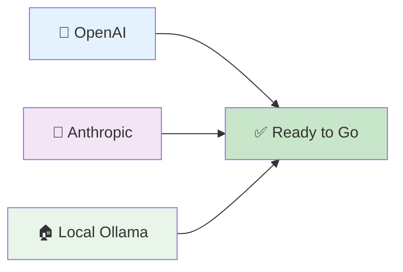
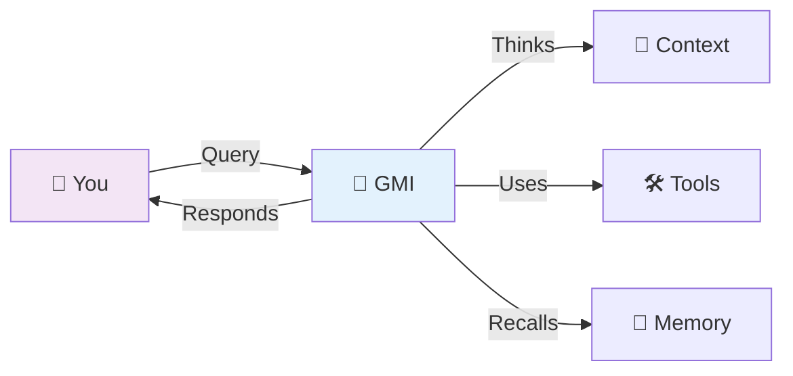
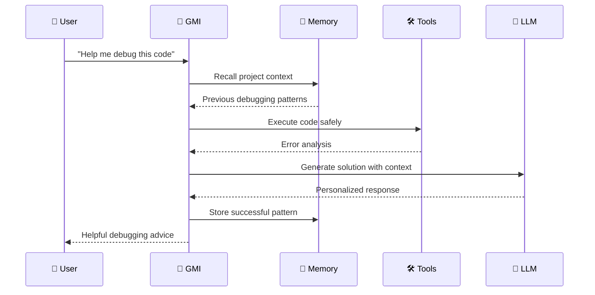
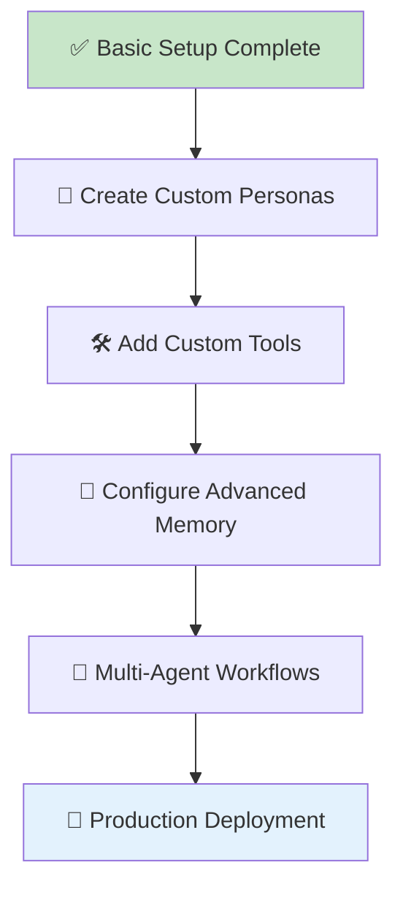

# 🚀 AgentOS Getting Started Guide

[](#) [](#)

> **Your complete guide to building intelligent AI agents with AgentOS - from zero to production in minutes**

---

## 🎯 Quick Start (5 Minutes)

| Step | Action | Time |
|------|--------|------|
| 1️⃣ | [Install AgentOS](#️-installation) | 2 min |
| 2️⃣ | [Configure API Keys](#-environment-setup) | 1 min |
| 3️⃣ | [Create Your First Agent](#-create-your-first-agent) | 2 min |

**🔗 Jump Ahead:**
- [📦 Installation](#️-installation) - Get AgentOS running
- [🎭 Create Agents](#-create-your-first-agent) - Build your first AI agent
- [🧠 Advanced Features](#-advanced-features) - Explore powerful capabilities
- [🛠️ Examples](#-example-projects) - Ready-to-use templates

---

## 📋 Table of Contents

- [🏁 Prerequisites](#-prerequisites)
- [📦 Installation](#️-installation)
- [🔧 Environment Setup](#-environment-setup)
- [🎭 Create Your First Agent](#-create-your-first-agent)
- [💡 Basic Concepts](#-basic-concepts)
- [🛠️ Example Projects](#️-example-projects)
- [🧠 Advanced Features](#-advanced-features)
- [🔧 Configuration](#-configuration)
- [❓ FAQ & Troubleshooting](#-faq--troubleshooting)
- [📚 Next Steps](#-next-steps)

---

## 🏁 Prerequisites

### **💻 System Requirements**

| Requirement | Minimum | Recommended |
|-------------|---------|-------------|
| **Node.js** | v18.0+ | v20.0+ |
| **RAM** | 4GB | 8GB+ |
| **Storage** | 2GB free | 5GB+ free |
| **OS** | Windows 10, macOS 10.15, Ubuntu 18.04+ | Latest versions |

### **🔑 API Keys (Choose One)**

You'll need at least one of these to get started:



- **🤖 OpenAI** (Recommended): Get API key from [platform.openai.com](https://platform.openai.com)
- **🧠 Anthropic**: Get API key from [console.anthropic.com](https://console.anthropic.com)
- **🏠 Local Ollama**: Free, runs on your machine - [Install Ollama](https://ollama.ai)

---

## 📦 Installation

### **⚡ Option 1: Quick Install (Recommended)**

```bash
# 🚀 One-command install
npx create-agentos@latest my-agent-project
cd my-agent-project
```

### **📥 Option 2: Manual Setup**

```bash
# Clone the repository
git clone https://github.com/agentos/agentos.git
cd agentos

# Install dependencies
npm install

# Build the project
npm run build

# Verify installation
npm run test:quick
```

### **🐳 Option 3: Docker Setup**

```bash
# Pull and run AgentOS container
docker run -p 3000:3000 -p 8080:8080 agentos/agentos:latest

# Or with docker-compose
curl -O https://raw.githubusercontent.com/agentos/agentos/main/docker-compose.yml
docker-compose up -d
```

### **✅ Verify Installation**

```bash
# Check AgentOS version
agentos --version

# Run health check
agentos health-check
```

Expected output:
```
✅ AgentOS v2.2 installed successfully
✅ All core components healthy
✅ Ready to create agents!
```

---

## 🔧 Environment Setup

### **🔑 Configure API Keys**

Create a `.env` file in your project root:

```bash
# Copy the example environment file
cp .env.example .env
```

Edit `.env` with your preferred provider:

```bash
# 🤖 OpenAI (Most Popular)
OPENAI_API_KEY=sk-your-openai-key-here

# 🧠 Anthropic Claude
ANTHROPIC_API_KEY=sk-ant-your-anthropic-key

# 🏠 Local Ollama (Free)
OLLAMA_BASE_URL=http://localhost:11434
OLLAMA_DEFAULT_MODEL=llama2

# 💾 Vector Storage (Optional - starts with in-memory)
PINECONE_API_KEY=your-pinecone-key
PINECONE_ENVIRONMENT=us-west1-gcp

# 🌐 Web Search (Optional)
SERP_API_KEY=your-serp-api-key
```

### **🏠 Local Setup (No API Keys Required)**

Want to try AgentOS without external APIs? Use Ollama:

```bash
# Install Ollama
curl -fsSL https://ollama.ai/install.sh | sh

# Download a model (choose one)
ollama pull llama2          # 3.8GB - Good for testing
ollama pull codellama       # 3.8GB - Great for coding
ollama pull mistral         # 4.1GB - Balanced performance

# Verify Ollama is running
curl http://localhost:11434/api/version
```

---

## 🎭 Create Your First Agent

### **🌟 The 30-Second Agent**

Create an agent with just natural language:

```bash
# Using the AgentOS CLI
agentos create-agent "Helpful coding assistant with web search and code execution"
```

Or programmatically:

```typescript
import { AgentOS } from '@agentos/core';

// 🚀 Initialize AgentOS
const agentOS = new AgentOS({
  llmProvider: 'openai', // or 'anthropic', 'ollama'
  apiKey: process.env.OPENAI_API_KEY
});

// 🎯 Create agent from natural language
const codingAgent = await agentOS.createAgent(`
# Expert Coding Assistant - web search, code execution, remembers project context

Create a senior-level programming assistant that can:
- Review and write code in multiple languages
- Execute code safely for testing
- Search the web for documentation and examples  
- Remember project details and coding patterns across sessions
- Provide detailed explanations that adapt to user skill level

Communication: Direct and technical, with working examples
Safety: Technical discussions allowed, always validate before execution
`);

// 💬 Start chatting with your agent
const response = await codingAgent.process({
  input: "Help me build a REST API with Node.js and Express",
  context: { 
    userSkillLevel: 'intermediate',
    projectType: 'web_api' 
  }
});

console.log(response.content);
```

### **📱 Web Interface Setup**

Start the AgentOS web interface:

```bash
# Start the development server
npm run dev

# Or production server
npm run start
```

Open [http://localhost:3000](http://localhost:3000) and you'll see:

```
🎯 AgentOS Agent Creator

┌─────────────────────────────────────────────┐
│ Describe your ideal AI assistant:           │
│                                             │
│ "Expert data scientist with Python,        │
│  visualization tools, and web search.      │
│  Friendly but professional communication." │
│                                             │
│              [Create Agent]                 │
└─────────────────────────────────────────────┘
```

---

## 💡 Basic Concepts

### **🧠 What is a GMI (Generalized Mind Instance)?**



A GMI is your AI agent - it has:
- **🎭 Personality**: How it communicates and behaves
- **🧠 Intelligence**: Problem-solving and reasoning capabilities  
- **💾 Memory**: Remembers conversations and learns patterns
- **🛠️ Tools**: Can use external services and APIs
- **🔄 Adaptation**: Gets better over time through interaction

### **🎯 Core Components**

| Component | Purpose | Example |
|-----------|---------|---------|
| **🎭 Persona** | Agent's personality and behavior | "Friendly coding mentor" |
| **🧠 Prompts** | How the agent thinks and responds | Dynamic, context-aware |
| **💾 Memory** | Long-term knowledge and context | Project details, preferences |
| **🛠️ Tools** | External capabilities | Web search, code execution |

### **🔄 How It All Works**



---

## 🛠️ Example Projects

### **1️⃣ Personal Coding Assistant**

```typescript
const codingAssistant = await agentOS.createAgent(`
# Senior Developer Mentor - code execution, web search, project memory

A patient, experienced developer who:
- Reviews code with constructive feedback
- Explains complex concepts clearly
- Helps debug issues step-by-step
- Remembers your coding style and preferences
- Provides working examples and best practices

Tools: code_execution, web_search, documentation_access
Memory: coding_patterns, project_context, learning_progress
Communication: Encouraging and detailed, adapts to your experience level
`);

// Example usage
const response = await codingAssistant.process({
  input: "I'm getting a 'Cannot read property of undefined' error in my React component",
  files: ["src/components/UserProfile.jsx"],
  context: { framework: 'react', experience: 'intermediate' }
});
```

### **2️⃣ Research Assistant**

```typescript
const researcher = await agentOS.createAgent(`
# Academic Research Assistant - web search, data analysis, citation tools

Professional research aide that:
- Conducts thorough literature reviews
- Analyzes data and identifies patterns  
- Provides properly formatted citations
- Summarizes complex academic papers
- Tracks research progress and notes

Tools: web_search, academic_databases, citation_formatter, data_analysis
Memory: research_topics, source_tracking, methodology_notes
Communication: Academic tone with clear summaries
`);
```

### **3️⃣ Business Analyst**

```typescript
const analyst = await agentOS.createAgent(`
# Senior Business Analyst - data visualization, market research, financial modeling

Strategic business partner that:
- Analyzes market trends and competitors
- Creates financial models and projections
- Generates executive-ready reports
- Provides actionable business insights
- Handles confidential business data securely

Tools: data_analysis, web_search, chart_generation, financial_modeling
Memory: business_context, client_preferences, analysis_patterns
Communication: Executive-level professional with data-driven insights
Safety: Confidential business data handling protocols
`);
```

### **4️⃣ Creative Writing Partner**

```typescript
const writer = await agentOS.createAgent(`
# Creative Writing Collaborator - web research, style analysis, editing tools

Imaginative writing partner that:
- Brainstorms creative ideas and plots
- Helps develop characters and worlds
- Provides style and grammar feedback
- Researches historical/technical details
- Remembers your writing projects and preferences

Tools: web_search, style_analyzer, grammar_checker, reference_lookup
Memory: writing_projects, character_development, style_preferences
Communication: Creative and inspiring, adapts to your writing genre
`);
```

---

## 🧠 Advanced Features

### **🎯 Dynamic Prompting**

Your agents automatically adapt their responses based on:

```typescript
// Agent automatically detects and adapts to:
const context = {
  userSkillLevel: 'beginner',     // Provides simpler explanations
  taskComplexity: 'high',         // Uses step-by-step approach
  userMood: 'frustrated',         // More patient and encouraging
  projectType: 'web_development', // Domain-specific knowledge
  timeOfDay: 'late_night'         // Concise, focused responses
};
```

### **💾 Intelligent Memory**

```typescript
// Your agent remembers and learns from:
const memoryCategories = [
  'user_preferences',        // How you like to work
  'project_context',         // Current project details
  'successful_patterns',     // What worked well before
  'learning_progress',       // Your skill development
  'conversation_history'     // Previous interactions
];

// Memory automatically managed with policies
const memoryConfig = {
  retention: '6_months',           // How long to keep information
  importance: 'auto_assessed',     // AI determines what's important
  privacy: 'user_controlled',      // You control what's stored
  sharing: 'project_scoped'        // Memory shared within projects
};
```

### **🛠️ Tool Integration**

```typescript
// Built-in tools available to all agents:
const availableTools = [
  'web_search',          // Real-time information lookup
  'code_execution',      // Safe code running and testing
  'file_management',     // Read/write project files
  'data_analysis',       // Process and visualize data
  'image_generation',    // Create visual content
  'api_integration',     // Connect to external services
  'calculation',         // Mathematical computations
  'translation',         // Multi-language support
];

// Custom tools are easy to add:
const customTool = {
  name: 'database_query',
  description: 'Query your project database',
  execute: async (query: string) => {
    return await yourDatabase.query(query);
  }
};
```

### **🔄 Self-Improvement**

```typescript
// Agents learn and improve through:
const learningMechanisms = {
  userFeedback: 'continuous',      // Learn from your corrections
  outcomeTracking: 'automatic',    // Track what works
  patternRecognition: 'enabled',   // Identify successful approaches
  crossSessionLearning: 'true',    // Improve across conversations
  peerLearning: 'optional'         // Learn from other agents
};
```

---

## 🔧 Configuration

### **⚙️ Basic Configuration**

```typescript
// agentos.config.js
export default {
  // 🤖 LLM Provider Settings
  llm: {
    primaryProvider: 'openai',
    fallbackProvider: 'anthropic',
    modelSelection: 'auto',        // Let AgentOS choose optimal model
    costOptimization: true
  },
  
  // 💾 Memory Configuration
  memory: {
    vectorStore: 'pinecone',       // 'pinecone', 'weaviate', or 'local'
    retentionPolicy: '6_months',
    maxDocuments: 10000,
    embeddingModel: 'text-embedding-ada-002'
  },
  
  // 🛠️ Tool Settings
  tools: {
    webSearch: {
      enabled: true,
      provider: 'serp',            // 'serp', 'google', or 'bing'
      safeSearch: true
    },
    codeExecution: {
      enabled: true,
      timeout: 30000,              // 30 seconds max
      allowedLanguages: ['python', 'javascript', 'bash']
    }
  },
  
  // 🔐 Security Settings
  security: {
    dataEncryption: true,
    auditLogging: true,
    rateLimiting: {
      requestsPerMinute: 100,
      tokensPerHour: 100000
    }
  }
};
```

### **🎯 Environment-Specific Configs**

```bash
# 🧪 Development
NODE_ENV=development
LOG_LEVEL=debug
ENABLE_PLAYGROUND=true
HOT_RELOAD=true

# 🚀 Production  
NODE_ENV=production
LOG_LEVEL=info
ENABLE_MONITORING=true
CACHE_ENABLED=true
```

---

## ❓ FAQ & Troubleshooting

### **🔧 Common Issues**

| Issue | Solution | Prevention |
|-------|----------|------------|
| **"API key not found"** | Check `.env` file exists with correct key | Use `.env.example` as template |
| **"Model not available"** | Verify provider supports the model | Use `agentos list-models` |
| **"Out of memory"** | Reduce memory retention or upgrade plan | Monitor usage with `agentos stats` |
| **"Tools not working"** | Check tool permissions and dependencies | Review tool configuration |

### **🚨 Quick Fixes**

```bash
# 🔍 Debug connection issues
agentos debug-connection

# 🧹 Clear cache and restart
agentos cache-clear
agentos restart

# 📊 Check system status
agentos system-health

# 🔧 Reset configuration
agentos config-reset --backup
```

### **💡 Performance Tips**

```markdown
## 🚀 Optimization Tips

### Memory Usage
- Set appropriate retention policies for your use case
- Use memory categories to organize information efficiently
- Regular cleanup of unused agents and conversations

### Cost Management  
- Use local models (Ollama) for development
- Set usage limits and monitoring alerts
- Choose appropriate models for different tasks

### Response Speed
- Enable caching for frequently used prompts
- Use streaming responses for long-form content
- Optimize tool configurations for your workflow
```

### **🆘 Getting Help**

```markdown
## 🤝 Support Channels

- 📚 **Documentation**: [docs.agentos.ai](https://docs.agentos.ai)
- 💬 **Discord Community**: [discord.gg/agentos](https://discord.gg/agentos)  
- 🐛 **GitHub Issues**: [github.com/agentos/agentos/issues](https://github.com/agentos/agentos/issues)
- 📧 **Email Support**: support@agentos.ai
- 🎥 **Video Tutorials**: [youtube.com/agentos](https://youtube.com/agentos)
```

---

## 📚 Next Steps

### **🎓 Learning Path**



### **📖 Recommended Reading**

| Topic | Documentation | Time |
|-------|---------------|------|
| **🎯 Advanced Prompting** | [Prompting System Guide](docs/PROMPTS.md) | 20 min |
| **💾 Memory Management** | [RAG System Documentation](docs/RAG.md) | 15 min |
| **🔧 Provider Setup** | [LLM Provider System](backend/agentos/core/llm/providers/README.md) | 10 min |
| **🏗️ Architecture** | [Technical Deep Dive](docs/ARCHITECTURE.md) | 30 min |

### **🛠️ Project Ideas**

Try building these progressively more complex projects:

#### **🟢 Beginner Projects**
- **Personal Assistant**: Schedule management and reminders
- **Study Buddy**: Q&A and explanation helper  
- **Code Reviewer**: Basic code feedback and suggestions

#### **🟡 Intermediate Projects**
- **Research Assistant**: Literature review and citation management
- **Data Analyst**: CSV analysis and visualization
- **Content Creator**: Blog post and social media helper

#### **🔴 Advanced Projects**
- **Business Intelligence**: Market analysis and reporting
- **Multi-Agent System**: Coordinated agents for complex workflows
- **Custom Domain Expert**: Specialized knowledge for your industry

### **🚀 Production Deployment**

Ready to deploy? Check out:

```bash
# 🐳 Docker deployment
agentos deploy --platform docker

# ☁️ Cloud deployment  
agentos deploy --platform aws
agentos deploy --platform gcp
agentos deploy --platform azure

# 🔧 Configuration management
agentos config --env production
agentos secrets --encrypt
```

---

## 🎉 You're Ready!

Congratulations! You now have AgentOS running and know how to:

- ✅ **Create intelligent agents** from natural language descriptions
- ✅ **Configure memory and tools** for your specific needs
- ✅ **Customize behavior** with advanced prompting features
- ✅ **Debug and optimize** your agent's performance
- ✅ **Scale to production** when you're ready

### **🔥 What's Next?**

```markdown
1. 🎯 **Build Your First Real Agent** - Solve a problem you actually have
2. 🤝 **Join the Community** - Share your creations and get help  
3. 🚀 **Contribute Back** - Help make AgentOS even better
4. 📈 **Scale Your Solutions** - Deploy agents that make a real impact
```

---

## 📄 Quick Reference

### **🔑 Essential Commands**

```bash
# Agent Management
agentos create-agent "description"    # Create new agent
agentos list-agents                   # Show all agents  
agentos chat <agent-name>            # Start conversation
agentos delete-agent <agent-name>    # Remove agent

# System Management
agentos status                       # System health
agentos logs                        # View system logs
agentos update                      # Update AgentOS
agentos backup                      # Backup your data

# Development
agentos dev                         # Start dev server
agentos test                        # Run tests
agentos debug <agent-name>          # Debug agent
agentos playground                  # Interactive testing
```

### **🔗 Quick Links**

- **[📖 Main Documentation](../README.md)** - Complete AgentOS overview
- **[🎯 Prompting Guide](docs/PROMPTS.md)** - Advanced agent customization
- **[💾 Memory System](docs/RAG.md)** - Intelligent knowledge management
- **[🔧 Provider Setup](backend/agentos/core/llm/providers/README.md)** - LLM integration
- **[🧠 Architecture](docs/ARCHITECTURE.md)** - Technical deep dive

---

<div align="center">

**🚀 Welcome to the Future of AI Agents**

*You're now equipped to build intelligent agents that understand, remember, and adapt*

[⭐ Star on GitHub](https://github.com/agentos/agentos) • [💬 Join Discord](https://discord.gg/agentos) • [📧 Newsletter](https://agentos.ai/newsletter)

**Happy Building! 🎉**

</div>