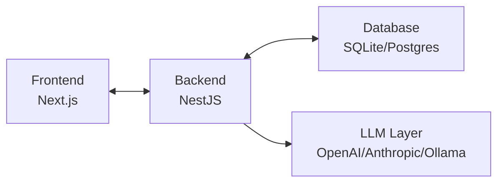
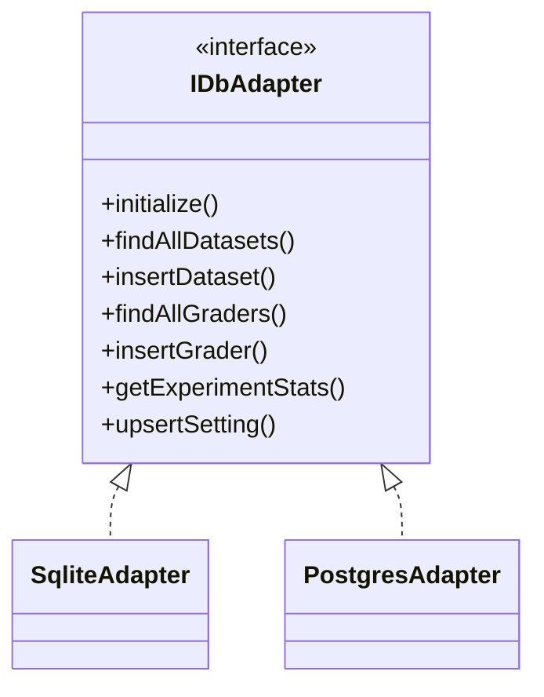
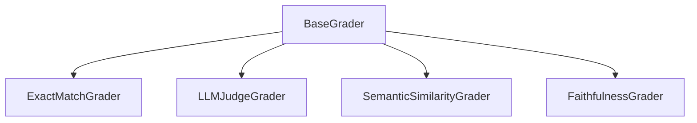
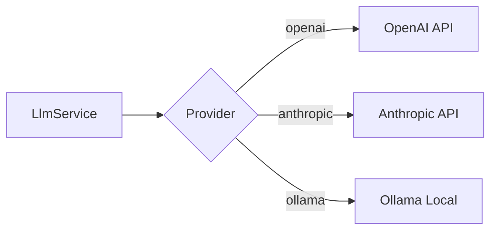
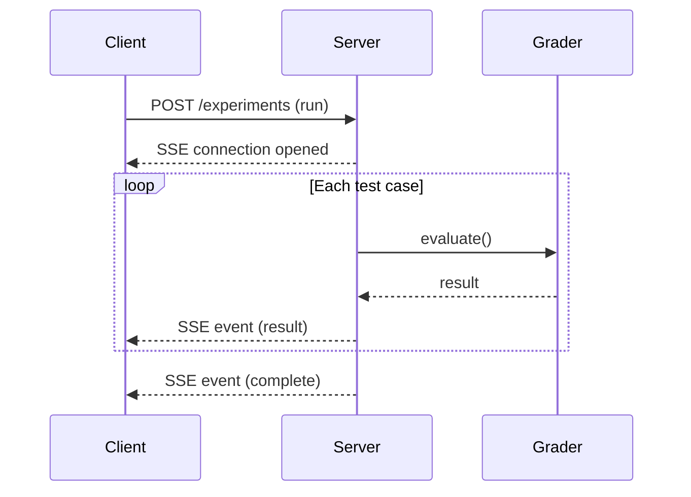
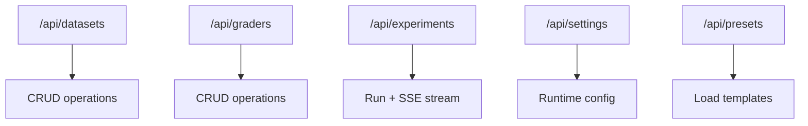

# Architecture

Technical design decisions and rationale for the eval harness.

---

## Overview

This harness evaluates AI outputs against test cases using configurable graders. The architecture prioritizes simplicity, extensibility, and developer experience.



---

## Database: Why Drizzle + SQLite?

**Drizzle ORM** was chosen because it's dialect-agnostic. The same schema definition works with SQLite (development) and PostgreSQL (production) with minimal changes—just swap the driver.

This matters for a skills demo: SQLite means zero setup (no Docker, no database server), but the code is production-ready if you want to scale later.

Schema uses straightforward relational design:
- `datasets` → `test_cases` (one-to-many)
- `experiments` → `experiment_results` (one-to-many)
- `experiment_results` references both `test_cases` and `graders`

Custom fields on test cases are stored as JSON in a `metadata` column—flexible without schema migrations.

### Database Adapter Interface

The database layer uses an adapter pattern for dialect-agnostic operations:



**References:**
- Drizzle ORM: https://orm.drizzle.team/
- Drizzle dialect switching: https://orm.drizzle.team/docs/sql-schema-declaration

---

## Grader System

The grader system draws inspiration from several established evaluation frameworks, adapted into a clean TypeScript implementation.

### Base Abstraction

```typescript
interface GraderResult {
  pass: boolean;
  score: number;  // 0.0 - 1.0
  reason: string;
}

abstract class BaseGrader {
  abstract evaluate(input: string, output: string, expected?: string): Promise<GraderResult>;
}
```

All graders extend this base. The interface is intentionally minimal—input, output, optional expected, returns pass/fail with a reason.

### Grader Types



**ExactMatchGrader**
Simplest grader. Compares output to expected string. Supports case-insensitive matching and whitespace normalization as options.

**LLMJudgeGrader**
Uses an LLM to evaluate output against a user-provided rubric. The prompt template asks the model to return a structured response with pass/fail and reasoning. This pattern is common in prompt engineering workflows where deterministic matching isn't sufficient.

Inspired by promptfoo's LLM assertion pattern (https://promptfoo.dev/docs/configuration/expected-outputs#llm-rubric).

**SemanticSimilarityGrader**
Generates embeddings for both output and expected, then computes cosine similarity. Pass if similarity exceeds a configurable threshold (default: 0.8). Useful when exact wording doesn't matter but meaning should align.

Uses the same embedding model as the LLM provider (OpenAI's text-embedding-3-small, or local alternatives via Ollama).

**FaithfulnessGrader**
Inspired by the RAGAS framework's faithfulness metric. The process:

1. Extract factual claims from the output
2. For each claim, verify whether it's supported by the provided context
3. Score = (supported claims) / (total claims)
4. Pass if score exceeds threshold

This catches hallucinations—outputs that sound plausible but aren't grounded in the source material.

**References:**
- RAGAS paper: https://arxiv.org/abs/2309.15217
- RAGAS docs: https://docs.ragas.io/en/stable/concepts/metrics/faithfulness.html
- DeepEval (similar patterns): https://docs.confident-ai.com/

---

## LLM Layer

The LLM service provides a unified interface over multiple providers (OpenAI, Anthropic, Ollama). Provider switching happens via environment variables or runtime settings—no code changes required.



Key benefits:
- Provider switching without code changes
- Structured outputs via response schemas
- Built-in retry and fallback logic
- Streaming support for real-time feedback

For local development, Ollama integration lets you run models without API costs or rate limits.

---

## Real-Time Updates: Why SSE?

When running experiments, users need to see progress as each grader completes.



**Polling** — Client repeatedly asks "done yet?" every N seconds. Simple but wasteful. Creates server load and introduces latency.

**WebSockets** — Full bidirectional communication. Overkill here. The client doesn't need to send anything during an experiment.

**SSE (Server-Sent Events)** — Server pushes updates over a long-lived HTTP connection. Advantages:
- One-way is exactly what we need (server → client)
- Auto-reconnect built into browser API
- Runs over plain HTTP—no proxy issues
- NestJS has a simple `@Sse()` decorator

**References:**
- MDN EventSource: https://developer.mozilla.org/en-US/docs/Web/API/EventSource
- NestJS SSE: https://docs.nestjs.com/techniques/server-sent-events

---

## API Documentation

The backend exposes a REST API with OpenAPI/Swagger documentation available at `/api/docs`.



---

## Frontend Design

The UI uses Tailwind CSS with a clean monochromatic design—focus on the data.

Six tabs:
- **Datasets**: CRUD for test cases
- **Graders**: CRUD for evaluation criteria
- **Experiments**: Run and view results
- **Stats**: Aggregate metrics and trends
- **Settings**: Runtime LLM configuration
- **About**: Documentation and references

State persists in SQLite. Settings can be configured at runtime without .env changes.

**References:**
- Tailwind CSS: https://tailwindcss.com/
- Next.js: https://nextjs.org/docs

---

## Testing Strategy

**Unit tests** cover grader logic with mocked LLM responses. This verifies the evaluation logic works correctly without hitting external APIs.

**Integration tests** cover full CRUD flows and experiment execution against a test SQLite database.

Jest is the test runner—industry standard, good NestJS integration.

---

## References

- Drizzle ORM: https://orm.drizzle.team/
- promptfoo: https://promptfoo.dev/docs
- RAGAS: https://arxiv.org/abs/2309.15217
- DeepEval: https://docs.confident-ai.com/
- NestJS: https://docs.nestjs.com/
- Next.js: https://nextjs.org/docs
