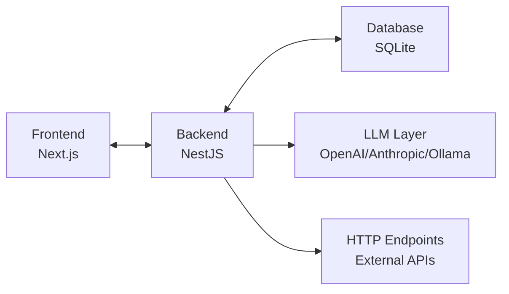
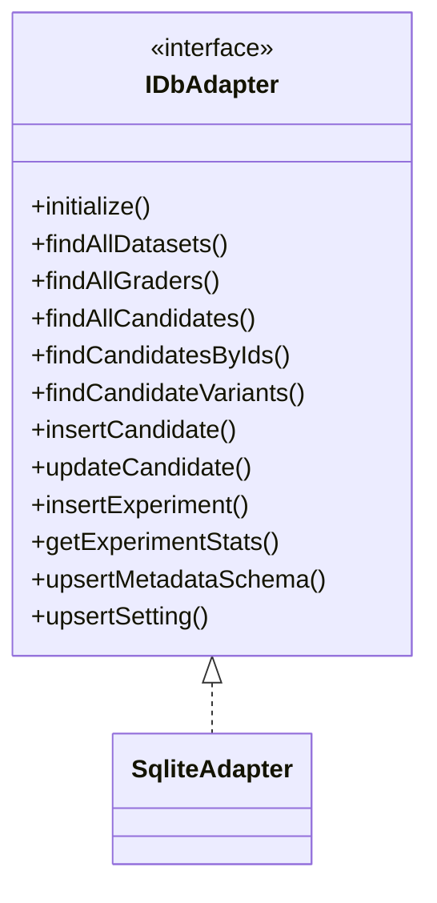
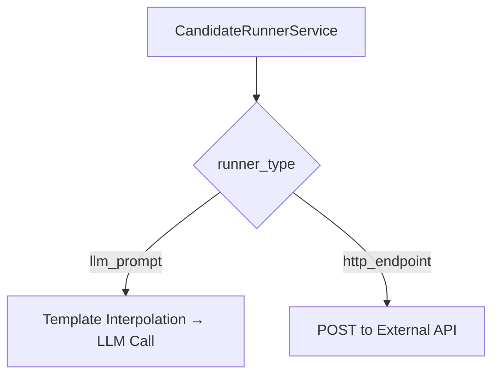
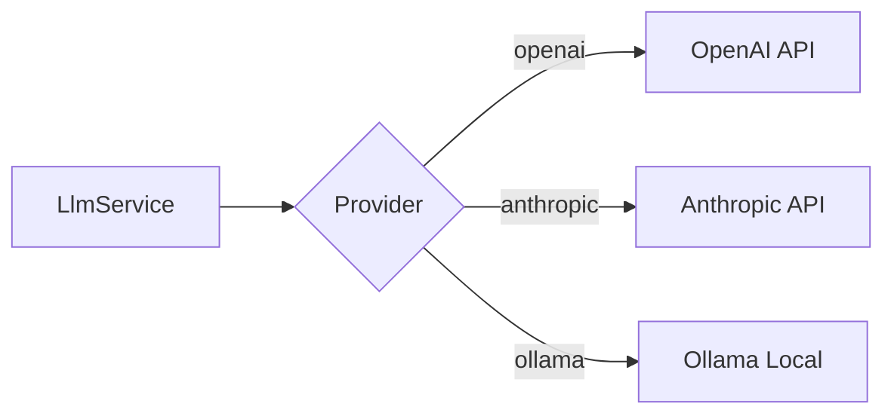
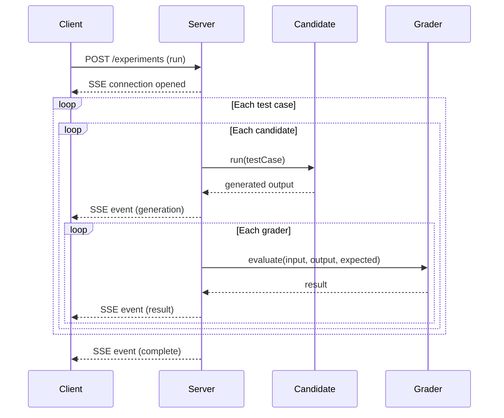
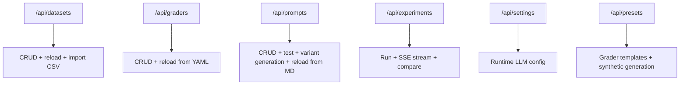

# Architecture

Technical design decisions and rationale for the eval harness.

---

## Overview

This harness evaluates AI outputs against test cases using configurable graders. Experiments run as `dataset × candidates × graders` — candidates produce output, graders evaluate it. The architecture prioritizes simplicity, extensibility, and developer experience.



---

## Database: Why Drizzle + SQLite?

**Drizzle ORM** keeps the schema definition portable across SQL dialects.
This repo currently ships a SQLite adapter (`DB_TYPE=sqlite`). A PostgreSQL adapter is planned (`DB_TYPE=postgres` currently errors) but the schema is written with portability in mind.

This matters for a skills demo: SQLite means zero setup (no Docker, no database server), but the code is production-ready if you want to scale later.

### Storage Model: Disk vs SQLite

There are two categories of data, stored in different places:

**Disk (source of truth for definitions)** — human-editable, git-trackable:

| What                 | Format                         | Directory           | Editable via                                          |
| -------------------- | ------------------------------ | ------------------- | ----------------------------------------------------- |
| Datasets             | `.csv` + optional `.meta.json` | `backend/datasets/` | Any text editor, spreadsheet, or UI upload            |
| Candidates (prompts) | `.md` with YAML frontmatter    | `backend/prompts/`  | Text editor, UI detail page, or AI variant generation |
| Graders              | `.yaml`                        | `backend/graders/`  | Text editor or UI                                     |

All CRUD operations (create, update, delete) write back to disk immediately. The `DatasetLoaderService`, `PromptLoaderService`, and `GraderLoaderService` read files on startup and keep an in-memory cache that stays in sync with disk writes.

**Variants** are regular `.md` files stored alongside their parent in the same **prompt family folder** under `backend/prompts/`:

- `backend/prompts/{family}/base.md` is the parent prompt (ID = `{family}`)
- `backend/prompts/{family}/{variant}.md` is a variant (ID = `{family}-{variant}`)

Variants can be created manually, via the UI, or via AI generation — all methods write a `.md` file to disk. Delete a variant by removing its file or using the UI delete button.

**SQLite (runtime data only)** — not human-editable, disposable:

| What                 | Purpose                                                       |
| -------------------- | ------------------------------------------------------------- |
| `experiments`        | Experiment run configs (dataset, candidates, graders, status) |
| `experiment_results` | Individual grader evaluations per test case per candidate     |
| `settings`           | Runtime LLM config (provider, model, API key, temperature)    |

The database file lives at `backend/data/evals.sqlite` (configurable via `DATABASE_PATH`). You can safely delete it to start fresh — all definitions (prompts, graders, datasets) live on disk and reload automatically.

Schema tables for datasets, test cases, and graders exist primarily for experiment history and exports. Disk is still the source of truth: loader services read definitions from files, and experiments opportunistically insert missing dataset/test case/grader rows into SQLite as needed. (Candidate rows are currently not persisted.)

Schema uses straightforward relational design:

- `experiments` → `experiment_results` (one-to-many)
- `experiment_results` references test case IDs (CSV-derived), grader IDs (YAML-derived), and optionally candidates

### Database Adapter Interface

The database layer uses an adapter pattern for dialect-agnostic operations:



SQLite adapter includes `migrateColumns()` for seamless upgrades of existing databases when new columns are added.

**References:**

- Drizzle ORM: https://orm.drizzle.team/
- Drizzle dialect switching: https://orm.drizzle.team/docs/sql-schema-declaration

---

## Grader System

Graders are YAML files in `backend/graders/`. The `GraderLoaderService` reads them on startup and provides CRUD operations that write back to YAML. Each grader defines an evaluation strategy, configuration, and optionally the research that inspired it.

### Storage Format

```yaml
# backend/graders/faithfulness.yaml
name: Faithfulness
description: Checks that response claims are grounded in provided context.
  Adjust threshold in the UI.
type: promptfoo
config:
  assertion: context-faithfulness
  threshold: 0.8
```

### Base Abstraction

```typescript
interface GraderResult {
  pass: boolean;
  score: number; // 0.0 - 1.0
  reason: string;
}

abstract class BaseGrader {
  abstract evaluate(input: EvalInput): Promise<GraderResult>;
}
```

All graders extend this base. The interface is minimal—input, output, optional expected/context, returns pass/fail with a reason.

### Grader Types

**Deterministic Graders:**

| Type          | Description                    | Inspired By                              |
| ------------- | ------------------------------ | ---------------------------------------- |
| `exact-match` | Binary string equality         | SQuAD EM metric (Rajpurkar et al., 2016) |
| `contains`    | Checks for required substrings | HELM (Liang et al., 2022)                |
| `regex`       | Pattern matching               | Standard eval pattern                    |
| `json-schema` | Validates JSON structure       | Function calling benchmarks              |

**LLM-Powered Graders (implemented in `backend/src/eval-engine/`):**

| Type                  | Description                       | Inspired By                              |
| --------------------- | --------------------------------- | ---------------------------------------- |
| `llm-judge`           | Evaluates against a custom rubric | LLM-as-Judge (Zheng et al., 2023)        |
| `semantic-similarity` | Embedding cosine distance         | Sentence-BERT (Reimers & Gurevych, 2019) |

**Promptfoo-Backed Graders:**

| Type        | Description                                                                  | Inspired By              |
| ----------- | ---------------------------------------------------------------------------- | ------------------------ |
| `promptfoo` | Wraps promptfoo's assertion types (RAGAS metrics, llm-rubric, similar, etc.) | promptfoo (MIT licensed) |

The `promptfoo` grader type delegates to promptfoo's battle-tested assertion engine. Configure the `assertion` in the grader's config:

```yaml
# RAGAS-style metrics via promptfoo
type: promptfoo
config:
  assertion: context-faithfulness  # or answer-relevance, context-relevance, context-recall
  threshold: 0.7

# LLM-as-judge via promptfoo
type: promptfoo
config:
  assertion: llm-rubric
  threshold: 0.7
rubric: "Evaluate accuracy, helpfulness, and clarity."

# Semantic similarity via promptfoo
type: promptfoo
config:
  assertion: similar
  threshold: 0.8
```

**Why promptfoo?** Rather than reimplementing complex metrics like RAGAS (claim extraction + NLI verification), we delegate to promptfoo's production-tested implementations. Benefits:

- MIT licensed, actively maintained
- Many assertion types including RAGAS-style metrics
- Saves significant development and maintenance effort

### Research References

- **RAGAS** — Es et al. 2023. "Automated Evaluation of Retrieval Augmented Generation." Faithfulness, answer relevancy, and context relevancy metrics. https://arxiv.org/abs/2309.15217
- **LLM-as-Judge** — Zheng et al. 2023. "Judging LLM-as-a-Judge with MT-Bench and Chatbot Arena." Rubric-based LLM evaluation. https://arxiv.org/abs/2306.05685
- **Sentence-BERT** — Reimers & Gurevych 2019. Sentence embeddings for semantic similarity. https://arxiv.org/abs/1908.10084
- **SQuAD** — Rajpurkar et al. 2016. Reading comprehension benchmark introducing EM/F1 metrics. https://arxiv.org/abs/1606.05250
- **HELM** — Liang et al. 2022. Holistic evaluation of language models. https://arxiv.org/abs/2211.09110
- **promptfoo** — Open-source LLM eval framework. Provides the assertion engine for the `promptfoo` grader type, including all RAGAS-style metrics. https://promptfoo.dev
- **DeepEval** — Python-based eval framework with similar RAGAS-style metric implementations. https://docs.confident-ai.com/

---

## Candidate System

Candidates define **how to produce output** for each test case. This turns experiments from `dataset × graders` into `dataset × candidates × graders`.

### Runner Types



**LLM Prompt Runner**

Interpolates template variables and calls the configured LLM:

- `{{input}}` — test case input
- `{{context}}` — test case context
- `{{expected}}` — expected output (for few-shot patterns)
- `{{metadata.field}}` — dot notation access into test case metadata JSON

Supports per-candidate model config overrides (provider, model, temperature, maxTokens).

**HTTP Endpoint Runner**

POSTs to an external API with an interpolated JSON body template. Parses the response looking for `output`, `response`, `text`, or `result` fields. Useful for testing real pipelines.

### Variant Lineage

Candidates can reference a `parentId` to form a variant tree, tracking prompt iteration history. `variantLabel` provides a human-readable description of what changed.
Variants can be created manually or generated in batches via `POST /api/prompts/:id/variants/generate`, with per-request generation config that falls back to runtime Settings defaults.

### Presets

Candidates are file-based markdown prompts in `backend/prompts/` (base prompts + variants). See the on-disk prompt files for the current set of included examples.

### Backwards Compatibility

`candidateIds` is nullable on experiments and `candidateId` is nullable on results. When no candidates are selected, experiments fall back to grading `expectedOutput` directly (legacy behavior).

---

## Roadmap: Retrieval-Augmented Generation (RAG)

**Current state:** The harness evaluates RAG-style behavior when context is already present in the dataset (`context` column). During an experiment, the `context` string is passed into graders (e.g. `context-faithfulness`, `context-relevance`, `context-recall`) and can be interpolated into prompt templates via `{{context}}`. The harness does **not** perform retrieval today.

**Future state:** Make retrieval a first-class part of candidate execution.

### Backend Integration Points

This repo already includes a retrieval contract:

- `backend/src/retrieval/retrieval.interfaces.ts` defines `IRetrievalService` (`ingest`, `retrieve`, `healthCheck`) plus `RetrievalConfig` and `RetrievedChunk`.
- `backend/src/retrieval/retrieval.module.ts` is a stub module intended to be imported by `CandidatesModule`.

Planned execution flow for a new runner type (e.g. `rag_prompt`):

1. `CandidateRunnerService.run()` calls `RetrievalService.retrieve(testCase.input, candidate.retrievalConfig)`
2. It builds a `context` string from retrieved chunks (and optionally a structured chunk list for audit/debug)
3. It interpolates `{{context}}` into the prompt template and calls `LlmService.complete()`
4. It grades using the retrieved context (not a pre-loaded dataset context), enabling end-to-end retrieval evaluation

### Storage & Auditability

To keep experiments reproducible and debuggable, retrieval traces should be persisted per `(experimentId, testCaseId, candidateId)`, including:

- query (possibly rewritten)
- latency
- retrieved chunks (content + score + source metadata)

This could be stored as JSON on the existing result rows or as a dedicated `retrieval_runs` table referenced by `experiment_results`.

### UI/UX Extensions (Building On What Exists)

- **Datasets**: add a "Sources" area and an "Index" action to ingest/chunk/embed documents.
- **Candidates**: add retrieval configuration fields (method, topK, thresholds, chunking, vector store) alongside the existing model/template config and variant workflows.
- **Experiments**: show retrieved context and chunk metadata in the existing result detail UI so "bad retrieval vs bad generation vs bad grading" is visible immediately.

### Synthetic RAG Dataset Generation

The existing synthetic dataset generator (`backend/src/presets/synthetic.service.ts`) can be extended to support RAG-specific fixtures, for example:

- generate a small synthetic corpus (documents + metadata)
- generate question/answer test cases with `expected_output`
- optionally include "gold" context/citations in dataset metadata for recall-style grading and debugging

---

## LLM Layer

The LLM service provides a unified interface over multiple providers (OpenAI, Anthropic, Ollama). Provider switching happens via environment variables or runtime settings—no code changes required.



Key benefits:

- Provider switching without code changes
- Per-candidate overrides (provider/model/apiKey/baseUrl) on top of global Settings
- Embeddings support for semantic similarity (OpenAI/Ollama, with fallback behavior for providers without embeddings)

For local development, Ollama integration lets you run models without API costs or rate limits.

---

## Real-Time Updates: Why SSE?

When running experiments, users need to see progress as each grader completes.



**Polling** — Client repeatedly asks "done yet?" every N seconds. Simple but wasteful. Creates server load and introduces latency.

**WebSockets** — Full bidirectional communication. Overkill here. The client doesn't need to send anything during an experiment.

**SSE (Server-Sent Events)** — Server pushes updates over a long-lived HTTP connection. Advantages:

- One-way is exactly what we need (server → client)
- Auto-reconnect built into browser API
- Runs over plain HTTP—no proxy issues
- NestJS has a simple `@Sse()` decorator

**References:**

- MDN EventSource: https://developer.mozilla.org/en-US/docs/Web/API/EventSource
- NestJS SSE: https://docs.nestjs.com/techniques/server-sent-events

---

## API Documentation

The backend exposes a REST API with OpenAPI/Swagger documentation available at `/api/docs`.



---

## Frontend Design

The UI uses Tailwind CSS with a clean monochromatic design—focus on the data.

Primary navigation tabs:

- **Datasets**: Inline editing, import/export (JSON/CSV), file paths, linked prompts
- **Graders**: YAML-based with expandable details, research references, reload from disk
- **Candidates**: Full detail page with frontmatter editing, save to disk, inline test panel
- **Experiments**: Run `dataset × candidates × graders`, multi-candidate results table, candidate comparison
- **Settings**: Runtime LLM configuration (provider, model, API key)

Additional page:

- **About**: Documentation and references

Source data (datasets, prompts, graders) is file-based. Runtime data (experiments, results, settings) persists in SQLite.

**References:**

- Tailwind CSS: https://tailwindcss.com/
- Next.js: https://nextjs.org/docs

---

## Testing Strategy

**Unit tests** cover grader logic with mocked LLM responses. This verifies the evaluation logic works correctly without hitting external APIs.

**Integration tests** cover full CRUD flows and experiment execution against a test SQLite database.

Jest is the test runner—industry standard, good NestJS integration.

---

## References

- Drizzle ORM: https://orm.drizzle.team/
- promptfoo: https://promptfoo.dev/docs
- RAGAS: https://arxiv.org/abs/2309.15217
- DeepEval: https://docs.confident-ai.com/
- NestJS: https://docs.nestjs.com/
- Next.js: https://nextjs.org/docs
